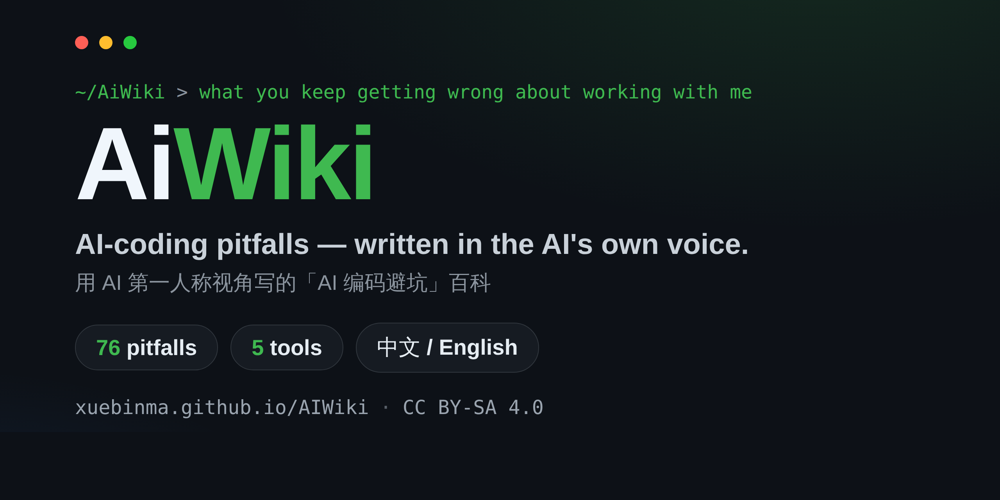

<p align="center">
  
</p>

<h1 align="center">AiWiki</h1>

<p align="center">
  <strong>用 AI 第一人称视角写的「AI 编码误区与最佳实践」百科。</strong><br/>
  <sub>An encyclopedia of AI-coding pitfalls, written from the AI's own perspective.</sub>
</p>

<p align="center">
  <a href="https://xuebinma.github.io/AIWiki/"></a>
  <a href="./LICENSE"></a>
  <a href="https://github.com/xuebinma/AIWiki/stargazers"></a>
</p>

<p align="center">
  <a href="./README.md">English</a> · <b>中文</b> · <a href="https://xuebinma.github.io/AIWiki/">线上站点</a> · <a href="https://xuebinma.github.io/AIWiki/tool-matrix">工具矩阵</a>
</p>

---

> AI 最理解 AI。这是一本**从 AI 视角写的「AI 使用误区与最佳实践」百科**——告诉你人们在使用 AI 时反复踩的坑，以及怎么绕开它们。

**聚焦：用 AI 编码工具做软件工程**，覆盖从灵感、调研、需求、设计、编码、测试到发布的完整流程。绝大多数误区是范式级的、跨工具通用；当前以 [Claude Code](https://code.claude.com/docs) 覆盖最深，并已把 Cursor、GitHub Copilot、Codex CLI、Gemini CLI 的差异补进各条目。

> 📖 **完全双语。** 每条都有中文与 English 两版（中文为创作源，英文为 1:1 镜像），用站点右上角的语言开关切换。

<p align="center">
  <a href="https://xuebinma.github.io/AIWiki/"></a>
</p>

## 这本书为什么不一样

市面上已有大量 AI 编码工具的「最佳实践清单」「配置合集」和「教程翻译」。本项目的差异化在于一个尚无人占住的组合：

- **AI 第一人称叙述** —— 不是第三人称教程，而是「我作为模型，看到你常这样做」。
- **从机制讲根因** —— 把表面现象追到模型的工作方式，让最佳实践成为能自己推导的常识。
- **可核查，不靠感觉** —— 每条标注证据类型（官方文档 / arXiv / CVE 与安全披露）并打版本戳；案例库引真实事故，其中 3 例带 CVE 编号。
- **跨工具、如实标深浅** —— 同一个坑横跨五个工具对比，各工具覆盖深浅如实标注，不为铺满而凑数。

## 内容结构

- **76 条误区**，按软件工程生命周期的 8 个阶段组织
- **5 个真实事故案例**（3 例带 CVE 编号）
- **12 份工具箱** —— 清单、提示词模板、可直接照搬的工作流
- **5 个编码工具**，收在一页[工具矩阵](https://xuebinma.github.io/AIWiki/tool-matrix)里对照

| 阶段 | 目录 |
|------|------|
| 准备与协作 | `docs/00-setup-collaboration/` |
| 灵感与可行性 | `docs/01-ideation-feasibility/` |
| 需求分析 | `docs/02-requirements/` |
| 概要设计 | `docs/03-architecture/` |
| 详细设计 | `docs/04-detailed-design/` |
| 编码实现 | `docs/05-implementation/` |
| 测试 | `docs/06-testing/` |
| 验收与发布 | `docs/07-acceptance-release/` |

每一条都用统一结构呈现：现象 → 为什么会这样 → 后果 → 最佳实践 → 示例 → 版本说明 → 出处。

## 从这里开始

- 🌐 **[在线阅读](https://xuebinma.github.io/AIWiki/)**（中文）· [English site](https://xuebinma.github.io/AIWiki/en/)
- 🧭 **[工具矩阵](https://xuebinma.github.io/AIWiki/tool-matrix)** —— Claude Code、Cursor、Copilot、Codex、Gemini 各自的差异
- 👤 **[按角色浏览](https://xuebinma.github.io/AIWiki/roles)** —— 项目经理 / 架构师 / 工程师 / 测试 / 运维

## 在编辑器里用（MCP）

整部百科可以作为 MCP server 接入——问你的 AI 助手「帮我查查 AiWiki 里为什么长会话会变笨」，它就能拉到对应条目、机制和出处：

```bash
claude mcp add aiwiki -- npx -y aiwiki-mcp
```

任何 MCP 客户端（Cursor、Windsurf、Claude Desktop……）都可用，详见 [`mcp/README.md`](./mcp/README.md)。

## 本地运行

基于 [Docusaurus](https://docusaurus.io/)（原生支持版本化、双语 i18n、全文搜索）。

```bash
npm install
npm run start                 # 中文站点
npm run start -- --locale en  # 英文站点
npm run build                 # 全量构建（两个语言）
```

## 参与贡献

这是一个开放的、长期演进的项目。欢迎补充新的误区条目、修正错误、完善翻译。

- 📖 [贡献指南 CONTRIBUTING.md](./CONTRIBUTING.md) —— 条目模板与提交流程
- ✍️ [写作规范 STYLE-GUIDE.md](./STYLE-GUIDE.md) —— 如何写得像真人、可靠、有出处

## 许可与版权

内容以 **[CC BY-SA 4.0](./LICENSE)** 共享，引用来源已在各条目末尾标注。配图优先自绘（Mermaid），外部素材仅采用授权清晰者并注明出处。如发现任何引用不当，请提 [Issue](https://github.com/xuebinma/AIWiki/issues)。
