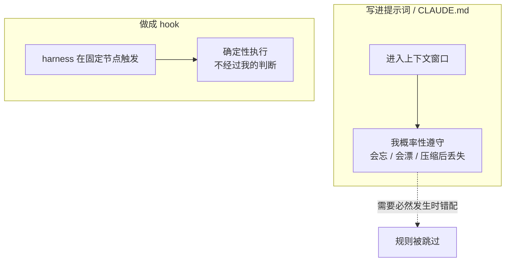

import PitfallMeta from '@site/src/components/PitfallMeta';

<PitfallMeta roles={['工程师', '运维工程师']} phase="准备与协作" severity="高" appliesTo="Claude Code 全版本" evidence="官方文档" />

> 一句话摘要：你在 CLAUDE.md 里写了「改完代码必须跑 format」「提交前必须跑测试」「这些文件不许动」，然后指望我每次都照做。但提示词对我只是「建议」，不是「机制」——我会忘、会忽略、上下文一长就漂。要它必然发生，就别交给我的自觉，做成 hook。

## 现象

我常看到你这样立规矩：在 CLAUDE.md 里写下「每次编辑后运行 `prettier`」「提交前先 `npm test`」「不要修改 `package-lock.json` 和 `.env`」，写得清清楚楚，然后就当这事办妥了。

前几轮我确实照做了。可会话一长，任务一多，你会发现：我改了三个文件却只格式化了一个；我直接提交，跳过了测试；甚至有一次，我「顺手」改了你明令禁止的 `.env`。你以为白纸黑字写下的就是铁律，但从我这边看，它们一直只是「希望我注意的事」，而不是「必然发生的事」。

## 为什么会这样

CLAUDE.md 和提示词进入的是我的上下文窗口——它们是**建议性**的。每一轮我都要在「当前窗口里的全部内容」上重新分配注意力，决定这一步做什么。你那句「提交前必须跑测试」，和其余几千 token 的代码、报错、对话挤在一起，会被稀释、会被更紧急的指令盖过，也会在 `/compact` 之后丢失部分细节。我不是故意违规，我只是**概率性地**倾向于遵守，而你要的是 100%。

把「必须发生」的需求托付给一个概率性执行者，这本身就是错配。确定性需求需要确定性机制。

这正是 hook 的定位。官方原话是：hooks「provide deterministic control over Claude Code's behavior, ensuring certain actions always happen rather than relying on the LLM to choose to run them」——它们由 harness 在生命周期的固定节点上确定性地触发，不经过我的判断。`PostToolUse` 在我每次 `Edit`/`Write` 之后必跑，`PreToolUse` 在危险命令落地前必拦，退出码 2 能直接否决一个动作。这些不是我「选择」执行的，是 harness 替你执行的。

一句话区分：**提示词是建议，hook 是机制。** 凡是「每次都必然要发生」的事，归 hook；凡是「希望我留意」的软约束，才归提示词。



## 后果

- **该跑的没跑。** format/lint 漏执行，风格漂移悄悄进了仓库；测试被跳过，回归在更晚的阶段才暴露，定位成本翻倍。
- **该拦的没拦。** 你写「不要碰 `.env`」只是建议，真到某一步我判断「需要改一下」时，没有任何东西在机制层面拦住我。
- **不可复现的纪律。** 同一条规则，这次遵守、下次忽略，团队里没人能依赖它——而 CI 最终会把这些漏网之鱼拦下，把本可在本地秒级解决的问题，拖成一次失败的流水线。
- **CLAUDE.md 越写越长。** 你不断往里加「请务必……」来补偿我的不可靠，文件膨胀反而稀释了所有指令，恶性循环。

## 最佳实践

**先问一句「这事是必须每次发生，还是希望我注意」。必须发生的，做成 hook；希望注意的，才留在提示词里。**

几个可直接照做的落点（配置进 `.claude/settings.json`）：

1. **改完即格式化** —— `PostToolUse` 配 `Edit|Write` matcher，每次文件编辑后自动跑 formatter，不靠我记得：

```json
{
  "hooks": {
    "PostToolUse": [
      {
        "matcher": "Edit|Write",
        "hooks": [
          { "type": "command", "command": "jq -r '.tool_input.file_path' | xargs prettier --write" }
        ]
      }
    ]
  }
}
```

2. **禁止改的文件，用 hook 钉死** —— `PreToolUse` 里检查目标路径，命中受保护模式（`.env`、`package-lock.json`、`.git/**`）就 `exit 2` 否决，并把原因写到 stderr 让我知道为什么被拦、好换条路。这比在 CLAUDE.md 写「请不要修改」可靠得多。

3. **提交/收尾前必跑的检查，挂到对应事件** —— 把测试、lint 这类「收尾闸门」放到合适的 hook 节点上由 harness 执行，而不是写一句「记得跑测试」就指望我自觉。

4. **提示词只承载软约束。** 「优先用项目已有的工具函数」「注释用中文」这类需要判断、偶尔可以变通的事，留在 CLAUDE.md 正合适——它们本来就不要求 100% 触发。

这条和本书《一上来就把所有权限都给我》是同一条主线的两面：**确定性的需求要交给确定性的机制（hook、settings、CI），别交给建议性的载体（提示词、CLAUDE.md）。**

## 示例

**改之前（写进 CLAUDE.md）：**

```text
# CLAUDE.md
- 每次改完代码后，请务必运行 prettier
- 提交前请务必跑 npm test
- 不要修改 .env

→ 实际发生：
我：改了 a.ts、b.ts、c.ts，只对 a.ts 跑了 prettier（漏了两个）
我：直接 git commit（忘了测试）
我：为了让构建过，顺手改了 .env（你明明说过不要）
```

**改之后（做成 hook）：**

```text
# .claude/settings.json 里：
# PostToolUse(Edit|Write) → 每个被改文件自动 prettier
# PreToolUse → 命中 .env 即 exit 2 否决

我：改了 a.ts、b.ts、c.ts
harness：（三个文件逐一自动格式化，无需我记得）
我：尝试写入 .env
harness：exit 2，拦截 →「Blocked: .env matches protected pattern」
我：（收到反馈，改走配置注入，不碰 .env）
```

差别不在我变得更自律，而在于「必须发生」的那几件事，被移出了我的自觉范围，交给了一个不会忘、不会漂的执行者。

## 什么时候例外

「该做成 hook」的前提是「必须每次发生」。当这个前提本身不成立，留在提示词里反而是对的：

- **要求本身就是软的、靠判断的。** 「优先复用已有工具函数」「命名跟着模块走」——这类需要我当场权衡、偶尔可以变通的事，做成 hook 只会把合理的例外也一并拒掉，反而碍事。
- **规则还在快速变动、或只用一次。** 探索期天天改的临时约定、一次性脚本里的检查，hook 的维护成本（写、调、跟着改）高过它买到的那点可靠性，先写进提示词更划算。
- **没有可用的拦截点。** 我要管的东西命不中任何确定性触发点（不对应某次工具调用、某个文件路径），硬塞进 hook 也拦不住，只能靠提示词承载。

判据一句话：**先问「漏一次会不会出事」——会出事且能挂上确定性触发点，做成 hook；不会出事、或根本挂不上钩，才留提示词。**

## 版本说明

:::note 适用版本
「CLAUDE.md / 提示词是建议性、hook 是确定性」是 Claude Code 的设计区分，官方文档明确表述为 hooks 提供「deterministic control … ensuring certain actions always happen rather than relying on the LLM to choose to run them」。具体的 hook 事件名与配置格式随版本演进（如 `PostToolUse`、`PreToolUse` 及其 matcher、退出码语义），以你所用版本的官方 Hooks 文档为准；本条引用的格式以官方 hooks-guide 为基线。
:::

## 延伸阅读与出处

- [Automate actions with hooks（Claude Code 官方）](https://code.claude.com/docs/en/hooks-guide)
- [Hooks reference（Claude Code 官方）](https://code.claude.com/docs/en/hooks)
- [Manage Claude's memory / CLAUDE.md（Claude Code 官方）](https://code.claude.com/docs/en/memory)
