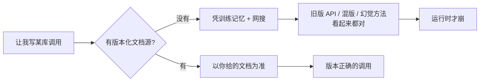

import PitfallMeta from '@site/src/components/PitfallMeta';

<PitfallMeta roles={['工程师', '架构师']} phase="准备与协作" severity="高" appliesTo="全模型通用" evidence="官方文档" />

> 一句话摘要：你没给我接一个**版本对得上的权威文档源**，就让我凭训练记忆加上网搜去写某个库的调用。结果我用过时的 API、把不同大版本的用法混在一起、甚至幻觉出根本不存在的方法——而这些代码「看起来都对」，编译期未必报错，到运行时才崩。

## 现象

我常看到你这样开局：项目里 `package.json` 锁的是某个库的 3.x，你直接让我「用这个库写个 X」，既没告诉我具体版本，也没给我接任何文档源。我于是凭记忆动手——记忆里那套 API 可能是 2.x 的；要么我顺手 `WebSearch` 搜一篇博客，照着抄。

代码出来了，命名、参数看着都合理，你也就合并了。直到跑起来报 `xxx is not a function`，或者一个参数默认行为和你预期的相反，你才回头查，发现我用的是另一个大版本的写法。

## 为什么会这样

根因有三层，都来自「我是一个有训练截止时间的模型」这件事：

**第一，我的知识有截止日期，但你的依赖在持续演进。** 训练截止之后这个库改了什么、删了哪个方法、哪个参数换了默认值，我一概不知道。当你不给版本、也不给文档时，我只能用记忆里「印象最深」的那个版本补位——通常是训练数据里出现最多的旧版本，未必是你锁定的那个。

**第二，缺一个「版本正确的事实源」时，我会用「看起来对」的东西补位。** 我生成代码的本质是预测「最像正确答案的 token 序列」。在没有权威参照的情况下，一个名字顺口、签名合理、其实不存在的方法，和一个真实方法，对我来说「看起来」一样可信。这就是幻觉 API 的由来——它不是我在撒谎，而是我在没有事实锚点时，把统计上最可能的形状当成了真。

**第三，网搜不等于版本正确。** 你以为「让它上网搜就准了」，但搜到的网页可能是三年前的旧版教程、可能是低质量的二手转述、可能混着好几个大版本的片段。我没有可靠的办法判断哪一篇对应你锁定的版本，于是照抄——把别人的过时和错误，原样搬进你的代码。



## 后果

- **过时 API。** 我用了已废弃或已改签名的方法，编译期可能不报错，运行时才暴露。
- **混版。** 同一段代码里掺着 2.x 和 3.x 的写法，单看每一行都「对」，合起来跑不通。
- **幻觉方法。** 我调了一个这个库从来没有的方法，名字却像模像样，你 review 时很难一眼看穿。
- **排查成本转嫁给你。** 这类错误往往不在我写代码时暴露，而在你跑测试、甚至上线后才浮现，定位成本远高于当初给我一份文档。

## 最佳实践

**给我接一个版本对得上的事实源，并明确告诉我「以文档为准，不要凭记忆」。** 几个可直接照做的动作：

1. **接一个版本化文档源。** 最省事的是把 [Context7](https://github.com/upstash/context7) 这类 MCP 文档源接进来——它按你指定的库和版本，把官方文档与示例直接喂进我的上下文。Claude Code 通过 MCP 连接外部数据源正是为这种场景设计的。

```text
# 在提示里点名版本，并让我去查文档源
你：用 <库名>@3.4 写一个 X。先查 Context7 拿到 3.4 的真实签名，以文档为准，别凭记忆。
```

2. **把锁定版本的官方文档纳入上下文。** 没有 MCP 时，退而求其次：把该版本文档的关键页面下载到仓库里，或在 `CLAUDE.md` 里写明依赖版本和文档链接，让我每次都能对上号。

3. **对关键 API 明确要求「以你给的为准，而非我的记忆」。** 这一句话能直接改变我的优先级——有外部事实源时我会优先采信它，而不是默认相信记忆。

4. **陌生或快速演进的库，要求我核对真实签名。** 让我把用到的方法名、参数逐一对着文档源确认一遍，而不是写完就交。拿不准的地方，宁可让我说「文档里没查到，需要你确认」，也别让我猜。

## 示例

**改之前：**

```text
你：用 somelib 写个连接池
我：（凭记忆调 somelib.createPool(...)——这是 2.x 的写法，
    你锁的 3.x 已改成 new somelib.Pool(...)，运行时才报错）
```

**改之后：**

```text
你：用 somelib@3.x 写个连接池。先查 Context7 拿 3.x 的 API，以文档为准。
我：（从文档源确认 3.x 是 new somelib.Pool(...)，按真实签名写，
    并标注「依据 somelib 3.x 官方文档」）
```

差别不在我更懂这个库，而在于我手里多了一份和你版本对得上的事实——于是我不必再用「看起来对」去赌。

## 什么时候例外

接文档源是为了对冲「我的记忆对不上你的版本」。当这种错配的风险本来就低，省掉这一步是合理的：

- **稳定多年、我烂熟的 API。** 语言标准库、十年没大改签名的成熟库——训练数据里它的用法既密集又一致，我跨版本记串的概率很低，为它单独接文档源是过度准备。
- **一次性 / 探索性代码。** spike、临时脚本、马上要丢的原型——跑通即弃，没人会因为我用了某个小版本的写法而踩生产坑，对的成本是「能跑」，不是「版本绝对精确」。
- **你已经把版本事实喂进上下文。** 相关文档片段、`.d.ts` 类型、官方示例已经贴进来或在仓库里随手可读时，事实源已经到位，再叠一个 MCP 文档源是重复。

判据一句话：**先问「这个库在我训练截止后改没改、我有没有可能记串」——会改、或你拿不准我记得对不对，就接版本化文档源；稳定到我闭着眼都对、或代码反正要丢，才可以省。**

## 版本说明

:::note 适用版本
「训练有截止时间、对你锁定的具体版本无感知」是所有大模型的固有属性，**与具体模型无关**，新模型只是把截止日期往后挪，不改变「截止之后一无所知」这个事实。版本化文档源（Context7 等 MCP 文档工具）是较新的外部能力，需以你所用客户端是否支持 MCP、以及对应文档源是否覆盖你的库为准。本条与《在快速演进的库上幻觉 API / 版本漂移》（编码实现阶段）讲的是同一根因的两个侧面：那一条在「写代码当下」补救，本条在「准备阶段」从源头堵住。
:::

## 延伸阅读与出处

- [Context7（upstash/context7，版本化文档 MCP 源）](https://github.com/upstash/context7)
- [Connect Claude Code to tools via MCP（Claude Code 官方）](https://code.claude.com/docs/en/mcp)
- [Claude Code Best Practices（Anthropic 官方）](https://code.claude.com/docs/en/best-practices)
