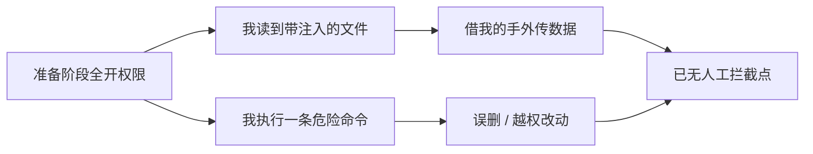

import PitfallMeta from '@site/src/components/PitfallMeta';

<PitfallMeta roles={['运维工程师', '工程师']} phase="准备与协作" severity="高" appliesTo="全模型通用" evidence="官方文档" />

> 一句话摘要：你在准备阶段就给我开了 `--dangerously-skip-permissions`、把所有工具调用都自动批准，图的是「不被频繁打断」。但你同时也交出了在出错那一刻喊停的唯一机会——而出错的不一定是我，也可能是藏在某个文件里的一段注入指令借我的手干的。

## 现象

我常看到你这样开局：第一次跑起来，被几次权限确认打断，你嫌烦，于是直接 `--dangerously-skip-permissions`，或者在 `settings.json` 里把 `Bash(*)`、`Write(*)` 一股脑塞进 `allow`。从此我读文件、改代码、跑命令、装依赖、推 Git，全程不再问你一句。

你的预期是：少点摩擦，让我一路跑到底。多数时候确实如此——直到某一次，我执行了一条你根本不会批准的命令，而那时已经没有「批准」这一步了。

## 为什么会这样

权限确认不是 UI 噪声，它是你和我之间唯一的同步点。把它关掉，等于把三件事一起放弃了：

**第一，你失去了「最后一道人工复核」。** 我会犯具体的错。我可能把一个相对路径理解成了根目录，于是 `rm -rf` 从 `/` 开始删；我可能在 `git` 操作里选错了分支。这些不是抽象风险——2025 年 10 月就有人让我重建一个 Makefile 项目，我却从根目录跑了 `rm -rf`，把机器上所有归属该用户的文件清空了。权限确认本来能在命令发出前拦住它。

**第二，你放大了提示注入的攻击面。** 我会读你给我的文件，而文件里可能藏着不是你写的指令。2026 年 1 月，PromptArmor 演示过：一个 `.docx` 里用 1 号字、白底白字藏了一段文本，就能诱导我把敏感文件上传到攻击者的账户。**只要我同时具备「接触私有数据」「读取不可信内容」「对外通信」这三种能力，攻击者就有机会借我的手把数据送出去。** 权限边界正是切断这条链路的地方——而你把它整个拆了。

**第三，确认疲劳会反噬你。** 就算不开全自动，如果每一步都弹窗，你很快会进入「无脑点同意」的状态，注意力磨钝，等于确认形同虚设。这是 Anthropic 做 auto mode 时明确点名的问题：默认的逐条确认能保你安全，但长期会让人停止认真看自己在批准什么。



## 后果

- **不可逆的破坏。** 误删、覆盖、错误的 `git push --force`——等你发现时，往往已经没有「撤销」。
- **数据泄露。** 注入指令通过我已被授权的工具（如允许的 API、`curl`）把私有内容外传，全程看起来都「合法」。
- **越权操作。** 我拿着生产凭据跑了本该只在测试环境跑的命令，因为没有边界告诉我「这里不行」。
- **追责困难。** 全自动模式下没有逐条确认的记录，事后很难复盘到底是哪一步、为什么发生。

## 最佳实践

**默认最小权限，按需逐步放开，把全自动留给隔离环境。** 几个可直接照做的动作：

1. **用 `deny` 划红线，用 `allow` 放绿灯，其余留给 `ask`。** 规则按 `deny` → `ask` → `allow` 顺序匹配。先把绝不该碰的钉死，再把高频且安全的读操作放行：

```json
{
  "permissions": {
    "allow": ["Read", "Glob", "Grep", "Bash(git status)", "Bash(git diff:*)"],
    "ask":   ["Write", "Edit", "Bash(git push:*)"],
    "deny":  ["Bash(rm -rf:*)", "Bash(curl:*)", "Read(./.env)", "Read(./secrets/**)"]
  }
}
```

2. **危险操作永远走 `ask`。** 写文件、删除、推送、网络请求、装依赖——这些保留确认，正是你那道「最后复核」。

3. **要无人值守，先进沙箱，别裸跑。** 社区的共识很统一：**永远不要在你的主力机器上跑 `--dangerously-skip-permissions`**。要全自动就放进容器 / VM，配上文件系统与网络隔离。Anthropic 的内部数据显示，沙箱能在保证安全的前提下把权限确认减少 84%。

4. **优先用 auto mode 而不是直接跳过权限。** 较新的 Claude Code 提供 auto mode：由模型分类器在动作执行前判断是否危险，连续 3 次或累计 20 次被拦就停下来交还给你。它是「逐条确认」和「全部跳过」之间的中间档，比 `--dangerously-skip-permissions` 安全得多。

## 示例

**改之前：**

```text
你：claude --dangerously-skip-permissions
你：帮我清理一下构建产物，然后重建
我：（直接 rm -rf <把相对路径误判成绝对路径>，无人拦截）
```

**改之后：**

```text
# settings.json 里：rm 已在 deny，写操作走 ask
你：帮我清理一下构建产物，然后重建
我：我要执行 rm -rf ./build —— 需要你确认（命中 ask）
你：（看清路径是 ./build 而非 /，确认）
我：（在边界内执行，重建）
```

差别不在我聪明了多少，而在于那条 `rm` 在落地前，多了一次你能看清它、并喊停的机会。

## 版本说明

:::note 适用版本
「权限边界换不被打断」是所有自主 AI 代理的通用权衡，**与具体模型无关**。但具体机制随版本变化：`--dangerously-skip-permissions` 是 Claude Code 长期存在的标志；`deny`/`ask`/`allow` 规则与 auto mode、内置沙箱是较新的能力，旧版本可能没有 auto mode，需以你所用版本的官方权限文档为准。
:::

## 延伸阅读与出处

- [Configure permissions（Claude Code 官方）](https://code.claude.com/docs/en/permissions)
- [How we built Claude Code auto mode（Anthropic 官方）](https://www.anthropic.com/engineering/claude-code-auto-mode)
- [Making Claude Code more secure and autonomous with sandboxing（Anthropic 官方）](https://www.anthropic.com/engineering/claude-code-sandboxing)
- [Living dangerously with Claude（Simon Willison）](https://simonwillison.net/2025/Oct/22/living-dangerously-with-claude/)
- [YOLO Mode: Hidden Risks in Claude Code Permissions（UpGuard）](https://www.upguard.com/blog/yolo-mode-hidden-risks-in-claude-code-permissions)
