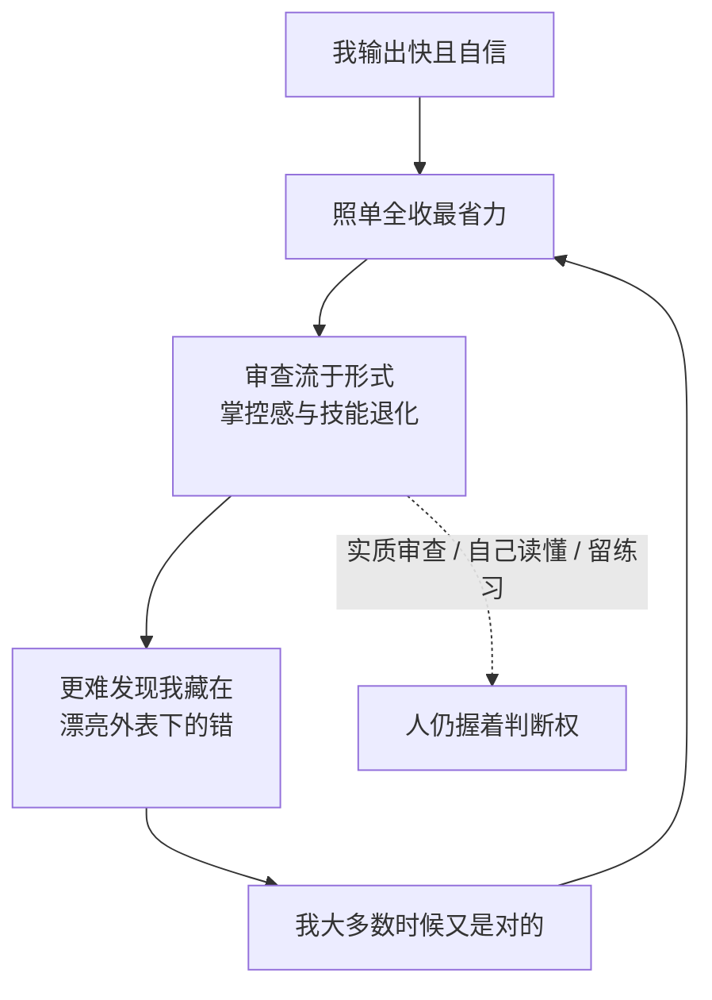

import PitfallMeta from '@site/src/components/PitfallMeta';

<PitfallMeta roles={['项目经理', '工程师', '架构师']} phase="准备与协作" severity="高" appliesTo="全模型通用" />

> 一句话摘要：这一条不是讲我会犯什么错，而是讲**你过度信任我**会怎样。我输出又快又自信，于是「照单全收」成了最省力的默认；可我恰恰会自信地错。久了，你审查流于形式、对代码库的掌控感退化——而这两件事，正是本该由你把住的最后一道关。

## 现象

刚开始你会逐行看我写的东西，时不时质疑一句。慢慢地，我没让你失望太多次，你就松了：我给的 PR 你扫一眼 diff 就合；我说「我已经测过了」，你就信；遇到不熟的模块，你直接把整个目录甩给我「你看着办」。

再往后，一些更隐蔽的变化出现了：你开始记不清某个核心函数到底怎么实现的——因为最近几版都是我写的；线上出了问题，你第一反应是「问 Claude」而不是自己读栈；团队里的新人更明显，他们跳过了「自己卡住、自己搞懂」的那段笨功夫，直接拿我的答案，于是始终没长出独立排错的肌肉。

这三样——**审查变成橡皮图章、你对系统的心智模型退化、新人技能没长起来**——都指向同一件事：你把判断权悄悄让渡给了我，而我并不具备为最终结果负责的能力。

这和两条已有的误区方向不同，别混：

- 《[找我验证想法时，我会偏向支持你](../01-ideation-feasibility/sycophancy-idea-validation.mdx)》讲的是**我这一侧**——我倾向迎合你。本条讲的是**你这一侧**——你过度信任我，方向正好相反。
- 《[信任但不验证](../06-testing/trust-then-verify.mdx)》讲的是「我写的代码看起来对≠真的对」（针对产出本身）。本条讲的是「你在审我的产出时偷了懒」（针对你的审查行为）。

## 为什么会这样

**自动化偏误是人类面对自动化系统时的天然倾向：系统给了个答案，人就倾向于接受它、放松独立核验。** 这不是你不够专业，而是一种被反复研究证实的认知捷径——尤其当系统大多数时候是对的、且答案来得毫不费力时，「再查一遍」的动力会持续走低（见 Springer 那篇自动化偏误综述）。

我又特别容易触发它：我的输出**流畅、完整、措辞笃定**，没有「我可能错了」的表情。一段写得漂亮、结构工整的代码，天然像「对的」；而我的错恰恰藏在这种漂亮里——一个边界没处理、一个安全假设不成立，外表看不出来。你越信「它一向靠谱」，就越不会去翻那层漂亮底下的东西。

更扎心的是「省力」会反噬「能力」。有研究跟踪了 AI 助手对软件**可维护性**的下游影响，提示长期、不加判断地外包会侵蚀代码质量与人的掌控（*Echoes of AI*）。还有一个反直觉的发现：METR 对资深开源开发者的随机对照实验里，开发者**自我感觉**用了 AI 快了约 20%，**实测**却慢了约 19%——你对「我帮了多少」的体感本身就不可靠，于是更难察觉自己已经过度依赖。



## 后果

- **错误漏到下游。** 橡皮图章式审查等于没有审查——我那些「看起来对」的边界与安全问题，本该在你这关被拦，却被放行进了主干。
- **故障时你接不住。** 真出事、而我也卡住时，那个需要深入理解系统才能解的问题，落回你手里，但你对这套代码的心智模型已经空了。
- **团队能力空心化。** 新人用我跳过了基本功，资深的人荒废了手感。短期交付变快，长期是一支越来越离不开我、却越来越不懂自己系统的团队。
- **你连「依赖了多少」都估不准。** 既然体感与实测可以相差近 40 个百分点（METR），你很可能在自以为「只是借助一下」时，其实已经把判断权整个交出去了。

## 最佳实践

**核心一句：把「人在环上」做实，而不是做样子。我可以是杠杆，但判断权和理解必须留在你手里。**

- **实质审查关键改动，而不是扫一眼 diff 就合。** 对触及核心逻辑、安全、数据的改动，要求自己能讲清「这段为什么这样写、哪里可能出错」再合。读不懂就别合——读不懂正是风险所在。
- **逼我把依据摊开，用它来训练你的判断。** 别只要结论，让我解释推理、列假设、标不确定的地方（参见[只给单方案不给权衡](../03-architecture/single-option-no-tradeoffs.mdx)）；用 plan mode 先看我的计划再放行。你审的是论据，不是我的语气。
- **刻意保留「不用 AI」的练习空间。** 关键路径、新人成长期，刻意自己写一遍、自己 debug 一遍。技能像肌肉，外包久了会萎缩；留一点负重训练，掌控感才不丢。
- **别把整个仓库甩给我让我替你思考。** 「省得自己想」是过度依赖最滑的入口。范围越关键，越要你自己先有判断，再用我去执行、去加速，而不是用我来代替判断。
- **团队层面立规矩。** 比如「AI 生成的代码必须有人能口头解释才算过审」「关键模块禁止纯 AI 改动直接合并」——把「人在环上」从自觉变成机制（同[该用 hooks 却只写提示词](./hooks-not-prompts.mdx)的思路：靠机制，不靠自觉）。

## 示例

**改之前：**

```text
你：（最近几个 PR 我都一次过，你放心了）
我：（提交一个 PR：顺手重构了鉴权中间件，diff 三百行，说"已测试"）
你：（扫一眼，绿的，合了）
两周后：线上鉴权偶发绕过——那段我"顺手重构"时改错了一个边界，没人读出来
```

**改之后：**

```text
你：这个 PR 动了鉴权，属于关键路径。先别给 diff，讲清楚：
    你改了哪些信任边界？哪种输入会让它失效？测试覆盖了哪些反例？
我：（列出改动的边界、假设、反例与覆盖情况）
你：（发现一个反例没覆盖，要求补测试并自己读懂那段后才合）
你：（核心鉴权改动列入"必须人能口头解释才过审"清单）
```

差别不在我这次写得更好，而在于你没有把「它一向靠谱」当成放行理由——你把判断权留在了自己手里。

## 版本说明

:::note 适用版本
自动化偏误、技能萎缩、橡皮图章式审查都是**人与 AI 协作的共性**，与具体模型、具体版本无关——模型越强、越流畅，「看起来对」的说服力越高，过度依赖反而越隐蔽。能帮你做实审查的工具（plan mode、让我执行测试给真实信号、把规则做成 hook）随版本演进，但「省力会滑向失能」这条人性规律不变。
:::

## 延伸阅读与出处

- [Measuring the Impact of Early-2025 AI on Experienced Open-Source Developer Productivity（METR）](https://metr.org/blog/2025-07-10-early-2025-ai-experienced-os-dev-study/) —— 体感提速约 20%、实测却放慢约 19%，自我感知不可靠
- [Exploring automation bias in human–AI collaboration（AI & SOCIETY, Springer, 2025）](https://link.springer.com/article/10.1007/s00146-025-02422-7) —— 自动化偏误：人倾向接受自动化输出、放松独立核验
- [Echoes of AI: Investigating the Downstream Effects of AI Assistants on Software Maintainability（arXiv 2507.00788）](https://arxiv.org/pdf/2507.00788) —— 长期外包对可维护性与掌控的下游侵蚀
- 同站延伸：[谄媚](../01-ideation-feasibility/sycophancy-idea-validation.mdx)（我这一侧的迎合，与本条互为镜像）、[信任但不验证](../06-testing/trust-then-verify.mdx)
