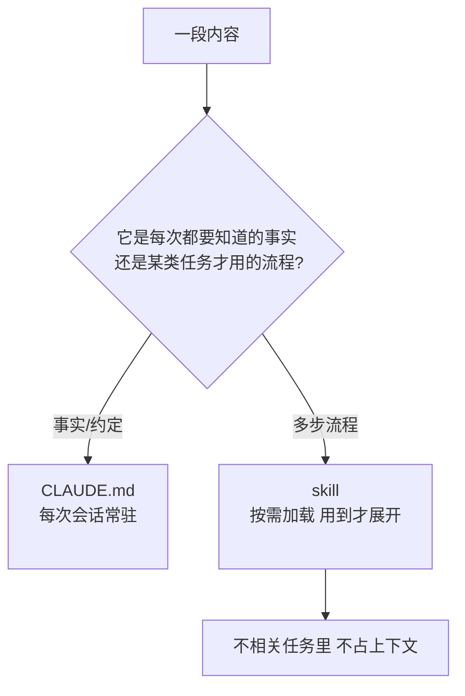

import PitfallMeta from '@site/src/components/PitfallMeta';

<PitfallMeta roles={['工程师', '架构师']} phase="准备与协作" severity="中" appliesTo="Claude Code 全版本" evidence="官方文档" />

> 一句话摘要：你把「发布的十二步流程」「数据库迁移的全套 SOP」整段写进了 `CLAUDE.md`，想着这样我什么时候都记得。结果它每次会话都常驻上下文，连「改个错别字」的任务也得先读一遍——而这些只在特定任务才用得上的步骤，本该做成按需加载的 skill。

## 现象

我常看到 `CLAUDE.md` 里长出这样一块：

```markdown
# 发布流程
1. 切到 release 分支并 rebase main
2. 跑全量测试，确认全绿
3. 更新 CHANGELOG，按 keepachangelog 格式
4. bump 版本号（package.json + 三处常量）
5. 打 tag，格式 vX.Y.Z
6. 构建产物并校验体积
7. ……（还有 6 步）
```

它本身写得很好——清晰、具体、每步都有理由。问题不在内容，在**位置**：这是一段「做某类任务时才用的流程」，你却把它焊死在了每次会话都加载的常驻上下文里。

## 为什么会这样

关键在于 `CLAUDE.md` 和 skill 的**加载时机**完全不同。

`CLAUDE.md` 在每次会话开始时**整文件加载**进上下文，无论这次任务用不用得到它。skill 不一样：它的正文**只在被用到时才展开**——你显式 `/skill-name` 调用，或我判断当前任务与它相关时，才把它读进来。官方文档把这层意思说得很直接：「skill 的正文只在使用时加载，所以再长的参考材料，在你需要它之前几乎不花成本」；以及——这句几乎是为本条量身写的——「当 `CLAUDE.md` 里某一段已经长成了一套**流程**而非一条**事实**，把它挪进 skill」。

这就是 progressive disclosure（渐进式披露）的价值：常驻上下文里只留「每次都要知道的事实」，把「特定任务才需要的流程」收进抽屉，用到才拉开。

把流程留在 `CLAUDE.md` 会同时踩两个坑：

- **信噪比下降。** 发布流程那十二步，对「改个错别字」「加一行日志」这类任务是纯噪声，却照样占着我有限的注意力预算，把真正每次都重要的约定往下挤。这和[《CLAUDE.md 过载》](../05-implementation/claude-md-overload.mdx)是一对因果——它讲「规则太多被忽略」，而流程整段塞进来，正是把文件撑大的主力之一。
- **固定开销变大。** 文件越长，每次会话开场就被吃掉的窗口越多，留给实际任务的空间越小——哪怕这次根本不发布。

放进刚才那个三层模型里看就很清楚：

- **`settings.json` = 我「能做什么」**（见[《把该进 settings 的规矩写进 CLAUDE.md》](./settings-vs-claudemd.mdx)）。
- **`CLAUDE.md` = 我「该知道什么」**：常驻的事实与约定。
- **skill = 「按需加载的流程」**：用到才展开。

本条只管后两者的边界：**常驻的「事实/约定」留 `CLAUDE.md`，「特定任务的流程」做成 skill。**



## 后果

- **每次会话都为用不上的流程买单。** 上下文里常年躺着发布 SOP、迁移手册，挤占注意力、抬高固定开销，而其中大多数任务根本不触发它们。
- **`CLAUDE.md` 持续膨胀。** 流程是最容易越写越长的内容，整段塞进来很快把文件推过「过载」线，触发《CLAUDE.md 过载》里那套稀释问题。
- **流程难维护、难发现。** 埋在几百行 `CLAUDE.md` 中段的一套步骤，既不好单独更新，团队也不容易意识到「原来有这么个流程」；做成 skill 后它有独立文件、能被 `/` 直接调起。

## 最佳实践

**把多步流程从 `CLAUDE.md` 抽出来，做成 skill；`CLAUDE.md` 只留每次都要知道的事实。**

1. **识别信号：一段内容是「步骤」而非「事实」，就该搬。** 凡是「先……再……然后……」、带编号清单、只在某类任务出现的，几乎都是 skill 的料。

2. **建一个 skill。** 在 `.claude/skills/<name>/SKILL.md` 写下流程，正文随你写多长——它只在被调用或被判断相关时才加载：

```text
.claude/skills/
└── release/
    └── SKILL.md   # 发布的十二步流程都放这里
```

3. **`CLAUDE.md` 里只留一行指针（如果需要）。** 比如「发布走 `/release` skill」，而不是把十二步原样抄一遍。

4. **判断口诀：这段内容是不是「每个任务都要知道」?** 是 → 留 `CLAUDE.md`；否（只有某类任务要）→ 做成 skill。官方的说法同样干脆：「`CLAUDE.md` 只留每次会话都该握住的事实；多步流程挪到 skill」。

## 示例

**改之前（`CLAUDE.md`，常驻 200+ 行，含整段发布流程）：**

```markdown
# CLAUDE.md
# 发布流程
1. 切 release 分支并 rebase main
2. 跑全量测试
3. 更新 CHANGELOG
4. bump 版本号
...（共 12 步，每次会话都加载）
```

**改之后：`CLAUDE.md` 瘦身，流程进 skill：**

```markdown
# CLAUDE.md
# 流程
- 发布：用 /release skill（按需加载）
```

```text
# 改错别字的会话：CLAUDE.md 里没有那 12 步，上下文清爽
你：把 README 里的 "recieve" 改成 "receive"
我：（直接改，没被发布流程干扰）

# 真要发布时：
你：/release
我：（这才把发布流程加载进来，照十二步走）
```

差别不在我记不记得住流程，而在于：**不需要它的时候，它不占地方；需要它的时候，它完整就位。**

## 与《CLAUDE.md 过载》的区别

[《CLAUDE.md 过载》](../05-implementation/claude-md-overload.mdx)讲的是「规则太多、被平均稀释」——是**数量**问题，解法是删减、加优先级；本条讲的是「这段流程根本不该常驻」——是**位置**问题，解法是换一层（搬进 skill 按需加载）。两者常一起出现：整段流程塞进 `CLAUDE.md`，往往正是把它推向过载的那一手。

## 什么时候例外

「流程做成 skill」是为了让不相关的任务不为它买单。当「按需」省不下什么、或「抽屉」本身有成本时，把流程留在 `CLAUDE.md` 反而更合适：

- **几乎每个任务都要走的短流程。** 三五行、且这个仓库里基本每次都用得上的约定（比如「每次改完都按这套提交规范」）——它本来就该常驻，做成 skill 等于给一个永远要展开的东西套一层按需的壳，反添一次加载开销。
- **小到 skill 的间接成本不划算。** 个人仓、临时项目，建目录、起 `SKILL.md`、记住去调它，这套开销比直接在 `CLAUDE.md` 留几行还高；流程短、又只有你一个人用时，就别拆。

判据一句话：**先问「这段流程是不是几乎每次会话都要用」——是、且短，留 `CLAUDE.md`；只在某类任务才触发、又长，才搬进 skill。**

## 版本说明

:::note 适用版本
「常驻事实留 `CLAUDE.md`、按需流程做成 skill」是 Claude Code 的推荐分工，**全版本适用**；skill 遵循 [Agent Skills](https://agentskills.io) 开放标准。skill 的具体能力（子代理执行、调用控制、动态上下文注入等）随版本演进，以你所用版本的官方 skills 文档为准。
:::

## 延伸阅读与出处

- [Extend Claude with skills（官方）](https://code.claude.com/docs/en/skills)
- [How Claude remembers your project（官方 memory 文档）](https://code.claude.com/docs/en/memory)
