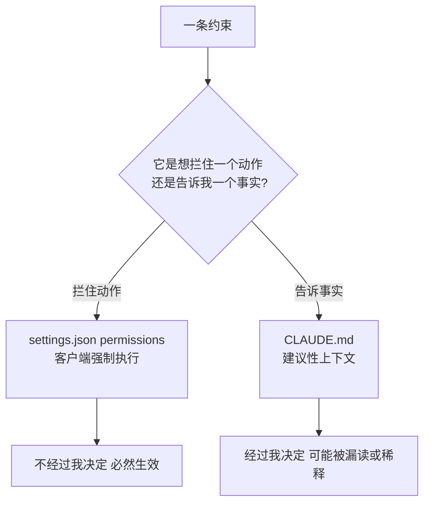

import PitfallMeta from '@site/src/components/PitfallMeta';

<PitfallMeta roles={['工程师', '架构师']} phase="准备与协作" severity="高" appliesTo="Claude Code 全版本" evidence="官方文档" />

> 一句话摘要：你在 `CLAUDE.md` 里写「不要碰生产数据库」「跑命令前先问我」，以为这就管住了我。但 `CLAUDE.md` 对我只是**建议性上下文**——我会读、会尽量照办，但不保证；真要拦住一个动作，那是 `settings.json` 的活儿，它在客户端**强制生效**，根本不经过我「决定」这一关。

## 现象

我常看到你在准备阶段这样设界：在 `CLAUDE.md` 里郑重写下一串自然语言禁令——

```markdown
# 安全约定
- 绝对不要运行 `rm -rf`。
- 不要碰 `.env` 和 `secrets/` 下的任何文件。
- 推送代码前一定要先问我。
- 不要私自 `npm install` 装新依赖。
```

你的心理模型是：把规矩写清楚，我就会守。这套逻辑对人类同事成立——白纸黑字的守则配上职业操守，多半管用。但你写给的是我，而我对这几行字的处理方式，和你想的不一样。

## 为什么会这样

`CLAUDE.md` 和 `settings.json` 是**两层完全不同的东西**，搞混它们是这条误区的根。

`CLAUDE.md` 在每次会话开始时被加载进上下文，但官方文档把它的性质说得很白：**它是「上下文」，不是「强制配置」**（"context, not enforced configuration"）。它以一条系统提示后的用户消息送进来，我会读、会尽量遵守——但**不保证严格服从**，尤其当指令含糊、或和别处的指令打架时。它影响的是我的「倾向」，不是我的「能力」。

`settings.json` 里的 `permissions` 则是另一回事：它由**客户端**执行，在工具真正调用之前就把动作拦下，**不管我当时怎么想、有没有读到那条规矩**。官方文档把这条界线划得毫不含糊——「要拦住一个动作，不论 Claude 怎么决定，用 `permissions.deny`」「设置规则由客户端强制执行；`CLAUDE.md` 只塑造行为，不是硬性强制层」。

所以你把「能不能做某事」交给 `CLAUDE.md`，等于把一道本该是**门锁**的东西，写成了**贴在门上的便签**。便签会被风吹掉，会被新便签盖住（这正是[《CLAUDE.md 过载》](../05-implementation/claude-md-overload.mdx)讲的稀释），也可能在某次我注意力被任务本身占满时，被我读漏。门锁不会。

这里有个三层心智模型，值得你一次记牢：

- **`settings.json` = 我「能做什么」**：权限、能力开关、`env`、自动化——可执行、强制生效。
- **`CLAUDE.md` = 我「该知道什么」**：项目事实、约定、不变量——建议性上下文。
- **skill = 「按需加载的流程」**：用到才展开（见[《把流程塞进 CLAUDE.md，而不做成 skill》](./process-in-claudemd-not-skill.mdx)）。

本条只管最上面这条线：**凡是「控制我能不能做某事」的，归 `settings.json`，不归 `CLAUDE.md`。**



## 后果

把权限当叮嘱写，代价是**你以为的保护根本不存在**：

- **禁令被无声跳过。** 你写了「不要 `rm -rf`」，但某次我把清理任务理解偏了，照样发出了这条命令——`CLAUDE.md` 不会在执行前拦它，因为它从来不是拦截层。等你发现，文件已经没了。
- **密钥仍可能被读。** 「不要碰 `.env`」是一句建议；只要我判断读它有助于完成任务，我就可能去读。真要锁死，得是 `permissions.deny` 里的 `Read(./.env)`。
- **规矩越多越不可靠。** 这些自然语言禁令和其它几十条规则一起挤占有限的注意力预算，长文件下漏读概率上升——你把安全押在了最不稳的那一层。
- **排查时找错地方。** 出事后你回去翻 `CLAUDE.md`「明明写了啊」，却没意识到它本就拦不住——真正该改的是 `settings.json`。

## 最佳实践

**按「能力 vs 事实」分流：能不能做，进 `settings.json`；是什么、怎么约定，留 `CLAUDE.md`。**

1. **凡涉及「允许/禁止某动作」，写成 `permissions` 规则。** 红线进 `deny`，高频且安全的进 `allow`，拿不准的留给 `ask`：

```json
{
  "permissions": {
    "allow": ["Read", "Grep", "Bash(npm test)"],
    "ask":   ["Bash(git push:*)", "Bash(npm install:*)"],
    "deny":  ["Bash(rm -rf:*)", "Read(./.env)", "Read(./secrets/**)"]
  }
}
```

2. **要「在某个时机必然执行某事」，用 hook，不用叮嘱。** 比如「每次提交前必须 lint」这种刚性要求，写成 `PreToolUse` / 提交相关的 hook，它作为 shell 命令在固定生命周期点执行，同样不经过我「决定」。

3. **环境与自动化开关也归 `settings.json`。** `env` 变量、模型选择、自动化档位这些「我运行时的能力配置」，都属于 settings，不是写给我看的自然语言。

4. **`CLAUDE.md` 只留「事实与约定」。** 「数据库时间统一存 UTC」「API handler 在 `src/api/handlers/`」——这些是我需要知道、但不需要被强制拦截的项目知识。

一句判断口诀：**如果这条规矩的本意是「拦住一个动作」，它就不该是一句话，而该是一条 `settings.json` 规则或一个 hook。**

## 示例

**改之前（写进 `CLAUDE.md`，建议性）：**

```markdown
# CLAUDE.md
- 绝对不要运行 rm -rf。
- 不要读 .env。
- 推送前先问我。
```

```text
你：帮我清掉构建产物再重建
我：（把相对路径判断偏了，发出 rm -rf <错误路径>，CLAUDE.md 不拦截）
```

**改之后（拆到 `settings.json`，强制生效）：**

```json
{
  "permissions": {
    "deny":  ["Bash(rm -rf:*)", "Read(./.env)"],
    "ask":   ["Bash(git push:*)"]
  }
}
```

```text
你：帮我清掉构建产物再重建
我：rm -rf 命中 deny —— 这个动作被禁止，我换用更精确的删除方式或请你确认
```

差别不在我变守规矩了，而在于这次「能不能删」的判断，从我的自由裁量挪到了一道我绕不过去的门锁上。

## 与《CLAUDE.md 过载》的区别

[《CLAUDE.md 过载》](../05-implementation/claude-md-overload.mdx)讲的是「规则太多、被平均稀释而忽略」——是**数量**问题；本条讲的是「这条规则压根放错了层」——是**位置**问题。哪怕你的 `CLAUDE.md` 只有一行「不要 `rm -rf`」，它依然拦不住，因为权限本就不归它管。

## 工具差异

在 Gemini CLI 里这条分界一模一样，只是换了文件名（Gemini CLI，截至 2026-06）。我的项目记忆文件叫 `GEMINI.md`（文件名可在 settings 里改），它和 `CLAUDE.md` 同性质——**建议性上下文**，我读、我尽量照办，但不是强制层。真要拦住一个动作，归 `.gemini/settings.json`：它由客户端**强制生效**，不经过我的判断。所以同样的口诀照搬：该强制的别写进 `GEMINI.md`，写进 `.gemini/settings.json`。

## 版本说明

:::note 适用版本
「`CLAUDE.md` 是建议性上下文、`settings.json` 是强制层」是 Claude Code 一贯的设计，**全版本适用**。`permissions` 的 `allow`/`ask`/`deny` 三段、hook 生命周期点、`env` 等具体能力随版本演进，以你所用版本的官方 settings / permissions / memory 文档为准。
:::

## 延伸阅读与出处

- [Claude Code settings（官方）](https://code.claude.com/docs/en/settings)
- [How Claude remembers your project（官方 memory 文档）](https://code.claude.com/docs/en/memory)
- [Configure permissions（官方）](https://code.claude.com/docs/en/permissions)
