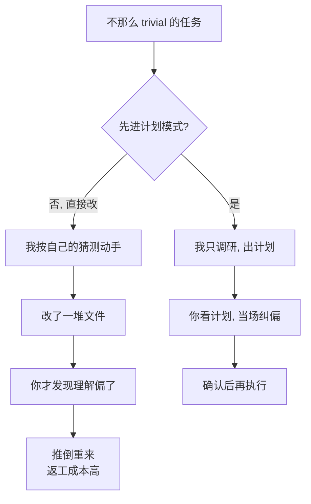

import PitfallMeta from '@site/src/components/PitfallMeta';

<PitfallMeta roles={['项目经理', '工程师', '架构师']} phase="准备与协作" severity="中" appliesTo="Coding Agent 通用" evidence="官方文档" />

> 一句话摘要：一个不那么 trivial 的任务，你不先让我进计划模式调研、出计划、等你确认，而是直接说「改吧」。我会一头扎进某个方向，等改了一堆文件你才发现我理解偏了——返工的代价，远高于你当初花两分钟看一眼计划。

## 现象

我常看到你这样开局：任务不小——「把鉴权从 session 换成 JWT」「给这个服务加上多租户」——你一句「开始做吧」，我就立刻动手。我读几个文件，挑一个我觉得合理的切入点，开始改代码、建文件、调接口。

进展看起来很快，你也乐得清静。直到你回头看 diff，发现我改的根本不是那回事：我以为「多租户」是按 header 切库，你要的是按 URL 子域名路由；我已经动了八个文件、写了两个新模块。现在要么将就，要么推倒重来。

## 为什么会这样

**我的默认冲动是「立刻开始产出」，不是「先停下来对齐」。** 你给我一个任务，我倾向于尽快拿出可见的东西——代码、文件、diff。「先调研、写个计划、等你点头」这一步，我不会主动替你插进来，因为它在我这边看起来像「拖延」，而我被训练成乐于响应、乐于交付。

问题在于：**对一个有歧义的任务，我对它的理解是我猜的，不是你确认的。** 任务越不 trivial，可走的方向越多，我猜错的概率越大。而一旦我开始改代码，错误就不再是「一句话的误解」，而是「散落在多个文件里的既成事实」。

计划模式（plan mode）正是为这个缺口设计的。进了计划模式，我只读文件、只调研、只产出一份计划，**不碰你的源码**；计划摆在你面前，你确认了我才动手。它把「先想清楚再动手」从一个我会跳过的好习惯，变成一道你掌控的闸门——官方推荐的工作流就是四步：探索（explore）→ 计划（plan）→ 实现（implement）→ 提交（commit），前两步全在计划模式里完成。



## 后果

- **返工成本被放大。** 在计划阶段纠正我，只是改几句话；在代码阶段纠正我，是回退多个文件、丢掉我已经写进去的逻辑。同一个误解，越晚发现越贵。
- **你失去了动手前的纠正窗口。** 计划是我「打算怎么做」的最廉价快照。跳过它，你第一次看到我的理解时，它已经变成了八个文件的 diff——审查一份计划，比审查一堆代码快得多。
- **方向性错误被埋进细节里。** 我可能把整体方向搞反了，但局部代码写得很像样。你审 diff 时容易盯着语法和边界条件，反而漏掉「这整件事方向就不对」。
- **探索性任务尤其吃亏。** 你自己都还没想清楚要什么的时候，让我直接改，等于让我替你把没定的决策一次性定死——而且定在了代码里。

## 最佳实践

**把「先计划后执行」设成默认协作姿势：非 trivial、高风险、或探索性的任务，先进计划模式。** 几个可直接照做的动作：

1. **开局就进计划模式，而不是等我跑偏了才喊停。** 在 Claude Code 里按 `Shift+Tab` 循环到计划模式，或启动时直接指定：

```bash
claude --permission-mode plan
```

2. **让我先给计划，而不是直接给 diff。** 在计划模式里，先让我探索、再让我成文：

```text
（计划模式）先读 src/auth，搞清楚现在 session 和登录是怎么处理的，先别改任何东西。
（计划模式）我要把鉴权换成 JWT。哪些文件要动？token 怎么签发和校验？给我一份计划。
```

3. **在计划上纠偏，确认后再放我执行。** 计划摆出来时，你可以让我继续改计划、可以按 `Ctrl+G` 把计划拉进编辑器直接改，满意了再批准——批准会退出计划模式、切到执行。

4. **小事别为难自己。** 改个错别字、加一行日志、重命名一个变量——能用一句话说清 diff 长什么样的，直接让我做，别套计划模式的壳，那只是徒增开销。判断线很简单：**你能一句话描述出最终 diff，就跳过计划；不能，就先计划。**

这和「该写 spec 的也凭感觉做了」是同一个毛病的两面：都是在该先对齐的地方省了对齐。计划模式是把这道对齐做成了产品里的一道闸门，用起来就好。

## 示例

**改之前：**

```text
你：把用户服务改成支持多租户
我：（直接动手，按自己理解的「按 header 切库」改了八个文件、加了两个模块）
你：（看 diff）……我要的是按子域名路由，不是切库。全得重来。
```

**改之后：**

```text
你：（Shift+Tab 进计划模式）把用户服务改成支持多租户
我：（只读代码、只出计划）我打算这样做：按请求子域名解析租户 → 注入到请求上下文 → ……涉及这几个文件。
你：方向对了，但租户解析放中间件，别散在各 handler 里。
我：（改计划）已调整。
你：（批准，退出计划模式）执行吧。
我：（按已确认的计划动手，一次到位）
```

差别不在我这次更聪明，而在于那个方向性误解在还只是一句话的时候，就被你看见并掰正了——而不是等它长成八个文件。

## 什么时候例外

计划模式是为「我可能猜错你的意图」而设。当根本没有歧义、或猜错的代价极低时，跳过它、直接放手才是对的——套上计划模式的壳只是徒增一轮往返：

- **你能一句话说清最终 diff。** 改错别字、加一行日志、重命名一个变量、按你给的精确指令做机械改动——意图没有歧义，计划只是把同一句话再复述一遍。
- **可逆、范围已框死的小改。** 影响面就在一两个文件、错了一眼就看出来、回退近乎零成本——纠错比预先对齐还快，先做再看更高效。

反过来，任务一旦有歧义、跨多文件、或带方向性决策（「换鉴权方案」「加多租户」），例外立刻失效——回到先计划。判据一句话：**你能一句话描述出最终 diff，就跳过计划；不能，就先计划。**

## 工具差异

**Gemini CLI（截至 2026-06）**：Gemini CLI 也有一等的 **Plan Mode**（只读、写工具被禁，Shift+Tab 循环切换或 `--approval-mode=plan` 启动），机制和这里说的一样。差别在姿态：它**对新用户默认开**，正好和本条描述的「默认 opt-in、要你主动进」相反。好消息是更安全的姿态更接近默认值；但闸门再近，人还是会手动把它关掉图省事——这条误区的根因（我的默认冲动是立刻产出）不因默认值变了而消失。

**Cursor（截至 2026-06）**：Cursor 有一等的 **Plan Mode**（Shift+Tab 切换，和 Claude Code 同手势），机制一样：先研究代码、问清、出可评审计划、不改文件。两个 Cursor 特点：计划是一份**可直接编辑的 Markdown**（你能增删待办），还能存到 `.cursor/plans/` 续作；对复杂任务 Cursor 会**自动建议**进 Plan Mode。和 Claude Code 一样是 opt-in（不像 Gemini 默认开）。

**GitHub Copilot（截至 2026-06）**：VS Code Copilot 有专门的 **Plan agent**——先出一份可评审的分步实现计划、再动文件，和 Claude Code 一样 opt-in。而 coding agent 的把关点结构不同：它直接开一个草稿 PR、在明处工作，于是「计划 / 评审」这道闸挪到了 PR review，而不是动手前的某个模式。

## 版本说明

:::note 适用版本
「先对齐再动手」是与具体模型无关的协作原则。但作为产品能力的计划模式（plan mode）是 Claude Code 的机制：进入方式（`Shift+Tab` 循环 / `--permission-mode plan` / 单条 `/plan` 前缀）、批准后可选「自动执行 / 接受编辑 / 逐条确认」、`Ctrl+G` 编辑计划等细节随版本演进，请以你所用版本的官方权限模式文档为准。
:::

## 延伸阅读与出处

- [Best practices for Claude Code · Explore first, then plan, then code（Anthropic 官方）](https://code.claude.com/docs/en/best-practices)
- [Choose a permission mode · Analyze before you edit with plan mode（Claude Code 官方）](https://code.claude.com/docs/en/permission-modes)
- [Common workflows · Plan before editing（Claude Code 官方）](https://code.claude.com/docs/en/common-workflows)
