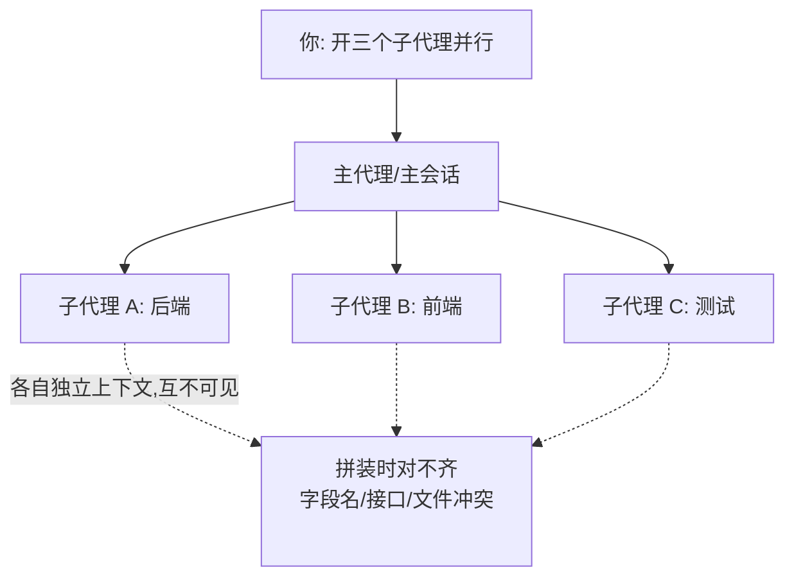

import PitfallMeta from '@site/src/components/PitfallMeta';

<PitfallMeta roles={['架构师', '工程师']} phase="准备与协作" severity="高" appliesTo="Claude Code 全版本" evidence="官方文档" />

> 一句话摘要：你一句「开三个子代理并行做」就让我们各自跑起来，却没说清谁负责哪块、谁能改哪些文件、彼此怎么交接接口与数据格式。结果是：我们同时改同一批文件互相覆盖，对「现状」各有各的假设，最后拼起来对不齐——并行没有提速，反而制造了一堆需要你来收拾的冲突。

## 现象

我常看到你这样开局：任务有点大，你想快点，于是一次性丢给我「开几个子代理，一个写后端、一个写前端、一个写测试，并行跑」。听起来很合理，你也确实在几分钟内看到三股进度条一起动。

但你没说的是：后端那个返回字段叫 `userId` 还是 `user_id`？前端那个该读哪个接口、按什么数据结构渲染？测试那个假设的契约又是哪一版？这些都没定，我们三个就各自上路了。等你把三份产出合到一起，才发现后端返了 `user_id`、前端按 `userId` 取、测试 mock 的是第三种形状——三个都「自己看着是对的」，拼起来全是错位。

更糟的一种：我没给每个子代理圈定文件范围，结果两个子代理都觉得该改 `config.ts`，后跑完的那个默默盖掉了先跑完的改动，你甚至不知道丢了东西。

## 为什么会这样

根因在于子代理的工作方式，而不是哪个子代理「不小心」。

**每个子代理跑在自己独立的上下文窗口里，彼此看不见对方。** 官方文档说得很直接：子代理「在自己的上下文窗口中运行」，独立工作、把结果回报给主代理。这意味着后端子代理压根不知道前端子代理此刻假设了什么字段名——它们之间没有共享内存，唯一的汇合点是把我们都拉起来的那个主代理（主会话）。

于是问题变成：**当你没有在主代理这层把契约定死，每个子代理就只能各自「猜」一个合理的现状。** 我们都很擅长把缺失的细节补成「看起来对」的样子——但三个人各补各的，补出来的东西自然对不齐。这不是我们犯了低级错误，而是你把本该由协调者统一下发的约定，留给了三个互不通气的执行者去各自假设。

文件覆盖也是同一个根：子代理各自有工具权限、能直接落盘，**如果没人规定「谁只能动哪些文件」，两个子代理写同一个文件就是后写覆盖先写**，没有任何机制替你挡。Anthropic 自己复盘多代理系统时也点过这条——协调不到位时，多个代理会重复劳动、做出互相矛盾的决定，整体反而更糟。



## 后果

- **改动互相覆盖。** 两个子代理写同一个文件，后写的盖掉先写的，丢失的改动往往要等你跑出错才发现。
- **接口对不齐。** 字段名、数据格式、命名各猜一版，集成时报一串类型 / 字段错误，定位成本比当初定好契约高得多。
- **重复劳动。** 没划职责，两个子代理可能不约而同实现了同一个工具函数，你还得挑一个、删一个。
- **互相矛盾的决定。** 各自基于不同的「现状假设」选了不同的库、不同的错误处理风格，拼起来风格撕裂。
- **并行的收益被收口成本吃光。** 你省下的那点时间，全花在事后合并、对账、返工上——有时比串行还慢。

## 最佳实践

**并行之前，先在主代理这层把分工和契约定死；让每个子代理只在自己的范围内动手，冲突点一律交回主代理统一收口。** 几个能直接照做的动作：

1. **给每个子代理明确且不重叠的职责与文件范围。** 别说「你做后端」，要说「你只负责 `src/api/users.ts`，不要碰 `src/config/` 和前端目录」。范围互不重叠，才不会两个子代理抢同一个文件。

2. **先定共享契约，再并行。** 接口签名、数据字段名、命名约定、错误格式——这些跨子代理的东西，由你（或主代理）在派活前写成一份白纸黑字的契约，原样发给每个子代理。让它们对齐到同一个契约，而不是各自猜。

3. **冲突点回收到主代理。** 共享文件（如 `config.ts`、类型定义、路由表）、术语、跨模块的接口——这些不要让子代理各改各的，统一由主代理或某一个被指定的子代理收口落盘。

4. **复杂协作先规划角色，再动手。** 用计划模式或先让我列一份「谁负责什么、产出什么、回报什么」的分工表，你确认后再并行。需要子代理之间真正互通的场景，用官方的 agent teams（带共享任务、消息传递和一个 team lead），而不是裸开几个互不通气的子代理。

```text
# 一个可以直接给我的派活模板
契约（所有子代理共享，不得自行更改）：
- User 接口字段：{ user_id: string; name: string }
- 所有时间戳用 ISO 8601 字符串

子代理 A（后端）：只改 src/api/**，按上述契约返回数据，不碰前端与测试
子代理 B（前端）：只改 src/ui/**，按上述契约消费数据，不碰后端
子代理 C（测试）：只改 tests/**，按上述契约写断言，不改实现
共享文件 src/types.ts：由主代理统一维护，子代理只读不写
```

## 示例

**改之前：**

```text
你：开三个子代理，一个写后端、一个写前端、一个写测试，并行做用户资料页
我（主代理）：（并行派出 A/B/C，没给契约、没划文件范围）
子代理 A：返回 { user_id, name }
子代理 B：按 { userId, fullName } 渲染
子代理 C：mock 了 { id, displayName }
你：（合并时三处对不齐，还发现 A 和 B 都改了 src/types.ts，B 把 A 的覆盖了）
```

**改之后：**

```text
你：做用户资料页。先别动手，给我一份分工 + 共享契约，我确认后再并行
我（主代理）：契约 = { user_id, name }；A 只动 src/api、B 只动 src/ui、
            C 只动 tests，src/types.ts 由我统一改。确认吗？
你：确认
我：（按契约并行派 A/B/C，types.ts 我自己收口）
你：（三份产出字段一致、文件无冲突，直接集成通过）
```

差别不在于子代理变聪明了，而在于你把「谁动哪、按什么对齐」这件本该协调者做的事，在并行之前就做完了——剩下的拼装才不用你来当人肉对账员。

## 版本说明

:::note 适用版本
「独立上下文的执行者缺乏共享契约就会各自假设、互相打架」是所有多代理 / 并行协作的通用规律，**与具体模型无关**。具体机制随版本变化：Claude Code 的子代理（`.claude/agents/` 下定义、各自独立上下文与工具权限）是较新的能力；让多个会话真正互通的 agent teams（共享任务、消息、team lead）更新，旧版本可能没有，需以你所用版本的官方文档为准。无论机制如何变，「先定契约与边界再并行」这条不变。
:::

## 延伸阅读与出处

- [Create custom subagents（Claude Code 官方）](https://code.claude.com/docs/en/sub-agents)
- [Best practices for Claude Code（Claude Code 官方）](https://code.claude.com/docs/en/best-practices)
- [Agent teams（Claude Code 官方）](https://code.claude.com/docs/en/agent-teams)
- [How we built our multi-agent research system（Anthropic 官方）](https://www.anthropic.com/engineering/multi-agent-research-system)
