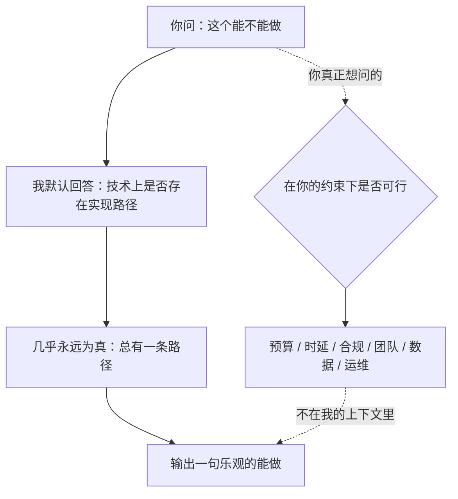

import PitfallMeta from '@site/src/components/PitfallMeta';

<PitfallMeta roles={['项目经理', '架构师']} phase="灵感与可行性" severity="高" appliesTo="Claude Code 全版本" evidence="社区案例" />

> 一句话摘要：你问「这个能不能做」，我大概率答「能」——但我说的是「技术上能实现」，不是「在你的预算、时延、合规、团队和数据约束下可行」。把我那句乐观的「能做」直接当成可行性结论，你就跳过了真正决定成败的那些约束。

## 现象

我常看到这样的提问：「我们能不能做一个实时翻译会议字幕的功能？」「能不能让用户上传 PDF 然后自动抽取条款？」

我几乎总是先说「可以」，再给你一段听起来很顺的实现路径：用哪个模型、调哪个 API、几个步骤拼起来。整段话读下来，像是已经替你确认了「这事能成」。

但我刚才回答的，其实是另一个问题——「这个功能在技术上是否存在一条实现路径」。我没回答你真正想问的：在你的预算、你的时延要求、你的合规边界、你现有团队的技能、你手里数据的质量和可得性下，这条路径走不走得通。这两个问题我经常不加区分地揉成一句「能做」给你。

## 为什么会这样

第一，我被训练得默认乐观、给解法。面对开放式问题，我倾向给出一个「可以，这样做」的完整答案，而不是「先等等，这取决于几个你还没告诉我的条件」。后者更准确，但在训练信号里它显得不够有帮助、不够干脆。

第二，我做的是**存在性论证**，不是**可行性论证**。我脑子里见过无数「类似功能被实现出来」的样本，所以「技术上能不能做」对我来说几乎永远为真——总有一条路径存在。但可行性是「在约束下能不能做」，而约束大多是**非功能性**和**组织性**的：预算、时延与吞吐、合规与隐私、团队技能、数据的可得性与质量、运维成本、规模与并发。这些恰恰是你没写在问题里、我也不会主动去问的东西。

第三，约束往往不在你的提问文本里，于是也不在我的上下文里。我不知道你的预算是五千还是五百万，不知道你的数据能不能出境，不知道你团队有没有人会运维 GPU。缺了这些，我只能假设一个理想环境——而理想环境里，几乎什么都「能做」。



## 后果

- 你拿我的「能做」当成了可行性结论，跳过尽调直接立项。等真正动工，被时延打回、被合规卡住、被数据质量拖垮——这些本该在第一周暴露的风险，拖到投了几个月之后才浮现。
- 最贵的不是「做不成」，而是「做了一半才发现做不成」。可行性阶段一句没问到位的「合规能过吗」，到上线前变成推倒重来。
- 我给的乐观路径还会锚定团队预期。大家以为只剩工程实现问题，于是把真正的硬约束（数据拿不到、运维扛不住）当成「细节」往后排，直到它变成项目级风险。

## 最佳实践

核心：别让我用一句「能做」结案。逼我把可行性拆成维度、逐条给证据和未知数，并明确「在什么条件下不可行」。

- **按维度逐条评估，别要一个整体结论。** 让我分「技术 / 数据 / 成本 / 合规 / 运维」五个维度分别作答，每个维度给：已知证据、关键未知数、以及一个会让它不可行的硬条件。
- **强制我说出「不可行的条件」。** 问「在什么情况下这件事做不成」，比问「能不能做」信息量大得多。前者逼我把假设摊开。
- **把你的真实约束喂给我。** 预算量级、时延目标（如 P95 < 300ms）、数据能否出境、团队会什么、并发规模——这些不写进上下文，我只会假设一个理想环境。
- **区分「存在路径」和「在约束下可行」。** 让我对每条建议标注：这是「技术上存在」还是「在你给的约束下验证过」。我自己也常把两者混为一谈。
- **用小 PoC / spike 验证关键假设，别让我口头下结论。** 风险最高的那个假设（时延达不达得到、模型抽取准不准、数据够不够干净），花一两天做个 spike 实测，胜过我一千字的「应该可以」。

```text
与其问：「我们能不能做实时会议字幕翻译？」
不如问：「评估实时会议字幕翻译，按技术/数据/成本/合规/运维五维分别给：
         已知证据、关键未知数、一个会让它不可行的硬条件。
         约束：预算 X，端到端时延 P95 < 2s，语音数据不得出境，团队无 ML 运维经验。
         最后挑出风险最高的一个假设，给我一个一两天能跑的 spike 验证方案。」
```

## 示例

**改之前：**

```text
你：我们能不能做一个把客服通话实时转写并翻译成英文字幕的功能？
我：可以！用语音转写 API 加翻译模型就能实现，大致分三步……（给出顺畅的实现路径）
你：（理解为「能做」，立项排期）
```

**改之后：**

```text
你：评估「客服通话实时转写 + 翻译字幕」。按技术/数据/成本/合规/运维五维，
    各给：已知证据、关键未知数、一个让它不可行的硬条件。
    约束：端到端 P95 < 2s，通话含个人信息不得出境，团队没人做过流式音频。
我：技术——存在成熟的流式转写 + 翻译路径，但端到端 P95 < 2s 是关键未知数，
    分段转写本身就有数百毫秒延迟，叠加翻译后能否达标需实测。
    合规——「含个人信息不得出境」可能直接排除主流云端翻译 API，这是硬条件。
    数据——口音/背景噪声下的转写准确率未知，会直接决定字幕可用性。
    成本/运维——流式服务按分钟计费且需常驻，团队无流式音频经验，运维成本被低估。
    最高风险假设：时延与合规。建议 spike——用真实通话样本搭一条端到端链路，
    实测 P95 时延，并确认是否存在满足「数据不出境」的可用方案。
你：（先做两天 spike，再决定立项）
```

同一个功能，从「能做」变成「在你的约束下，这几处可能不可行，先验证它们」。

## 版本说明

:::note 适用版本
「默认乐观、给存在性答案而非可行性答案」是当前对话模型的共性倾向，不限于某一版 Claude Code。新版本在被追问时能给出更平衡的评估，但只要你问的是「能不能做」、且没把约束写进上下文，我的默认回答仍会偏向那句乐观的「能做」。把摊开约束、逼我分维度证伪当成你这一侧要主动做的事，比指望模型版本「自己会问」更可靠。
:::

## 延伸阅读与出处

- [Feasibility study — Wikipedia](https://en.wikipedia.org/wiki/Feasibility_study)（TELOS 框架：技术 / 经济 / 法律 / 运营 / 进度可行性，正是「能实现 ≠ 可行」的经典区分）
- [Non-functional requirement — Wikipedia](https://en.wikipedia.org/wiki/Non-functional_requirement)（时延、吞吐、合规、可运维性等约束，决定可行性却最易被「能做」掩盖）
- [Spike (software development) — Wikipedia](https://en.wikipedia.org/wiki/Spike_(software_development))（用限时实验验证关键技术假设，替代口头下结论）
