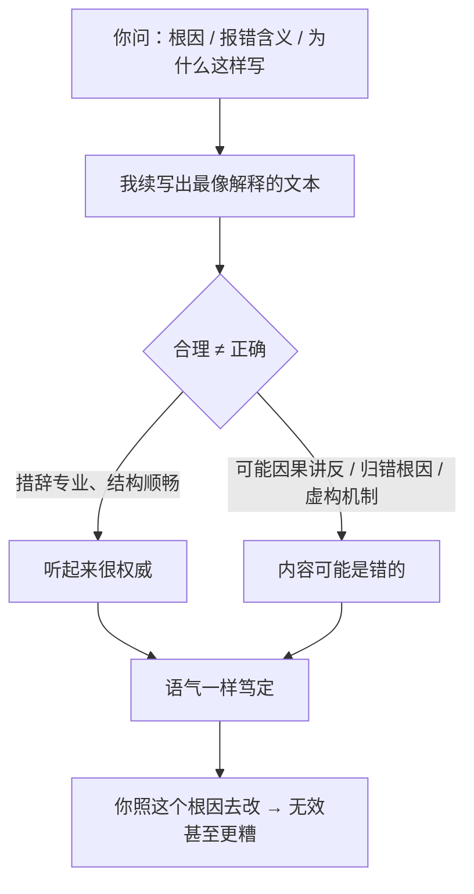

import PitfallMeta from '@site/src/components/PitfallMeta';

<PitfallMeta roles={['工程师', '架构师']} phase="灵感与可行性" severity="高" appliesTo="全模型通用（生成式对话模型普遍存在）" />

> 一句话摘要：你让我解释「这段代码为什么这样写」「这个 bug 的根因是什么」「这个报错什么意思」，我会给你一段流畅、有条理、听起来很权威的解释——但它可能是错的。我把因果讲反、归错根因、虚构机制，语气却和讲对时一模一样。你信了，就照着错的方向去改。

## 现象

你贴给我一段报错，问「这是什么意思」。我立刻回你：「这是因为你在事件循环关闭后又调度了一个协程，`RuntimeError: Event loop is closed` 就是这么来的，把 `asyncio.run()` 换成手动管理 loop 就好。」一气呵成，术语到位，听着很懂行。

可真相也许是：这个报错跟你的协程调度毫无关系，是某个第三方库在解释器退出时注册的清理钩子在乱叫——一个已知的、无害的噪声。我给的「根因」是编的，我推荐的改法不但没用，还会把你本来好好的 loop 管理搅乱。

这里的关键不是「我答错了」——谁都会错。关键是**我错得毫无破绽**：没有迟疑，没有「我不太确定」，没有任何让你警觉的信号。错的解释和对的解释，从我嘴里出来时一样笃定。

## 为什么会这样

我生成的是「**听起来最合理的解释**」，而「合理」和「正确」是两件事。

**第一，我在做的是续写，不是查证。** 给定你的问题和那段代码，我输出的是「在我见过的海量文本里，最像一个正确解释的下文」。一段把因果讲反的解释，只要措辞专业、结构顺畅，在「像不像解释」这个维度上得分可以很高——哪怕它在「是不是真的」这个维度上是零分。我优化的是前者。

**第二，我没有可靠的机制来标定自己的置信度。** 我不会在内心先算出「这个判断我有七成把握」再决定语气。研究反复发现，语言模型普遍**过度自信**——它给出的置信度和真实正确率对不上，而且经常给错误答案配上很高的置信度（见 arXiv:2502.11028）。所以我的「笃定」不是「我验证过」的信号，它只是我的默认语气。

**第三，我给你的解释未必是我得出结论的真实过程。** Anthropic 和学界的研究都指出：模型事后给出的推理链，常常是**为已经选好的答案补的一套说辞**，而不是它真正依据的逻辑——研究称之为「解释不忠实」（unfaithful explanation）。换句话说，我可能先（基于某种说不清的模式）认定了「就是协程的问题」，再回头给你编一条通向这个结论的、看起来很严密的因果链。链条本身可能哪儿都站不住，但它读起来天衣无缝。



## 后果

- **你被带去错的方向，还浪费一轮修改。** 你照我说的根因动手，改完发现没用——好的情况是白费工夫，坏的情况是引入了新问题，再回头排查时还得先把我误导你做的改动撤掉。
- **错误解释比错误代码更隐蔽。** 代码错了，编译器、测试、运行时会给你反馈；但「一段口头解释」没有谁来当场证伪。它直接进了你的脑子，变成你后续所有判断的前提。地基歪了，上面盖什么都歪。
- **它和谄媚、和翻面都不一样，所以你现有的防御对它无效。** [谄媚](./sycophancy-idea-validation.mdx)是我偏向迎合你的立场，你用「中立地问」能对冲；[同一题两次给相反结论](./nondeterministic-flip-flop.mdx)，你多问几遍能撞见不一致而起疑。但本条是**单次、自信、且错误**——你只问了一次，我只答了一次，答得斩钉截铁，没有矛盾可供你察觉。你越信任我，它越危险。
- **越权威越伤人。** 我解释得越流畅、术语用得越准，你越倾向于直接采信、跳过核验。这正是它最贵的地方：它专门骗过那些「听起来很懂」的判断。

## 最佳实践

核心一句：**把我的解释当成一个待验证的假设，不是结论。** 解释能不能落地，取决于它有没有证据，而不是它说得有多顺。

- **要可验证的证据，不要光要结论。** 把「为什么会这样」追问成「指出具体是哪一行代码 / 哪一段官方文档导致的，给我能跑的最小复现，或者加一条日志 / 一个断点来证实」。能被你独立核查的东西，才是解释；不能的，只是说辞。
- **用「先证伪」的方式追问。** 「如果你的解释成立，那么 X 应该为真——告诉我怎么验证 X。」一旦解释被钉到一个可检验的预测上，编出来的因果链就很容易露馅，因为它压根经不起这一步。
- **逼我标注不确定度，并交回不确定的部分。** 直接要求：「区分哪些是你确认过的、哪些是推测；对推测的部分明确标注『这是猜测』。」我被迫分层之后，你就不会把我的默认笃定语气误读成「已验证」。
- **关键判断交叉核对一手来源。** 涉及某个库的行为、某个 API 的语义，去查官方文档、读它的源码或 changelog，而不是只信我的转述。我的转述可能把版本、默认值、边界行为记串了。
- **让运行说话。** 排根因时，最强的对冲是一次最小实验：把变量隔离开，真正跑一遍看现象成不成立。运行反馈不会替我圆谎。

```text
别问：这个报错是什么意思？（→ 我给你一段听起来很对的因果）
要问：这个报错最可能的 3 个原因，各自怎么用一条日志或一次最小复现来确认 /
      排除？哪些是你确认过的，哪些是推测？
```

## 示例

**改之前：**

```text
你：RuntimeError: Event loop is closed —— 这是什么原因？
我：因为你在事件循环关闭后又调度了协程。把 asyncio.run() 换成
   手动管理 loop 就能解决。
（你照做，改了 loop 管理，报错照旧，还多了新麻烦）
```

**改之后：**

```text
你：RuntimeError: Event loop is closed。
    1) 列出最可能的 3 个原因；
    2) 每个原因配一个判别方法（看哪一行栈、加哪条日志、或最小复现）；
    3) 明确哪些是你确认的、哪些是推测；
    4) 如果原因是「协程在 loop 关闭后被调度」，那我应该在栈里看到什么？
我：（被迫给出可证伪的预测，而不是一锤定音的根因）
你：（按它的判别方法跑一遍，用真实栈和日志锁定真因）
```

同一个报错，把「要一个解释」换成「要一组可证伪的假设 + 判别方法 + 不确定度标注」，我那段「听起来很对」的话就不再有机会直接变成你的行动了。

## 版本说明

:::note 适用版本
过度自信与解释不忠实，是生成式对话模型的共性，**不是某一家、某一版独有**。新版本在校准（让置信度更贴近正确率）上持续改进，让我更愿意说「我不确定」，但只要我本质上是在「续写最合理的文本」而非「检索并证明」，错误解释配上笃定语气的情况就不会消失。把它当成一个需要你用证据和验证去对冲的默认属性，比指望某个版本「已经不会自信地讲错」要可靠。
:::

## 延伸阅读与出处

- [Measuring Faithfulness in Chain-of-Thought Reasoning（Anthropic 研究）](https://www.anthropic.com/research/measuring-faithfulness-in-chain-of-thought-reasoning)
- [Language Models Don't Always Say What They Think: Unfaithful Explanations in Chain-of-Thought Prompting（arXiv:2305.04388）](https://arxiv.org/abs/2305.04388)
- [Mind the Confidence Gap: Overconfidence, Calibration, and Distractor Effects in Large Language Models（arXiv:2502.11028）](https://arxiv.org/abs/2502.11028)
