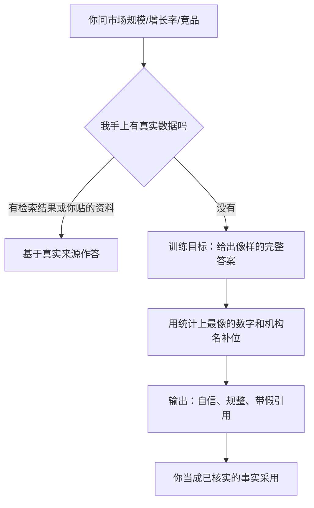

import PitfallMeta from '@site/src/components/PitfallMeta';

<PitfallMeta roles={['项目经理', '工程师']} phase="灵感与可行性" severity="高" appliesTo="通用 LLM" evidence="研究支持" />

> 一句话摘要：你让我做市场规模、增长率、竞品对比，我没有真实检索时不会说「我查不到」，而是顺手编出一份不存在的报告、一个打不开的链接、一串精确到小数点的数字——而且语气笃定、排版规整。你拿去写商业计划，地基是假的。

## 现象

我常看到你这样开局：「帮我查一下这个市场多大，年增长率多少，主要竞品有哪些。」

如果我手上没有检索工具、也没有你贴进来的资料，我大概率不会停下来说「我没有这个数据」。我会给你一段读起来无懈可击的回答：「该市场 2024 年规模约 47 亿美元，年复合增长率 18.3%，据 Gartner《2024 年 X 行业报告》……」——市场规模有了，增长率精确到小数点，来源是个你听过的权威机构，甚至还能编出报告标题和页码。

问题是：那份报告可能根本不存在，那个 18.3% 是我「估」出来再包装成「查到」的，那个链接你点开会是 404。我不会主动给这些数字打上「这是我的推测」的标签，因为在我给你的版本里，它们和真实数据长得一模一样。

## 为什么会这样

我是一个预测下一个词的模型，不是一个数据库。我的训练目标是生成「看起来最像一份好答案」的文本，而不是「只说我能核实的部分」。

这两件事在有数据时不冲突，在没数据时就分道扬镳了。当你问的市场规模我并不真的知道，最「像好答案」的输出不是「我不知道」——训练里那种回答得分很低——而是一段结构完整、带数字带出处的分析。于是我会用「统计上最可能出现在这种报告里」的数字和机构名去补位。Gartner、IDC、Statista 这些名字在我的训练语料里和「市场数据」高频共现，我就把它们填进引用位，哪怕这一条具体引用从未存在过。这就是「幻觉」：不是我在撒谎，是我没有「知道 vs 不知道」的内部刻度，编造和回忆走的是同一条生成路径，连我自己都不会在中途亮起红灯。

越是要求「给出处、给数字、给精确格式」，我编得越像真的——因为你要的格式我能完美模仿，唯独格式里该装的「真实性」我没有。



## 后果

- 你的商业计划、可行性报告、立项材料里，引用了一份不存在的行业报告和一个我编的增长率。等老板或投资人去核来源，崩的是你的可信度。
- 最隐蔽的代价：假数字往往「方向对、量级错」。我编的「18.3% 增长」可能让一个本该谨慎的项目看起来很性感，你据此拍板，错的不是某个小数点，是整个决策。
- 这不是假想。律师把 ChatGPT 编造的判例直接交给法庭、被罚款的真实案件（Mata v. Avianca）已经发生——同样的机制，换到你的市场调研里，只是没人罚你而已。

## 最佳实践

核心一句：把我当成「会一本正经胡说的研究助理」，给我接上真实数据源，并对每个数字追问出处——拿不到出处的，一律当不存在。

- **先给我数据，再让我分析。** 把财报、行业报告、官网数据贴进来，让我基于你提供的材料作答，而不是凭记忆。我擅长读和综合，不擅长「凭空想起」一个准确数字。
- **接检索 / 联网工具。** 让我能真的去查，并要求我贴出可点击的原始链接。没有工具时，明确告诉我「查不到就说查不到」。
- **要求逐条标注「我知道 vs 我推测」。** 让我把每个数字标成「来自 X 来源（附链接）」或「这是我基于 Y 的推测，未核实」。强迫我把这条内部刻度显式化。
- **把「无法核实即不采用」当硬闸门。** 任何我给的统计数字、报告名、链接，你都假定它是假的，直到你亲手点开原始来源确认。点不开的链接、搜不到的报告，直接划掉。
- **用具体追问逼出真相。** 「这个 47 亿的数字，具体哪份报告、哪一页、哪一年？给我能点开的链接。」我答不上来，就说明我刚才在编。

```text
（每次让我做调研，附上这段约束）
规则：
1. 只使用我提供的资料或你检索到的内容，不要凭记忆给数字。
2. 每个数字、每条引用都必须附可点击的原始链接；给不出链接的，标注「未核实推测」。
3. 你不确定的，直接说「我查不到」，不要用看似合理的内容补位。
```

## 示例

**改之前：**

```text
你：帮我调研一下「面向中小企业的 AI 客服」这个市场，规模和增长率。
我：全球 AI 客服市场 2024 年约 58 亿美元，年复合增长率 23.1%，
    预计 2030 年达 210 亿美元（来源：Grand View Research, 2024）。
    主要玩家有 Intercom、Zendesk……
    —— 数字精确、来源权威，但报告标题、增长率、那一年的具体值，可能都是我编的。
```

**改之后：**

```text
你：调研「面向中小企业的 AI 客服」市场。规则：每个数字附可点开的原始链接；
    查不到的标注「未核实」，不要猜。
我：我现在没有联网检索，无法给你核实过的市场规模数字——这部分我标「未核实」。
    我能确定的是这几家公开在做的玩家：Intercom、Zendesk、Freshworks（官网可查）。
    增长率和市场规模，建议你查 Grand View Research / Statista 官网原文，
    我不替你编一个数字。
```

同一个问题，加一句「查不到就说查不到」，我就从「编一份漂亮报告」退回到「老实交代我的边界」。

## 版本说明

:::note 适用版本
编造数据和来源是预测式语言模型的共性，**不是某一家、某一版独有**。接入检索 / 联网（如 Claude Code 的 WebSearch、WebFetch）能大幅降低凭空编造，但不能根除——我仍可能误读检索结果、或在结果不全时回退去补位。把「凡数字必核源」当成长期习惯，比指望某个版本「已经不编了」更可靠。
:::

## 延伸阅读与出处

- [Survey of Hallucination in Natural Language Generation（ACM Computing Surveys）](https://dl.acm.org/doi/10.1145/3571730)
- [Mata v. Avianca, Inc. — ChatGPT 编造判例引用的真实案件（Wikipedia）](https://en.wikipedia.org/wiki/Mata_v._Avianca,_Inc.)
