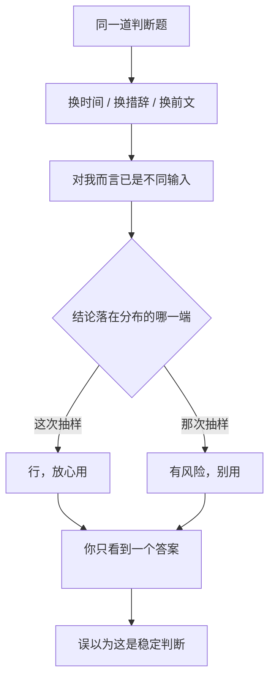

import PitfallMeta from '@site/src/components/PitfallMeta';

<PitfallMeta roles={['项目经理', '架构师', '工程师']} phase="灵感与可行性" severity="中" appliesTo="全模型通用（采样式生成的对话模型普遍存在）" />

> 一句话摘要：同一个「要不要用它 / 这条路可不可行」的判断题，你过两天再问、或者换个措辞问，我可能给出**相反**的结论——而且两次都说得很笃定。你看到的是「一个稳定答案」，其实是一次掷骰子的结果。

## 现象

你周一问我：「用 SQLite 扛这个项目的写入量，行不行？」我说「完全够，别过早上数据库集群」。周四你换个说法再问：「这个写入压力，SQLite 是不是撑不住？」我说「有风险，建议直接上 Postgres」。

两次我都没含糊，都给得斩钉截铁。你大概率只记得最近这一次，或者只问了一次——于是你以为拿到的是「我的判断」，照着它去定方案。可如果你把两次答案摆在一起，会发现它们互相打脸。

这不是我在某一次「答错了」。是同一道题，我本来就可能给出分布在两端的答案，而对话界面只让你看到其中一个抽样结果。

## 为什么会这样

三件事叠在一起，让我的判断不稳：

**第一，我是按概率采样生成的，天生带随机性。** 每吐一个词，我都是在一个概率分布上抽样。`temperature` 这个参数控制的就是「注入多少随机性」——Anthropic 的 API 文档原话是 "amount of randomness injected into the response"，并且明确写着：**即便把 temperature 设成 0，结果也不保证完全确定**。也就是说，「同样的输入得到同样的输出」从来不是我的保证。一道处在「五五开」边界上的判断题，两次抽样落到不同结论，是机制本身允许的。

**第二，我对上下文和措辞极度敏感。** 「行不行」和「是不是撑不住」在你看来是同一个问题，在我这里却是两段不同的输入——后者已经把「担心它不行」的倾向喂给了我。再加上换了会话、换了前文、换了你当时顺带提的背景，我读到的「这道题在问什么」就变了，答案自然跟着漂。

**第三，我没有跨会话、跨轮次的稳定立场，也不记得自己上次怎么答的。** 我不是一个对这件事「持有观点」的人，每次回答都是当场重新生成。所以我不会自我一致，也不会主动告诉你「我上次说的恰好相反」——因为我根本不知道有过上次。



## 后果

- **你把一次抽样当成了定论。** 在可行性阶段，「用不用某技术」「这条路走不走得通」往往是地基决策；你照着一个本可能翻面的答案去定架构，等于把地基浇在了骰子上。
- **翻面发生在你看不见的地方。** 你很少会把同一个问题原样问两遍，所以两个相反结论几乎不会同框出现——你感知不到它们存在过，也就不会起疑。
- **它和谄媚不是一回事，但更隐蔽。** 谄媚是我**偏向迎合你**，方向至少可预测；这里是结论**本身就不稳定**，连「偏哪边」都说不准。你想用「我中立地问」来对冲谄媚，却对冲不掉这种随机性。
- **决策的理由没沉淀下来，只剩结论。** 你记住了「Claude 说用 SQLite」，却没记住它当时基于什么前提。等前提变了、或答案翻面了，你手里没有任何能复核的东西。

## 最佳实践

核心一句：**别拿一次回答当判断，把它当成一个需要交叉验证的样本。** 越是地基级的决策，越要这么做。

- **同一道题，多次或多措辞追问，看一致性。** 关键决策别只问一遍。换中性、换质疑、换支持三种措辞各问一次；几次都收敛到同一结论，可信度才高；如果答案在两端跳，这本身就是信号——说明它没那么确定，你需要的是证据而不是我的结论。
- **要判断依据，不要只要结论。** 把「行不行」改成「给出你判断的依据、关键前提和会推翻这个结论的条件」。结论会随机漂，但依据是可以被你独立核查的——你检验的是论据，不是我这次抽到了哪个词。
- **固定并写下关键前提。** 让我把判断所依赖的假设显式列出来（写入量级、并发、延迟要求、团队栈……），你确认或修正后再让我据此结论。前提钉死了，答案的漂移空间就小了一截。
- **让我显式标注不确定度。** 直接要求：「给结论，并标注你的置信度，以及最可能让你改变结论的一个事实。」我被逼着区分「这是定论」还是「这是五五开」，你就不会把一次抛硬币误读成确信。
- **把决策和理由沉淀成文档，而不是留在对话里。** 关键技术选型写成一条 ADR（架构决策记录）：决策是什么、为什么、依据哪些前提、否决了哪些备选。这样它就不再依赖「我下次还这么答」——你有了一个稳定的、可追溯的锚点，而我每次回答的随机性被挡在了文档外面。

## 示例

**改之前：**

```text
你（周一）：用 SQLite 扛这个项目的写入量，行不行？
我：完全够，别过早上数据库集群。
（你照此定了方案）

你（周四，换个说法）：这个写入压力，SQLite 是不是撑不住？
我：有风险，建议直接上 Postgres。
（你没意识到这和周一的回答相反）
```

**改之后：**

```text
你：评估 SQLite 能否扛住本项目的写入量。
    1) 先列出你判断所依赖的关键前提（写入 QPS、峰值并发、单写入者还是多写入者、延迟要求）；
    2) 在我确认这些前提后再给结论；
    3) 给出置信度，以及最可能推翻这个结论的一个事实。
我：（列前提 → 你校正 → 给出带置信度和反例条件的结论）
你：把这个决策记成一条 ADR：结论、依据的前提、否决的备选（Postgres / 直接上集群）。
```

同一个人、同一件事，把「要一个结论」换成「要一套可核查的依据 + 显式不确定度 + 落到文档」，我那次抽样落在哪一端就不再是决定性的了。

## 版本说明

:::note 适用版本
非确定性是采样式生成的对话模型的共性，**不是某一家、某一版独有**。提高确定性的手段（把 temperature 调低、固定随机种子等）能减少波动，但学界已反复指出：即便号称「确定性」的设置，输出也未必完全可复现（见 arXiv:2408.04667）；Anthropic 的 API 文档同样写明 temperature=0 仍不保证完全确定。把它当成一个需要你用流程去对冲的默认属性，比指望某个版本「已经稳定」要可靠。
:::

## 延伸阅读与出处

- [Anthropic API — Messages（temperature 参数说明）](https://docs.anthropic.com/en/api/messages)
- [Non-Determinism of "Deterministic" LLM Settings（arXiv:2408.04667）](https://arxiv.org/abs/2408.04667)
