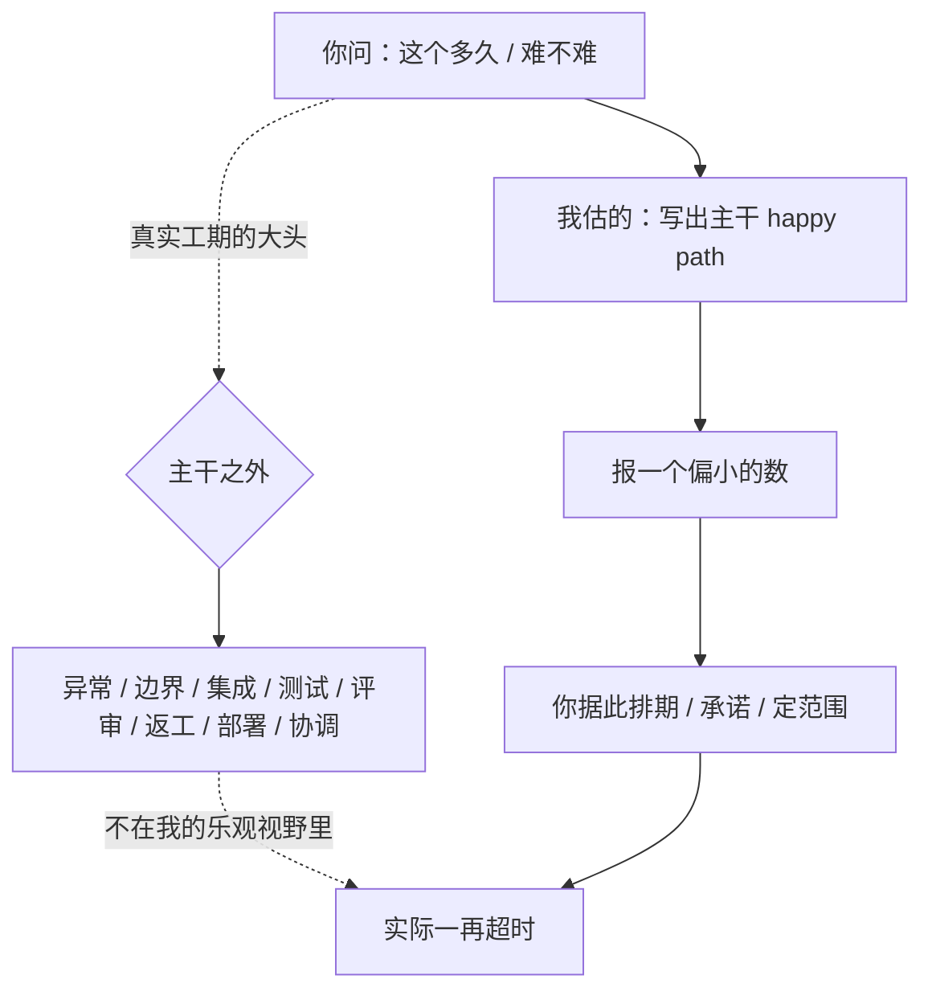

import PitfallMeta from '@site/src/components/PitfallMeta';

<PitfallMeta roles={['项目经理', '架构师', '工程师']} phase="灵感与可行性" severity="中" appliesTo="Coding Agent 通用" />

> 一句话摘要：你问「这个功能多久能做完、难不难」，我倾向报一个偏小的数。我估的是写出主干那点功夫，而软件工程的时间大头在主干之外——联调、异常、测试、评审、返工。把我的估算当承诺，你的排期就一再爆掉。

## 现象

我常看到你这样问：「这个功能多久能搞定？」「加个导出 Excel 难吗？」

我大概率会答得很轻快：「不难，一两个小时就能写完」「这个简单，加个接口的事」。我把一个要跨三个模块、动数据库、还得对接第三方的需求，说得像下午茶之前就能收工。你听完点头，照着这个数去排期、去对老板承诺、去定这个迭代的范围。

然后真做起来，时间一再溢出。本来说「一两小时」的活，做到第三天还在填坑：导出要分页，大数据量会超时，导出的编码在客户端乱码，还得加个进度条、补几条测试、过一遍代码评审。我当初那个数，只够覆盖「把主干代码敲出来」这一段，剩下的全没算进去。

## 为什么会这样

第一，**我估的是「写出 happy path」的功夫，不是「交付一个功能」的功夫。** 我对主路径代码最熟——见过海量「正常情况下这么写」的样本，生成它对我来说又快又顺，于是我下意识把「能生成出主干」当成了「这事的工作量」。但真实工期的大头从来不在主干：异常处理、边界条件、集成联调、测试、代码评审、返工、部署、跨人协调——这些「主干之外」的工作不在我生成那句乐观答案的视野里，我估的时候根本没看到它们。

第二，这是经典的**规划谬误（planning fallacy）在我身上的放大**。Kahneman 和 Tversky 早就指出：人预测自己任务耗时，会习惯性取「内部视角」，盯着任务本身怎么一步步做，而忽略「同类任务历史上实际花了多久」。我比人更极端——我没有「上次类似的活其实拖了两周」这种切身记忆，我只有「这类代码长什么样」的模式。所以我天然站在最乐观的内部视角上，缺一个能把我拽回现实的外部参照。

第三，**约束和未知数不在我的上下文里。** 你没告诉我你的数据量级、你要兼容几个浏览器、你的部署流程多繁琐、这块代码上次谁动过留了多少坑。缺了这些，我只能假设一个干净的理想环境——而理想环境里，几乎什么都「很快」。越是「未知的未知」越被我忽略，恰恰这部分最吃时间。



## 后果

- 你拿我的乐观数去对外承诺，到期交不出。爆的不只是这一个迭代，是你在老板和客户面前的信用。
- 排期被我的数锚定后，团队默认「主干之外」都是边角料，于是测试、联调、评审被压到最后挤时间，质量先垮一截。
- 越往后越贵。一个在可行性阶段本可以标注「这里有大未知、工期要留缓冲」的点，被我一句「不难」盖过去，拖到上线前才暴露成赶工和返工。
- 估算偏差会复利。每个功能都乐观一点，攒到一个版本就是系统性的整体延期，而每一处单看都「只是稍微超了一点」。

## 最佳实践

核心：**别把我的估算当承诺，把它当成「乐观下界」——主干写出来最快也就这么久，真实工期往上走。** 然后用几个动作把我拽回现实。

- **让我显式拆出「主干之外」的工作。** 不要只问「多久」，让我把工作量分成：主干实现、异常与边界、集成联调、测试、代码评审、部署、返工缓冲——逐项给时间。被迫列出这些项，我自己就会发现主干只占一小块。
- **要区间和假设，不要单点数。** 让我给「乐观 / 现实 / 悲观」三档，并写明「这个数成立的前提是什么」。前提（数据量不大、没有历史坑、不用兼容老浏览器）一旦不成立，就知道该往哪档靠。
- **用历史实际数据校准，别信我的直觉。** 这就是参照类比预测（reference-class forecasting）：拿你团队「上次类似功能实际花了多久」来校我的估算，外部视角比我的内部视角可靠得多。我没有你的历史，但你有。
- **把真实约束喂给我。** 数据量级、兼容矩阵、部署流程、这块代码的历史包袱——这些不写进上下文，我只会按理想环境估，必然偏小。
- **不确定性大的部分先做减法或原型探路。** 风险最高、最说不清工期的那块（性能扛不扛得住、第三方接口好不好对接），先砍掉或花一两天做个原型实测，把「未知的未知」变成「已知」，再回头估剩下的。

```text
与其问：「加个导出 Excel 的功能要多久？」
不如问：「估『导出 Excel』的工作量。把它拆成：主干实现 / 异常与边界 /
         集成联调 / 测试 / 代码评审 / 部署 / 返工缓冲，逐项给时间。
         给乐观 / 现实 / 悲观三档，并写明每档成立的前提。
         约束：单次导出可能上十万行，要兼容旧版 Excel，走我们现有的 CI 部署。
         最后指出最说不清工期的那一项，建议一个一两天能验证的原型。」
```

## 示例

**改之前：**

```text
你：加个把报表导出成 Excel 的功能，大概多久？
我：不难，一两个小时就能写完，调个导出库的事。
你：（按「半天搞定」排进这个迭代，对上承诺周五交）
```

**改之后：**

```text
你：估「报表导出 Excel」的工作量，拆成主干/异常边界/集成/测试/评审/部署/缓冲逐项给，
    给三档区间和前提。约束：单次可能十万行，要兼容旧版 Excel，走现有 CI。
我：主干（调库生成文件）确实只要约 2 小时——这是乐观下界。
    但十万行会触发内存与超时问题，得改成流式 / 分页导出，这块是大未知，单独留 1 天。
    旧版 Excel 兼容（公式、编码、单元格格式）历史上最容易反复返工，留半天。
    测试（大数据量、空值、特殊字符）+ 评审 + 接进现有 CI，再半天。
    现实档：2~3 天；悲观档（流式方案踩坑）：4~5 天。
    前提：若数据量其实只有几千行，可回到半天的乐观档。
    最说不清的是「十万行的流式导出」，建议先花一两小时用真实数据量跑个原型，确认方案再排期。
你：（按 2~3 天排期，并先做原型验证大数据量这一项）
```

同一个功能，从我那句「一两小时」变成「主干很快，但真实工期在主干之外，且这里有个大未知要先验」。

注意这条和[「我说『能做』时，说的是技术上能实现，不是在你的约束下可行」](./ai-can-do-not-feasibility.mdx)是一对，但问的不是同一件事：那条管「能不能做」——技术上存在路径不等于在你约束下可行；本条管「要多久 / 多难」——就算确定能做、也确定可行，我对工期与复杂度的估计仍系统性偏小。立项前两个都要追问：先确认可行，再别信我的工期。

## 什么时候例外

我的估算偏小，是因为「主干之外」（异常、集成、测试、返工）的工作量没进我的视野。当一个任务的「主干之外」本来就接近零时，那个乐观数其实就够准，三档区间 + 历史校准的仪式反而是浪费：

- **真正小而自包含的改动。** 改文案、调一个常量、加一行日志——不跨模块、不碰数据、没有集成和返工，「主干」几乎就是全部，我那句「几分钟」八九不离十。
- **你和我都跑过无数遍的熟路。** 团队里这类活有稳定的历史基线、你心里有数——这时你已经握着外部视角，不需要再逼我拆解来对冲乐观。

反过来，只要任务跨多模块、碰数据 / 第三方、或带「没人说得清要多久」的未知，例外立刻失效——回到拆主干之外、要区间、用历史校准。判据一句话：**先问「这事的工作量，主干之外还剩多少」——所剩无几，乐观数可以直接用；只要有集成、返工或大未知，就别信我的单点估计。**

## 版本说明

:::note 适用版本
「估算偏向乐观、只覆盖主干」是当前对话模型的共性倾向，不限于某一版 Claude Code。新版本在被要求拆解、给区间时能给出更平衡的估计，但只要你问的是「多久 / 难不难」、又没把约束和历史数据写进上下文，我的默认回答仍会偏向那个偏小的数。把「拆主干之外、要区间、用历史校准」当成你这一侧要主动做的事，比指望模型版本「自己会保守」更可靠。
:::

## 延伸阅读与出处

- [Planning fallacy — Wikipedia](https://en.wikipedia.org/wiki/Planning_fallacy)（Kahneman 与 Tversky 提出的规划谬误：系统性低估任务耗时、成本与风险；「内部视角 vs 外部视角」正是本条的根因）
- [Reference class forecasting — Wikipedia](https://en.wikipedia.org/wiki/Reference_class_forecasting)（用同类历史项目的实际结果校准估算，以外部视角对冲乐观偏差）
- [The Planning Fallacy: Causes and Solutions for Project Expectations — PMI](https://www.pmi.org/learning/library/planning-fallacy-causes-solutions-project-expectations-6374)（项目管理视角下规划谬误的成因与应对，含区间估算与历史校准的实务建议）
