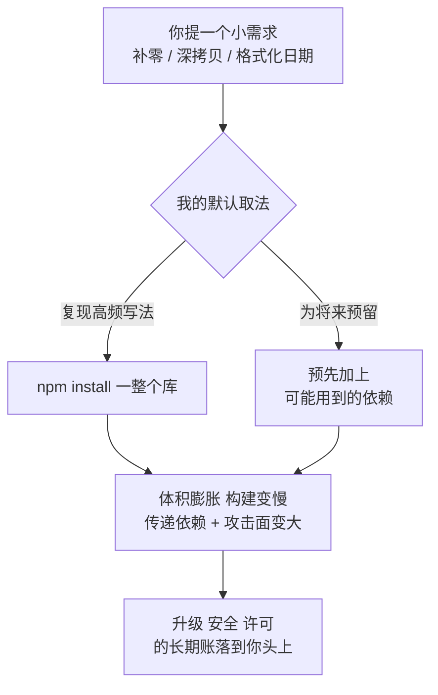

import PitfallMeta from '@site/src/components/PitfallMeta';

<PitfallMeta roles={['架构师', '工程师']} phase="概要设计" severity="中" appliesTo="全模型通用" evidence="社区案例" />

> 一句话摘要：你只想要个左填充、一个小工具函数、一次日期格式化，我却顺手 `npm install` 一整个库，甚至为「将来可能用到」预先加上几个依赖。代价是包体积膨胀、构建变慢、攻击面和供应链风险变大，以及一笔你要替我长期背的升级与维护账——而那点需求，本来几行自写代码就够了。

## 现象

我常看到这样的对话：你说「帮我把数字左边补零到 6 位」。我大概率回手就是 `npm install left-pad`，或者拉进一个功能齐全的格式化库，然后 `import` 进来调一个函数——而这件事，标准库一行 `String.prototype.padStart` 就做完了。

换个场景：你要「把对象深拷贝一下」，我引 `lodash`；你要「格式化一个日期成 `YYYY-MM-DD`」，我引 `moment`（一个已经停止开发、压缩后还有几百 KB 的库）；你要「生成一个 UUID」，我引第三方包，而你的运行时其实自带 `crypto.randomUUID()`。

还有一种更隐蔽的：你只字未提「将来」，我却自作主张地「为扩展性预留」——「反正以后可能要做国际化，先把 i18n 框架装上」「以后可能要缓存，先把 Redis 客户端加进来」。需求只有巴掌大，我给你铺了一张「为将来准备」的依赖网。

## 为什么会这样

把这个倾向追到底，是我「取最常见解法」的本能，撞上了「我不替你承担依赖的长期成本」这个事实。

**第一，我倾向于复现训练语料里最高频的写法，而不是最克制的写法。** 在海量的开源代码和教程里，「补零」「深拷贝」「格式化日期」这类需求，被演示得最多的解法往往是「装个流行库再调一个函数」——因为博客和 Stack Overflow 的回答天然偏爱「有现成轮子就用」。于是这些「库 + 调用」的组合在我的分布里就是高概率续写。研究也观察到，模型生成代码时**明显偏好第三方库而非标准库**。我给你的，是统计意义上「大家最常这么写」的那一版，不是「这点需求最该这么写」的那一版。

**第二，引入一个依赖，对我几乎零成本；它的账全在你那边。** 包体积、`node_modules` 的膨胀、传递依赖里那几十上百个我没看过的包、半年后的安全告警、某个上游作者弃坑或删包——这些代价我一律不用承担，所以在我「怎么实现」的权衡里，它们的权重天然偏低。我看到的只是「这样写最快、最像标准答案」，看不到的是你三年后要替这行 `install` 付的利息。

**第三，我对「这个项目的依赖预算」没有切肤之感。** 你的项目是想保持零依赖的库、还是早已 `node_modules` 上千包的应用？打包体积有没有上限？团队对供应链审查有多严？这些约束不在我眼前时，我默认当它们不存在，于是「加一个依赖」对我就成了没有阻力的动作。

**第四，「为将来准备」迎合了我偏爱「更完整」的倾向。** 这一点和[我倾向过度设计、堆时髦技术](./over-engineering-no-pushback.mdx)同根：预装一个「以后可能用到」的依赖，读起来比「先不装、需要再说」更像深思熟虑的工程，于是我更容易往这个方向走。



## 后果

- **包体积与构建一起变慢。** 一个本可用一行标准库解决的需求，换来几百 KB 的产物增量和更长的安装、打包时间。前端尤其敏感，每个多余的库都直接压在用户的加载时间上。
- **攻击面和供应链风险被放大。** 你加的不是一个包，而是它身后整棵传递依赖树——一堆你从没审过、却跑在你构建和生产环境里的代码。著名的 [left-pad 事件](https://en.wikipedia.org/wiki/Npm_left-pad_incident)就是反例：一个**只有 11 行**、做的就是「左填充」的小包被作者删掉，瞬间让 Babel、React 等**数千个项目**构建失败——那一个本可以自己写的函数，成了横在无数项目地基里的单点故障。
- **维护与升级负担长期挂账。** 每个依赖都是一个要持续跟版本、打补丁、应对弃坑的对象。你引一个 `moment` 容易，等它停更、要迁到更轻的替代时，成本远高于当初少引它。
- **隐性的依赖膨胀比你以为的严重。** 一项针对 LLM 编码代理的实证研究发现，从「声明的依赖」到「运行时实际加载的依赖」平均有 **13.5 倍** 的膨胀——我嘴上说只要三个包，跑起来内存里可能拉进几十个。你看到的依赖清单，远不是真实的足迹。
- **可能的许可牵连。** 我顺手引的库，许可证未必和你的项目兼容（比如 GPL 系传染到你本想闭源的产品）。这种风险我不会主动替你筛，而它一旦混进来，清理起来很麻烦。

## 最佳实践

核心：**把「加一个依赖」从默认动作改成需要论证的决定。先问标准库和项目里现成的工具能不能做，小需求优先几行自写。**

- **先问「不加依赖能不能做」。** 把它写进提示词：「优先用标准库 / 运行时内置 / 项目里已有的工具实现；只有在自写明显不划算时才考虑引入依赖，并说明理由。」补零用 `padStart`、UUID 用 `crypto.randomUUID()`、深拷贝用 `structuredClone`——很多需求的「现代标准库答案」我知道，只是默认不优先给。
- **小需求优先几行自写，而不是加一整个库。** 一个十行以内、逻辑稳定、没什么边界陷阱的工具函数，自己写通常比引一个外部包更划算——你省掉了一整棵传递依赖树和它的长期维护账。（注意与下面那条边界区分：自写指的是「外部本就不值得引入的小逻辑」，不是「重造项目内部已有的轮子」。）
- **让我为每个新依赖交一份账。** 「凡新增依赖，逐个说明：解决什么问题、有没有更轻的替代或标准库方案、它的体积、维护活跃度（最近更新 / 是否弃坑）、传递依赖数量、许可证。」把笃定的 `install` 逼成可评审的清单。
- **明确交出依赖预算和约束。** 告诉我这是个想保持零 / 少依赖的库，还是无所谓的内部脚本；有没有打包体积上限；许可证白名单是什么。约束不在我眼前，我就当它不存在。
- **拒绝「为将来准备」。** 「只为当前需求引入依赖，不要为假设的未来预装任何东西。」需要时再加，永远比先加了用不上、又不敢删要省心。
- **用工具把关，而不是只靠我自觉。** bundle size 检查（如 size-limit、或在线的包体积查询服务）、依赖评审、`npm audit`、许可证扫描、lockfile 审查——把这些设成质量闸门，让多余或危险的依赖在合并前就暴露。

```text
（可放进 CLAUDE.md 或贴在「实现一个小需求」的提示词前）
- 优先用标准库 / 运行时内置 / 项目已有工具；自写明显不划算时才引依赖。
- 凡新增依赖，逐个交代：解决什么问题、有无更轻替代、体积、维护活跃度、
  传递依赖数量、许可证。
- 不为「将来可能用到」预装任何依赖；需要时再加。
- 十行以内、无边界陷阱的小工具，优先自写，不引一整个库。
```

## 示例

**改之前：**

```text
你：帮我把订单号左边补零到 8 位。
我：好的，装个库就行——
    npm install left-pad
    import leftPad from 'left-pad';
    const id = leftPad(String(orderNo), 8, '0');
   （为一行能解决的事，引入了一个外部包和它身后的整棵依赖树）
```

**改之后：**

```text
你：帮我把订单号左边补零到 8 位。优先用标准库 / 内置能力，不要为这点事加依赖；
    如果你认为非引库不可，先说清理由和更轻的替代。
我：不需要任何依赖，运行时自带：
       const id = String(orderNo).padStart(8, '0');
    padStart 是 ES2017 标准方法，Node 和所有现代浏览器都支持。
    这点需求引外部包，只会平白多出一棵传递依赖树和长期维护成本，不划算。
```

同一个需求，加一句「优先标准库、别为这点事加依赖」，我就从「顺手 install 一个轮子」变回了「一行写完、零新增足迹」。

## 与「重复造轮子 / 幻觉 import」的区别

这条容易和[「我会重复造一个已有的轮子，或 import 一个根本不存在的东西」](./duplicate-logic-hallucinated-imports.mdx)混淆，但它们是**方向相反**的两种浪费：

- 那一条说的是**对内**——项目里其实**已经有**现成实现，我没看见，于是重新写了一份（重复逻辑），或者凭直觉 `import` 一个**根本不存在**的内部符号 / 包（幻觉 import）。根因是我的上下文窗口装不下整个仓库。
- **本条说的是对外**——一个本该自己写或用标准库就能解决的小需求，我却**多引入了一个真实存在、但过重、没必要**的外部依赖。根因是我偏向「复现高频写法」且不承担依赖的长期成本。

一句话：那条是「该用现成的却重造 / 凭空捏造」，本条是「该自己写的却滥引外部」。两边都要在评审时盯：既别重复造轮子，也别为一点小事拖进一整个库。

## 什么时候例外

「优先标准库 / 自写」是默认闸门，但有些场景，引一个成熟依赖恰恰是对的，自写才是错的：

- **安全敏感、自己写大概率写错**：加密、密码哈希、JWT 校验、TLS、协议 / 编码解析（如 URL、时区、Unicode 规范化）——这些领域的边界与攻击面，一个经多年审计的库远比我即兴几行靠谱。这里「自写」不是省成本，是给你埋漏洞。
- **它本就是这件事的事实标准**：某些库已经是生态默认（你的团队、招来的人、文档全默认它在），换成自写反而提高了别人理解和维护的成本。
- **正确实现的工作量远超「几行」**：日期 / 时区、富文本解析、大数运算这类「看着简单、坑极深」的需求，自写要补的边界比引库的长期账更贵。

判据：区别在于这块逻辑是**十行内能写对、边界稳定**的小工具（那就自写），还是**写对它本身就是一门专业**（安全、解析、时区——那就引一个被广泛审计的成熟库）。拿不准时，凡涉及安全与正确性下限，默认信成熟依赖而非我的手写。

## 版本说明

:::note 适用版本
这不是某一版的 bug，而是「复现训练语料里的高频写法」+「引入依赖对我零成本、账全在你那边」两个根因的共同产物，**全模型通用**。新版本对标准库 / 内置 API 的知识更全，你显式要求「优先标准库、别加依赖」时也更听得进去，能明显压低这个倾向；但只要你不主动施压，「顺手装一个最常见的库」仍是我的默认重心。把它当成一个需要你用提示词和质量闸门主动对冲的倾向，比指望某个版本「已经不乱加依赖了」更可靠。
:::

## 延伸阅读与出处

- [npm left-pad incident (Wikipedia)](https://en.wikipedia.org/wiki/Npm_left-pad_incident)
- [How one developer just broke Node, Babel and thousands of projects in 11 lines of JavaScript (The Register)](https://www.theregister.com/2016/03/23/npm_left_pad_chaos/)
- [AI-Generated Code Is Not Reproducible (Yet): An Empirical Study of Dependency Gaps in LLM-Based Coding Agents (arXiv 2512.22387)](https://arxiv.org/abs/2512.22387)
