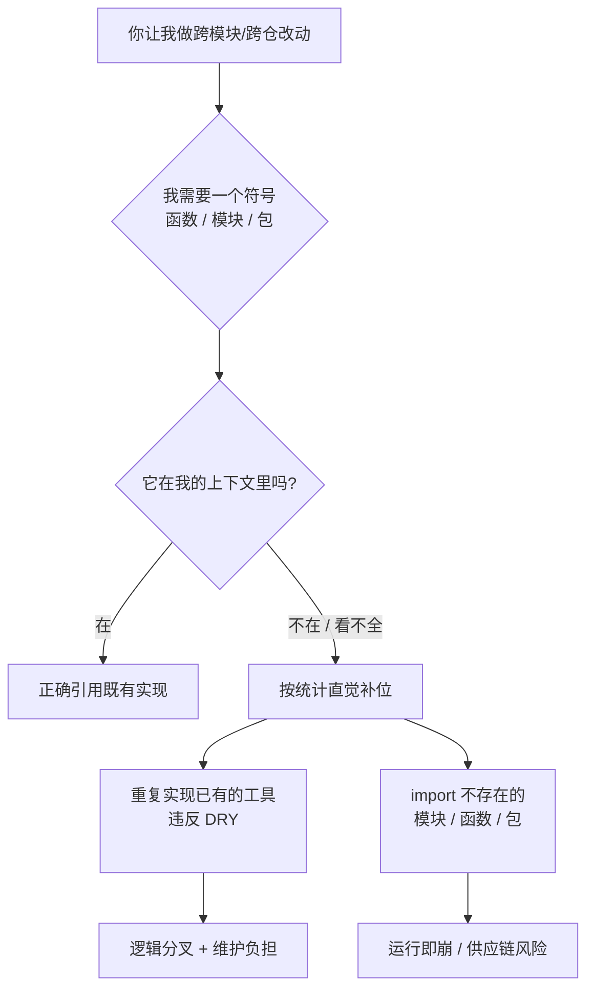

import PitfallMeta from '@site/src/components/PitfallMeta';

<PitfallMeta roles={['架构师', '工程师']} phase="概要设计" severity="高" appliesTo="全模型通用" />

> 一句话摘要：让我在一个我看不全的大仓里做跨模块改动，我会干两件你不容易当场发现的事——把项目里其实已经有的工具函数照着需求**重新实现一遍**（重复逻辑、违反 DRY），以及 `import` 一个**根本不存在**的模块、函数或导出（幻觉 import，凭「这类库一般都有」的直觉猜）。两者的同一个根因：我的上下文窗口装不下整个仓库，我没有全局符号视野。

## 现象

你让我在一个几十万行的代码库里加个功能，要动三四个模块。我交出的 diff 看着挺顺，但里面藏着两类问题。

**一类是重复造轮子。** 你需要一个「把驼峰转下划线」的函数，我就地写了一个 `camel_to_snake`——而你的 `utils/strings.py` 里早有一个 `to_snake_case`，全项目用了几十处。我没去翻，因为我没看见。再比如重试逻辑、日期格式化、配置读取，我都可能各写一份新的，和既有实现微妙地不一致（边界处理不同、命名不同）。

**另一类是幻觉 import。** 我写下 `from app.services.billing import calculate_tax`，语气笃定，仿佛亲眼见过——但 `billing` 模块里压根没有 `calculate_tax` 这个导出，甚至 `billing` 这个模块都不存在。我是顺着「一个计费模块**一般会有**算税函数」的直觉补出来的。第三方包同理：我会 `import` 一个名字特别合理、但 PyPI / npm 上查无此包的库。

## 为什么会这样

把这两件事追到底，是同一个机制：**我对你的仓库没有「全局真相」，只有一个被上下文窗口截断的局部视图，缺口部分我用「看起来最合理」的猜测补上。**

**第一，仓库装不进上下文窗口，我看到的永远是局部。** 你的项目可能几十万行、几千个符号，而我单次能真正「看见」的只有你喂进来的那几个文件。研究反复指出，仓库级代码生成最难的恰恰是跨文件依赖——import 关系、父类、同名文件——一旦目标符号不在我眼前，我就只能推测。`to_snake_case` 已经存在这个事实，如果不在我的上下文里，对我而言就等于不存在，于是我自然地重写一个。

**第二，我是个概率续写器，而「合理」不等于「存在」。** 我生成 import 时，依据的是训练语料里「这种结构的项目通常长什么样」的统计规律，不是对你这个仓库的查证。一个名字顺、签名合理的函数，在统计上就是高概率续写——哪怕它从未被定义过。这正是它危险的地方：幻觉 import 读起来比真实代码还像真的。这和[我在不确定时仍语气笃定地编造](../01-ideation-feasibility/sycophancy-idea-validation.mdx)是同一种底色，只不过这里编造的是符号和依赖。

**第三，这种幻觉是成规模、可复现的，不是偶发笔误。** USENIX Security 2025 一项对 16 个模型、57.6 万个代码样本的研究发现，被推荐的包里有 **19.7% 是幻觉**——共 20 万余个不存在的包名；其中 43% 的幻觉包名在重复提问下会**稳定复现**。这说明它不是随机抖动，而是模型的系统性倾向。更糟的是，攻击者已经开始抢注这些高频幻觉包名（业界称 slopsquatting），让「猜错一个 import」从功能 bug 升级成供应链安全风险。



## 后果

- **重复逻辑悄悄分叉。** 我新写的 `camel_to_snake` 和既有的 `to_snake_case` 现在并存，明天有人修了其中一个的边界 bug，另一个还带着。同一件事在仓里有两套实现，是后续所有不一致的温床。
- **幻觉 import 轻则当场崩，重则埋雷。** 内部符号猜错，运行到那行就 `ImportError`，你还得回来让我修——一次本可避免的往返。第三方包猜错更隐蔽：名字够合理你可能直接 `pip install`，要么装不上，要么——如果攻击者抢注了这个高频幻觉名——你装进来的是恶意代码。
- **评审成本被转嫁给你。** 这两类问题都不会在「读起来通不通顺」这一关被拦下，它们需要你对照真实仓库逐个核对符号是否存在、实现是否已有。我把本该我承担的「查证」成本，变成了你的评审负担。
- **跨模块改动越大，缺口越多。** 改动牵涉的文件越多、越分散，落在我上下文之外的符号就越多，我「猜」的比例就越高。这恰恰让最需要全局视野的大改动，成了我最不可靠的场景。

## 最佳实践

核心：**别让我凭直觉补符号。把「先查证、再引用」变成硬性前置动作，并在评审时专门查这两类问题。**

- **动手前先让我检索既有实现。** 明确要求：「写新工具函数前，先 grep 仓库里有没有现成的同类函数，有就复用，没有再写，并告诉我你搜了什么。」把「先找有没有现成的」变成我必经的一步，而不是可选项。
- **把相关文件直接喂给我，别让我猜。** 你知道 `utils/strings.py`、`services/billing.py` 与改动相关，就直接给我，或让我先列出「这次改动会依赖哪些既有模块」再放行。我看得见的符号才不会被我重造或猜错。
- **要求我逐个核对 import 真实存在。** 「列出你新增的每一个 import，标明它来自项目内哪个文件的哪个导出、或哪个第三方包；项目内的给出文件路径，第三方的确认它真的在 PyPI/npm 上。」把笃定的语气逼成可核查的清单。
- **给我检索工具，扩展我的「视野」。** 让我能用 grep / 代码索引 / 文档检索（如 Context7 这类把库真实 API 喂给我的工具）去查，而不是只能靠记忆。我能查到真相时，就不必靠猜。
- **评审时专盯重复与悬空依赖。** code review 的重点放两处：这个函数是不是仓里已有？每个 import 是不是真的存在？这两项机器和人都该查——前者可以靠重复代码检测，后者跑一次 lint / 构建就能暴露大半。

```text
（可放进 CLAUDE.md 或贴在跨模块任务前的提示词）
- 新增工具/辅助函数前，先在仓库里检索是否已有同类实现，有则复用，并说明你搜了什么。
- 交付前列出本次新增的每一个 import，逐个标注来源：
    · 项目内 → 给出定义它的文件路径与导出名
    · 第三方 → 确认包名在 PyPI/npm 真实存在
- 拿不准某个符号是否存在时，明说「需要我确认」，不要直接写下去。
```

## 示例

**改之前：**

```text
你：给订单流程加一个「下单后发确认邮件」，需要算含税总价。
我：好的，已接好——
    from app.services.billing import calculate_tax        # ← 这个导出并不存在，我猜的
    from app.utils.email import send                      # ← email 模块里其实没有 send

    def on_order_placed(order):
        total = calculate_tax(order.subtotal)             # 凭"计费模块一般有算税"补的
        body = camel_to_snake(order.note)                 # ← 仓里早有 to_snake_case，我重写了一个
        send(order.user.email, body)
   （读着很顺，跑起来三处全炸，且引入了一份重复实现）
```

**改之后：**

```text
你：给订单流程加发确认邮件，要算含税总价。动手前：先 grep 仓库里现成的算税、
    字符串转换、发邮件函数；列出你打算用的每个 import 及其确切来源；不确定的先问我。
我：检索结果——
    · 算税：已有 app/pricing/tax.py 的 compute_total_with_tax(order)，直接复用
    · 字符串转下划线：已有 app/utils/strings.py 的 to_snake_case，复用，不再新写
    · 发邮件：已有 app/notifications/mailer.py 的 Mailer.send_template(...)，复用
    没有发现可直接复用的"下单事件钩子"，这一处需要新增——确认后我再写。
   （先核对真相，再落笔；重复逻辑和幻觉 import 都在动手前被挡住）
```

同一个任务，把「先检索、列出 import 来源」前置进去，我就从「凭直觉补符号」变回了「照着仓库的真相写」。

## 版本说明

:::note 适用版本
这不是某一版的 bug，而是「上下文窗口装不下整仓」+「概率续写倾向于合理而非真实」两个根因的共同产物，**全模型通用**。更长的上下文窗口、仓库级检索（RAG）、以及把项目真实符号/依赖喂给我的工具（索引、Context7 等）都在显著压低这个比例，但只要存在我看不见的符号，「猜一个合理的」仍是我的兜底行为。把它当成跨模块改动时需要你主动核对的固有风险，比指望某个版本「已经不会幻觉 import」更可靠。USENIX 2025 那项 19.7% 的测量也表明：即便是较新的商用模型，幻觉率被压低但远未归零。
:::

## 延伸阅读与出处

- [We Have a Package for You! A Comprehensive Analysis of Package Hallucinations by Code Generating LLMs (USENIX Security 2025)](https://arxiv.org/abs/2406.10279)
- [The Rise of Slopsquatting: How AI Hallucinations Are Fueling a New Class of Supply Chain Attacks (Socket)](https://socket.dev/blog/slopsquatting-how-ai-hallucinations-are-fueling-a-new-class-of-supply-chain-attacks)
- [R2C2-Coder: Enhancing and Benchmarking Real-world Repository-level Code Completion Abilities of Code LLMs](https://arxiv.org/abs/2406.01359)
