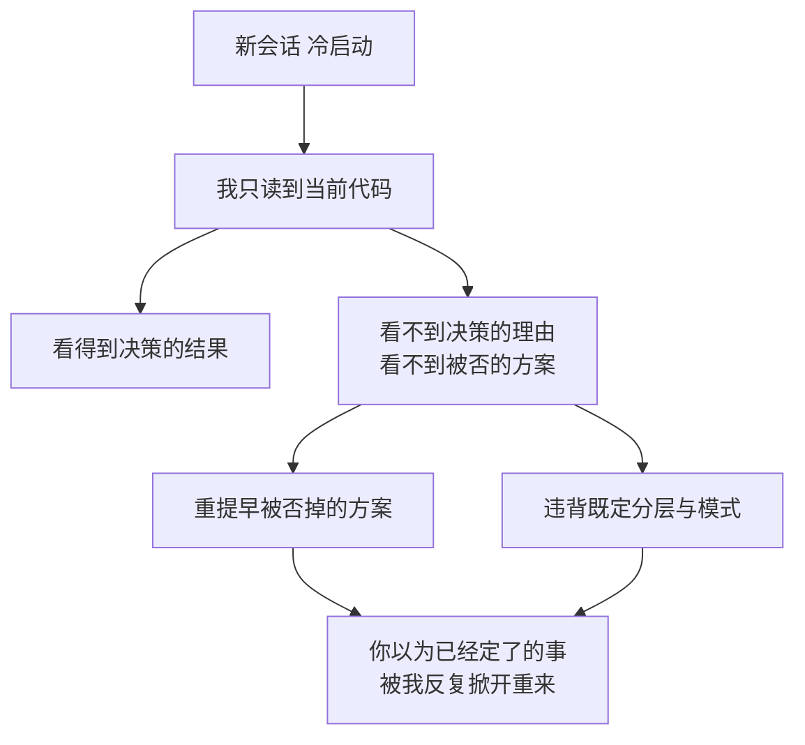

import PitfallMeta from '@site/src/components/PitfallMeta';

<PitfallMeta roles={['架构师', '工程师']} phase="概要设计" severity="高" appliesTo="Coding Agent 通用" evidence="社区案例" />

> 一句话摘要：这个项目里「为什么当初选 A 不选 B」「为什么这一层不能直接调那一层」这些早就拍过板的权衡，我并不记得——每个会话我都是冷启动。于是我会重新端上一个上周被你否掉的方案、绕过既定的分层、或者把一次刻意的取舍当成可以随手改掉的细节。别指望我「想起来」，我没有跨会话的记忆；你得把决策连同**理由**写成我能读到的产物。

## 现象

我常看到这样的事。三周前你和我（或者和另一个会话里的我）一起定了：缓存层只能由 service 层访问，controller 不许直接碰 Redis——因为你们踩过缓存键散落各处、改一次散弹式波及的坑。今天你让我加个接口，我顺手就在 controller 里读了一把缓存，理由是「这样少绕一层，更直接」。我说得理直气壮，因为在我眼里那条规矩从来不存在。

还有更扎心的：上个月评审时你已经明确否掉了「引入一个独立的事件总线」，结论是当前量级用数据库表加状态字段就够。今天你问我「这个异步通知怎么做更好」，我大概率又把事件总线端上来，论证得头头是道——我不是没听你说过，而是我根本没听过，每个会话我都从零开始读代码、不读历史。

## 为什么会这样

根因只有一句话：**我没有跨会话的持久记忆。**

LLM 在架构上是无状态的——每一次推理调用都从一个全新的上下文窗口开始，上一次会话里的对话、推理、你拍板时讲的理由，调用结束就全部丢弃，不会自动结转到下一次。我不是「忘了」那次权衡，而是它从来没进过我这次的上下文。会话之间，我每次都是冷启动。

这就引出关键的一点：**我能看到代码现在长什么样，但看不到它「为什么长成这样」。** 代码记录的是决策的*结果*，不是决策的*理由*。我读到 controller 不直接碰缓存，但我读不到「这是为了避免缓存键散落」这条约束；我读到你用了一张表加状态字段，但读不到「事件总线已经被评估并否决」。Michael Nygard 在提出架构决策记录（ADR）时点破过同一个困境：一个新来的人面对某个过往决策，如果不了解它背后的理由与后果，就只剩两个选择——盲目接受，或者盲目修改。**每个新会话里的我，就是那个永远新来的人。**

于是我默认走两条歧路：

- **重复一个已死的方案。** 被否的方案不会在代码里留下痕迹（它正是因为没被采纳才不存在），所以从代码反推，我完全看不出它被考虑过、被否过。我会兴冲冲地「发现」它，当成新点子端给你。
- **违背一条看不见的约束。** 既定的分层、调用方向、模式边界，往往是「不该出现什么」而非「出现了什么」。而「不该出现的东西」恰恰不在代码里——我没有负面证据可读，于是踩线时毫无知觉。



## 后果

- **同一场争论反复重开。** 你每个会话都要重新跟我解释「为什么不用事件总线」，我每次都要重新被说服一遍。决策没有沉淀，等于没决策——它的成本被你一遍遍重付。
- **架构的一致性被我悄悄蛀空。** 我违背的分层和模式，单看每一处「都能跑」，于是容易合进去。但约束的价值正在于全局一致；被我开了几个口子之后，「controller 不碰缓存」这条规矩名存实亡，下一个人（或下一个会话的我）有样学样，地基就这么松了。
- **刻意的取舍被当成疏忽「修正」。** 你为了简单而刻意不做的事，在我眼里像是「还没做完」。我会「好心」地把它补上——把你省下的复杂度又加回来，还觉得自己在帮忙。
- **最危险的是我的笃定。** 我违背决策时不会犹豫、不会标注「这里我可能动了既定结构」，因为我根本不知道有结构存在。这种零自觉的笃定，比一个明显的错误更难在评审里被你抓住。

（这条说的是「**不记得既有决策与其理由**」导致的重复与违背。它跟「只给单一方案、不摆权衡」是两回事——那是另一条误区；也不是「跨模块重复逻辑、幻觉 import」那种当下产出的问题。这条的病根在记忆，不在产出本身。）

## 最佳实践

核心动作只有一个：**把决策连同理由，沉淀成我读得到的产物，并要求我动结构前先读它。** 我没有记忆，但我有一双眼睛——你喂进上下文的东西，我一定看得见。

- **关键架构决策写成 ADR。** 一条 ADR 记一个决策，标准结构是「背景 / 决策 / 后果」——尤其要写清*被否的方案和否它的理由*，这正是代码里读不到、而我最需要的那部分。放在 `docs/adr/` 之类固定位置，让它成为可检索的决策日志。
- **把硬约束做成 CLAUDE.md 里的指针。** 不必把整篇 ADR 抄进去（那会撑爆上下文，本身也是一条误区），而是留一条指针：「改动数据访问层前，先读 `docs/adr/0007-no-direct-cache-access.md`」。让约束在我每次启动时就在视野里。
- **动结构前先让我复述依据。** 提示词里写死一步：「在你修改分层或引入新组件前，先告诉我这一步*依据或违反*了哪条既有决策（引用 ADR 编号）；找不到对应决策再继续。」把「读决策」变成我动手的前置闸门。
- **评审时索要决策引用。** 不要只问「这样写对吗」，要问「你这处改动遵循了哪条既定模式？有没有碰到任何被记录过的约束？」逼我去对照决策，而不是凭当前代码即兴发挥。
- **把『不要做什么』也写下来。** 既然我读不到「被否的方案」「不该出现的调用」这类负面信息，那就把它们显式写成正面记录——ADR 里那句「我们*不*采用事件总线，因为……」，比任何代码注释都救命。

## 示例

**改之前：**

```text
你：帮我加一个工单状态变更后的异步通知。
我：建议引入一个轻量事件总线，状态变更时发事件，通知服务订阅消费，
    这样解耦更彻底、未来扩展也方便……
   （上个月这个方案刚被你否过，结论是用一张表加状态字段。我毫不知情，又端了一遍。）
```

**改之后：**

```text
你：帮我加一个工单状态变更后的异步通知。动手前先读 docs/adr/，
    告诉我这块有没有已记录的决策，你的方案依据或违反了哪一条。
我：读到 ADR-0012：通知此前评估过事件总线并否决，理由是当前量级下运维成本不划算，
    选定方案为「状态表 + 定时轮询」。那我顺着既有决策来：在状态表上加一个
    notified 标记，用现有的定时任务扫描未通知的变更。要重新考虑事件总线，
    按 ADR-0012 的触发条件是吞吐到了 X——目前还没到。
```

同一个需求，差别只在于：第二次我手里有了那份「我读得到的决策记录」。我依然没有记忆，但我不再需要记忆——你把它放进了我的视野。

## 版本说明

:::note 适用版本
这不是某一版的 bug，而是 LLM「无状态、按上下文窗口工作」这一架构属性的直接结果，**全模型通用**。各家在不断加大上下文窗口、上线项目记忆 / 长期记忆等外挂机制（把过往片段检索后注入上下文），这些都能缓解症状，但它们的本质仍是「把历史重新喂进上下文」，而非我真的「记住」了。只要某条决策的理由没被写进我这次能读到的产物，我对它就依然零记忆。把「沉淀决策、动结构前先读」当成稳定的工程习惯，比指望某个版本「能记住上次聊过什么」可靠得多。
:::

## 延伸阅读与出处

- [Architecture Decision Record（Martin Fowler bliki，含 Michael Nygard 原始论述）](https://martinfowler.com/bliki/ArchitectureDecisionRecord.html)
- [Architectural Decision Records（adr.github.io）](https://adr.github.io/)
- [Are LLMs Stateless? Architecture, Implications and Solutions（Atlan）](https://atlan.com/know/are-llms-stateless/)
