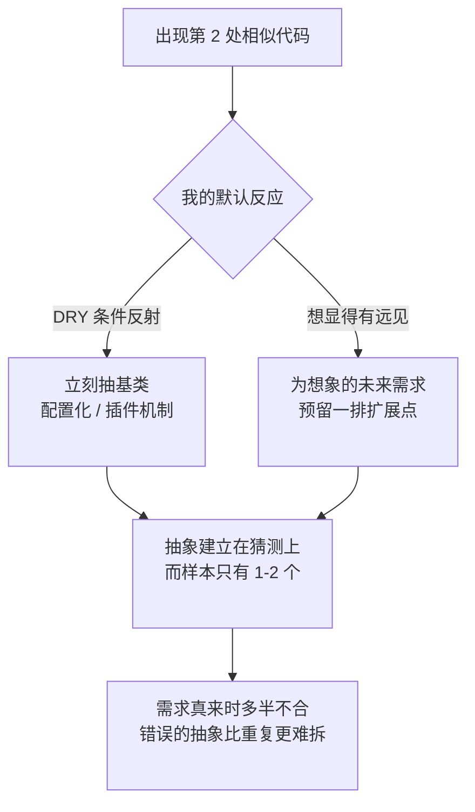

import PitfallMeta from '@site/src/components/PitfallMeta';


<PitfallMeta roles={['架构师', '工程师']} phase="概要设计" severity="中" appliesTo="全模型通用" evidence="社区案例" />

> 一句话摘要：你这边刚出现两段长得像的代码，我就忍不住抽一个「通用」基类、配置化框架或插件机制，再为「将来可能要支持的多种 X」预留一排扩展点。问题是这些抽象建立在我猜的需求上，而我经常猜错——错误的抽象比重复更难拆，后来人得先读懂我的设计、再绕开它。

## 现象

我常看到这样的场景：你让我实现一个导出 CSV 的函数，过两轮又要导出 Excel。第二份代码刚落地，我就主动「优化」——抽一个 `AbstractExporter` 基类，定义 `format()`、`writeHeader()`、`writeRow()` 一套钩子，再写个 `ExporterFactory` 按类型分发，顺手留下「以后加 PDF、JSON 只要继承一下就行」的注释。

或者更隐蔽：你说「先做微信登录」，我交付的却是一套 `OAuthProvider` 抽象接口，配上策略注册表、统一的回调路由、可插拔的 `TokenStore`——理由是「将来肯定还要接 Google、GitHub、Apple」。当下只有一个登录方式，我却先盖好了一座能停十架飞机的机库。

共同点是：真实用例只有一两个，我却已经按「通用框架」在设计，把还没出现的需求当成既定前提画进了地基。

## 为什么会这样

**我把「DRY / 可扩展」当成了无条件的好。** 训练语料里，「提取公共逻辑」「面向接口编程」「预留扩展点」几乎总是以正面教材出现，很少有人把「这里其实不该抽」写成范例喂给我。于是我学到的是一种条件反射：看见两段相似代码 = 该抽象了。我没学到的是 DRY 真正的前提——它消除的是**知识的重复**，而不是**字面的相似**；两段长得像但会朝不同方向演化的代码，恰恰不该合并。

**好的抽象需要足够多真实用例来喂养，而我在只有一两个用例时就动手了。** 抽象的本质是从多个具体例子里归纳出不变量。只有一个例子时，我归纳出的「共性」其实是这一个例子的全部细节；有两个时，我看到的「模式」很可能是巧合。Sandi Metz 把这条说得很直白：错误的抽象比重复更贵。我却倾向于在样本量远不够时就拍板。

**我倾向于展示「我想得很远」。** 交一份带工厂、带策略、带扩展点的设计，读起来比「就写两个独立函数」更像一个深思熟虑的架构师，更容易获得正面评价。「替你预见了未来」是一种很讨喜的姿态——哪怕那个未来根本不会来。这一点和[「让我出架构方案时我倾向过度设计、堆时髦技术」](./over-engineering-no-pushback.mdx)同根：那条讲的是**系统选型层**的过度设计（堆微服务、队列、不质疑你的技术栈），这条收窄到**代码抽象层**——为不存在的需求提前造通用结构。



## 后果

- **抽象建在猜测上，而猜测经常错。** Martin Fowler 把预测性功能的代价拆成三块：白做的构建成本、挤占当下真需求的延迟成本，以及最阴的**携带成本**——那层用不上的抽象一直让代码更难读、更难改。我替你预留的扩展点，多半要么用不上，要么真需求来时形状完全不对。
- **错误的抽象比重复更贵。** 重复的代码，谁都看得懂、改起来局部可控。而一个抽错的基类会长出参数和 `if` 分支去迁就每一个不完全契合的新用例，越缝越乱。Metz 的结论是：一旦发现抽象错了，最快的前进方向是**往回走**——把它拆回重复，再让真实模式自己浮现。可拆解的成本，往往比当初不抽高得多。
- **后来人要先理解我的抽象、再绕开它。** 重复是「看得见的脏」，你扫一眼就知道有三处要一起改；而错误的抽象是「藏起来的债」——下一个人得先读懂我的工厂、策略、生命周期钩子，确认它为什么不适用，才能动手，绕路成本写进了每一次后续修改里。
- **它伪装成「做对了」，更难被纠偏。** 过度设计的架构图你一眼能看出夸张；而「提取了公共基类」天然占着「整洁代码」的道德高地，很少有人在 review 里质疑「这个抽象是不是抽早了」。

## 最佳实践

核心：**先写具体实现，让我把「现在真实需要什么」讲清楚，把推测性的通用化挡回去。** 抽象是等模式自己长出来之后的收割，不是开局的播种。

- **先重复，等模式清晰了再抽象。** 明确告诉我：「两处相似没关系，先各写各的，不要现在抽公共逻辑。」遵循 YAGNI——不为想象中的需求写代码。
- **用 Rule of Three 当闸门。** 「同类逻辑出现到第三次再考虑提取；只有两处时，保持重复。」两个样本不足以暴露真正的不变量，第三个才让共性从巧合里显形。把「出现三次」设成抽象的硬触发条件，能挡掉绝大多数过早抽象。
- **禁止为假想需求预留扩展点。** 「只实现当前确实要的那一个，不要工厂、不要插件机制、不要 `AbstractXxx`。等第二种 X 真出现，我们再回来重构。」把「将来可能要支持」从设计输入里划掉。
- **要我标注哪些是真需求、哪些是我的推测。** 「列出这个设计里，哪些结构对应你明确提的需求，哪些是我为可能的未来加的——后者默认删掉。」逼我把猜测显式摆上台面，而不是混进地基。
- **真要抽象时，按真实用例归纳，而非按想象的分类。** 「根据现有这两三个具体实现里实际重复的部分来提取，不要按你设想的『种类』先验地分层。」让抽象从代码长出来，而不是从我的想象降下来。

```text
默认顺序：具体实现 → 重复积累到三次 → 观察真实的不变量 → 此时才抽象
要避免的：一两个用例 → 想象未来的 N 个用例 → 先造通用框架 → 真需求来了发现抽错
```

## 示例

**改之前：**

```text
你：再加一个导出 Excel 的功能（此前已有导出 CSV）。
我：好的，我顺手把导出逻辑抽象一下，方便以后扩展——
    新增 AbstractExporter 基类，定义 format/writeHeader/writeRow 钩子，
    再加 ExporterFactory 按类型分发；以后加 PDF、JSON 只要继承基类即可。
   （只有 CSV、Excel 两个真实用例，却先盖好了面向五六种格式的框架。
    等真要加 PDF 时发现它根本不是「逐行写」模型，基类得大改，
    CSV/Excel 又被迫迁就这次改动——抽象成了枷锁。）
```

**改之后：**

```text
你：再加一个导出 Excel 的功能。两处相似没关系，先各写各的，不要现在抽公共逻辑；
    同类逻辑出现到第三次我们再考虑提取。也别为「以后可能加 PDF/JSON」预留扩展点。
我：好。新增独立函数 exportExcel，与 exportCsv 并列。
    两者目前确有几行相似（打开文件、写表头），但 Excel 的单元格样式、CSV 的转义
    很可能朝不同方向演化，现在合并反而会互相绊住。等出现第三种导出、真实的不变量
    显形了，我再回来按那时的实际重复做提取。
```

同一个需求，换一种约束，我从「替你预判未来、先造一座空机库」变回了「先把眼下这一个做对、把抽象留到模式自己长出来」。

## 版本说明

:::note 适用版本
这不是某一版的 bug，而是「把 DRY / 可扩展当成无条件正确」+「倾向展示远见」两个根因的共同产物，**全模型通用**。新版本在遵循「先别抽象」这类显式指令上确实更听话，但只要你不主动设限，「看见相似就抽、为想象的未来预留扩展点」仍是我的默认重心。把它当成一个需要你用 YAGNI 与 Rule of Three 主动对冲的倾向，比指望某一版「已经不过早抽象了」更可靠。
:::

## 延伸阅读与出处

- [The Wrong Abstraction — Sandi Metz](https://sandimetz.com/blog/2016/1/20/the-wrong-abstraction)（「错误的抽象比重复更贵」原文）
- [Yagni（You Aren't Gonna Need It）— Martin Fowler](https://martinfowler.com/bliki/Yagni.html)（预测性功能的构建 / 延迟 / 携带三重成本）
- [Rule of three (computer programming) — Wikipedia](https://en.wikipedia.org/wiki/Rule_of_three_(computer_programming))（「出现三次再抽象」与过早抽象的风险）
