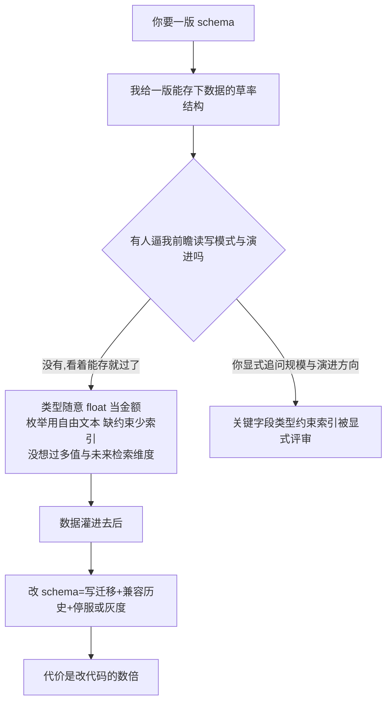

import PitfallMeta from '@site/src/components/PitfallMeta';

<PitfallMeta roles={['架构师', '工程师']} phase="概要设计" severity="高" appliesTo="Coding Agent 通用" />

> 一句话摘要：你让我设计表结构或接口契约，我会很快给你一版「能把数据存下来」的 schema——但字段类型挑得随意（该 decimal 用了 float、该枚举用了自由文本）、缺约束少索引、没想过将来要怎么查、怎么演进。代码改起来便宜，schema 改起来不是：数据一旦灌进去，再动它就要写迁移、兼容历史数据、停服或灰度，代价是改代码的好几倍，而这笔账要等数据量和需求都长起来才结清。

## 现象

我常看到这样的开场：你说「帮我设计一张存订单的表」。我几秒钟就给你一版，看着挺齐全——`id`、`user_id`、`amount`、`status`、`created_at`，能跑。但细看就露馅：

- `amount` 我用了 `float`，而它是钱。
- `status` 我用了 `varchar`，里面将来会塞进「pending」「paid」「PAID」「已支付」各种写法。
- 外键没加约束，`user_id` 可以指向一个不存在的用户。
- 没有索引，等你按 `user_id` 查历史订单时全表扫描。
- `address` 我塞了一个字段，没想过一个用户会有多个地址、地址将来要拆成省市区分别检索。

每一处单看都「能用」。问题是这版 schema 一旦上线、灌进几十万行真实数据，上面每一条都得靠一次迁移来纠正——而迁移远不是改代码那么轻。

## 为什么会这样

根因是一句话：**我优化的是「现在能把数据存下」，而 schema 的成本是滞后显现的。** 拆开看有三股力。

**第一，schema 的代价不在写的时候,而在改的时候,我当下看不见。** 给我一段代码,写错了你立刻能跑出来、改一行就好;给我一版 schema,它「错」得很安静——`float` 存金额今天和 `decimal` 看不出差别,要等到对账差几分钱才暴露;`varchar` 当枚举今天能存,要等到三种大小写混进去、统计口径对不上才暴露。我没有为「将来改它有多贵」付费的机制,于是默认不为还没发生的演进买单。

**第二,我天然走数据的 happy path。** 我描述的是「正常一条订单怎么存」,因为那是最清楚的故事。一个用户多个地址、金额要支持多币种、状态机将来要加一档、这个字段以后要能被检索——这些「会变」的维度不在那个故事里,除非你逼我去想数据三年后长什么样。这一点和[《我给的方案看起来对,却经不起边界推敲》](../04-detailed-design/plausible-but-brittle-design.mdx)同源:那条说的是**方案在最坏情况下垮不垮**(规模、并发、失败重试),这条说的是**数据契约前不前瞻、改起来贵不贵**。一个是运行时健壮性,一个是数据演进成本,别混为一谈。

**第三,数据和代码不是一类东西,而我常按代码的惯性对待 schema。** 代码可以随便重构,因为它没有状态——改完跑测试就行。schema 背后压着真实数据:改类型要转换存量、加非空约束要先回填、删字段要确认没人读、拆表要搬数据并双写过渡。代码的「重构」近乎免费,数据的「重构」是一场带历史包袱的迁移。我若不把这点摆在眼前,就会用「改代码的轻松感」去定一个「改起来很重」的东西。



## 后果

- **改 schema 的代价是改代码的数倍。** 改一行代码,提交、跑测试、合并。改一个已上线的字段类型,要写迁移脚本、转换存量数据、在测试库验证、安排发布窗口、想好回滚——而且数据越多,迁移越慢、风险越高。
- **历史数据成了甩不掉的包袱。** 你想把自由文本的 `status` 收成枚举?先得把库里已有的「PAID」「已支付」「paid」全部归一,而你未必还分得清当初每种写法是什么意思。草率的 schema 把脏数据一起固化进了地基。
- **要停服或上灰度,本来可以不用。** 不能容忍停机的系统,改 schema 往往得走 expand-contract:先加新结构、双写过渡、迁数据、再删旧结构 (Martin Fowler 称之为 Parallel Change)。这套流程安全,但要拆成至少三次发布、维护一段双 schema 共存期——是一版前瞻的设计本可以替你省掉的复杂度。
- **错误的契约会向外扩散。** 接口契约一旦发出去被下游依赖,改它就不只是改你的库,而是要协调每一个调用方。schema 定得越随意,将来要拉的人越多。

## 最佳实践

**别让我「先给一版能存的表」,要让我先问清数据怎么读、多大规模、往哪演进,再定契约;关键字段的类型、约束、索引逐条评审;改动一律走迁移工具而非手改。**

- **先交出读写模式和规模,再要 schema。** 「这张表主要按什么维度查?写多还是读多?一年内大概多少行?哪些字段将来可能要支持检索或排序?」把这些写进提示词。我对数据的未来没有切肤之感,那就让它变成白纸黑字的硬输入。
- **逼我对关键字段显式定型。** 金额用 `decimal` 不用 `float`(浮点数存不准钱);有限取值用枚举或带外键的码表,不要自由文本;该非空的加 `NOT NULL`,该唯一的加唯一约束,常查的列加索引。让我对每个字段回答「为什么是这个类型、它将来会不会变」。
- **为「会变」的部分留演进空间——但不是过度通用。** 这和[《过度设计、不质疑你的选型》](./over-engineering-no-pushback.mdx)是一条线的两端:那条警告「为不存在的需求堆复杂度」,这条提醒「为**确实会来**的演进留余地」。区别在于有没有真实依据:一个用户会有多个地址,这是业务事实,就该一开始用关联表而不是一个 `address` 字段;而「也许将来要支持任意键值对」纯属臆测,别用一张 EAV 大宽表去接。前瞻是按已知的读写与演进方向定契约,不是把 schema 做成万能容器。
- **改动一律走版本化迁移,别手改库。** 把每次 schema 变更写成可重放、可回滚的迁移脚本,纳入版本控制和 CI——这正是 Evolutionary Database Design 的核心:schema 跟着代码一起迭代演进,而不是一次定死或线上手术。
- **不能停机就显式要 expand-contract。** 对线上系统的破坏性变更 (改类型、删字段、拆表),让我给出「加新→双写→迁移→切读→删旧」的分步方案,而不是一条 `ALTER` 怼上去。

## 示例

**改之前:**

```text
你:帮我设计一张存订单的表。
我:好的!
   CREATE TABLE orders (
     id        INT PRIMARY KEY,
     user_id   INT,
     amount    FLOAT,           -- 钱用了浮点
     status    VARCHAR(20),     -- 枚举用了自由文本
     address   VARCHAR(200),    -- 假设一个用户只有一个地址
     created_at DATETIME
   );
   -- 没有外键约束、没有索引、状态没有约束取值
```

**改之后:**

```text
你:设计订单表前先问清楚:主要按 user_id 和 created_at 查;一年约 50 万单;
   金额涉及多币种;一个用户会有多个收货地址;状态是固定状态机。给出带类型、
   约束、索引的 schema,并说明哪些地方为已知的演进留了空间。
我:orders 表:amount 用 DECIMAL(12,2) 并加 currency 列;status 用枚举 (或带
   外键的状态码表),不用自由文本;user_id 加外键约束;(user_id, created_at)
   建联合索引以支撑你的主查询。地址拆出独立的 addresses 表用 order_id/user_id
   关联,因为「一个用户多地址」是确定的业务事实——这是按已知演进留空间,不是
   过度通用。所有变更我会写成迁移脚本纳入版本控制;若上线后要改类型或拆表,
   走 expand-contract 分步迁移,避免停服。
```

同一张表,先把读写模式、规模和演进方向问清楚,我就从「随手给一版能存的」变成「替你把数据契约的账算到三年后」。

## 什么时候例外

「先问读写与演进再定 schema」是默认闸门，但前提是这版 schema 会承载真实数据、要长期演进。有些场景，一版草率的表恰恰是对的：

- **明确会丢的探针（spike）**：你只是想验证「这个查询跑不跑得通」「这个想法成不成立」，数据用完即弃、绝不上生产——这时 `float` 当金额、`varchar` 当状态都无所谓，把时间花在前瞻设计上才是浪费。
- **一次性脚本与本地分析**：跑一遍就删的数据导入、临时报表，schema 没有「将来」，自然不必为不存在的演进买单。

判据：区别在于这份数据**会不会被长期依赖、会不会演进**。会，就先问清读写与规模再定契约；如果它寿命以小时计、明确不进生产，草率就是对的——但务必显式说清「这是一次性探针」，别让它悄悄长成正式表。

## 版本说明

:::note 适用版本
这不是某一版的 bug,而是「优化当下能存、不为滞后成本买单」加「默认走数据 happy path」两个根因的产物,**全模型通用**。模型越强,给出的 schema 越像模像样、越容易让你直接采纳,草率的类型与缺失的约束反而藏得越深——所以「先问清读写与演进再定 schema」这件事,越用强模型越不能省。把它当成一个需要你主动对冲的倾向,比指望某个版本「已经会自己前瞻了」更可靠。
:::

## 延伸阅读与出处

- [Evolutionary Database Design (Martin Fowler & Pramod Sadalage)](https://martinfowler.com/articles/evodb.html)
- [Parallel Change / Expand-Contract (Martin Fowler bliki)](https://martinfowler.com/bliki/ParallelChange.html)
