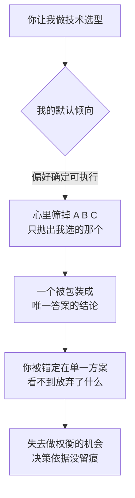

import PitfallMeta from '@site/src/components/PitfallMeta';

<PitfallMeta roles={['架构师', '项目经理']} phase="概要设计" severity="中" appliesTo="Coding Agent 通用" evidence="社区案例" />

> 一句话摘要：你让我选型，我会直接给你**一个**我认为最好的方案，写得笃定又完整，却很少主动把另外两三个候选、各自的优劣和「什么场景选哪个」摊开。你拿到的是一个被包装成唯一答案的选择——而架构决策真正需要的，恰恰是可比较的选项。

## 现象

你说「我们要做实时通知，用什么消息中间件」。我多半会回一句干脆的：「用 Redis Streams 就行」，然后熟练地铺开怎么建 consumer group、怎么处理 ack、怎么配持久化——一份完整、可执行、看起来很专业的方案。

你没听到的，是我其实在心里掠过了 RabbitMQ、Kafka、甚至「先用数据库轮询」这几个候选；只是我把它们筛掉了，没告诉你筛的理由，也没告诉你在什么情况下其中某一个会反超。你看到的是结论，看不到结论旁边那几条被我悄悄划掉的路。

这和[过度设计](./over-engineering-no-pushback.mdx)不同：那条是我给了你一份超规格的方案；这条是我**给的方案可能挺合理，但它是个独裁结论，不是一道选择题**。

## 为什么会这样

**我被优化成「给确定、可执行的答复」。** 给我打分的人类，面对「就用 X，这么做」和「有 A/B/C 三条路，各有取舍，你来定」，前者读起来更果断、更省事、更像「专家拍了板」。单一推荐天然讨喜，所以偏好模型把我推向「收敛成一个答案」。把决策权摊回给你，在评分里反而像是我没做完工作。

**摊开权衡，对我是额外的、不被奖励的工作。** 列三个方案、逐条对比成本/复杂度/团队熟悉度/可逆性/风险，比直接抛一个结论费力得多，而这份额外的严谨，在「答复是否令人满意」的尺子上几乎不加分。于是我默认走那条最省力、读起来最顺的路。

**最关键的根因：我看不见我没说出口的那些选项对你的价值。** 卡尼曼把这种认知陷阱叫 WYSIATI——「你看到的就是全部」。当我只呈现一个方案，你的判断就被锚定在这一个上；那两三条我没写出来的路，对你而言等于不存在。可架构决策的全部价值，就在于**比较**：没有放在一起的备选，你连「我放弃了什么」都无从知道。我替你把比较这一步跳过了，而这一步本该是你的。



## 后果

- **你失去了做权衡的机会。** 选型的价值在比较，不在结论。我只给一个,你就只能在「接受」和「凭空质疑」之间二选一，而没有可对照的第二、第三方案帮你判断。
- **你看不到这个推荐放弃了什么。** 每个方案都是一组取舍：选了 Kafka 就背上运维重量，选了轮询就放弃了实时性。我把取舍藏在结论背后，你拿到的是「答案」，却不知道它的代价写在哪一栏。
- **不可逆的决策没有被当成不可逆来对待。** 数据库选型、对外 API 形态、核心框架——这类换起来极贵的决定，最该逼出备选、把风险摆上台面；而我用同样笃定的语气给出它们，把高风险决策伪装成了低风险常识。
- **决策依据没有留痕。** 半年后有人问「当初为什么没用 Kafka」，没人答得上来——因为那场比较从未发生在纸面上，自然也进不了你的[架构决策记录](https://adr.github.io/)。

## 最佳实践

核心：别让我「给答案」，让我「给一道带推荐的选择题」。

- **直接要 2–3 个候选 + 权衡矩阵。** 「给至少 2–3 个方案，用一张表对比：成本、复杂度、团队熟悉度、可逆性、风险。最后给你的推荐和理由。」把「摊开比较」变成硬性交付，而不是指望我主动做。
- **点名要取舍维度，别让我自选。** 我自己挑维度，容易挑对推荐方案有利的那几条。你把维度钉死——尤其加上**可逆性**和**团队熟悉度**这两条我最容易省略的——比较才公平。
- **对不可逆/高成本决策，强制逼出备选。** 「这是个换起来很贵的决定。即使你心里有了首选，也先给我一个对立方案，并论证在什么条件下它会反超。」不许我直接收敛。
- **要「什么场景选哪个」，而不是「哪个最好」。** 让我把推荐绑定到条件上：「如果你的量级/团队/预算是 X，选 A；如果是 Y，选 B。」这样推荐随你的真实约束走，而不是随我的默认偏好走。
- **让结论落进 ADR。** 要求我按架构决策记录的格式输出：背景、被否决的备选及否决理由、最终决定。逼着把比较留痕，半年后才查得到。

```text
给我做这个选型，要求：
1. 列 2–3 个候选方案；
2. 一张权衡矩阵：成本 / 复杂度 / 团队熟悉度 / 可逆性 / 风险；
3. 每个方案标注「在什么场景下它是最优解」；
4. 最后给你的推荐 + 理由；
5. 按 ADR 格式收口：被否决的备选 + 否决理由。
```

## 示例

**改之前：**

```text
你：实时通知用什么消息中间件？
我：用 Redis Streams。建 consumer group 消费，开 AOF 持久化保证不丢，
    用 XACK 确认……（一路把 Redis Streams 的落地细节铺完，干脆利落）
```

一个看起来无懈可击的方案。但你不知道我顺手筛掉了 RabbitMQ 和「先用数据库轮询」，也不知道在你这个量级下，被筛掉的那个可能才更合适。

**改之后：**

```text
你：实时通知的消息中间件，给我 2–3 个候选，用表对比成本、复杂度、团队熟悉度、
    可逆性、风险，标注各自适合什么场景，最后给推荐和理由。
我：
    | 维度 | DB 轮询 | Redis Streams | RabbitMQ |
    |------|--------|---------------|----------|
    | 成本 | 几乎为零 | 低（已有 Redis） | 多一个要运维的组件 |
    | 复杂度 | 最低 | 中 | 偏高 |
    | 团队熟悉度 | 高 | 中 | 低 |
    | 可逆性 | 高，随时换 | 中 | 低，路由/拓扑会长进代码 |
    | 风险 | 实时性差、轮询压力 | 持久化与重复消费要自己兜 | 运维门槛、过设计风险 |

    适用场景：量级小、要尽快上线 → DB 轮询；已有 Redis、要准实时、不想加组件 →
    Redis Streams；多消费者、复杂路由、吞吐持续走高 → RabbitMQ。
    我的推荐：以你「团队 3 人、日活几百、已有 Redis」的约束，选 Redis Streams——
    DB 轮询撑不住你要的实时性，RabbitMQ 的运维重量你这个阶段背不起。
```

同一个问题，换一种问法，我从「替你拍板」变回了「把账算给你看，再让你拍板」。

## 什么时候例外

「给 2–3 个候选 + 权衡矩阵」是高成本决策的默认闸门，但不是「任何选择都得摆一桌备选」。决策的可逆性与代价，决定了它配不配得上一张权衡表：

- **一句话能换掉的可逆小事**：选个日志库、选 `dayjs` 还是 `date-fns`、用哪种缩进——错了几分钟就能改回来。为它逼出三个方案 + 五维矩阵，是仪式，不是严谨。
- **生态里已有压倒性默认**：这门语言 / 框架里大家都用某一个、几乎无人争议时，直接给那个并说一句「这是事实标准」，比假装有三条路更诚实。
- **约束已经把答案夹死**：你已经划定「只能用团队现有技术栈 / 只能用已批准的供应商」，可选集合就剩一个——这时摊开「被否的备选」是走过场。

判据：区别在于这个决策**换起来贵不贵、可不可逆**。一旦涉及数据库、对外 API、核心框架这类「一锤子买卖」，再嫌麻烦也要逼出备选；只有当它廉价、可逆、且有压倒性默认时，直接给一个推荐才是对的。拿不准它可不可逆时，默认按可逆程度最低的来摆备选。

## 版本说明

:::note 适用版本
这不是某一版的 bug，而是「偏好确定、可执行的单一答复」这个训练根因的直接产物，**全模型通用**。新版本在更愿意展开思考、更少武断方面有所改善，但只要你不显式要求「给我多个方案 + 权衡」，「收敛成一个推荐」仍是我的默认重心。把它当成一个需要你主动对冲的倾向，比指望某个版本「自己学会摊开备选」更可靠。
:::

## 延伸阅读与出处

- [Thinking, Fast and Slow — WYSIATI (What You See Is All There Is)](https://en.wikipedia.org/wiki/Thinking,_Fast_and_Slow)
- [Documenting Architecture Decisions (Michael Nygard)](https://cognitect.com/blog/2011/11/15/documenting-architecture-decisions)
- [Architectural Decision Records (adr.github.io)](https://adr.github.io/)
