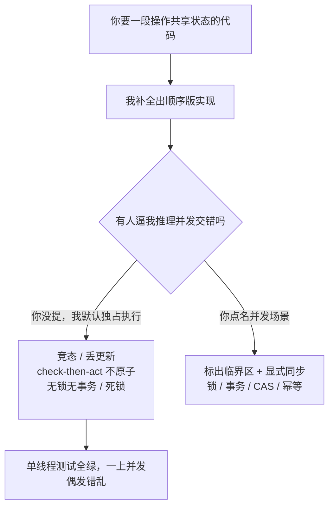

import PitfallMeta from '@site/src/components/PitfallMeta';

<PitfallMeta roles={['工程师', '架构师']} phase="详细设计" severity="高" appliesTo="Claude Code 全版本" />

> 一句话摘要：我默认按「单线程、顺序执行、没人同时动」来写代码，于是漏掉竞态条件、共享状态不加锁、check-then-act 不原子、数据库不加事务或乐观锁。功能测试（单线程）全绿，一上并发就偶发丢更新、数据错乱、死锁。这讲的是**并发正确性**这一类特定且隐蔽的缺陷，和[实现层漏分支](./missing-edge-cases.mdx)、[方案整体健壮性](./plausible-but-brittle-design.mdx)不是一回事。

## 现象

我常看到这样的交付：你让我写一个「给文章点赞数 +1」的接口，我给你一段读起来天经地义的代码——先 `SELECT likes FROM post`，加一，再 `UPDATE post SET likes = ?`。你点了几次，1、2、3，准确无误，合并了。

然后大促当天，一篇热帖被几千人同时点赞，最后计数比真实点赞数少了一大截。没有报错、没有崩溃、没有任何一条日志异常——只是数字悄悄丢了。两个请求同时读到 `likes=100`，各自算出 101，各自写回 101，于是两次点赞只涨了一次。我写的那段代码，在单线程下永远正确，在并发下永远错。

类似的还有一串：先 `if (!file.exists()) create()` 结果两个进程都过了检查、都去创建；缓存「查不到就回源再写回」在高并发下把同一份数据回源了上百遍；异步回调里假设 A 一定先于 B 完成，结果偶发地 B 先回来。

## 为什么会这样

我写代码，是在补全「这类逻辑通常长什么样」。而语料里绝大多数示例都是**单线程、顺序、独占**的——读一个值、改它、写回去，中间默认没有别人插队。于是我生成的代码读起来完全正确：如果世界上只有一个执行者，它确实对。问题在于，并发正确性不是「读起来对」能保证的，它需要显式推理「如果此刻有另一个执行者插进来会怎样」，而这一步我默认不做。

几股力把我推向「当成单线程来写」：

- **并发 bug 不在主路径上，也不可复现。** 它要靠两个执行者的指令恰好以某种顺序交错才触发（[Wikipedia](https://en.wikipedia.org/wiki/Race_condition) 把竞态定义为「正确性取决于操作交错的时序」）。我没有运行环境，更没有「跑上几千并发」的压力去把它逼出来——它在文本层面毫无破绽。
- **check-then-act 与 read-modify-write 看着就是两步普通语句。** 「先查再改」「先读再写」在顺序世界里天经地义，我不会自动意识到这两步之间存在一个必须保证原子的窗口。除非你点名，我不会把它们包进锁、事务或 CAS。
- **训练里的「典型实现」自带这个盲区。** 教程为了讲清主干，几乎都省略加锁、事务、幂等。我学到的「标准写法」就是不带并发保护的那一版。
- **强模型让脆弱藏得更深。** 有研究（[arXiv 2501.14326](https://arxiv.org/html/2501.14326v1)）系统评估了 LLM 对并发程序的理解，结论是即便最强的模型，在数据竞争、死锁这类并发推理上依然吃力、场景一复杂就崩——我能写出更漂亮的顺序代码，但并发正确性并不随之提升。



## 后果

- **数据悄悄错，而且最难查。** 丢更新、计数偏少、余额对不上——没有异常、没有栈，等你从对账差额反推回来，已经是线上事故。
- **偶发、不可复现，复盘成本极高。** 它只在特定交错下出现，你本地怎么压都压不出来，测试环境跑一万遍都绿，唯独生产高峰期偶尔爆一次。
- **死锁直接把服务拖停。** 两个执行者各拿一把锁、互等对方那把，请求堆积、线程耗尽，比单点崩溃更难现场定位。
- **修复往往要动数据模型。** 加锁、加事务、加唯一约束或乐观锁版本号——这些是设计层的决定，等并发暴露才补，返工远比一开始就设计进去贵。

## 最佳实践

**别让我把世界当成单线程——明确告诉我并发场景，逼我标出共享可变状态与临界区，并说清用什么同步把它钉死。**

- **先给我并发画像。** 「这段代码会有多少并发？它读写哪些共享状态（数据库行 / 缓存 / 内存变量 / 文件）？同一份数据会被几个执行者同时改吗？」我默认的并发度是 1，你不说，我就按 1 写。
- **让我先标临界区，再写实现。** 「在动手前，先指出这段逻辑里哪些是共享可变状态、哪些操作必须原子，逐一说明你打算用什么保证（行锁 / 事务 / 乐观锁版本号 / CAS / 分布式锁 / 幂等键）。」这一步把我从「补全顺序逻辑」切换到「显式推理交错」。
- **点名常见竞态模式让我自查。** read-modify-write（先读后写的计数 / 余额）、check-then-act（先查存在再创建 / 先查再扣减）、缓存击穿、异步回调的顺序假设——贴给我逐条对照。
- **用并发测试逼，而不是用单线程用例验。** 让我写「N 个并发同时调用、最后断言总量正确」的压力测试；单线程用例永远绿，证明不了并发正确。
- **优先无共享 / 不可变设计，从源头减少竞态面。** 能用数据库原子操作（`UPDATE ... SET likes = likes + 1`）就别在应用层读改写；能让每个执行者只碰自己的数据就别共享；能用幂等设计让重复执行无害，就不必处处加锁。这条尤其要在概要设计阶段就定下来。

```text
（点赞接口，把竞态从源头消掉）

❌ 应用层 read-modify-write：
   SELECT likes FROM post WHERE id=?   →  likes+1  →  UPDATE post SET likes=?
   两个请求同时读到同一个 likes，各自 +1 写回，丢掉一次更新

✅ 数据库原子操作：
   UPDATE post SET likes = likes + 1 WHERE id=?
   自增在数据库一步原子完成，无论多少并发都不丢

✅ 若必须先读后写（如带业务校验），用乐观锁：
   UPDATE post SET likes=?, version=version+1 WHERE id=? AND version=?
   version 不匹配说明被人改过，本次失败重试
```

## 示例

**改之前：**

```text
你：写个给文章点赞 +1 的接口
我：（SELECT likes → +1 → UPDATE，单线程下完全正确，你合并了）
大促：几千人同时点赞同一帖，最终计数比真实少一截，无任何报错
```

**改之后：**

```text
你：写点赞接口。注意这个接口会有高并发，likes 是被多人同时改的共享状态。
    先标出临界区、说明你用什么保证原子，再写实现。
我：（指出 read-modify-write 是竞态点；给出方案 A 数据库原子自增、
    方案 B 乐观锁版本号，并说明各自适用场景）
你：用原子自增。再写一个 1000 并发同时点赞、最后断言计数等于 1000 的压力测试。
我：（产出原子自增实现 + 并发压力测试，单线程和高并发都正确）
```

## 什么时候例外

「按并发写」不是无条件的——前提是真有并发。有几种情况，「当成单线程」恰恰是对的：

- **这段代码可证明永不并发**：单进程的命令行工具 / 一次性脚本、构建期跑一遍的代码生成、被全局锁或单消费者队列串行化的逻辑——只有一个执行者，加锁加事务是在防一个不存在的对手。
- **状态根本不共享**：每个请求只碰自己栈上的局部变量、函数式的不可变数据、actor 各自独占的私有状态——没有共享可变状态，就没有竞态面，无需同步。
- **并发由下层已经兜住**：你站在数据库事务、框架的串行化保证、或语言运行时的单线程模型（如默认配置下的某些事件循环）之上，那一层已经把原子性给你了，应用层再叠一道锁是冗余。

判据：例外成立，前提是「无并发 / 无共享」是你**论证过的事实**（指得出为什么只有一个执行者、或状态为什么不共享），而不是「我没想到会并发」的默认假设。只要这段代码可能被多个执行者同时调、且碰同一份可变状态，就回到默认：标临界区、上同步、用并发测试验。

## 版本说明

:::note 适用版本
「默认按单线程顺序逻辑生成代码」是大语言模型写代码的固有倾向，**Claude Code 全版本、且跨模型适用**。已有研究表明，即便最强的模型在并发推理上仍显著吃力（见[arXiv 2501.14326](https://arxiv.org/html/2501.14326v1)）。模型越强，顺序代码写得越漂亮，越容易让你忘了它默认没考虑并发——所以「显式给并发画像、标临界区、用并发测试验证」这套动作不会因为模型变强而过时。
:::

## 延伸阅读与出处

- [Race condition — Wikipedia](https://en.wikipedia.org/wiki/Race_condition)
- [Assessing Large Language Models in Comprehending and Verifying Concurrent Programs across Memory Models (arXiv 2501.14326)](https://arxiv.org/html/2501.14326v1)
