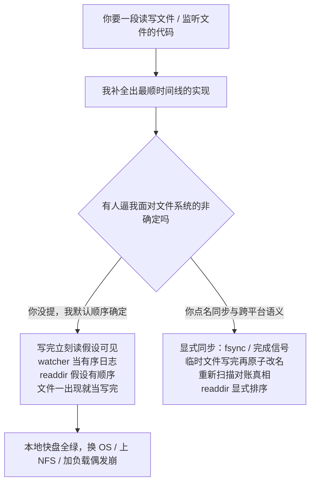

import PitfallMeta from '@site/src/components/PitfallMeta';

<PitfallMeta roles={['工程师', '架构师']} phase="详细设计" severity="中" appliesTo="Coding Agent 通用" evidence="官方文档" />

> 一句话摘要：我默认文件系统的操作和事件「按确定、串行、可预测的顺序发生」——写完一个文件马上就能读到完整内容、watcher 事件按修改顺序一条一条来、`readdir` 按创建或字典序返回、文件一出现就代表写完了。于是我把「文件出现」当同步信号、把 watcher 当成有序日志，代码在我本地的快盘上跑得好好的，换台机器、换个 OS、上点负载就偶发崩。这讲的是 **OS / 文件系统层的假性确定**，和[并发竞态](./concurrency-races.mdx)（共享内存/数据库状态的竞态）、[漏掉边界分支](./missing-edge-cases.mdx)（漏了某个输入）都不是一回事。

## 现象

我常看到自己交付这样的代码：

- **写完立刻读，假设写已落盘。** 我 `writeFile(path, data)` 之后下一行就 `readFile(path)`，默认刚写的内容已经完整可见。在本地 SSD 上几乎永远「对」，于是测试全绿。换到 NFS、容器挂载卷，或别的进程在读，就偶发读到旧内容或半截文件——因为写还在缓冲区里，没 `fsync`，对别的读者还不可见。
- **把 watcher 当成有序、一对一的事件流。** 我接 inotify / FSEvents / chokidar，假设「改一次文件 → 收到一个事件」，并且事件严格按修改顺序到。于是我直接拿事件去驱动状态机。真实世界里事件会被**合并**（连续相同事件没被读走就并成一条）、会**重复**、跨平台**语义不同**——我的状态机于是丢事件或被同一变化触发好几遍。
- **把「文件出现」当成「写完了」的同步信号。** 进程 A 写 `result.json`，进程 B 轮询「文件存在就去读」。文件**先出现、内容后写完**，B 经常读到一个 0 字节或写了一半的 JSON，解析直接炸。
- **假设 `readdir` / 目录扫描有顺序。** 我遍历目录，默认条目按文件名字典序、或按创建顺序回来，于是「取第一个就是最早的」。POSIX 根本不保证目录项顺序——换个文件系统顺序就变，我那句「取第一个」就取错了。
- **假设「删了再用同名创建」是原子的。** 我 `unlink(path)` 紧接着 `create(path)`，默认中间没有缝。可这两步之间，别的读者会看到文件**短暂消失**；两个进程同时这么干还会互相打架。

这些代码的共同点：在「单进程、本地快盘、没人同时动、就一个 OS」的理想世界里读起来天经地义，一旦任一前提破掉就偶发出错——而我默认所有前提都成立。

## 为什么会这样

我写文件相关的代码，是在补全「这类操作通常长什么样」。而语料里绝大多数示例，都跑在**最顺的那条时间线**上：本地 SSD、单进程、写完马上读到、watcher 一改一个事件、目录恰好按名字回来。这些 happy interleaving 在短代码片段里**几乎总是「对」的**，于是我把「常见情形下碰巧成立的顺序」学成了「被保证的顺序」。

几股力把我推向「把文件系统当确定状态机」：

- **示例里的成功掩盖了底层的非确定。** 教程为了讲清主干，`writeFile` 下一行就 `readFile`，从不演示「换 NFS 会读到旧值」；watcher 例子永远「改一次收一个事件」，从不演示合并与重复。我学到的「标准写法」自带这个盲区——它在演示环境里从不暴露。
- **OS 层的保证写在 man page 里，不在代码片段里。** 「inotify 事件会被合并，所以**不能用来可靠计数**」「目录项顺序未指定」「写要 `fsync` 才持久」「`fs.watch` 跨平台不一致、`filename` 不保证给」——这些是规范层的事实，散在文档而非示例代码里。我读的短片段里没有它们，我也就不会自动把它们考虑进去。
- **跨平台差异天然不在单条片段里。** 同一段 watcher 代码，Linux 走 inotify、macOS 走 FSEvents、Windows 走 ReadDirectoryChangesW，三者事件语义不同。可一段示例只在一个平台上写成、也只在那个平台上验证过，差异在文本层面毫无破绽。
- **没有运行环境去打我的脸。** 这类 bug 要靠「时机恰好错开」才触发——别的进程恰好在写没写完时来读、事件恰好被合并。我没有跑在 NFS、跑在另一个 OS、跑上并发的压力去把它逼出来，它在我眼里就是对的。



## 后果

- **测试在本地绿、在 CI 或别的 OS 上偶发红。** 「写完立刻读」「文件出现就读」在你的快盘上稳过，搬到 CI 的网络盘、搬到 macOS 跑就间歇失败。这类 flaky test 最磨人：重跑一次又绿了，谁也定位不到，慢慢就被 `retry` 掩盖过去。
- **读到半截或过期数据，污染下游。** 写没落盘就被读、文件刚出现内容没写完就被解析——读者拿到 0 字节、截断的 JSON、旧版本内容，要么当场解析炸，要么把脏数据带进后续处理，等发现时已经污染了一长串。
- **watcher 漏事件 / 重复触发。** 合并导致「改了三次只收到一个事件」，我的增量构建/同步逻辑漏掉中间状态；重复导致同一变化触发好几遍，做了重复甚至冲突的写。两者都不报错，只是结果悄悄不对。
- **典型的「在我机器上是好的」。** 整套逻辑赌的是一组本地碰巧成立的文件系统时序，换环境就垮。返工时你才发现脆弱不在某一行，而在「把文件系统当确定状态机」这个隐含前提——和[看着对但经不起边界的设计](./plausible-but-brittle-design.mdx)一样，得动整条数据流。

## 最佳实践

**别赌文件系统的顺序——把「写是否可见」「文件是否完整」「事件是否有序」从默认假设变成你显式建立的保证。**

- **用显式同步代替「靠时机」。** 要让别的读者读到，就等写真正完成的信号：`fsync` 落盘、关闭文件句柄、或一个明确的「就绪」标志，而不是赌「写完下一行读就有了」。
- **发布用「写临时文件 → 原子改名」，让读者永远看不到半成品。** 把内容写到同目录下的临时文件，`fsync`，再 `rename` 到目标名。同文件系统内的 `rename` 是原子的：读者要么看到旧文件、要么看到完整新文件，绝不会看到写了一半的。**别把「文件出现」当同步信号**——要等的是「完整文件原子就位」。
- **把 watcher 事件当提示，不当有序日志。** 收到事件别直接信，而是 **debounce + 重新扫描对账到真相**：事件只告诉你「这附近可能变了」，真实状态以你重新 `stat` / 重新读目录为准。明确预期事件会**合并、重复、乱序、跨平台语义不同**——inotify 官方就说事件会合并、因此不能用来可靠计数。需要「等大文件写完」时，用 chokidar 的 `awaitWriteFinish` 一类机制，而不是收到第一个事件就动手。
- **永远不要依赖 `readdir` 顺序——要顺序就自己排。** 需要按时间就读 `mtime` 显式排序，需要确定性就按文件名显式排序。把目录项顺序当未指定来写。
- **为跨平台 watcher 差异做设计。** 如果代码要在 Linux / macOS / Windows 都跑，优先用抹平差异的库（如 chokidar 把各平台事件归一成 add / change / unlink），并在每个目标平台上各跑一遍验证，而不是在一个平台写成就当三个平台都对。

```text
（发布一个结果文件，让读者永不读到半成品）

❌ 直接写目标文件 + 靠「文件存在」同步：
   A: writeFile("result.json", data)        // 文件先出现，内容后写完
   B: while (!exists("result.json")) sleep  // 一出现就去读
      readFile("result.json") → JSON.parse  // 经常读到 0 字节 / 半截，解析炸

✅ 临时文件 → fsync → 原子改名 + 显式就绪信号：
   A: writeFile("result.json.tmp", data); fsync; close
      rename("result.json.tmp", "result.json")   // 同盘 rename 原子
   B: 监听 / 轮询 "result.json"，读到的要么是旧的完整文件、
      要么是新的完整文件——绝不会是写了一半的
```

## 示例

**改之前：**

```text
你：进程 A 算完把结果写 out.json，进程 B 监听到就读来处理
我：A writeFile("out.json")；B chokidar.on('add', () => readFile + parse)
本地：A 的盘快、文件瞬间写完，B 读到的总是完整的，全绿，你合并了
CI / NFS：B 的 'add' 在 A 写完前就触发，读到截断 JSON，parse 偶发抛错；
          A 改三次，inotify 合并成一个事件，B 漏掉中间两版
```

**改之后：**

```text
你：A 写结果、B 消费。注意 B 可能在 A 没写完时就被 watcher 触发，
    且事件可能合并/重复。用「临时文件→原子改名」发布，B 端 debounce
    并重新扫描对账，别直接信单个事件。
我：（A：写 out.json.tmp → fsync → rename 到 out.json；
     B：收到事件先 debounce，再重新 stat/读目录确认完整文件，
     readdir 处用 mtime 显式排序；标注事件可能合并、重复、乱序）
你：在 Linux 和 macOS 各跑一遍这套 watcher 流程的集成测试。
我：（产出原子发布 + 对账消费，本地、CI、跨 OS 都稳定，不再读到半成品）
```

## 什么时候例外

「别赌文件系统顺序」的前提是真有非确定性来源。有几种情况，顺序确实是你能论证的事实，这时加同步/对账是在防一个不存在的对手：

- **单进程、单线程，只碰你刚写且已 flush 的本地文件**：没有别的读者、没有 watcher、没有跨进程，你 `writeFile` 后同一进程同步 `readFile`（且语言/运行时保证此处顺序）——这条时间线确实确定。
- **写完即弃的一次性脚本**：你自己跑、数据你自己给、本地盘、跑一遍就删——为一个你确知不会出现的 NFS 延迟或事件合并写防护，是给马上要扔的代码买保险。
- **你在目标平台上**亲自验证过**那条保证**：某个文件系统、某个 OS 上你确认了写后立即可见、或事件不合并，并且部署环境就锁死在这个平台——那就可以依赖你验证过的那条具体保证（但要打平台戳：换平台即失效）。

判据：例外成立，前提是「顺序确定」是你**论证过、或在目标平台验证过**的事实（指得出为什么没有别的读者/别的平台/网络盘），而不是「我没想到会换环境」的默认假设。只要代码可能跑在网络盘、可能被别的进程同时读写、可能换 OS，就回到默认：显式同步、原子发布、对账到真相、`readdir` 自己排序。

## 与相邻误区的区别

- [并发竞态](./concurrency-races.mdx)：那条是**共享内存 / 数据库状态**上的竞态（两个执行者读改写同一份数据丢更新）；这条是**文件系统的操作与事件顺序**上的假性确定（写是否可见、事件是否有序、目录是否有顺序）。同属「把世界当顺序执行」，但战场一个在内存/DB、一个在 OS/文件系统。
- [漏掉边界分支](./missing-edge-cases.mdx)：那条是**漏了某个输入**（空数组、null、`size` 为 0）；这条不是漏输入，而是**假设文件系统本身是确定的**——即便输入全对，底层时序的非确定照样让它崩。
- [看着对但经不起边界的设计](./plausible-but-brittle-design.mdx)：这条是它的一个**具体子类**——「赌文件系统确定性」正是那种「读起来很顺、却隐含了一组真实世界不成立的健壮性前提」的脆弱假设，只不过这里的前提专指 OS / 文件系统层。

## 版本说明

:::note 适用版本
「默认文件系统操作与事件按确定顺序发生」是大语言模型写文件相关代码的固有倾向，**全模型、跨工具通用**，不是某个工具的 harness 特性。底层事实由 OS 与库的文档背书：inotify 事件会合并、目录顺序未指定（[inotify(7)](https://man7.org/linux/man-pages/man7/inotify.7.html)），`fs.watch` 跨平台不一致、`filename` 不保证给（[Node.js fs.watch Caveats](https://nodejs.org/api/fs.html#caveats)），文件可能先出现后写完（[chokidar awaitWriteFinish](https://github.com/paulmillr/chokidar)）。模型越强，最顺那条时间线的代码写得越漂亮，越容易让你忘了它默认没考虑非确定——所以「显式同步、原子发布、对账、跨平台验证」这套动作不会因为模型变强而过时。版本戳：2026-06。
:::

## 延伸阅读与出处

- [inotify(7) — Linux manual page](https://man7.org/linux/man-pages/man7/inotify.7.html) —— 事件合并、不能用来可靠计数、目录监控非递归、目录项相关说明
- [Node.js fs.watch Caveats](https://nodejs.org/api/fs.html#caveats) —— API 跨平台不一致、`filename` 参数不保证提供、底层依赖 inotify / FSEvents / ReadDirectoryChangesW
- [chokidar README](https://github.com/paulmillr/chokidar) —— `awaitWriteFinish`：文件先出现、内容后写完；`atomic` 选项：抹平编辑器「先写临时文件再改名」产生的伪事件
