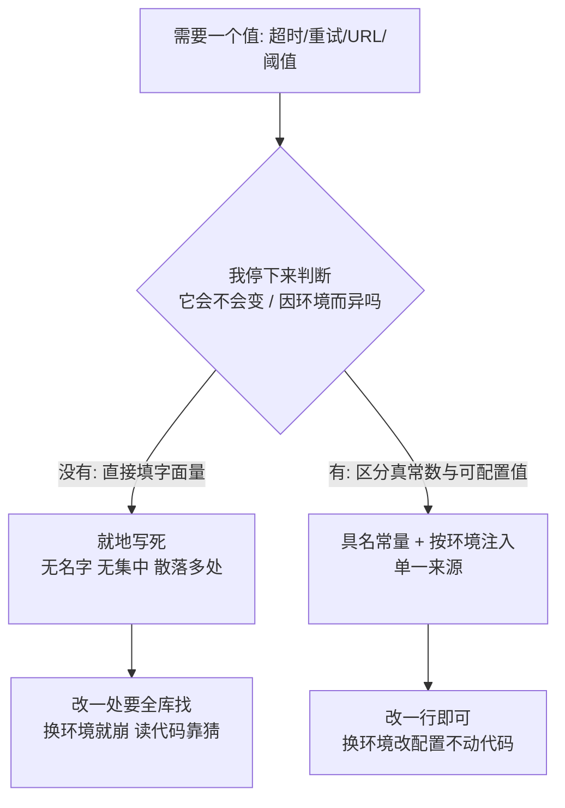

import PitfallMeta from '@site/src/components/PitfallMeta';

<PitfallMeta roles={['工程师']} phase="详细设计" severity="中" appliesTo="Claude Code 全版本" />

> 一句话摘要：超时写 `30000`、重试 `3`、接口地址 `https://api.prod...` 直接塞进逻辑里——没有名字、没有集中、同一个值散落好几处。代价是改一处要全库找、换环境就崩、读代码全靠猜。

## 现象

我常看到自己这样交付：你让我加一段调接口、做重试、读文件的逻辑，我写出来能跑，但值全是裸的字面量。

- 超时直接写 `setTimeout(fn, 30000)`，没人知道这 `30000` 是什么、能不能改。
- 重试 `for (let i = 0; i < 3; i++)`，那个 `3` 既没名字也没解释。
- 接口地址写死成 `fetch("https://api.prod.example.com/v1/users")`，生产 URL 直接焊进代码。
- 业务阈值 `if (amount > 5000)` 里的 `5000`，过两个文件又出现一次 `5000`——我把同一个含义抄了两遍，而它们之间没有任何关联。
- 密钥、token 的取法也图省事，要么写死路径，要么干脆把占位值留在代码里。

单看每一行都「能用」。问题是这些值既没有具名、也没有集中到一处，更没区分「它将来会不会变、会不会因环境而异」。

## 为什么会这样

根因不是我不懂「魔数不好」，而是**我在优化「最短路径让它跑通」，而就近写死字面量正是这条路径上成本最低的一步**。

写代码时我面前有两条路：

1. 在用到值的地方直接填一个字面量——一步到位，立刻能跑；
2. 先想清楚这个值是什么含义、该叫什么名字、会不会因环境变化、该放进哪个配置层，再抽成具名常量或注入项——要多想几步、多写几行。

在你没有明确要求第 2 条时，我默认走第 1 条。因为生成「一段当下就能跑通的代码」是我被反复奖励的目标，而「这个值三个月后会不会要改」「测试环境和生产环境是不是同一个 URL」这类**关于未来和环境的判断，不在我眼前的任务里**——我缺少主动做这个判断的默认动作。于是我把一个本该是「配置」的东西，当成了「常量字面量」就地写死。



还有个放大效应：我写死的那个 `5000`，下次会被我（或下一段会话的我）当成「这个仓库就这么写」照抄。一个魔数会繁殖成一片，等到要统一调整时，已经散落在我自己都数不清的地方。

## 后果

- **改一个值要满库搜**：超时要从 30 秒调成 10 秒，你得在代码里找出每一处 `30000`，还要分辨哪个 `30000` 是超时、哪个碰巧也是 `30000` 但含义无关——漏改一处就出现不一致。
- **换环境就崩**：生产 URL、数据库地址、密钥位置写死在代码里，一旦换到测试或本地环境，要么连错后端，要么直接跑不起来。配置本就是「会随部署变化」的东西，焊进代码就丧失了这份灵活。
- **可读性塌方**：裸 `3`、裸 `5000` 不解释自己是什么，读代码的人（包括下一段会话的我）只能靠上下文猜含义，维护时如履薄冰。
- **凭据外泄风险**：把密钥、token 直接写进源码，提交后就进了版本历史——12-Factor 有个利落的判据：你的代码库能不能随时开源而不泄露任何凭据？写死就意味着不能。
- **加重技术债**：和[风格漂移](./style-drift.mdx)一样，这类不一致进了仓库就成了下一轮模仿的样板，越积越难收拾。

## 最佳实践

口头说「别用魔数」对我几乎无效——太抽象，我无法验证。**把判断标准和落点说清楚，并用工具兜底**才管用。

1. **先帮我区分「真常数」和「可配置值」。** 圆周率 π、一周 7 天、HTTP 状态码 200 这种**永远不变、与环境无关**的，抽成具名常量即可（`MAX_RETRIES`、`HTTP_OK`），目的是给字面量一个能读懂的名字。而超时、重试次数、阈值、接口地址、密钥位置这类**会变、或因环境而异**的，属于配置，要从代码里分离出去。这条区分我默认不会主动做，请在提示里点名。

2. **同一含义的值只定义一处。** 给它一个有意义的名字，集中到一个常量/配置模块里，别让我在多个文件里各抄一份。改的时候只动一行——这就是 Fowler「Replace Magic Literal」的核心：把字面量换成单一来源的具名符号。

3. **环境相关的值走环境变量 / 配置文件，不要写死。** 测试与生产的 URL、凭据、开关，按 12-Factor 的做法注入，代码里只读取、不内嵌。一个好用的自检：这份代码能不能直接开源而不泄露任何密钥？

4. **用工具把它变成硬约束。** lint 规则（如 ESLint `no-magic-numbers`）能在我留下裸字面量时直接报错；再配合[钩子](../00-setup-collaboration/over-permissioning.mdx)在我每次改完文件后自动跑 lint，把「我要记得抽配置」降级成「工具会兜底」。

写之前，最有效的一招还是**直接把仓库现有的配置文件 / 常量模块指给我看**：「超时、重试这类参数都放在 `config/defaults.ts`，照那个模式来。」让我看见你们怎么放配置，胜过让我自己猜。

## 示例

**改之前：**

```text
你：加一个拉取用户的函数，带超时和重试。
我：（生成）
    async function fetchUsers() {
      for (let i = 0; i < 3; i++) {
        try {
          return await fetch("https://api.prod.example.com/v1/users", {
            signal: AbortSignal.timeout(30000),
          });
        } catch (e) { /* retry */ }
      }
    }
    // 3、30000、生产 URL 全部写死、无名字、不可配置
```

**改之后：**

```text
你：加一个拉取用户的函数，带超时和重试。
    超时、重试次数走 config/http.ts 里的具名常量，
    API base URL 从环境变量读，参照 config/http.ts 现有写法。
我：（先读了那个文件，再生成）
    // config/http.ts
    export const HTTP_TIMEOUT_MS = 30_000;
    export const MAX_RETRIES = 3;
    export const API_BASE_URL = process.env.API_BASE_URL ?? "";

    // users.ts
    async function fetchUsers() {
      for (let attempt = 0; attempt < MAX_RETRIES; attempt++) {
        try {
          return await fetch(`${API_BASE_URL}/v1/users`, {
            signal: AbortSignal.timeout(HTTP_TIMEOUT_MS),
          });
        } catch (e) { /* retry */ }
      }
    }
    // 值有名字、集中一处、URL 随环境注入
```

差别不在我会不会写，而在你有没有先帮我把「哪些是真常数、哪些是配置、它们该放哪儿」定下来。

## 版本说明

:::note 适用版本
「优化最短路径、就近把值写死」是大语言模型生成代码时的固有倾向，**全版本、且跨模型适用**——模型越强，写死的那段代码越自洽、越像样，反而越容易让人忽略里面藏着一堆魔数和硬编码配置。用 lint（`no-magic-numbers`）+ 钩子在编辑后自动校验的能力依赖较新版本；不具备时，可在 CLAUDE.md 写明「配置统一放某处、禁止写死环境相关值」，并在提示里显式点名配置模块，达到同样效果。
:::

## 延伸阅读与出处

- [The Twelve-Factor App — III. Config](https://12factor.net/config) —— 配置（会随部署变化的值：凭据、后端地址、每环境参数）必须与代码严格分离、存入环境变量；判据是「代码库能否随时开源而不泄露凭据」
- [Replace Magic Literal（Martin Fowler, Refactoring catalog）](https://refactoring.com/catalog/replaceMagicLiteral.html) —— 把带特定含义的字面量替换为具名符号常量，获得单一来源、提升可读性与可维护性
