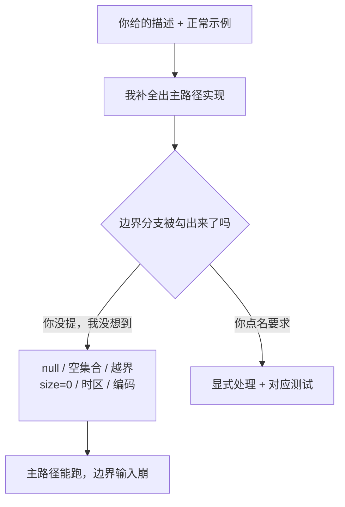

import PitfallMeta from '@site/src/components/PitfallMeta';

<PitfallMeta roles={['工程师']} phase="详细设计" severity="高" appliesTo="Claude Code 全版本" evidence="官方文档" />

> 一句话摘要：我写出来的实现，主路径几乎总能跑。但 null、空集合、越界下标、超长字符串、并发、时区、编码这些边界，只要你没明说，我经常就漏过去——代码看着完整，喂个边界输入就崩。这讲的是**实现细节层面的遗漏**；如果是整个方案的健壮性假设站不住，见[《方案看起来对，经不起边界推敲》](./plausible-but-brittle-design.mdx)。

## 现象

我常看到这样的交付：你让我写一个 `splitIntoBatches(items, size)`，我给你一个干净的实现，循环、切片、返回，读起来挑不出毛病。你跑了一遍 `[1,2,3,4,5]` 分成大小 2，三个批次，对的，合并了。

然后线上来了一个空数组——返回了 `[[]]` 而不是 `[]`；来了一个 `size=0`——死循环；来了一个 `null`——直接抛异常。这些分支我一个都没写，因为你给的例子里一个都没有。

## 为什么会这样

我写代码，靠的是对「这类函数通常长什么样」的模式补全。你给我的描述和示例，决定了我脑子里激活的是哪条主路径——而**边界分支不在主路径上，除非有什么东西把它们勾出来，否则它们不会自己冒出来**。

具体说，有三股力把我推向「只写主路径」：

- **你的示例就是我的锚。** 你举的例子全是正常输入，我就默认输入都长那样。空集合、负数、`size=0` 没出现在你的话里，也就没出现在我的代码里。
- **训练语料里的「典型实现」往往也省略边界。** 教程和示例代码为了讲清主干，经常把 null 检查、越界保护略掉。我学到的「标准写法」自带这个盲区。
- **我没运行过它。** 我对边界的覆盖取决于我有没有「想到」，而不是有没有「踩到」——没有真实执行去打我的脸，漏掉的分支在文本层面毫无破绽。



## 后果

- 代码通过了你手边那几个例子，给你「写完了」的错觉，于是直接合并。
- 漏掉的边界往往是最难复现、最贵的 bug：空数据导致的崩溃、`off-by-one` 的越界、时区错位的对账差、编码问题导致的乱码——都要等到真实数据撞上来才暴露。
- 你下次会本能地替我把每个边界都列全，等于把我能省的活又还了回去。

## 最佳实践

**别指望我自动想全边界——把「该考虑哪些边界」变成一道我必须回答的题，再用测试把答案钉死。**

- **先让我列举边界，再让我写实现。** 「在动手前，先列出这个函数所有可能的边界与异常输入，逐一说明你打算怎么处理。」这一步把我从「补全主路径」切换到「枚举边界」，光是问出来，我的覆盖率就明显上去。
- **给我一份边界清单当检查项。** 常见的就那几类，贴给我让我逐条对照：空 / null、单元素、超长 / 超大、零与负数、重复、越界、并发、时区与 DST、字符编码与多字节。
- **用测试逼出边界，而不是用眼睛找。** 先让我写覆盖这些边界的测试（这与[《信任但不验证》](../06-testing/trust-then-verify.mdx)是同一招在设计阶段的前置），跑红了再补实现——边界没处理，测试就亮红，我无处藏拙。
- **明确「非法输入怎么办」。** 是抛异常、返回空、还是夹取到合法区间？你不定，我就替你默认一个，而我默认的那个未必是你要的。

## 示例

**改之前：**

```text
你：写个 splitIntoBatches(items, size)，比如 [1..5] 按 2 分，给我三批
我：（给出实现，跑你的例子正确，你合并了）
线上：splitIntoBatches([], 2) → [[]]；splitIntoBatches([1], 0) → 死循环
```

**改之后：**

```text
你：写 splitIntoBatches(items, size) 之前，先列出所有边界：
    空数组、size<=0、size 大于元素个数、items 为 null。每个说明你的处理。
我：（列出四类边界 + 处理策略：空数组返回 []，size<=0 抛参数错误……）
你：合理。现在为这些边界各写一个测试，再写实现让它们全绿。
我：（测试先行，边界被逐个逼出来，实现一次到位）
```

## 版本说明

:::note 适用版本
「主路径强、边界弱」是大语言模型写代码的固有倾向，**Claude Code 全版本、且跨模型适用**。模型越强，主路径写得越漂亮，反而越容易让你放松对边界的警惕——所以「先枚举边界、再用测试钉死」这套动作不会因为模型变强而过时。
:::

## 延伸阅读与出处

- [Claude Code Best Practices（Anthropic 官方）](https://code.claude.com/docs/en/best-practices)
- [Boundary value analysis — Wikipedia](https://en.wikipedia.org/wiki/Boundary-value_analysis)
