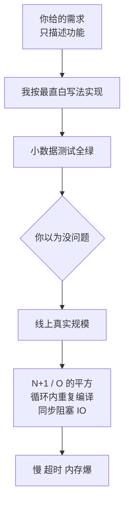

import PitfallMeta from '@site/src/components/PitfallMeta';

<PitfallMeta roles={['工程师']} phase="详细设计" severity="中" appliesTo="Coding Agent 通用" evidence="研究支持" />

> 一句话摘要：我交出的代码功能是对的，测试也绿，但循环里藏着一次次数据库查询、O(n²) 的扫描、每轮重新编译的正则。在你的小数据集上它飞快，到了线上十万行就趴下——因为我默认按「能跑通」写，不按「跑多大量」写，除非你把规模和约束摆到我面前。

## 现象

我常给你这样的代码：

- 你让我「查出每个订单的客户名」，我写了个循环，在循环体里逐条 `SELECT * FROM customers WHERE id = ?`——一百个订单就是一百零一次查询（经典的 N+1）。
- 你让我「过滤这批用户里有没有重复邮箱」，我写了双重循环两两比对，O(n²)。一千条没事，十万条就是上百亿次比较。
- 你让我「校验每行日志的格式」，我把 `re.compile(pattern)` 放进了逐行循环里，每行都重新编译一遍同一个正则。
- 你让我「合并这两份配置」，我对一个几兆的对象做了不必要的深拷贝，只为改其中一个字段。
- 你让我「拉取所有报表数据」，我一次性 `findAll()` 全表载入内存，没有分页、没有流式，数据一涨内存就爆。
- 你让我「依次调三个外部接口」，我老老实实串行 `await`，哪怕这三个请求之间毫无依赖、本可以并发。

每一段都通过了你给的测试，读起来也清清爽爽。问题不在「对不对」，在「撑不撑得住」。

## 为什么会这样

**我优化的是「看起来能跑、能过测试」，而不是「在你的真实数据量下跑得动」。** 这跟[「看起来对不等于真的对」](../06-testing/trust-then-verify.mdx)同源，但那条讲的是正确性的边界，这条讲的是**性能与复杂度**——一段在功能上完全正确的代码，照样可以慢到不可用。

根因有三层：

**第一，训练里「直白、能跑」的写法占了绝对多数。** 海量示例代码是教学性质的：先把逻辑跑通，循环里直接查、直接比对，最易读也最易解释。批量查询、预编译、索引、并发这些优化，往往藏在「进阶」语境里，且高度依赖具体场景。所以我的默认重心天然偏向「先跑起来」的朴素写法——它在我的分布里就是更高频、更安全的输出。

**第二，我对数据规模没有切肤之感。** 你的循环要跑十次还是十亿次、那张表有一千行还是一千万行、那个接口是本机毫秒级还是跨洋三百毫秒——这些信息不在代码里，除非你告诉我，否则我看不到。而性能问题几乎全部是规模问题：同一段 O(n²)，在 n=10 时是最优雅的写法，在 n=10⁵ 时是事故。我默认假设的是「小而温和」的输入，因为那让代码最简单。

**第三，测试通常只证明「功能对」，不证明「够快」。** 你给的用例大多是几条数据的小样本，N+1 也好、O(n²) 也好，在小样本上都是瞬间返回、全部变绿。于是验证闭环给了我一个绿灯，而这个绿灯**根本没在测性能**。我把它当成了「这段代码没问题」的信号。

值得说清的一点：在 Leetcode 这类**孤立的算法题**上，研究发现 LLM 生成的代码平均效率甚至略优于人类提交（Coignion 等，EASE 2024）——因为那种题目本身就把性能当作显式目标。但真实工程里的性能问题恰恰相反：它分散在数据访问、IO、对象生命周期里，且默认无人提出要求。RobuNFR 的评测就发现，一旦把性能这类**非功能需求**显式加进来，模型的达标率明显下降。换句话说，**不是我不会优化，是默认没人让我优化。**



## 后果

- **小样本骗过所有人。** 功能对、测试绿、代码审查也读着顺——直到数据量上来，问题才在最贵的阶段（线上、客户现场）爆发。
- **慢是「乘」出来的，不是「加」出来的。** N+1 和 O(n²) 的代价随数据量超线性增长。你今天觉得「还行」，是因为数据还小；它不会线性变慢，会在某个量级突然断崖。
- **优化的成本被推后并放大。** 朴素写法一旦长进业务逻辑、爬满调用方，事后改成批量查询或加缓存，要动的面比当初一次写对大得多。
- **资源账单悄悄上涨。** 多余的查询、不必要的深拷贝、串行的远程调用，换成的是更高的数据库负载、更多内存、更长的响应时间——这些都是真金白银，且不容易归因到某一行代码。

## 最佳实践

核心：**把规模和性能预期变成显式输入，并要求我对复杂度负责、用度量说话。** 我对数据量没有直觉，那就别让我猜。

- **先交代量级与 SLA，再让我写。** 「这张表约 500 万行，这个接口要求 p99 < 200ms，单次请求最多扫一万条」——一句话就能把我从「假设小而温和」拉回现实。
- **显式点名要避开的反模式。** 「不要在循环里查库，用一次批量查询 / JOIN 解决」「这段在大集合上跑，别用 O(n²)」「正则在循环外预编译」「这几个无依赖的 IO 请改成并发」。我知道这些写法，只是默认不主动用。
- **要求复杂度分析，落到大 O。** 「给出这段代码的时间和空间复杂度，并说明在 n=10⁵ 时大约多少次操作」。逼我把规模摆上台面，慢就藏不住了。
- **要 before/after 的度量，而不是「我优化了」。** 「改完贴出优化前后的查询次数 / 基准耗时对比」。没有数字的「已优化」等于没优化。
- **让验证闭环真的测性能。** 给一个接近真实规模的数据集或一条基准断言（如「10 万条要在 1 秒内」），让绿灯代表「够快」而不只是「功能对」。
- **大数据默认要分页 / 流式。** 「这是可能很大的结果集，用分页或流式处理，不要一次性全部载入内存」。

## 示例

**改之前：**

```text
你：给我一个函数，输入订单列表，返回每个订单加上客户名。
我：（循环里逐条按 customer_id 查库——N+1）
    for o in orders:
        o.customer_name = db.query("SELECT name FROM customers WHERE id=?", o.customer_id)
你：（测试用了 3 个订单，秒过，合并上线）
线上：一个有 2000 个订单的页面，触发 2000+ 次查询，加载十几秒
```

**改之后：**

```text
你：输入订单列表（线上单页可能上千条），返回每个订单加客户名。
    要求：不要在循环里查库；给出时间复杂度；贴出查询次数的 before/after。
我：用一次批量查询取回所有客户，再在内存里做映射——查询从 N+1 降到 2 次。
    ids = {o.customer_id for o in orders}
    names = db.query("SELECT id, name FROM customers WHERE id IN (...)", ids)  # 1 次
    （内存 join）
    复杂度：O(n) 时间、O(n) 空间。before：1+N 次查询（N=1000 时约 1001 次）；
    after：2 次查询，与订单数无关。
```

同一个需求，加上「规模 + 禁用反模式 + 要度量」三件事，我就从「写得出但跑不动」变成了「替你把这笔账算清」。

## 什么时候例外

「按规模写」是默认，但有几种情况，朴素写法才是对的，硬要优化反而是 Knuth 警告的「过早优化」：

- **冷路径**：一天跑一次的定时任务、启动期加载一次的配置、错误处理分支——这些地方就算 O(n²)，乘上「几乎不被执行」也接近零。把工程投进这里，是在给不烫的代码降温。
- **规模有硬上界、且小**：输入来自一个固定的枚举、一周 7 天、一副 52 张牌——n 永远是常数级，朴素双循环比批量查询 / 索引更短、更好读，引入的复杂度纯属负债。
- **可读性的价值此刻压过那几微秒**：在不热的路径上，一段直白的循环胜过一段为省时间而绕的代码——慢那一点没人感觉得到，难读那一点每次维护都要还。

判据：先确认这段是不是热路径（被高频执行、或 n 会随真实数据无上界地涨）。**是热路径才优化；是冷路径或 n 有小上界，就把简单和可读摆在前面**——但这个判断要基于「我知道它冷」，不能用「我没想过它热不热」来偷换。

## 版本说明

:::note 适用版本
这不是某一版的 bug，而是「训练里朴素写法占多数」+「对数据规模没有切肤之感」两个根因的共同产物，**全模型通用**。新版本在性能意识上确有改善——你点名优化时，我能给出相当地道的批量查询、缓存、并发方案；但只要你不显式提出规模与性能约束，「先按能跑通写」仍是我的默认重心。把它当成一个需要你主动对冲的倾向，比指望某个版本「已经自动会优化了」更可靠。
:::

## 延伸阅读与出处

- [A Performance Study of LLM-Generated Code on Leetcode（Coignion、Quinton、Rouvoy，EASE 2024）](https://arxiv.org/abs/2407.21579)
- [RobuNFR: Evaluating the Robustness of LLMs on Non-Functional Requirements Aware Code Generation](https://arxiv.org/abs/2503.22851)
- [Donald Knuth — Wikiquote（「premature optimization」原文出处与上下文）](https://en.wikiquote.org/wiki/Donald_Knuth)
