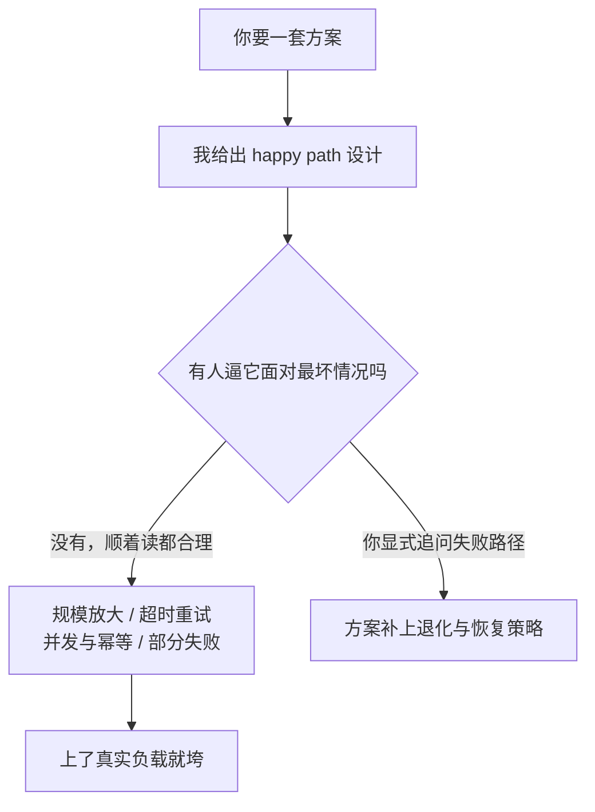

import PitfallMeta from '@site/src/components/PitfallMeta';

<PitfallMeta roles={['工程师']} phase="详细设计" severity="高" appliesTo="Coding Agent 通用" evidence="官方文档" />

> 一句话摘要：我给你一套设计，在常规输入下自洽、读起来很合理，你就采纳了。但它一上规模、一碰异常路径、一遇并发或失败重试就垮——问题不在某一行代码，而在方案隐含的健壮性假设站不住。这讲的是**设计层面的脆弱**；如果是写实现时漏了某个具体边界分支，见[《写实现时，我会漏掉那些你没明说的边界分支》](./missing-edge-cases.mdx)。

## 现象

我常看到这样的方案评审：你让我设计一个「定时把订单同步到下游系统」的方案，我给你一套清晰的流程——拉取新订单、逐条调下游接口、标记已同步。画成图、写成步骤，怎么看怎么顺。你点头，按这个去实现了。

直到订单量从几百涨到几十万：逐条串行调用慢到跑不完一个周期；下游偶尔超时，我的方案没说重试，于是丢单；任务上次没跑完这次又起来了，同一批订单被同步两遍。每一个问题，单看都「显而易见」，可它们在我那份读起来很顺的方案里，一个都没被提到。

## 为什么会这样

这和[《写实现时漏边界》](./missing-edge-cases.mdx)是两个高度的问题。那条讲的是「代码里少了一个 null 判断」；这条讲的是「整个方案默认了一组在小规模、顺利路径下成立、但在真实世界里不成立的前提」。

根因在于我**优化的是「读起来合理、自洽」，而不是「在最坏情况下仍然成立」**：

- **我默认走 happy path 设计。** 我的方案天然描述「一切顺利时它怎么转」，因为那是最清楚、最好讲的故事。失败、超时、部分成功、重试、并发——这些「不顺」的分支不在那个故事里，除非你逼我去想最坏情况。
- **我会把分布式与规模的经典谬误一起继承下来。** 「网络可靠」「延迟为零」「带宽无限」「不会有人重复触发」——这些被反复证伪的假设，恰恰是最常见的方案默认前提，而我也常默认它们成立。
- **合理 ≠ 健壮。** 我最擅长生产「貌似合理」的东西，方案这一层尤其如此：它没有可运行的代码去戳破，全靠你顺着读，而顺着读时脆弱假设是看不出来的。



## 后果

- 脆弱藏在设计里，要到联调、压测甚至上线才暴露——这时返工的不是一行代码，而是整套数据流，代价是实现阶段的数倍。
- 丢单、重复处理、雪崩这类问题，往往直接砸在数据正确性和线上稳定性上，比单点崩溃更难收拾。
- 你基于一个看着靠谱的方案做了排期和承诺，等脆弱暴露，塌的是整个计划的时间线。

## 最佳实践

**别问我「这个方案行不行」——它读起来总像行。要逼我把方案放到最坏情况下去推演，把隐含假设逐条摆到台面上。**

- **让我先列假设，再评方案。** 「在给方案之前，列出它依赖的所有前提：流量规模、并发度、下游可靠性、失败时的行为。哪条不成立会让它垮？」
- **拿失败模式当提问清单。** 逐条追问：规模放大 10×、100× 会怎样？下游超时 / 返回错误怎么办？任务重叠执行会不会重复处理（幂等吗）？部分成功如何恢复？这些正是方案层最常塌的地方。
- **要求给出退化与恢复策略，而不只是主流程。** 一套能上生产的方案，必须说清重试、超时、幂等、断点续传、限流——缺哪个就是哪个方向的脆弱。
- **让我演一个唱反调的架构评审。** 「假设你要在评审会上否掉这个方案，给出三个最可能让它在生产环境失败的场景。」这和[《找我验证想法时我会偏向支持你》](../01-ideation-feasibility/sycophancy-idea-validation.mdx)是同一招——把我从「附和」逼到「证伪」。

## 示例

**改之前：**

```text
你：设计一个把订单定时同步到下游的方案
我：拉取新订单 → 逐条调下游接口 → 标记已同步。（读起来很顺，你采纳了）
上量后：串行太慢跑不完、下游超时丢单、任务重叠导致重复同步
```

**改之后：**

```text
你：给方案前，先列它依赖的假设，并说明每条不成立时会怎样。
我：（列出：假设下游稳定、量级在 X 以内、任务不重叠……指出各自的失败后果）
你：现在按「10 万量级、下游会超时、任务可能重叠」重做，给出幂等、重试、
    分批与断点续传策略。
我：（产出一套带退化路径、经得起最坏情况推敲的方案）
```

## 版本说明

:::note 适用版本
「优化貌似合理而非最坏情况健壮」是大语言模型的本质倾向，**全模型、跨工具通用**。模型越强，给出的方案越完整、越顺滑，脆弱假设反而藏得越深——所以「逼方案直面最坏情况」这件事，越是用强模型越不能省。
:::

## 延伸阅读与出处

- [Fallacies of distributed computing — Wikipedia](https://en.wikipedia.org/wiki/Fallacies_of_distributed_computing)
- [Claude Code Best Practices（Anthropic 官方）](https://code.claude.com/docs/en/best-practices)
