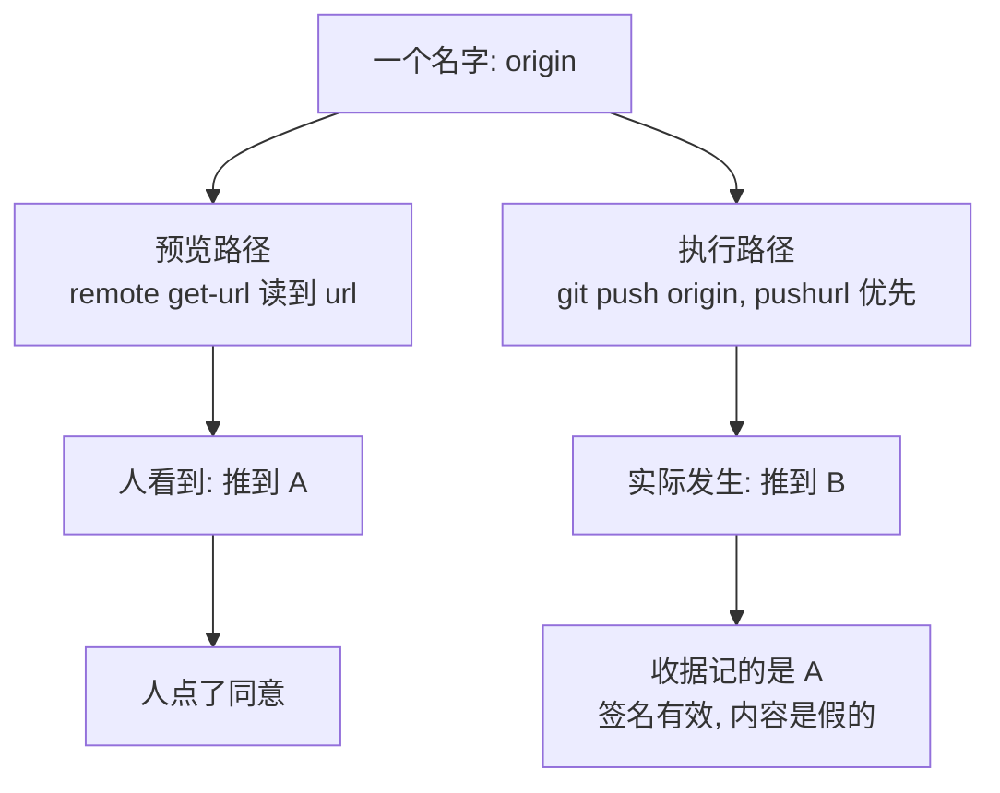

import PitfallMeta from '@site/src/components/PitfallMeta';

<PitfallMeta roles={['架构师', '工程师']} phase="详细设计" severity="高" appliesTo="Coding Agent 通用" evidence="安全报告" />

> 一句话摘要：你让我做「先给人看清楚、再执行」的功能，我会写成两段代码：一段渲染预览，一段执行动作，各自去问系统「这次的目标是什么」。「它们读的是同一个真相」是我的假设，不是代码强制的性质——两条路径可以在同一瞬间给出两个不同的答案，而人是照着其中一个点的头。

## 现象

你让我实现「先把这次推送要做什么显示给人看，他同意了再执行」。我交出两段代码：

- 预览那段：`git remote get-url origin`，拿到一个地址，连同分支、提交列表一起打印出来。
- 执行那段：把远端名 `origin` 和 refspec 交给 `git push`。

看起来没问题——两边说的都是 `origin`。

但 git 在推送时，若仓库设了这个远端的 `pushurl`，它优先用那个，而不是 `url`。**同一个 `origin`，两条路径解析出两个不同的地址。**

我实测过这个组合：预览和事后收据上都写着「远端 = A、结果 = 已推送」，而 A 一个字节没变，提交进了 B。那张收据还是签过名的——签名保证了它没被篡改，保证不了它说的是真话。

## 为什么会这样

**我按功能切分代码，不按「同一个事实」切分。** 预览是显示，执行是动作，在我看来是两个关注点，于是写成两个函数、各自取数。两个函数之间没有任何东西强制它们取到同一个值——只有我脑子里那句「反正读的是同一处」。

**我对每个调用点分别求「最合理的写法」。** 给人看，就该显示可读的 URL；去执行，就该传远端名——传名字才走得通那一套凭据和配置。两个局部最优，合起来是一句假话。

**那条优先级规则不在我的代码里。** 「推送时 `pushurl` 覆盖 `url`」写在 git 的文档里。凡是「一个名字在不同场景解析成不同东西」的系统都有这类规则——环境变量的层叠、DNS 的分裂视图、容器镜像 tag 的重新指向、符号链接——而我默认它们不存在，因为它们在我写的那几行里看不见。



## 后果

- **人批准的和系统做的不是同一件事，而那份批准记录仍然「有效」。** 它准确记录了一次并不存在的操作。
- **事后追责断裂。** 日志和收据取的是预览那一侧的值，于是你查到的是一个自洽、完整、但假的故事——比没有日志更糟，因为它会让你停止追查。
- **同一个落点，攻击者也在用。** Checkmarx 2025 年 9 月公布的「Lies-in-the-Loop」针对 Claude Code：通过污染上下文，让人看到的批准框像是在请求「写个代码片段」「跑个 `git status`」，真正要执行的却是拼接了反弹 shell 的命令；他们还演示了用大段看似正常的文本把真实命令挤出屏幕。厂商当时的回应是用户需自行仔细审阅所批准的命令，研究者不认同这个分工。**事故和攻击落在同一个点上，说明这不是运气问题，是结构问题。**

## 最佳实践

**给人看的和真正执行的，必须由同一个值构造，不能各自推导。**

- **解析一次，冻结成一个对象。** 预览渲染它，执行使用它。两边共用一个不可变的结构，而不是各自去问系统。
- **逐字段问一遍：「执行时它可能和现在不一样吗？有什么强制它一样？」** 那个从来没人问过的字段，就是下一个 bug。上面的例子里，那个字段是「远端」。
- **别把名字传给执行层。** 名字是会被重新解析的东西。传解析后的值：URL、对象 ID、绝对路径、数值主键。
- **让执行侧把两端钉住。** 源用对象 ID 而不是分支名；目的地带上前置条件——「远端此刻必须还是我给人看的那个」——让底层系统在不符时拒绝，而不是靠你几毫秒前那次读取。
- **测法是构造一个「两条路解析不一致」的环境**，而不是断言两条路在正常情况下一致。正常情况下它们当然一致，那正是这个 bug 能活这么久的原因。

## 示例

**改之前：**

```python
def preview(repo, remote, branch):
    url = run(repo, ["remote", "get-url", remote])      # 解析路径一
    print(f"将推送到 {url} 的 {branch}")

def execute(repo, remote, branch, oid):
    run(repo, ["push", remote, f"{oid}:refs/heads/{branch}"])   # 解析路径二
```

两个函数各自都对，合起来是错的。

**改之后：**

```python
def resolve(repo, remote, branch):
    """解析一次。预览和执行都吃这个返回值。"""
    return Target(
        url=run(repo, ["remote", "get-url", "--push", remote]),  # 推送真正会用的那个
        branch=branch,
        oid=run(repo, ["rev-parse", f"refs/heads/{branch}"]),
        remote_oid=lookup_remote_tip(repo, remote, branch),
    )

def preview(target):
    print(f"将推送到 {target.url} 的 {target.branch}")

def execute(repo, target):
    run(repo, [
        "push",
        f"--force-with-lease=refs/heads/{target.branch}:{target.remote_oid}",
        target.url,                                   # 传值，不传名字
        f"{target.oid}:refs/heads/{target.branch}",   # 传对象 ID，不传分支名
    ])
```

配套的测试不是「预览和执行一致」，而是：**造一个 `url` 和 `pushurl` 指向不同地址的仓库，断言推送落在预览显示的那一个上。**

## 什么时候例外

预览是**尽力而为的估计**而不是承诺时，两边各算各的可以接受：一个粗略的进度百分比、一个「大约影响 N 个文件」的提示、一份用于排序而非决策的预估报告。前提是界面本身说清了这是估计。

判据：**只要人是基于这块显示做「要不要」的决定，它就必须与执行同源。** 决策界面没有「差不多」这个档位。

## 与相邻误区的区别

- [并发竞态](./concurrency-races.mdx)：那条要有并发才出错。这条不需要并发，甚至不需要时间流逝——两条路径在同一瞬间就会得到不同答案。
- **CWE-367（TOCTOU）** 是它的邻居而不是它本身：TOCTOU 是**同一个求值在时间上失效**，这条是**两个不同的求值从一开始就不一致**。两者的修法有交集（把值冻结、执行时带前置条件），所以上面那段「改之后」同时挡住了两种。
- [自主性审批边界缺失](../00-setup-collaboration/autonomy-approval-boundaries.mdx)：那条是没给我一把按风险分级的尺子。这条是尺子有了，但量的不是即将被执行的那个东西。

## 版本说明

:::note 适用版本
这是「一个名字有多条解析路径」的系统里的固有形态，与 AI 工具版本无关。文中的 `pushurl` 只是最容易复现的一例；同类还有环境变量层叠、DNS 分裂视图、容器镜像 tag 重新指向、符号链接与挂载点。

「Lies-in-the-Loop」发布于 2025-09-15，针对当时的 Claude Code。各家 agent 的批准界面一直在改，**具体某个版本挡没挡住这一招需要另行核实**；这里引它是因为它证明了这个落点会被主动利用，不是为了给某个版本下结论。
:::

## 延伸阅读与出处

- [Bypassing AI Agent Defenses With Lies-in-the-Loop（Checkmarx）](https://checkmarx.com/zero-post/bypassing-ai-agent-defenses-with-lies-in-the-loop/)：把「人看到的」和「将要执行的」拆开，正是这类攻击的着力点；文中还演示了用长文本把真实命令挤出可视区域。
- [CWE-367: Time-of-check Time-of-use (TOCTOU) Race Condition](https://cwe.mitre.org/data/definitions/367.html)：检查与使用之间状态改变导致检查失效的经典形态——读它是为了看清本条与它的差别在哪。
- [git-config 文档](https://git-scm.com/docs/git-config)：远端的 `pushurl` 一节写明推送时它优先于 `url`；`git remote get-url --push` 才是问「推送会用哪个」的正确问法。
