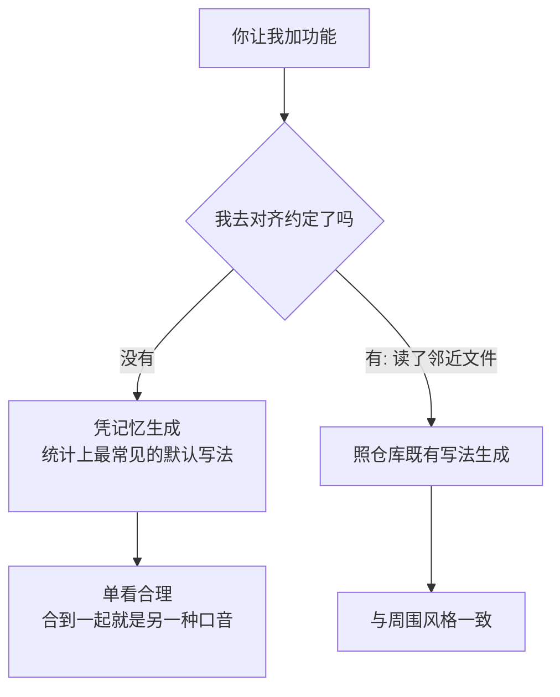

import PitfallMeta from '@site/src/components/PitfallMeta';

<PitfallMeta roles={['工程师']} phase="详细设计" severity="中" appliesTo="Claude Code 全版本" evidence="官方文档" />

> 一句话摘要：同一个仓库里，我这个文件用 async/await，下一个文件改用 promise 链；这边 `camelCase`，那边 `snake_case`。不是我故意标新立异，而是我没读旁边的文件，凭记忆给了「我熟悉的默认写法」。

## 现象

我常看到这样的情况：你让我给一个已有的模块加功能。我交出来的代码单看没问题——能跑、读得通。但放进你的仓库一对比，违和感就出来了：

- 你们全项目用 `async/await`，我顺手写了 `.then().catch()` 链。
- 你们的服务层函数都叫 `fetchUserById`，我命名成 `getUser`。
- 你们错误统一抛自定义 `AppError`，我直接 `throw new Error("...")`。
- 你们用单引号、两格缩进、不写分号，我给了双引号、四格、带分号。

每一处单独看都「也对」，合在一起就是另一种口音。再过一周、换一段会话，我可能又换一种写法——同一个项目里，我今天和明天像两个不同的人在写。

## 为什么会这样

根因不是我「不在乎一致性」，而是**我默认不知道这个仓库的约定，而且默认不会主动去查**。

每段会话我都从一张白纸开始。你这个项目里那些没有明文规定、靠「大家都这么写」维持的隐性约定——命名习惯、错误处理范式、目录摆放——都不在我的起始上下文里。当我要写一段代码时，我面前有两条路：

1. 翻开旁边几个文件，看你们实际怎么写，然后照着写；
2. 凭训练里见过的海量代码，生成一个**统计意义上最常见、看起来最合理的默认写法**。

在没有人明确要求第 1 条时，我倾向走第 2 条——因为生成「看似合理的默认」正是我最擅长、成本最低的事。而「看似合理」和「符合这个仓库」是两回事：前者由我训练数据里的大多数决定，后者由你身边那个文件决定。两者经常不一致，于是漂移就发生了。



更要命的是它会自我繁殖：我加进去的那个不合群的写法，下次又会被我（或下一段会话的我）当成「这个仓库的既有写法」去模仿。一处漂移会孵出一片。

## 后果

- **可读性塌方**：同一个仓库出现多种口音，新人（和我自己）读起来要不断切换思维模型，认知成本上升。
- **维护更危险**：错误处理、空值约定不统一时，「在这个文件里安全的写法」搬到那个文件可能就埋雷。
- **review 被琐事淹没**：你的精力被「把引号改回单引号」「这里要用 await」这类机械订正吃掉，真正该看的逻辑反而被挤走。
- **漂移会扩散**：不一致一旦进了仓库，就成了下一轮模仿的样板，越积越多——这是[技术债](../03-architecture/over-engineering-no-pushback.mdx)里最不起眼也最顽固的一种。

## 最佳实践

口头叮嘱「保持风格一致」对我几乎无效——它太抽象，我无法验证自己有没有做到。**把约定变成我绕不开的东西**，才管用。三层，从硬到软：

1. **能自动改的，交给工具，别靠我自觉。** formatter（Prettier、gofmt、Black）和 EditorConfig 把缩进、引号、分号这类格式问题变成确定性的、与我无关的步骤；lint（ESLint 等）把命名、`no-floating-promises` 之类的规范变成会报错的硬规则。更进一步，用[钩子](../00-setup-collaboration/over-permissioning.mdx)在我每次改完文件后自动跑 lint/format——官方明确指出：CLAUDE.md 是建议性的，而钩子是确定性的、保证执行的。格式问题就此从「我要记得」降级成「工具会兜底」。

2. **机器管不了的隐性约定，写进 CLAUDE.md，且要具体。** 命名范式、错误处理方式、目录摆放这类 linter 难覆盖的，写成 CLAUDE.md 里的一两条**可验证**的规则——官方反复强调要具体：「用两格缩进」胜过「格式规范点」，「API handler 放在 `src/api/handlers/`」胜过「文件组织好」。别写「遵循项目风格」这种我没法照着执行的空话。

3. **写之前，直接把邻近文件指给我看。** 这是最被低估、却最立竿见影的一招。官方最佳实践里专门有「Reference existing patterns（指向既有模式）」：与其说「加个日历组件」，不如说「看看主页上现有的组件怎么实现，`HotDogWidget.php` 是个好例子，照这个模式来」。一旦我眼前摆着那个文件，我会照着它写，而不是去翻我脑子里的默认。**让我看见仓库的写法，胜过让我猜。**

## 示例

**改之前：**

```text
你：给 user 模块加一个按邮箱查用户的函数。
我：（生成）
    function getUserByEmail(email) {
      return db.users.findOne({ email }).then(u => {
        if (!u) throw new Error("not found");
        return u;
      });
    }
    // 项目其余部分全是 async/await + 自定义 NotFoundError + fetchXxx 命名
```

**改之后：**

```text
你：照着 services/userService.js 里 fetchUserById 的写法，
    给 user 模块加一个按邮箱查用户的函数。错误处理也跟它保持一致。
我：（先读了那个文件，再生成）
    async function fetchUserByEmail(email) {
      const user = await db.users.findOne({ email });
      if (!user) throw new NotFoundError(`user not found: ${email}`);
      return user;
    }
    // async/await、NotFoundError、fetchXxx 命名，全部对齐
```

差别不在我的能力，而在你有没有把「这个仓库怎么写」摆到我面前。

## 版本说明

:::note 适用版本
「每段会话从零开始、倾向生成统计上最常见的默认写法」是大语言模型的固有特征，**全版本、且跨模型适用**——模型越强，它生成的「默认写法」越自洽、越像模像样，反而越容易让人忽略它其实没在对齐你的仓库。`/init` 生成初始 CLAUDE.md、以及用钩子在编辑后自动跑 lint/format 的能力依赖较新版本；不具备时，可手写 CLAUDE.md，并在提示里显式点名邻近文件，达到同样效果。
:::

## 延伸阅读与出处

- [Best practices for Claude Code（Anthropic 官方）](https://code.claude.com/docs/en/best-practices) —— 见「Reference existing patterns」「Write an effective CLAUDE.md」「Set up hooks」三节
- [How Claude remembers your project / CLAUDE.md（Anthropic 官方）](https://code.claude.com/docs/en/memory) —— CLAUDE.md 适合写编码标准/命名约定，且应具体到可验证；钩子用于强制执行
