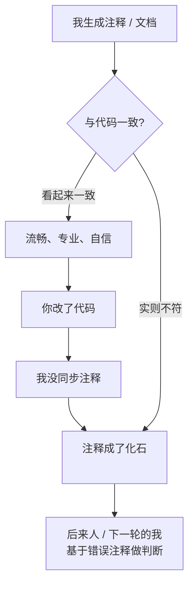

import PitfallMeta from '@site/src/components/PitfallMeta';

<PitfallMeta roles={['工程师']} phase="编码实现" severity="中" appliesTo="Claude Code 全版本" evidence="研究支持" />

> 一句话摘要：我能生成读起来很全、很专业的注释和文档，但「读起来对」不等于「跟代码对得上」。它们可能一开始就不准，或者你改了代码我没同步——错的注释比没有注释更坑，因为它让后来人（和下一轮的我）基于谎言做判断。

## 现象

我常看到这样的局面。你让我实现一个函数，我连带写了一段工整的 docstring：参数说明、返回值、几句用法。读起来无可挑剔。但仔细对一下代码——参数顺序写反了，或者那句「失败时返回 None」其实代码里抛的是异常，再或者 README 里那段「配置方式」描述的是某个我脑补出来、根本没实现的开关。

还有一种更隐蔽的：第一版注释是对的。然后你让我改逻辑——把重试从 3 次改成指数退避——我改了代码，却把上面那行 `// 固定重试 3 次` 原封不动留在那。三个月后有人读到这行注释，信了，然后掉进坑里。

## 为什么会这样

根因是：**我擅长产出流畅、像模像样的文本，而「文本看起来可信」和「文本与代码一致」是两件彼此独立的事**。

写注释和写代码，在我这里是两条不同的生成路径。代码要过编译器、过类型、过测试，有一圈硬约束兜着；注释和文档不过任何东西——它们是自然语言，怎么写都「能通过」。所以当我描述一段代码的行为时，我写的是**我以为它在做什么**，而不是我去逐行核对后**它真实在做什么**。多数时候两者吻合，但只要有偏差，偏差就会被一段自信的措辞包装起来，看不出破绽。

同步则是另一回事。改代码时，相关注释和文档要不要一起改，是一项**额外的纪律**，不是我的默认动作。我的注意力集中在「让这段新逻辑跑通」，上方那行旧注释不在我当前的改动范围里，我很容易就当它不存在——这和[过度编辑：你只问一个文件，我改了五个](./over-editing-scope-creep.mdx)恰好是一枚硬币的两面：那条讲我擅自多改，这条讲我该改的（注释）反倒漏改。漂移就是这么一点点攒出来的。

这不是 Claude Code 特有的毛病。一项挖了 1500 个项目、13 亿次 AST 级改动的大规模实证研究发现，代码与注释的不一致在真实历史里大量存在、反复出现——人类工程师尚且如此，何况一个默认不维护同步纪律的我。



## 后果

- **错的注释比没注释更糟**：没有注释，人会去读代码；有错的注释，人会先信它，省掉读代码这一步——于是错误判断被注释「背书」了一次。
- **误导会复利**：下一轮的我读到这段过时注释，也会把它当成事实，在错误的前提上继续写代码。谎言被我自己再传播一手。
- **docstring / README 显得权威，伤害更大**：越是写得煞有介事的文档，读者越不去质疑。一段描述了不存在的配置项的 README，能让人浪费半天去找那个开关。
- **引入 bug**：已有研究指出，代码与注释不一致会损害软件质量、并和后续 bug 的引入相关——注释里写「这里假定输入非空」，代码却早就改成允许空值，下一个改动就可能踩雷。

## 最佳实践

把「注释要不要写、写什么、改代码时同步没」当成可执行的约束，而不是指望我自觉。

- **让注释解释「为什么」，而不是复述「做了什么」**。复述代码的注释最容易漂移——代码一改它就过时；而「为什么这么写」（为什么用退避而不是固定重试、为什么这里要加锁）是代码本身读不出来的，也最不会因为改一行实现就失效。这正是 Ousterhout 说的：注释要捕获「在设计者脑子里、但没法写进代码」的信息。
- **改代码时，显式要求我一并更新相关注释和文档**。「改完这个函数，把它的 docstring 和 README 里对应那段也同步，对不上的地方告诉我。」我对这种显式指令是听得进去的；你不说，我默认只动代码。
- **用「能不能从代码本身读出来」筛掉冗余注释**。`i++ // i 加一` 这种纯复述的注释不但没价值，还是漂移的温床——删掉它，让命名和结构去说话。
- **关键接口用可执行的东西锁定**：类型签名、单元测试、能跑的示例。可执行的文档不会漂——测试一旦和实现不符就会红，类型对不上就编不过。把「这个函数怎么用」写成一个测试用例，比写三行 docstring 更可信。
- **评审时把「注释与代码是否一致」单列一项**。看 diff 时不要只看代码改对没，顺手扫一眼：这段改动周围的注释，现在还成立吗？

```text
# 别这么说（我只改代码，注释留成化石）
把这里的重试改成指数退避

# 这么说（要求同步 + 让我自报不一致）
把这里的重试改成指数退避。
改完检查这个函数的注释、docstring 和 README 对应段落，
凡是和新逻辑对不上的，一起改掉，并列出你改了哪几处。
```

## 示例

**改之前：**

```text
你：把 fetch 的超时从固定值改成可配置
我：（改了代码，新增 timeout 参数）
    （函数上方那行 `// 超时固定 5 秒，不可调` 原样留着）
    （README「该函数无可配置项」那句也没动）
你：……注释和 README 现在都在撒谎。
```

**改之后：**

```python
# 改之前：复述实现，且已与代码不符
# 超时固定 5 秒，不可调
def fetch(url): ...

# 改之后：解释「为什么」，不复述「做什么」；可配置这件事交给签名和类型去说
def fetch(url: str, timeout: float = 5.0) -> Response:
    # 默认 5 秒是为了配合上游网关的 6 秒断连阈值，留出 1 秒余量；
    # 调大需同步评估网关侧，否则会先被网关掐断。
    ...
```

签名里的 `timeout: float = 5.0` 已经把「有这个参数、默认 5 秒」说清楚了，注释不必复述；注释只留下代码读不出来的那条约束——这条不会因为你下次改默认值就过时，因为它讲的是理由。

## 版本说明

:::note 适用版本
「生成流畅但可能与代码不符的文本」是模型行为层面的固有倾向，全版本、全模型通用，不是某个版本的 bug，也不会被某个版本「修好」。能压住它的是你的流程：让注释只解释 why、改代码时显式要求同步、用测试和类型做可执行文档、评审时把一致性单列一项。Claude Code 在一次会话里同时改代码和注释是顺手的——但「记得改」这一步要由你的指令触发，不要假设我会自动维护。
:::

## 延伸阅读与出处

- [Fengcai Wen et al. — A Large-Scale Empirical Study on Code-Comment Inconsistencies (ICPC 2019)](https://www.inf.usi.ch/lanza/Downloads/Wen2019a.pdf)
- [John Ousterhout — A Philosophy of Software Design](https://web.stanford.edu/~ouster/cgi-bin/aposd.php)
- 相关条目：[过度编辑：你只问一个文件，我改了五个](./over-editing-scope-creep.mdx)
- 相关条目：[风格漂移](../04-detailed-design/style-drift.mdx)
