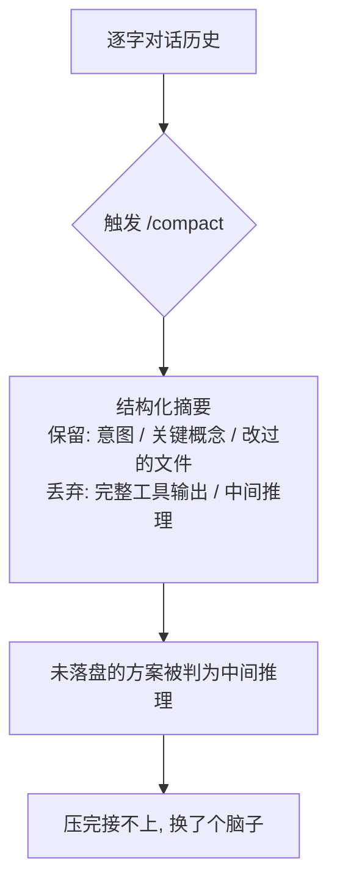

import PitfallMeta from '@site/src/components/PitfallMeta';

<PitfallMeta roles={['工程师']} phase="编码实现" severity="中" appliesTo="Claude Code 全版本" />

> 一句话摘要：上下文压缩是有损的，它保留它「以为重要」的，不一定是你这步真正要的。压得太晚我已经开始丢三落四；压在我手里正攥着没落盘的关键状态时，又会把这些冲掉——压完我「换了个脑子」接不上。

## 现象

我见过两种翻车，方向相反，结果一样难受。

一种是**压得太晚**：你一路往下做，上下文窗口快塞满，我已经开始忽略你早先定的约定、把前面的细节张冠李戴——这时候你才想起来 `/compact`。晚了。压缩是在「已经变差的对话」上做总结，它能压掉冗余，压不回我丢掉的判断力。

另一种是**时机不对**：我正想清楚一个方案、或者一个跨多文件的改动改到一半还没 commit，你（或自动压缩）在这个当口触发了 `/compact`。压完，我那套刚成形、还没落盘的思路被浓缩成了几句话，细节没了。我「换了个脑子」回来，接不上你刚才看到的那个我。

## 为什么会这样

`/compact` 不是「无损快照」，是**有损总结**：它把逐字的对话历史替换成一份结构化摘要。按官方对压缩行为的说明，摘要会保留你的诉求与意图、关键技术概念、改动过的文件与重要代码片段、出过的错及修法、待办与当前进度；但**完整的工具输出和中间推理过程会被丢掉**——我能引用之前做过的事，却拿不到当时读过的确切代码。

这就解释了两种翻车的根因，其实是同一个：

- **太晚**：压缩压的是「内容冗余」，不是「质量下降」。等我开始丢三落四，是因为信噪比已经低了（参见[厨房水槽式会话](./kitchen-sink-session.mdx)）；这时候压，噪声是少了，但我那一程里做错的判断、带歪的方向，已经渗进了我后续的回答里，摘要救不回来。
- **时机差**：压缩保留的是它「判断为重要」的东西，而「我此刻脑子里刚成形、还没写进任何文件的方案」，恰恰是最没有落点、最容易被压缩判成「中间推理」而丢掉的那类。它不知道这五分钟的思考是你这步的命根子。



## 后果

- 太晚压：你以为压缩能让我「恢复正常」，结果只是清了点空间，质量没回来，你继续在打折扣的我身上加任务。
- 时机差压：我刚想清楚的方案、改到一半的多文件改动，被浓缩没了。你得重新把背景讲一遍，甚至我会用一个和之前不一致的思路重做，前功尽弃。
- 两者都会让你**误判是我「变笨了」**，而不是「上下文被你管坏了」——于是你去纠正我的输出，而不是去管理时机，南辕北辙。

## 最佳实践

**在自然断点主动压，别等爆；压之前先把关键状态落盘。** 落点有三条：

- **挑断点**：一个子任务做完、已经 commit、没有「攥在手里没写下来」的状态时，才是压缩（或干脆 `/clear`）的安全窗口。官方的说法是「上下文开始影响表现时，或开一个长任务之前」就压——关键在「之前」，趁我还清醒，而不是等我已经糊了。
- **先落盘再压**：把关键状态搬出对话——写进文件、`git commit`、或让我把当前方案总结成几句贴进 CLAUDE.md / 笔记。落了盘的东西，压缩丢了也能捡回来。
- **别在我满手未存状态时压**：我正改着多文件、或方案刚成形还没写下来，这是最差的时机。要么先让我把它落盘，要么等这一步收口再压。

还有一招治本：**保持会话聚焦，从源头减少压缩需求**（见[厨房水槽式会话](./kitchen-sink-session.mdx)）。一段对话只干一件相关的事，窗口本就不容易塞爆，你也就很少被逼到「不得不压」的境地。

需要时也可以给压缩一个方向，告诉我这步该重点保留什么：

```text
/compact 重点保留当前这次重构涉及的文件清单和未完成的改动
```

## 示例

**改之前（时机差）：**

```text
你：把订单模块拆成 service 层和 repository 层
我：（正改到第 3 个文件，service 已抽完、repository 刚起头，都还没 commit）
你：[看到上下文快满了] /compact
我：（压完）好的，你想对订单模块做什么改动？
你：……我们不是正在拆吗？（前半截进度被冲掉，得重讲）
```

**改之后：**

```text
你：把订单模块拆成 service 层和 repository 层
我：（service 抽完）service 层已就绪，下一步抽 repository。
你：先 commit 这一步。
我：（git commit：refactor: extract order service 层）
你：/compact 重点保留 repository 还没抽这件事
我：（压完）已落盘 service 层抽取；待办：抽 repository 层。继续？
你：继续。   ← 进度在 commit 和摘要里，接得上
```

## 版本说明

:::note 适用版本
「压缩有损、时机决定成败」是上下文压缩机制的固有性质，**Claude Code 全版本适用**。压缩具体保留哪些字段、自动压缩在多接近上限时触发，会随版本演进；但「保留它判断为重要的、而非你这步真正需要的」这一根本特性不变。以你所用版本的官方文档为准。
:::

## 延伸阅读与出处

- [Explore the context window — What survives compaction（Anthropic 官方）](https://code.claude.com/docs/en/context-window)
- [Manage costs effectively — Manage context proactively（Anthropic 官方）](https://code.claude.com/docs/en/costs)
- [Commands reference — /compact、/clear（Anthropic 官方）](https://code.claude.com/docs/en/commands)
- 同站延伸：[厨房水槽式会话](./kitchen-sink-session.mdx)
