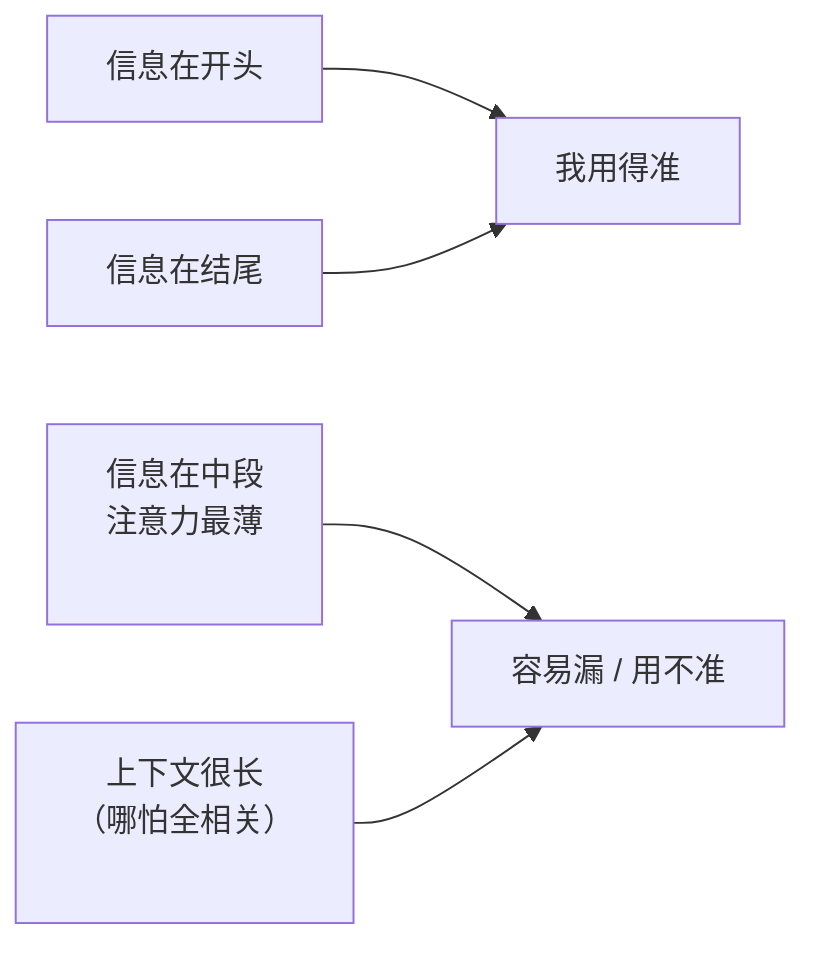

import PitfallMeta from '@site/src/components/PitfallMeta';

<PitfallMeta roles={['工程师', '架构师']} phase="编码实现" severity="中" appliesTo="全模型通用" evidence="研究支持" />

> 一句话摘要：「把整个仓库 / 整篇长文档都喂给它，它肯定全看到了」是个错觉。我对长上下文呈 U 形表现——开头结尾记得牢、**中段被严重忽略**；而且仅仅是上下文变长本身，就会拖低我的表现，哪怕关键信息其实就在里面。更多上下文 ≠ 更好。

## 现象

你想让我少出错，于是把能塞的都塞进来：整个目录、几千行日志、一篇很长的规格文档，最后补一句「都在上面了，按这个来」。我答得很流畅，但漏掉了夹在第 40 个文件里的那条关键约束——明明它就在我「读过」的内容里。

你会觉得奇怪：同样的信息，单独贴给我时我用得好好的；一旦把它埋进一大段上下文的中间，我就像没看见。不是它不在我的窗口里，是它落在了我注意力最薄的那一段。

这和几条已有的上下文类误区是**不同机制**，别混：

- 《[厨房水槽式会话](./kitchen-sink-session.mdx)》讲的是**混杂无关任务**稀释了焦点；本条即便喂的全是相关内容，长度本身也会拖低表现。
- 《[CLAUDE.md 过载](./claude-md-overload.mdx)》讲的是**规则太多被平均稀释**；本条是更底层的「长上下文中段注意力衰减」，不限于规则。
- 《[`/compact` 时机](./compact-timing.mdx)》讲的是**何时压缩**；本条解释的是「为什么长上下文本身就该警惕」——也正是该压缩、该精选的根本原因。

## 为什么会这样

**研究反复发现 LLM 用长上下文呈 U 形：信息放在开头或结尾，我用得最准；放在中间，准确率显著下降。** 这就是著名的「lost in the middle」（*Lost in the Middle: How Language Models Use Long Contexts*）——把关键信息从两端挪到中段，表现可以掉超过 30%。

更反直觉的是：**不是「无关内容多了」才坏，是「长」本身就坏。** 有研究专门控制了这一点——即便相关信息能被完美检索到、甚至屏蔽掉无关 token 只让我看该看的，**仅仅上下文更长**，表现依然下滑（*Context Length Alone Hurts LLM Performance Despite Perfect Retrieval*）。也就是说，「我反正都读到了」并不能救场。

机制上的根源在注意力本身：Transformer 的自注意力是个在所有 token 上分配的概率分布，序列越长，分母越大，**每个 token 摊到的注意力权重被稀释**；再叠加位置编码的长程衰减——距离越远的 token 对之间相似度系统性偏低，落在中段、离当前生成位置较远的信息，拿到的注意力更少。于是「塞进窗口」和「真正被用上」是两回事。



## 后果

- **关键约束被漏掉，你却以为我「都看到了」。** 最危险的不是我说「我没读到」，而是我读到了却没用上——你基于「全喂了」的错误安全感去验收。
- **加越多越糟，过了某个点是负收益。** 你为「保险」把更多上下文灌进来，反而把关键信息推向中段、整体注意力摊得更薄，质量不升反降。
- **长会话悄悄变笨。** 随着对话拉长，早期定下的关键决定、约束滑进中段被淡忘，我开始前后不一致——你以为模型「累了」，其实是上下文腐烂。

## 最佳实践

**核心一句：少而精地喂相关片段，把最关键的放在显眼位置，别指望「全塞进去」。**

- **检索，而不是灌入。** 只挑与当前任务真正相关的几个片段给我，而不是把整个目录 / 整份日志倒进来。研究里常见的经验是：几个精选片段往往胜过几十个——多出来的那些主要在稀释注意力。
- **关键信息放开头或结尾，别埋中段。** 把「绝不能违反的约束」「这次任务的核心目标」放在 prompt 的开头或结尾；中段是我的注意力洼地。
- **关键约束重复 / 置顶。** 对最要命的那条，宁可在长上下文里重复一次、或单独拎到显眼处，也别赌它埋在中间还能被用上。
- **长会话及时收口。** 一个子任务做完就 `/clear` 或压缩（见《[`/compact` 时机](./compact-timing.mdx)》），别让窗口无限堆长——这正是上下文腐烂的对策。
- **别用「全喂给它」代替「想清楚喂什么」。** 灌入全量看着省事，实则把「挑出相关信息」这步偷懒外包给了我的注意力——而那一段恰恰最不可靠。

## 示例

**改之前：**

```text
你：（把 20 个文件的整个目录 + 三千行日志一次性贴给我）
你：需求都在里面了，照这个改
我：（漏掉了埋在第 12 个文件中段的那条"金额必须用整数分"约束，用了浮点）
你：……怎么又是浮点，我明明给你了
```

**改之后：**

```text
你：相关的就这三处：models/money.py、第 12 文件里"金额用整数分"这条约束（我置顶给你）、
    还有这个失败用例。约束最重要：金额一律整数分，别用浮点。
我：（基于精选的相关片段 + 置顶的关键约束，一次改对）
```

差别不在我这次更用心，而在于你把相关信息挑出来、把关键约束放到了我注意力够得到的位置——而不是赌它埋在一大段中间还能被我捞起来。

## 什么时候例外

「少而精」是默认，但不是绝对。有几种情况「多喂」反而对：

- **任务本身需要全局视野，且总量没超出有效窗口**：比如跨文件重构、全局一致性检查，信息高度关联、删谁都会漏。关键是判断「有效长度」，而不是「窗口标称装得下」。
- **配了检索 + 重排 + 结构化摘要**：你不是裸塞，而是先把长材料压成结构化摘要 / 索引，再按需取片段——长度的伤害被工程手段对冲掉了。这时「全都在」是整理过的全，不是一锅倒。
- **关键信息在两端并重复置顶**：U 形里头尾是高地，刻意把关键约束放头尾、必要时重复一次，可以在较长上下文里仍保住它。

判据：例外成立的前提是你对「长」做了主动管理（精选 / 检索 / 置顶 / 摘要），而不是用「反正都读到了」替代「想清楚喂什么」。

## 版本说明

:::note 适用版本
U 形注意力、中段丢失、「长度本身拖低表现」是基于自注意力 + 位置编码的**模型机制层面**现象，**全模型通用**，不分厂商与版本。上下文窗口的标称大小会随版本变大（几十万乃至上百万 token），但「能装下」从来不等于「能均匀用好」——窗口越大，越要主动精选，而不是越敢全塞。
:::

## 延伸阅读与出处

- [Lost in the Middle: How Language Models Use Long Contexts（TACL；arXiv 2307.03172）](https://arxiv.org/abs/2307.03172) —— 长上下文 U 形表现，中段信息显著掉点
- [Context Length Alone Hurts LLM Performance Despite Perfect Retrieval（arXiv 2510.05381）](https://arxiv.org/abs/2510.05381) —— 即便完美检索、屏蔽无关 token，仅长度本身仍拖低表现
- 同站延伸：[厨房水槽式会话](./kitchen-sink-session.mdx)、[CLAUDE.md 过载](./claude-md-overload.mdx)、[`/compact` 时机](./compact-timing.mdx)
