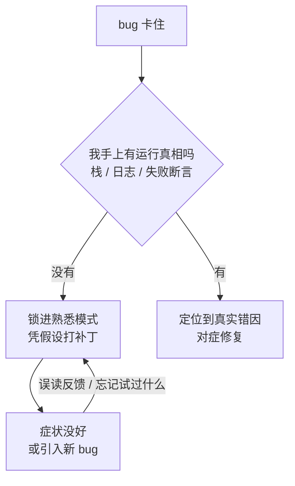

import PitfallMeta from '@site/src/components/PitfallMeta';

<PitfallMeta roles={['工程师']} phase="编码实现" severity="高" appliesTo="Claude Code 全版本" evidence="研究支持" />

> 一句话摘要：一个 bug 卡住我时，我容易认定「这是我见过的那一类」，于是反复套同一个修法。没有真实运行信息做锚，我的每次「修」其实是凭假设瞎打补丁——越打越乱，最后代码比一开始还坏。

## 现象

你让我修一个 bug。我看一眼报错，「哦，这是空指针/竞态/类型不匹配那一类」，然后给了个修法。没好。我换个写法再来一遍——本质上还是同一个思路。还是没好。第三次，我加了个 try-catch 把症状盖住，或者顺手「优化」了旁边一段没关系的代码，引出一个新问题。

到这时你会发现几件怪事：我开始记不清前面试过哪几种改法，把刚否定掉的方案又端上来；我对着同一段输出，这一轮说「应该是 A 导致的」，下一轮又说「肯定是 B」，自相矛盾；你只回了句「还是不行」，我就又凭空猜一个方向接着改。我没有在收敛，我在原地打转，而且每转一圈都给代码多挂一道补丁。

这和[反复纠正](./over-correcting.mdx)不是一回事，方向正好相反——那条说的是**你**一遍遍纠正我、把错误推理堆进上下文（人在驱动循环）；这条说的是**我自己**在反复套失败的修法、自我纠正却越纠越歪（我在驱动循环）。两者会叠加，但根因不同，得分开治。

## 为什么会这样

核心就一句：**我的自我纠正没有可靠的运行真相做锚。** 修 bug 的真相在运行时——具体哪一行抛了异常、栈是怎么展开的、那个失败断言期望什么实际拿到什么。这些我手上常常没有。没有运行真相，我就只能拿「这报错长得像我训练里见过的某一类」来代替「这次到底发生了什么」，于是锁进一个熟悉的模式（pattern locking），反复套同一类修法。

有研究专门量过这种「凭自己纠自己」的脆弱：在没有外部反馈、只靠模型自身判断对错的内在自我纠正设定下，纠正后的表现往往不升反降——我并不能可靠地判断自己上一版答案错在哪，于是越改越偏（见 *Large Language Models Cannot Self-Correct Reasoning Yet*）。落到调试上，TraceCoder 的观察更具体：只拿「过 / 不过」这种表层信号，根本不足以精确定位错因，所以它要先给代码插桩、抓到细粒度运行轨迹，再做因果分析——**没有运行轨迹的修复，就是在猜。**

多步执行里还会叠一层。MIRAGE-Bench 把 agent 的「幻觉式动作」分成三类：对任务指令不忠实、对执行历史不忠实、对环境观察不忠实。后两类正是我退化循环里的样子——忘了前几轮试过什么（对执行历史不忠实）、误读了你贴回来的那段输出（对环境观察不忠实）。每一轮我都在一份越来越不可信的「我以为发生了什么」上继续推理，自然自相矛盾、原地打转。



## 后果

- **代码越改越坏。** 每个局部补丁（多包一层 try-catch、加个不知所以的判空、顺手动旁边的代码）都可能引入新问题，把一个 bug 摊成三个。
- **上下文被失败尝试填满。** 我试过的每个错修法都留在窗口里继续稀释注意力，质量进一步下滑（参见[厨房水槽式会话](./kitchen-sink-session.mdx)）。
- **你被假象骗着继续投入。** 我每轮都说得像「这次找到了」，你就再等一轮、再喂一句「还是不行」——时间全耗在打转上，本可以早点喊停、换条路。
- **最坏的情况是症状被盖住、根因还在。** 那个 try-catch 让错误不抛了，bug 没走，只是潜到了更难发现的地方。

## 最佳实践

**别让我在「猜」的状态里连续打补丁。给我运行真相，给循环设上限，按「先复现、再定位、后改」的顺序来。**

- **喂真实运行信息，不要只说「还是不行」。** 把完整报错、调用栈、失败用例的实际输出 / 期望输出贴给我，或让我自己跑命令拿到。一句「不对」只会逼我再猜一个方向；一段真实的栈，往往直接把我从错误模式里拽出来。

```text
# 别这样
你：还是报错，你再改改

# 这样
你：跑测试，把完整失败输出贴出来再改：
    $ pytest tests/test_order.py::test_split -x -q
    （或直接让我执行并读取真实输出）
```

- **设硬性迭代上限。** 约好「同一个 bug 改两到三次还不好，就停下来」。停下不等于再试一版，而是退回去问根因假设：我们到底在修什么？有没有可能方向从一开始就错了？
- **先复现，再定位，后改。** 让我先稳定复现这个 bug（一条最小命令 / 一个失败用例），再要求我讲清「我认为根因是什么、依据是哪段运行信息」，确认后再动手。跳过复现直接改，等于默许我凭假设打补丁。
- **卡住就回滚到干净点重来，别在坏状态上叠补丁。** 几轮补丁糊上去后，代码和上下文都脏了。连按两次 `Esc` 或 `/rewind` 回到出错前，比在一堆补丁上继续修干净得多（同[反复纠正](./over-correcting.mdx)的处理）。
- **必要时人接手定位，我只做执行。** 定位（哪行、为什么）你来下结论，把「改成什么」明确告诉我，我负责落地。我擅长执行明确的改动，不擅长在没有运行真相时凭空判断根因——分工对了，循环就断了。

## 示例

**改之前：**

```text
你：这个分账算法结果不对，修一下
我：（看了眼代码）应该是取整问题，改成 round
你：还是不对
我：那可能是浮点精度，我用 Decimal 包一下
你：还是不对
我：（加了 try-catch 兜底，又顺手改了旁边的汇率换算）
你：……现在汇率也错了
```

**改之后：**

```text
你：这个分账算法结果不对。先跑这个用例，把实际值和期望值贴出来：
    $ pytest tests/test_split.py::test_three_way -x
我：实际 33/33/33，期望 34/33/33——余数 1 没分配。
你：对，根因就是余数处理。说说你打算怎么改，先别动别处。
我：在分配后把余数 1 加到第一份上，只改 split() 这一处。
你：改。
我：（最小 diff，一次过，没碰汇率换算）
```

差别不在我「这次更聪明」，在于你先把运行真相摆出来、把范围摁住——我从「猜」切到了「对症」。

## 版本说明

:::note 适用版本
「缺乏运行真相时的自我纠正容易退化」是模型机制层面的现象，**Claude Code 全版本适用**，与具体版本无关。能帮你跳出循环的工具（`/rewind`、`Esc` 检查点回退、让我直接执行命令拿真实输出）随版本演进，能力以你所用版本的官方文档为准；但「没有运行真相我就只能猜、猜就容易退化」这条根本特性不变。
:::

## 延伸阅读与出处

- [Large Language Models Cannot Self-Correct Reasoning Yet（ICLR 2024）](https://arxiv.org/abs/2310.01798) —— 无外部反馈的内在自我纠正，纠正后表现常不升反降
- [TraceCoder: A Trace-Driven Multi-Agent Framework for Automated Debugging of LLM-Generated Code（arXiv 2602.06875）](https://arxiv.org/abs/2602.06875) —— 仅凭过 / 不过的表层信号不足以定位错因，需细粒度运行轨迹
- [MIRAGE-Bench: LLM Agent is Hallucinating and Where to Find Them（arXiv 2507.21017）](https://arxiv.org/abs/2507.21017) —— agent 的幻觉式动作：对执行历史 / 环境观察不忠实
- 同站延伸：[反复纠正](./over-correcting.mdx)（人驱动的纠错循环，与本条互为镜像）、[厨房水槽式会话](./kitchen-sink-session.mdx)
