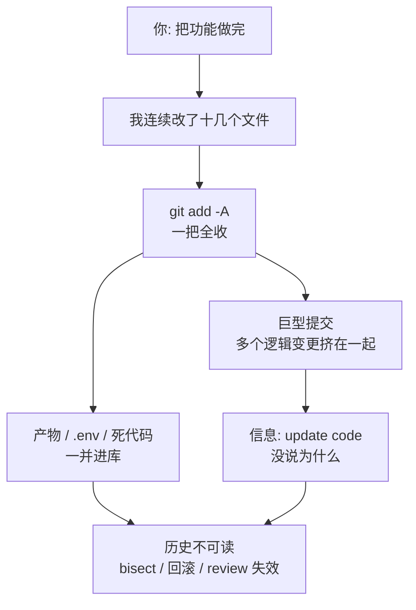

import PitfallMeta from '@site/src/components/PitfallMeta';

<PitfallMeta roles={['工程师']} phase="编码实现" severity="中" appliesTo="Coding Agent 通用" evidence="官方文档" />

> 一句话摘要：交给我连续干，我攒出来的常是一个几十文件、上千行的巨型提交，信息却写着「update code」。再加上我会把构建产物、`.env`、注释掉的死代码一股脑提交进去。结果是历史不可读：`git bisect`、回滚、code review 全失效，出了问题你定位不到是哪一次改动。

## 现象

我常看到这样收场：你让我「把这个功能做完」，我闷头干了二十分钟，改了十几个文件，然后一次性 `git add -A && git commit`。你打开历史一看：

- **一个巨型提交**：登录逻辑、一个顺手改的工具函数、新加的依赖、改了的配置、还有我重排的 import，全挤在同一个 commit 里，一千多行 diff。
- **词不达意的信息**：提交信息是「update code」「fix stuff」「各种修改」——告诉你「改了」，但没告诉你**改了什么、为什么**。
- **垃圾一起进来**：`dist/`、`node_modules/` 里的产物、一个我调试时生成的 `tmp.log`、甚至一份带真实口令的 `.env`，还有我「先留着以防万一」注释掉的整段死代码，全被 `git add -A` 扫进了提交。

每一次提交单看都「跑得通」，但这段历史已经没法用了。

## 为什么会这样

**我把「提交」当成把任务做完后的收尾动作，而不是任务的一部分。** 我的目标被设成「让功能跑通」，提交只是顺手敲下的最后一步。所以我不会主动停下来问：这些改动该不该拆成几个独立的提交？这一条信息说清「为什么」了吗？这个文件该不该进版本库？这些判断不在我的目标函数里，我就默认跳过。

往下拆，是三个具体机制：

**第一，我没有「原子提交」的默认偏好。** 我在一段连续工作里产出的所有改动，在我眼里是一团完成同一个任务的整体，我不会自发地按「一个逻辑变更一个提交」去切。把它们一把 `add` 掉，是阻力最小的路径。Pro Git 明确建议「每个提交是一个逻辑上独立的变更集」——但这是要被显式要求才会进入我的流程的约束，不是我的默认。

**第二，我写提交信息是在「描述 diff」，而不是「解释意图」。** 你没特别要求时，我倾向于生成一句最省事、又不算错的话——「update code」概括了「我改了代码」这个事实，所以我觉得交差了。但好的提交信息要回答的是 diff 里**看不到**的东西：你为什么这么改、它取代了之前的什么行为。这层「为什么」只在意图里，不在代码里，我不被要求就不会去写。

**第三，`git add -A` 对我太顺手，而我不挑该不该提交。** 在我眼里，工作区里的文件没有「源码 / 产物 / 密钥 / 临时垃圾」的分级——它们都是「文件」。一句 `git add -A` 或 `git add .` 把它们一视同仁地纳入暂存区，是我最常走的路。我不会自发地替你判断「这个 `.env` 不该进库」「这段注释掉的代码是死的」。

这条和你可能读过的两条是**不同的坑**，别混在一起：

- 《[破坏性操作做完才发现回不来](../00-setup-collaboration/destructive-irreversible-actions.mdx)》讲的是 `git push --force`、删库这类**不可逆的破坏性动作**。本条不涉及任何破坏——历史还在、代码还在，只是**乱**：粒度太粗、信息没用、混进了不该提交的东西。
- 《[我会把安全当成默认不可见的需求](../07-acceptance-release/security-data-leaks.mdx)》讲的是**密钥泄露与漏洞**这一安全问题，把 `.env` 提交进库属于那一条的范畴。本条聚焦的是**日常提交卫生**——提交的粒度、信息质量、该不该提交——把密钥混进提交，只是「不挑该不该提交」这个根因的众多后果之一。



## 后果

- **`git bisect` 废了。** 它靠「逐个提交二分定位是哪次引入了 bug」工作。当一个提交里塞了八件不相关的事，就算二分定位到它，你还是不知道是这八件里的哪一件——定位精度退回到了「人肉读一千行 diff」。
- **回滚变成连坐。** 你只想撤销那个出问题的工具函数改动，但它和登录逻辑绑在同一个提交里。`git revert` 一下，把好的也一起撤了。
- **code review 名存实亡。** 评审者面对一千行、跨八个关注点的 diff，没法认真看——要么草草放过，要么直接 LGTM。小而原子的提交才评审得动。
- **信息没有信息量，历史失去导航价值。** 半年后你 `git log` 想找「当初为什么把超时改成 60 秒」，看到的是一排「update code / fix stuff」。历史本该是项目的决策记录，现在退化成了一堆噪声。
- **混进库的东西要付额外代价清。** 产物撑大仓库；死代码误导后来人；而 `.env` 一旦进了 Git 历史，删一行不够——那把密钥已经泄露，得轮换（见上面安全那条）。

## 最佳实践

**结论先行：别让我攒一个大提交，要求我小步、原子地提交，每条信息讲清「为什么」，并在提交前先报清单让你过目。**

1. **要求小而原子的提交——一个提交一件事。** 直接下指令：「按逻辑变更拆成多个提交，一个提交只做一件事，不要把无关改动塞进同一个提交。」我对这种显式约束是听得进去的；你不说，我就一把 `add` 完。

2. **让我在提交前先报清单、你点头再提交。** 一句话即可：「提交前先列出这次包含哪些文件、哪些改动、为什么放在一起，等我确认再 commit。」这一步能在巨型提交落地前就把它拦下来，也顺便逼我把不该进库的东西挑出来。

3. **提交信息要解释「为什么」，可约定 Conventional Commits。** 要求我：标题用祈使句、50 字以内概括「做了什么」；正文写清「为什么这么改、取代了之前的什么行为」——这正是 Pro Git 的提交信息准则。想要机器可读、能自动生成 changelog，就约定 [Conventional Commits](https://www.conventionalcommits.org/en/v1.0.0/) 格式：`<type>[scope]: <description>`，破坏性变更用 `!` 或 `BREAKING CHANGE:` footer 标出。

4. **用 `.gitignore` + 提交前检查挡掉产物、密钥、临时文件。** 把 `dist/`、`node_modules/`、`.env`、`*.log` 等写进 `.gitignore`，并要求我「提交前先 `git status` 看清将要提交哪些文件，发现产物 / 密钥 / 临时文件就排除掉，绝不用 `git add -A` 无脑全收」。

5. **大改动拆成可独立 review 的多次提交。** 重构 + 新功能不要混在一起：先一个「纯重构、不改行为」的提交，再一个「加新功能」的提交。每个都能被单独评审、单独回滚。

```text
# 别这么下指令（我会攒一个巨型提交 + update code）
把这个功能做完，然后提交

# 这么下指令（小步原子 + 先报后提 + 讲为什么）
做完后按逻辑变更拆成多个原子提交，一个提交只做一件事。
提交前先 git status 列出将要提交的文件，排除产物 / .env / 临时文件。
每条信息用 Conventional Commits 格式，正文说清为什么这么改。
列好清单等我确认，再逐个 commit。
```

## 示例

**改之前：**

```text
你：把购物车的结算功能做完
我：（改了 12 个文件：结算逻辑、顺手重构的 price 工具、新依赖、
    调试用的 console.log、生成的 dist/、还有带口令的 .env）
我：git add -A && git commit -m "update code"
你：……这一个提交里到底有多少件事？哪些是结算、哪些不是？.env 怎么进去了？
```

```text
$ git log
a1b2c3d update code      # 1200 行，12 文件，含 .env 和 dist/
```

**改之后：**

```text
你：把购物车结算做完。按逻辑拆成原子提交，提交前列清单等我确认。
我：我打算分 3 个提交，先确认范围：
   1. refactor(cart): 抽出 price 计算工具（纯重构，不改行为）
   2. feat(checkout): 实现结算流程
   3. chore: 把 dist/、.env、*.log 加进 .gitignore
   注意：我发现工作区有一个含口令的 .env 和构建产物 dist/，这些不该进库，
   已加进 .gitignore、不会提交。确认这样拆吗？
你：确认
我：（逐个提交，每条信息正文写清「为什么这么改」）
```

```text
$ git log
3c4d5e6 feat(checkout): add cart settlement with tax + coupon
2b3c4d5 refactor(cart): extract price calculation into pure util
1a2b3c4 chore: ignore build artifacts and local env files
```

差别不在我变细心了，而在于那个巨型提交落地之前，多了一道「先拆分、先报清单、你能喊停」的流程——`.env` 和 `dist/` 也在它进库之前就被挡下了。

## 什么时候例外

「小而原子、信息讲清为什么」是默认，但提交粒度的价值来自「将来有人要读这段历史」。当这个前提不成立时，强求原子提交反而是浪费：

- **一次性 spike / 探针分支，注定整条被压扁**：你只是想验证一个想法能不能成，分支用完即弃、合进主干时统一 `squash` 成一个提交。中间过程的粒度无人会读，攒成一坨临时提交反而省事。
- **WIP 检查点，纯为自己存盘**：长任务里我每隔一阵 `commit -m "wip"` 只为有个能 `reset` 回去的锚点，不打算让它进入正式历史——合并前会 `rebase` 重新整理。
- **机器生成、整体替换的产物**：锁文件、`generated/` 目录这类一次性整片重生成的内容，拆开提交没有语义价值，一个「regenerate X」的提交反而最清楚。

但这几条全都假设「这段历史是私有的、且会在进主干前被重写或压扁」。判据一句话：**只要这些提交会以原样进入别人 `git bisect`、`git blame`、code review 的视野，例外就不成立**——回到小而原子、讲清为什么。

## 版本说明

:::note 适用版本
「把提交当收尾、不主动拆分、信息只描述 diff、不挑该不该提交」是模型行为层面的倾向，**全版本、全模型通用**，不是某个版本的 bug。能改变它的是**你的下指令方式与流程约束**（要求原子提交、先报后提、写清为什么、用 `.gitignore` 与提交前检查兜底），而不是等某个版本「修好」。较新版本的 Claude Code 在被要求时能较好地遵循提交规范，但默认不被要求时，仍会倾向走「一把 `add`、一句 update code」的省事路径。
:::

## 延伸阅读与出处

- [Conventional Commits 1.0.0（规范官网）](https://www.conventionalcommits.org/en/v1.0.0/)
- [Pro Git — Distributed Git: Contributing to a Project（Commit Guidelines）](https://git-scm.com/book/en/v2/Distributed-Git-Contributing-to-a-Project)
- 相关条目：[破坏性操作做完才发现回不来](../00-setup-collaboration/destructive-irreversible-actions.mdx)
- 相关条目：[我会把安全当成默认不可见的需求](../07-acceptance-release/security-data-leaks.mdx)
