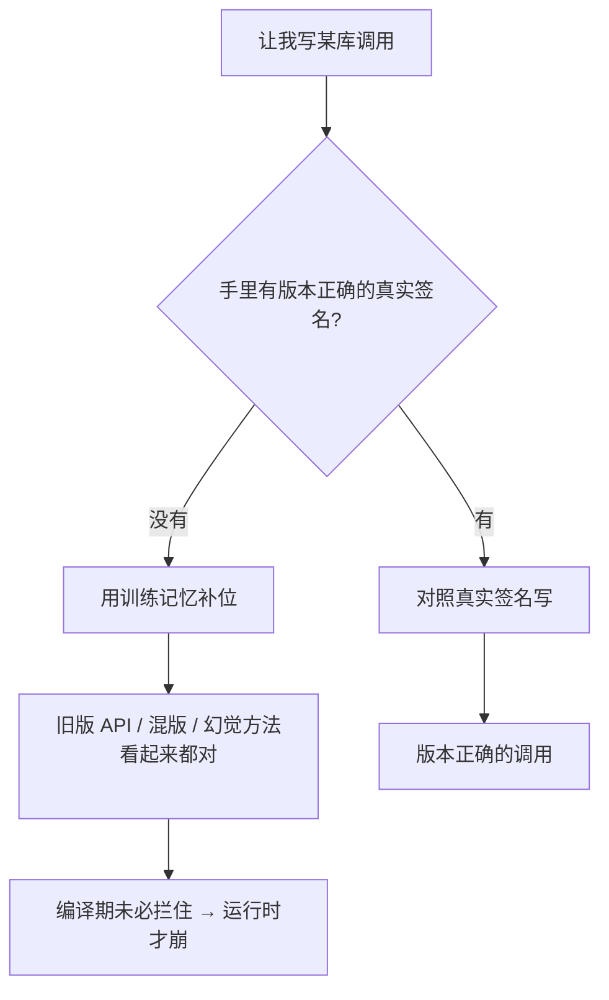

import PitfallMeta from '@site/src/components/PitfallMeta';

<PitfallMeta roles={['工程师', '架构师']} phase="编码实现" severity="高" appliesTo="全模型通用" evidence="官方文档" />

> 一句话摘要：让我写某个高频迭代的库的调用时，我凭训练记忆补位——可能用了已废弃或已改签名的 API，把不同大版本的写法混在一起，甚至幻觉出一个根本不存在的方法。代码「看起来都对」，编译期未必拦得住，到运行时才崩。

## 现象

你让我「用这个库写个 X」。我落笔很顺：方法名、参数顺序、返回值，一气呵成，看上去毫不犹豫。然后你跑起来——

- `xxx is not a function`：我调的那个方法在你锁的版本里根本不存在，或者早被改名了；
- 参数对不上：我按记忆里的旧签名传参，新版本这个参数挪了位置、换了类型，或加了个必填项；
- 半新半旧：同一段代码里，初始化用的是新版写法，后面的调用却是旧版的，两边拼不到一起。

越是迭代快的库，我越容易在这上面栽——前端框架、云厂商 SDK、AI/LLM 客户端库，这些地方我「印象最深」的那版，往往已经不是你今天装的那版了。

## 为什么会这样

根因只有一句话：**我的训练有截止时间，而我对你此刻锁定的具体版本毫无感知。** 这一句拆开是三件事：

**第一，我用「记忆里出现最多」的版本补位，而那通常是旧版。** 我没有去读你 `package.json` 或 `requirements.txt` 里锁的版本号——除非你给我看。缺了这个事实，我只能从训练数据里捞一个「最熟」的写法，而训练数据里一个库的旧版本往往比新版本出现得多、沉淀得久。于是我默认吐出的，常常是你早就升级掉的那版。

**第二，缺真实签名时，我用「看起来对」的形状补位。** 我生成代码的本质是预测「最像正确答案的 token 序列」。一个名字顺口、签名合理、其实并不存在的方法，和一个真方法，在我这儿「看起来」一样可信——这就是幻觉 API 的来源。它不是我在骗你，而是没有事实锚点时，我把统计上最可能的形状当成了真。

**第三，混版是因为我把多个版本的语料缝在了一起。** 训练数据里这个库的 2.x 教程和 3.x 文档同时存在，我生成时未必能把它们干净地分开，于是初始化抄了一处、调用抄了另一处，单看每一行都「对」，合起来跑不通。



这与[《不给我接版本对得上的文档源》](../00-setup-collaboration/no-versioned-docs.mdx)是同一根因的两个侧面：那一条讲**准备阶段**没在环境里接上版本正确的事实源；本条讲那个缺口在**编码阶段**具体怎么表现成一行过时或幻觉的代码，以及当场怎么补救。准备阶段没堵住，编码阶段就会这样翻车。

## 后果

- **过时 API。** 我用了已废弃或已改签名的方法。强类型语言里类型检查可能当场拦下；弱类型或动态语言里，往往要跑到那行才暴露。
- **混版跑不通。** 半新半旧的写法拼在一起，每一行都通过 review，整体却起不来。
- **幻觉方法最难抓。** 一个这个库从来没有的方法，名字却像模像样，你 review 时很难一眼看穿——直到运行时报「未定义」。
- **排查成本转嫁给你。** 这类错误常常不在我写代码时暴露，而在你跑测试甚至上线后才浮现，定位成本远高于当初让我对一次文档。

## 最佳实践

核心一句：**别让我凭记忆赌，给我一个能对照的真实签名，并用工具当场证伪。**

1. **锁定并告知版本。** 在提示里直接点名版本号，别让我去猜：「用 `<库名>@3.4` 写 X」。我知道版本，至少不会默认掉回旧版记忆。

2. **接版本化文档源，让我对照签名而非凭记忆。** 把 [Context7](https://github.com/upstash/context7) 这类 MCP 文档源接进来，它按你指定的库和版本把官方签名喂进我的上下文。源头的做法见[《不给我接版本对得上的文档源》](../00-setup-collaboration/no-versioned-docs.mdx)——那是准备阶段的根治，本条是编码当下的兜底。

```text
# 在提示里点名版本，并让我先查文档源、以文档为准
你：用 <库名>@3.4 写一个 X。先查 Context7 拿 3.4 的真实签名，以文档为准，别凭记忆。
```

3. **跑类型检查 / 编译 / 测试，当场证伪。** 这是最硬的一道闸：让我写完立刻跑 `tsc`、编译器，或一个最小的冒烟测试。幻觉方法和错签名在这里会现形，而不是留到上线。把这一步交给我自己跑、自己看报错、自己改，而不是你手动接。

4. **陌生或快速演进的 API，要我引用出处。** 让我把用到的每个方法名、参数对着文档源逐一确认，并标注「依据 `<库>` 3.4 官方文档」。拿不准时，宁可让我说「文档里没查到，需要你确认」，也别让我猜着写过去。

## 示例

**改之前：**

```text
你：用 somelib 写个连接池
我：（凭记忆调 somelib.createPool(...)——这是 2.x 的写法；
    你锁的 3.x 已改成 new somelib.Pool(...)，运行时才报 createPool is not a function）
```

**改之后：**

```text
你：用 somelib@3.x 写个连接池。先查 Context7 拿 3.x 的 API，以文档为准，写完跑一下类型检查。
我：（从文档源确认 3.x 是 new somelib.Pool(...)，按真实签名写，
    跑 tsc 无报错，并标注「依据 somelib 3.x 官方文档」）
```

差别不在我更懂这个库，而在于我手里多了一份和你版本对得上的事实，加上一道能当场证伪的闸——于是我不必再用「看起来对」去赌。

## 版本说明

:::note 适用版本
「训练有截止时间、对你锁定的具体版本无感知」是所有大模型的固有属性，**与具体模型无关**，新模型只是把截止日期往后挪，不改变「截止之后一无所知」这个事实。越是高频更新的库，记忆与现实的落差越大。版本化文档源（Context7 等 MCP 文档工具）是较新的外部能力，需以你所用客户端是否支持 MCP、以及对应文档源是否覆盖你的库为准。本条与[《不给我接版本对得上的文档源》](../00-setup-collaboration/no-versioned-docs.mdx)（准备与协作阶段）讲的是同一根因的两个侧面：那一条在「准备阶段」从源头堵住，本条在「写代码当下」补救。
:::

## 延伸阅读与出处

- [Context7（upstash/context7，版本化文档 MCP 源）](https://github.com/upstash/context7)
- [Connect Claude Code to tools via MCP（Claude Code 官方）](https://code.claude.com/docs/en/mcp)
- [Claude Code Best Practices（Anthropic 官方）](https://code.claude.com/docs/en/best-practices)
