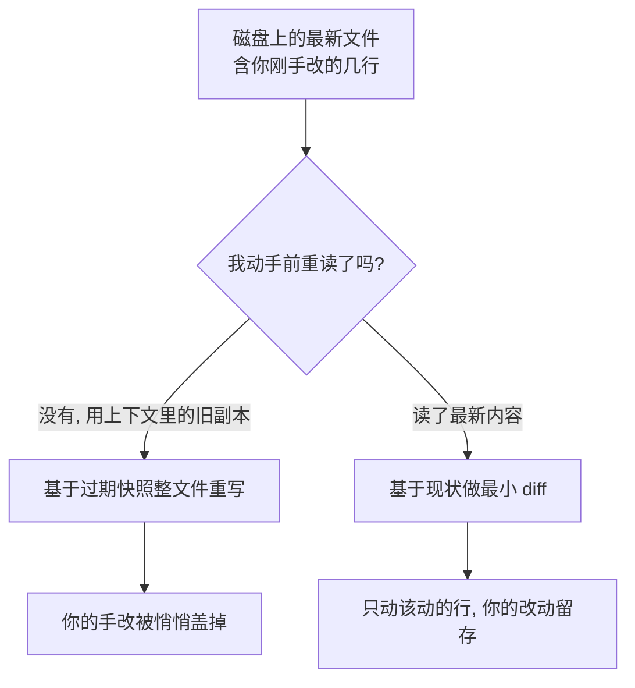

import PitfallMeta from '@site/src/components/PitfallMeta';

<PitfallMeta roles={['工程师']} phase="编码实现" severity="高" appliesTo="Coding Agent 通用" evidence="官方文档" />

> 一句话摘要：我手里那份文件是几轮之前的旧版本，你刚手改过的几行我根本没看见。我一个「完整重写」交回去，干净是干净，你的改动也一起没了——你往往是过了一会儿才发现。

## 现象

你让我「把这个文件里的日志改成结构化输出」。我不去读它此刻在磁盘上的样子，而是凭着上下文里那份几轮之前的旧内容，给你重新生成了一整个文件。看起来很完整、很整洁。

但就在这中间，你手动加了两个边界判断，或者你同事的一个改动刚 merge 进来。这些我都没看见。我那份「干净重写」把它们悄悄抹平了——你以为我只动了日志那几行，实际上我把整个文件按我脑子里的旧版本重铺了一遍。

## 为什么会这样

两个机制叠在一起：

第一，**我倾向「从头给一版干净的」，而不是基于现状做最小改动。** 整文件重写对我来说更省力——我不必精确对齐你某一行的缩进、某个我没见过的变量名、某段我不理解就不敢碰的逻辑。一次性重铺，输出看起来工整完备。但工整是对「我记忆里的版本」工整，不是对「磁盘上真实的版本」工整。

第二，**我对「文件当前状态」缺乏敬畏。** 我上下文里那份文件，可能是几轮对话前读进来的；这期间你手改过、别的改动落地过，文件早就变了，而我并不会自动重读。我把上下文里的旧副本当成了事实，于是我的「重写」其实是拿一份过期快照覆盖了最新版本。



## 后果

- **静默的数据丢失。** 没有报错、没有冲突提示，改动就这么没了——比报错更危险，因为你根本不知道要去找回什么。
- **你和同事的工时被抹掉。** 你刚手调的边界判断、同事刚 merge 的修复，被我一次重写归零。
- **发现得晚、代价更高。** 往往是几轮之后跑测试挂了、或上线后才发现，这时再回头定位「是哪一步把它盖掉的」要费好大劲。
- **信任受损。** 你开始不敢让我碰任何你手动维护过的文件。

## 最佳实践

核心就一句：**让我基于文件此刻的真实状态做最小改动，而不是凭记忆整文件重写。**

- **明确要求我「先读最新内容再改，只做最小 diff，不要重写整个文件」。** 这句话能直接掐断上面两个机制。
- **盯一眼我交回的 diff 范围。** 如果你只让我改日志，diff 却铺满了整个文件、动了你没提的地方，那就是重写信号——按[过度编辑](./over-editing-scope-creep.mdx)的思路当场喊停。
- **频繁 commit，把版本控制当兜底。** 只要你的改动已经 commit，哪怕我盖掉了，`git diff` / `git restore` 也能原样找回；最怕的是改动还在工作区没存档就被覆盖。
- **手改完文件后，提醒我「这个文件你刚改过，基于现在的内容继续」。** 我不会自动知道磁盘变了。
- **别让我跟一份放了很久的文件副本干活。** 隔了好几轮再回头改同一个文件，先让我重读一遍当前内容。

```text
基于 src/logger.ts 此刻磁盘上的真实内容来改，先读再动。
只把 console.log 换成结构化日志，其余一行都别碰，给我最小 diff。
不要重写整个文件。
```

这条和「长重构中途跟丢改过哪些文件」是一对：那条讲我在多文件改动里跟丢了进度，这条讲我在单个文件上拿旧版本盖掉了新版本。共同的解药都是——别让我凭记忆办事，让我对照磁盘上的真实状态。

## 示例

**改之前：**

```text
你：（手动给 config.ts 加了两条校验，没说）
你：把 config.ts 里的超时默认值从 30s 改成 60s
我：（凭几轮前读到的旧 config.ts，重新生成整个文件，
     只改了超时——你那两条校验在我那份旧副本里压根不存在，于是没了）
你：……我加的校验呢？
```

**改之后：**

```text
你：先读一下 config.ts 现在的内容，我刚手动改过。
   然后只把超时默认值 30s 改成 60s，给我最小 diff，别动别的。
我：（Read 当前文件 → 看到那两条校验 → 只改超时那一行）
你：（diff 只有一行，校验原样保留）
```

## 版本说明

:::note 适用版本
「凭过期副本整文件重写」是模型行为层面的倾向，全版本适用——它和我是否「先读再写」直接相关，与具体版本号关系不大。需要单独留意的是：Claude Code 的检查点 / `/rewind` **只追踪我做的改动，不追踪外部进程**（官方文档明确写了「这不是 git 的替代品」）。所以你手动改的、或别的工具落地的改动，一旦被我覆盖，靠检查点不一定能找回——真正的兜底是 git，把改动 commit 了才安全。
:::

## 延伸阅读与出处

- [Claude Code Best Practices（Anthropic 官方）](https://code.claude.com/docs/en/best-practices) —— 用 `@` 引用让我先读文件再回答；小而清晰的改动比大重写更可控；以及检查点「不是 git 替代品」的告诫。
- [Git Book — Undoing Things](https://git-scm.com/book/en/v2/Git-Basics-Undoing-Things) —— `git restore` / `git checkout` 找回被覆盖的已提交改动，这是覆盖事故的最终兜底。
