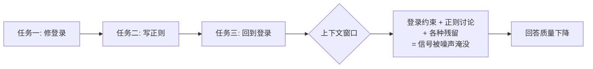

import PitfallMeta from '@site/src/components/PitfallMeta';

<PitfallMeta roles={['工程师']} phase="编码实现" severity="中" appliesTo="Claude Code 全版本" />

> 一句话摘要：你在一段对话里先修了个 bug，又顺手问了个不相关的问题，再回头继续原来的任务。我的上下文被无关内容填满，回答开始变差——而你以为是我「变笨了」。

## 现象

我常看到这样的会话：你让我修复登录接口的一个报错，修完了；接着你想起来，顺口问我「对了，帮我看看这个正则怎么写」；又过一会儿，你回来说「刚才那个登录的事，再帮我加个日志」。

一段对话里塞了三件互不相关的事。到第三件时，你会感觉我的反应明显迟钝了：开始忽略你早先定下的约定，或者把前面那个正则的上下文错误地带进了登录代码里。

## 为什么会这样

我没有「忘掉上一件事」的开关。在同一段会话里，**之前所有的内容都还留在我的上下文窗口里**——包括那个和当前任务毫无关系的正则讨论。

我每生成一个回答，都是在「当前窗口里的全部内容」上做注意力分配。无关内容越多，真正重要的指令（比如你最初定下的代码风格、那个登录接口的关键约束）占的比重就越小，越容易被稀释、被忽略。这不是我「累了」，而是信噪比下降了。



## 后果

- 我开始忽略你早先给的指令，因为它们被埋在了大量无关内容之下。
- 我可能把上一个任务的细节错误地迁移到当前任务。
- 你为了纠正这些偏差又补充更多对话，反而让窗口更拥挤——进入恶性循环。

## 最佳实践

**任务切换时，开一段干净的对话。** 在 Claude Code 里就是一条命令：

```text
/clear
```

它会清空当前上下文，让我从零开始面对新任务。一个简单的判断标准：**如果新问题不需要旧对话里的任何信息，就该 `/clear`。**

如果你确实要在相关任务间切换、又想保留要点，可以在 `/clear` 之前让我把关键结论总结成几句话，下一段对话开头再贴回来——用一小段精炼的摘要，换掉一大段嘈杂的历史。

## 示例

**改之前（一段对话）：**

```text
你：修一下 login() 的空指针报错
我：（修复）
你：顺便，帮我写个匹配邮箱的正则
我：（给出正则）
你：好，回到 login，再帮我加上失败日志
我：（开始在 login 里东拼西凑，偶尔把邮箱正则的讨论带进来）
```

**改之后：**

```text
你：修一下 login() 的空指针报错
我：（修复）
你：/clear
你：帮我写个匹配邮箱的正则
我：（给出正则，干净利落）
你：/clear
你：给 login() 的失败分支加上结构化日志
我：（专注、准确）
```

## 版本说明

:::note 适用版本
这是上下文窗口机制带来的固有现象，与具体版本无关，**Claude Code 全版本适用**。不同模型的窗口大小不同，会改变「多久开始变差」的临界点，但不会改变「无关内容稀释信号」这一根本规律。
:::

## 延伸阅读与出处

- [Claude Code Best Practices（Anthropic 官方）](https://code.claude.com/docs/en/best-practices)
- [MuhammadUsmanGM/claude-code-best-practices](https://github.com/MuhammadUsmanGM/claude-code-best-practices)
