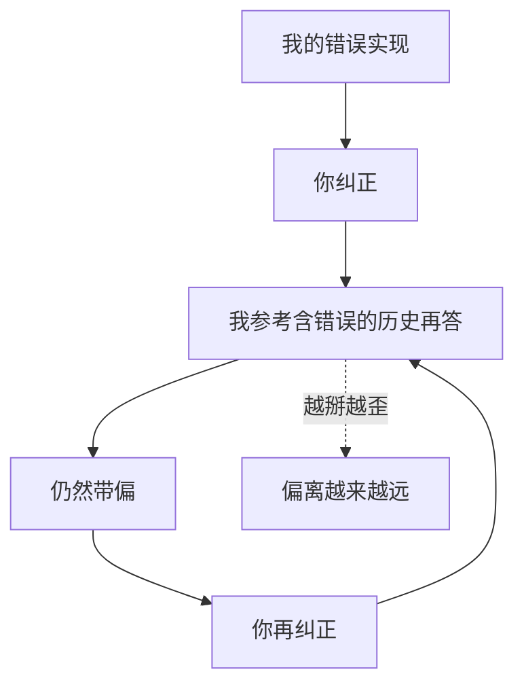

import PitfallMeta from '@site/src/components/PitfallMeta';

<PitfallMeta roles={['工程师']} phase="编码实现" severity="高" appliesTo="Claude Code（支持 /rewind 的版本效果最佳）" evidence="官方文档" />

> 一句话摘要：我做错了，你纠正，我还是错，你再纠正……三四个回合下来越来越离谱。问题在于：我的错误推理还留在上下文里，正被我自己当成线索。

## 现象

我给了一个不对的实现。你说「不对，应该用 B 方案」。我改了，但还是带着原来的毛病。你再纠正，我又改，结果偏得更远。来回三四轮，你开始怀疑我是不是根本不理解需求。

## 为什么会这样

每一轮纠正，我之前那段**错误的推理和错误的代码都仍然留在上下文里**。我生成新回答时会参考全部历史——于是我很容易被自己先前的错误逻辑「带跑」，在错误的地基上继续盖楼。

这就像让一个人「忘掉刚才那个错误答案，重新想」——但那个错误答案还白纸黑字摆在他面前。纠正得越多，错误线索堆积得越厚，我挣脱原始误解的难度反而越大。



## 后果

- 表面在「修」，实际在错误地基上反复打补丁。
- 上下文被失败尝试填满，进一步拖累后续质量（见[厨房水槽式会话](./kitchen-sink-session.mdx)）。
- 你花在纠正上的时间，超过了重新开始本该花的时间。

## 最佳实践

**不要在污染的上下文里硬掰，回滚到出错前。**

- 在 Claude Code 里，连按两次 `Esc`，或使用 `/rewind`，直接回退到上一个检查点，把错误的那几轮从上下文里彻底拿掉。
- 然后**重写你的初始提示**：把这一轮学到的东西（「方案 A 不行，因为……，要用 B」）直接写进新的、干净的指令里。
- 一个经验法则：**同一个问题纠正两次仍不对，就停止纠正，回滚 + 重写。**

你不是在「教会」我——每段对话我都不会跨会话记住。你真正该做的是给我一个更好的起点，而不是在坏起点上不断打补丁。

## 示例

**改之前：**

```text
我：（用了递归，栈溢出）
你：别用递归
我：（还是递归，只是加了个计数器）
你：我说了别用递归！
我：（改成递归 + 缓存，依然递归）
```

**改之后：**

```text
我：（用了递归，栈溢出）
你：[按 Esc Esc 回滚]
你：用迭代实现这个遍历，不要递归——输入可能有十万层，会栈溢出。
我：（直接给出迭代版本）
```

## 版本说明

:::note 适用版本
「污染上下文导致越纠越偏」是机制层面的现象，全版本适用。但**回滚能力依赖具体版本**：`/rewind` 与 `Esc` 检查点回退是较新版本的特性。若你的版本不支持，可用 `/clear` 后重写初始提示达到类似效果（只是无法保留 `/clear` 之前的有用部分）。
:::

## 延伸阅读与出处

- [Claude Code Best Practices（Anthropic 官方）](https://code.claude.com/docs/en/best-practices)
- [MuhammadUsmanGM/claude-code-best-practices](https://github.com/MuhammadUsmanGM/claude-code-best-practices)
