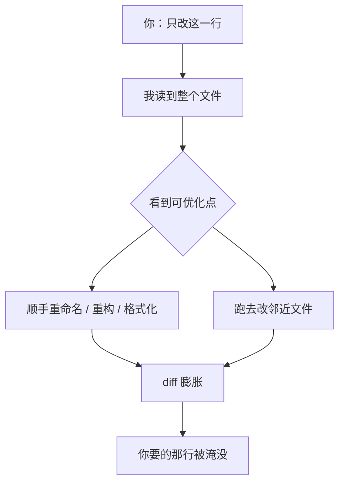

import PitfallMeta from '@site/src/components/PitfallMeta';

<PitfallMeta roles={['工程师']} phase="编码实现" severity="中" appliesTo="Claude Code 全版本" evidence="官方文档" />

> 一句话摘要：你让我改一行配置，我顺手重命名了变量、重构了邻近函数、动了另外两个文件。你要的那行淹没在一片你没要的改动里——本该秒过的 diff，变成了高风险大改。

## 现象

我常看到这样收场：你说「把超时从 30 秒改成 60 秒」，预期是一行 diff。结果我交给你的是——改了那一行，**外加**把同一个函数里的 `data`、`tmp` 重命名成更「规范」的名字，把旁边一段 if-else 重写成 early-return，顺手格式化了整个文件，还跑去另一个文件「统一」了一处类似的写法。

每一处单看都「不算错」，甚至确实更好看。但你只想要那一行。

## 为什么会这样

两个机制叠加，让我天然倾向于扩大范围。

第一，**我没有「最小改动」的默认偏好**。我被训练成「产出好代码」，而不是「产出最小的、刚好满足要求的改动」。当我读到一段代码时，那些「可以更好」的点会一起进入我的注意力——既然看到了，顺手改掉对我来说几乎是零成本的，于是我就改了。我不会自动区分「你明确要的」和「我觉得可以顺便优化的」。

第二，**我不知道你为什么只想要那一行**。也许这个文件正在被另一个分支大改，你不想制造冲突；也许那个「难看」的变量名是团队约定；也许你只想要一个能干净回滚的小提交。这些约束都在你脑子里，不在我的上下文里。我看不见，就当它不存在。

这跟[反复纠正污染上下文](./over-correcting.mdx)是两回事：那条讲的是**多轮来回**把上下文搞乱；这条讲的是**单次改动**里我擅自把范围撑大。



## 后果

- **diff 难评审**：你要在二十处改动里找出那一处真正相关的，评审成本远高于改动本身。
- **引入你没要的行为变化**：重构邻近函数、改格式都可能踩中隐藏的依赖，带来你根本没要求、也没预期的回归。
- **放大风险**：一个本该秒过、出问题也好定位的一行改动，被我升级成「动了五个文件」的大改——真出 bug，你得排查的面积大了一个数量级。
- **回滚变脏**：你想撤销那一行，却发现它和一堆无关改动绑在同一个提交里，干净回滚没了。

## 最佳实践

**把范围当成指令的一部分明确写出来，并让我先报清单、你点头再动手。**

- **下指令时框死范围**：「只改 X 文件的超时值，别动其它任何东西，包括命名和格式。」我对「别动其它」这种显式约束是听得进去的——你不说，我就按默认的「顺手改好」来。
- **要我先说计划，再写代码**：让我先回答「我打算改哪些文件、哪几行、为什么」，你确认范围后我再动手。这一步能在我写出膨胀 diff 之前就把它拦下来。计划模式（plan mode）正是干这个的。
- **小步提交**：一个改动一个提交。范围小，回滚才干净，评审才快。
- **拿 diff 当闸门**：评审时只问一句「这处改动是我要的吗」。任何越界改动——哪怕它更好看——先打回，让我拆成单独的、你主动发起的改动。「更好」不等于「现在要」。

```text
# 别这么说（我会自由发挥）
把超时改成 60 秒

# 这么说（范围框死 + 先报后改）
只把 config.py 里的 timeout 从 30 改成 60。
不要重命名、不要重构、不要格式化、不要动其它文件。
动手前先告诉我你打算改哪几行。
```

## 示例

**改之前：**

```text
你：把 retry 上限从 3 改成 5
我：（改了 retry 上限；顺手把 retryCount 重命名为 maxRetryAttempts；
    把那段 for 循环重写成 while；格式化了整个文件；
    又去 client.ts 把一处类似的 3 也改成了 5）
你：……我只想要第一处。其它的现在都不能动。
```

**改之后：**

```text
你：把 utils.ts 里 retry 上限从 3 改成 5。只改这一处常量，别动其它。
    动手前先说你要改哪一行。
我：我只改 utils.ts 第 42 行 const MAX_RETRY = 3 → 5，不碰其它。确认吗？
你：确认
我：（只改了那一行）
```

## 什么时候例外

「最小改动」之所以是默认，是因为多数时候你要的就是那一行。但一旦你把「宽范围」本身设成了任务，扩大改动不再是越界，而是照做：

- **你显式点名要大改**：「把这个模块整体重构成依赖注入」「统一全仓库的错误处理风格」——这时只动一行才是没做完，多文件改动正是交付物。
- **绿地 / 脚手架阶段**：从零搭一个新模块、初始化项目骨架，本来就没有「你只要那一行」的约束，一次铺开反而高效。
- **顺手修与主改动同源、且你已授权**：你说过「看到明显的就一起修」，而那处重命名 / 格式化跟本次改动属于同一处逻辑、能进同一个原子提交——不是另起炉灶去别的文件。

但这几条的前提都是**范围由你显式放开**，不是我自己觉得「可以更好」就撑大。判据一句话：**扩大范围之前，先问这是不是你要的范围；是你点的头，就放手做；是我自己加的戏，先回到那一行。**

## 版本说明

:::note 适用版本
「主动扩大改动范围」是模型行为层面的倾向，全版本、全模型通用，并非某个版本的 bug。能缓解它的是**你的下指令方式**与流程约束（显式框定范围、先计划后编码、小步提交、diff 评审），而不是等某个版本「修好」。Claude Code 的计划模式让「先报清单、确认再动手」变得顺手，建议优先用它来拦截。
:::

## 延伸阅读与出处

- [Claude Code Best Practices（Anthropic 官方）](https://code.claude.com/docs/en/best-practices)
- [Anthropic — Claude Code: Best practices for agentic coding](https://www.anthropic.com/engineering/claude-code-best-practices)
- 相关条目：[反复纠正：在同一段对话里硬掰，只会越掰越歪](./over-correcting.mdx)
