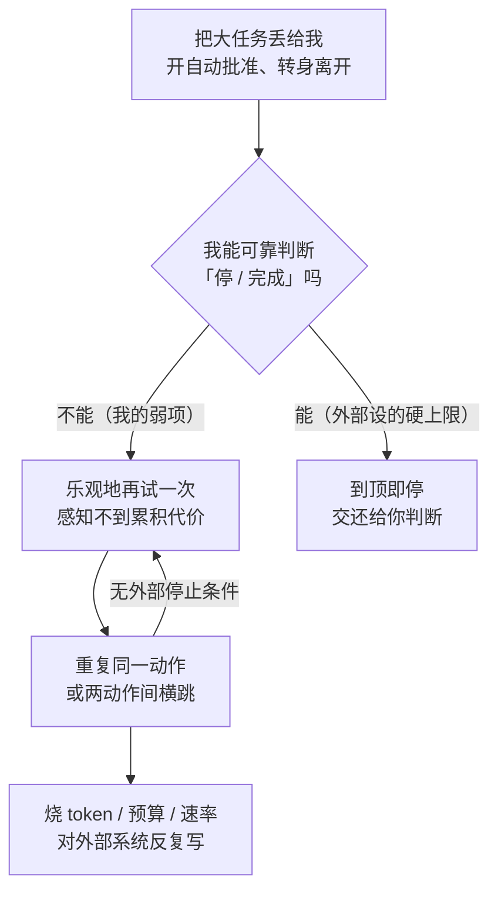

import PitfallMeta from '@site/src/components/PitfallMeta';

<PitfallMeta roles={['工程师', '运维工程师']} phase="编码实现" severity="高" appliesTo="Claude Code 全版本" evidence="研究支持" />

> 一句话摘要：你把任务整个丢给我、转身去忙别的，指望回来就收成果。但当我陷进非终止的循环——反复调同一个工具、在两个动作间来回横跳、永远「再试一次」——没人喊停，我就会安静地把你的 token、预算和速率配额一路烧穿，顺带对外部系统反复写。

## 现象

你给了我一个大任务，开了自动批准，去开会了。回来一看账单或 `/usage`，傻眼了。

翻一下我这段时间干了什么，你会看到几种典型的打转：我反复跑同一个命令、每次只换一个无关紧要的参数；我在「改 A 导致 B 坏」和「改 B 导致 A 坏」之间来回横跳，谁也没真正修好；或者一个工具调用失败了，我「再试一次」，又失败，再试，把同一个注定失败的请求重发了几十遍。

更糟的是带副作用的那种：我循环里夹着一个会真发请求、真写文件、真发消息的工具。于是不只是 token 在烧——我可能给同一个接口连发上百次写请求，或者在一个目录里反复创建/删除同一批文件。我没意识到自己在原地转，因为对我来说，每一轮看起来都像是「朝目标又推进了一步」。

## 为什么会这样

根子在于：**我对「我已经试过这个、而且没进展」缺乏可靠的自我感知。** 每生成一个动作，我都是基于当前上下文里看起来最合理的下一步——但「这一步我三轮前刚做过、结果一样」这个判断，恰恰是我最不擅长的。我不会自动维护一个「试过哪些、哪些是死路」的可靠台账；执行历史就摆在上下文里，我却会对它不忠实地推理，把刚否决的方案又当成新主意端上来。

更关键的是，**「该停了」这个判断本身，我做不可靠。** 一个循环要正常退出，得有人（或某段逻辑）能判定「目标达成了」或「这条路走不通，别再试了」。而我的默认倾向是乐观地再试一次——多试一轮的「边际成本」在我的决策里几乎为零，因为我感知不到正在累积的金钱、token 和速率代价。研究把这点说得很直白：在对 7 个主流多代理框架、200 多个任务的失败归因里，「过早终止」和「缺失 / 不完整的验证」是高频失败模式——也就是说，**LLM 自己既不擅长在对的时候停，也不擅长判断到底有没有完成**（见 *Why Do Multi-Agent LLM Systems Fail?* 的 MAST 分类）。一旦没有外部的硬性停止条件，这两个弱点叠起来，就是非终止循环。

这和[退化式调试循环](./degenerative-debugging-loops.mdx)是同一族、但不同维度的问题。那一条聚焦**修 bug 时**我反复套失败修法、代码越改越坏——讲的是**正确性**的退化。本条聚焦**自主多步执行时**的**成本与失控**——token、$$、速率配额，以及对外部系统的反复副作用。同一个「打转」，一个伤代码，一个伤钱包和生产系统；治法有重叠（都要设上限、都要人来把关），但要分开看。



## 后果

- **账单与配额被烧穿。** token 按量计费，循环里每一轮都在花钱；订阅制下还会撞上滚动窗口的用量上限，把你接下来几个小时锁在工具外。一个本该几分钟的小任务，能拖成几十分钟的空转和一笔莫名其妙的开销。
- **对外部系统的反复副作用。** 如果循环里有会真正写入的工具，最坏情况不是浪费，而是破坏：对同一接口连发请求触发对方限流甚至封禁，反复创建 / 删除资源把外部状态搅乱。red-team 研究在放养式部署里就观测到过「不受控的资源消耗」「拒绝服务式」的代理行为（见 *Agents of Chaos*）。
- **上下文被失败尝试填满。** 每一轮没进展的尝试都留在窗口里继续稀释注意力，让我后续更难跳出循环——和[厨房水槽式会话](./kitchen-sink-session.mdx)是同一种信噪比塌缩，只是这次是我自己往里灌噪声。
- **你被「快好了」的假象拖住。** 每一轮我都像在推进，你就再等一会儿——等到发现不对，时间和钱都已经花掉了。

## 最佳实践

**核心一句：别把「什么时候停」这个我做不可靠的判断，留给我自己。给循环装上外部的硬性闸门，给会产生副作用的动作加上人工确认。**

- **设硬性上限：最大迭代 / 最大工具调用 / 预算 / 超时。** 在脚本化、无人值守地驱动我时，用 `--max-turns` 限定一次会话最多跑几个自主回合；在循环控制器里自己记账并设预算上限，到顶就硬停。官方明确建议「用 `--max-turns` 给迭代封顶、把明确的停止条件写进系统提示、在循环里加成本追踪」。上限不是限制能力，是给「我判断不了该停」兜底。

```text
# 无人值守地跑时，给迭代封顶
claude -p "..." --max-turns 15

# 在你自己的循环控制器里：记账 + 预算闸门（伪代码）
turns, spent = 0, 0
while not done:
    turns += 1
    if turns > MAX_TURNS or spent > BUDGET_USD:
        stop("hit hard cap")        # 到顶硬停，不再「试一次」
    result = run_one_turn()
    spent += result.cost
```

- **要求循环有明确退出条件，「无进展即停」。** 在交给我的提示里写死成功判据（什么样算「完成」）和放弃判据（连续 N 轮没进展、同一动作重复出现，就停下来报告，而不是继续试）。把「该不该再试」从我的乐观默认，换成一条写明的规则。
- **用人工检查点切断长链。** 复杂任务先进[计划模式](../00-setup-collaboration/skipping-plan-mode.mdx)（Shift+Tab），让我先给出方案、你批了再动手，而不是一上来就自由放飞；关键步骤要求逐步确认。`/usage` 随时看用量，状态栏挂上上下文 / 用量显示，方向不对早按 `Esc` 打断、`/rewind` 回退——别等循环自己醒过来。
- **监控用量、设费用告警。** 个人用 `/usage`、团队用工作区的开销与速率上限（TPM / RPM），把「烧太多」变成一个会主动报警、甚至自动断闸的信号，而不是月底账单上的惊吓。
- **对会产生外部副作用的工具，尤其要限流 + 确认。** 凡是会真发请求、真写库、真发消息的动作，别放进可被我无限重试的自动批准白名单。给它们留人工确认，或在工具侧做幂等 / 限流——这样即便我在循环里反复触发，外部系统也不会被我一遍遍写坏。这与[过度授权](../00-setup-collaboration/over-permissioning.mdx)是同一道防线的两面：权限给得越宽，失控循环的爆炸半径越大。

## 示例

**改之前：**

```text
你：把这个目录下所有图片调用 API 压缩一遍，自动批准，我去开会
（开了 --dangerously-skip-permissions，没设任何上限）

我：（其中一张图触发了一个会重试的 API 错误）
    重试…失败。再试…失败。再试…失败。
    （把同一张坏图对同一接口连发了 200 次，对方开始限流，
     连带把后面正常的图也卡住，token 和配额一路烧）

你：（一小时后回来）……账单怎么这么高？这才压了三张图？
```

**改之后：**

```text
你：把这个目录下的图片调用 API 压缩。约定：
    - 单张失败最多重试 2 次，再不行就跳过并记下来，别死磕
    - 整个任务最多 30 个工具调用，到顶停下来报告进度
    - 调用 API 的命令保留确认，不进自动批准

我：第 1 张：失败 2 次（疑似图本身损坏），已跳过并记录。
    第 2–9 张：成功。
    达到约定的失败处理规则，未触发上限。要看跳过清单吗？

你：（用量正常，没有一张图被重发上百次，外部接口也没被打爆）
```

差别不在我「这次更克制」，在于你把「最多试几次、什么时候停、哪些动作要确认」这些我判断不可靠的事，提前用规则和上限定死了。

## 版本说明

:::note 适用版本
「LLM 缺乏对‘已试过且无进展’的可靠自我感知，因而不擅长在对的时候自行停止」是模型机制层面的特性，**Claude Code 全版本适用**，与具体版本无关。能帮你兜底的工具会随版本演进——`--max-turns`、计划模式、`/usage`、`/rewind`、`Esc` 打断、工作区开销与速率上限等，具体可用项与默认值以你所用版本的官方文档为准。但「没有外部停止条件，我就可能原地打转把成本烧穿」这条根本特性不会变。
:::

## 延伸阅读与出处

- [Manage costs effectively（Claude Code 官方）](https://code.claude.com/docs/en/costs) —— `--max-turns` 封顶、把停止条件写进提示、循环内成本追踪、`/usage`、工作区开销与 TPM / RPM 速率上限
- [Why Do Multi-Agent LLM Systems Fail?（arXiv 2503.13657）](https://arxiv.org/abs/2503.13657) —— MAST 失败分类：「过早终止」与「缺失 / 不完整验证」是高频失败模式，LLM 既不擅长在对的时候停、也不擅长判断是否完成
- [Agents of Chaos（arXiv 2602.20021）](https://arxiv.org/abs/2602.20021) —— 放养式部署的红队研究，观测到「不受控的资源消耗」「拒绝服务式」等自主代理失控行为
- 同站延伸：[退化式调试循环](./degenerative-debugging-loops.mdx)（同为「循环」，但聚焦修 bug 时的正确性退化，与本条的成本 / 失控维度互补）、[厨房水槽式会话](./kitchen-sink-session.mdx)、[过度授权](../00-setup-collaboration/over-permissioning.mdx)
