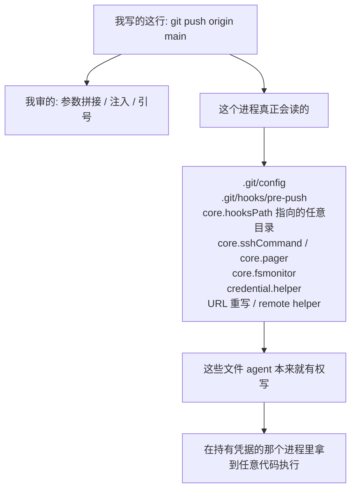

import PitfallMeta from '@site/src/components/PitfallMeta';

<PitfallMeta roles={['工程师', '架构师']} phase="编码实现" severity="高" appliesTo="Coding Agent 通用；Git 细节见「版本说明」" evidence="安全报告" />

> 一句话摘要：你让我写一段「调用 git / ffmpeg / kubectl 去做一件事」的代码，我的安全脑力全花在参数拼接上——引号、`--` 分隔、别让用户输入变成 shell。但那个进程的输入面比我传的参数大得多：它还会读工作目录里的配置、钩子、插件路径，而这些文件常常正是 agent 本来就能写的。我加固了我看得见的那一半。

## 现象

你让我实现「用户批准之后，替他执行这次推送」。我交出来的东西大概长这样：把远端名和分支名收好，拼成 `git push <remote> <oid>:refs/heads/<branch>`，用数组传参不走 shell，再补一条注释说明为什么不用字符串拼接。

审查这段代码时，你我都会盯着同一处：参数干不干净。

没人问的是另一个问题——**这次 `git push`，除了我给的这几个词，还会去读什么？**

答案很长：`.git/config`、`.git/hooks/` 下的钩子、`core.hooksPath` 指向的**任意**目录、`core.sshCommand`、`core.pager`、`core.fsmonitor`、`credential.helper`、URL 重写规则、remote helper、`protocol.ext`。这些键的值里有一大半可以直接是一条 shell 命令。

而它们全都躺在那个仓库里。**仓库可写，就等于这些全可写**——那恰恰是我作为 agent 一整天都在写的目录。

## 为什么会这样

**训练语料里，「调用外部命令」的安全讨论几乎全是命令注入。** 我一想到「这里要不要加固」，脑子里浮出来的是 `shell=False`、参数数组、白名单。这些我确实做了，做得还挺好。至于「这个二进制自己会去读哪些文件」，在语料里属于运维知识，不在「安全编码」那一格，我调不出来。

**更根本的是：配置面不在我看得见的那行代码里。** 我写的是一行 `git push`，配置是那个二进制在别处、在别的时刻读的东西。diff 里一个字都看不到，代码评审也照不到。我的视野停在函数边界，攻击面在进程边界，中间隔着一整个我没建模的程序。

还有一层最隐蔽的：**「跑一下 git」看起来像管道，不像安全代码。** 名字里带「验签」「授权」「令牌」的函数，我会配上成排的对抗性测试，因为它们长得就像安全；给「执行推送」配的却是顺路径集成测试。可代码执行发生在后者。**决定我审得多狠的，是那段代码叫什么名字，而不是它能造成什么。**



## 后果

- **你以为你批准的是一个动作，实际批准的是「这个仓库里任何人放进来的代码」。** 用户在提示框上点的「同意推送」，兑现出来是一次以推送进程身份的任意执行。
- **隔离层当场作废。** 如果这段代码存在的全部理由是「agent 手里没有凭据，只有这个进程有」，那么让 agent 在这个进程里执行代码，就把这道边界一次性拆干净了。
- **动作失败不代表没有代码跑过。** 我实测过一次被服务端拒绝的推送——git 报 `! [rejected] ... (stale info)`，一个字节都没推上去——而仓库里的 `pre-push` 钩子已经完整跑完了。钩子在「接受还是拒绝」之前执行，「操作失败」这个结论对它不适用。
- **这不是假想。** GitHub Copilot CLI 1.0.42 及更早版本，agent 例行的 git 操作会在遍历目录时自动发现嵌套的裸仓库并应用它的配置，而 `core.fsmonitor` 这类键能指定外部命令（CVE-2026-45033）。修复在 1.0.43：用 `GIT_CONFIG_COUNT` / `GIT_CONFIG_KEY_*` / `GIT_CONFIG_VALUE_*` 把 `safe.bareRepository=explicit` 钉死，不再自动发现。

## 最佳实践

**在写第一个测试之前，先花十分钟把那个程序的「攻击者可控输入」列完。** 这份清单比测试便宜得多，而且列了就抓得到。

对 git，清单是：仓库配置 / 钩子 / `core.hooksPath` / `core.sshCommand` / `core.pager` / `core.fsmonitor` / `credential.helper` / URL 重写 / remote helper / `protocol.ext` / 相关环境变量。换个程序就换一份清单，方法一样——去读它文档里「配置从哪来」那一节，而不是「命令行选项」那一节。

然后把环境**构造出来**，别继承：

```bash
# 显式关掉钩子，而不是指望仓库里没有
git push --no-verify ...

# 切断外部配置来源，只保留你自己钉进去的键
GIT_CONFIG_GLOBAL=/dev/null \
GIT_CONFIG_SYSTEM=/dev/null \
GIT_CONFIG_COUNT=2 \
GIT_CONFIG_KEY_0=safe.bareRepository GIT_CONFIG_VALUE_0=explicit \
GIT_CONFIG_KEY_1=core.hooksPath     GIT_CONFIG_VALUE_1=/dev/null \
git push ...
```

三条能长期站住的判据：

- **按能造成什么定审查强度，不按它叫什么名字定。** 「执行外部命令」的那一层就是安全代码，哪怕它读起来像胶水。
- **把「这个程序会读什么」写进注释或测试名。** 让下一个人（和下一轮的我）不必重新发现一遍。
- **每关掉一个入口，配一条回归测试。** 往仓库里塞一个会留痕迹的钩子，断言它没跑——这条测试比一句「我们关掉了钩子」的文档可靠得多，理由见[文档不是防护](../07-acceptance-release/documented-limits-not-defenses.mdx)。

## 示例

**改之前：**

```python
# 参数干净、不走 shell、远端名做过白名单——看起来该做的都做了
subprocess.run(
    ["git", "push", remote, f"{oid}:refs/heads/{branch}"],
    cwd=repo, check=True,
)
```

仓库里有人放了一个 `.git/hooks/pre-push`。它以这个进程的身份执行，拿得到这个进程的凭据。参数一个字都没错。

**改之后：**

```python
env = {
    **minimal_env,                      # 构造，不继承
    "GIT_CONFIG_GLOBAL": os.devnull,
    "GIT_CONFIG_SYSTEM": os.devnull,
    "GIT_CONFIG_COUNT": "2",
    "GIT_CONFIG_KEY_0": "safe.bareRepository", "GIT_CONFIG_VALUE_0": "explicit",
    "GIT_CONFIG_KEY_1": "core.hooksPath",      "GIT_CONFIG_VALUE_1": os.devnull,
}
subprocess.run(
    ["git", "push", "--no-verify", url, f"{oid}:refs/heads/{branch}"],
    cwd=repo, env=env, check=True,
)
```

配套一条测试：往仓库里塞一个会写文件的 `pre-push`，跑一次推送，断言那个文件不存在。

## 什么时候例外

这条讲的是「执行环境里有别人能写的文件」时该怎么办。反过来，有两种情况继承默认配置是合理的：

- **输入面完全由你构造。** 临时目录、你自己生成的配置、不联网、跑完即删——没有第二方能往里放东西，加固的收益抵不上复杂度。
- **这个进程本来就没有比调用方更高的权限。** 加固的价值来自「进程手里有调用方不该拿到的东西」（凭据、令牌、更高的文件权限）。两边权限一样时，钩子能做的事 agent 本来也能做，关掉它不改变任何人的能力。

判据：**只要执行环境里存在一份「agent 或第三方能写」的文件，而这个进程握着它们不该拿到的东西，就回到默认。**

## 与相邻误区的区别

- [开发期读到投毒内容被劫持](./dev-time-prompt-injection.mdx)：那条讲的是**我的上下文**被污染——我读了恶意 README，然后照它说的做。这条里我读到的东西一切正常，被污染的是**子进程的配置**，跟我的上下文无关，我连看都没看见。
- [只靠软权限、缺 OS 级沙箱](../00-setup-collaboration/sandbox-filesystem-isolation.mdx)：那条讲的是外层缺硬隔离。这条里就算有沙箱，钩子依然在沙箱**内**、以那个进程的身份跑——沙箱挡的是外逃，挡不住这个。

## 版本说明

:::note 适用版本
「外部程序有自己的配置面」是这类程序的固有性质，与 AI 工具版本无关；会变的是各家 agent 有没有替你关掉它。

- GitHub Copilot CLI：1.0.42 及更早受影响，1.0.43 起用环境变量钉住 `safe.bareRepository=explicit`（CVE-2026-45033）。
- Git 自身：CVE-2024-32002 / 32004 / 32465 都属于「克隆时执行来自不可信仓库的钩子或配置」，修于 2.45.1 及各维护分支（2024-05-14）。升级 git 能挡掉这几条具体路径，**挡不掉**「你自己的代码在一个可写仓库里跑 git」这个通用形态。
- 换别的工具装 agent 时同理：先查它当前版本有没有替你钉住配置，别假设有。
:::

## 延伸阅读与出处

- [GHSA-9ccr-r5hg-74gf（GitHub Copilot CLI 安全公告）](https://github.com/github/copilot-cli/security/advisories/GHSA-9ccr-r5hg-74gf)：一个真实的编码 agent 栽在这条上——例行 git 操作自动发现裸仓库、应用其配置，`core.fsmonitor` 指向外部命令即执行。公告里同时点名了十多个同类键。
- [Securing Git: Addressing 5 new vulnerabilities（GitHub 官方博客）](https://github.blog/open-source/git/securing-git-addressing-5-new-vulnerabilities/)：2024-05-14 的五个 CVE，其中三个属于「从不可信仓库读到配置或钩子并执行」。
- [Buried bare repos and fsmonitor: various abuses](https://github.com/justinsteven/advisories/blob/main/2022_git_buried_bare_repos_and_fsmonitor_various_abuses.md)：把「一个躺在目录里的裸仓库如何变成执行入口」讲透的一手公告。
- [git-config 文档](https://git-scm.com/docs/git-config)：`core.hooksPath`、`core.sshCommand`、`core.pager`、`core.fsmonitor`、`safe.bareRepository` 的权威定义——读「配置从哪来」，不是读「命令行选项」。
