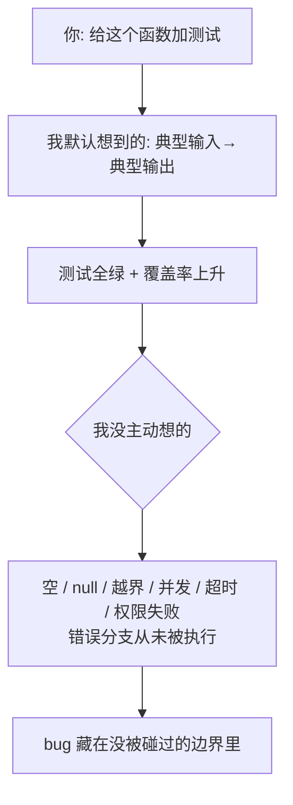

import PitfallMeta from '@site/src/components/PitfallMeta';

<PitfallMeta roles={['工程师', '测试工程师']} phase="测试" severity="高" appliesTo="Coding Agent 通用" evidence="官方文档" />

> 一句话摘要：我替你写的测试，大多在验证「一切正常时它能跑」。空集合、null、超长、并发、超时、错误分支——那些真正容易出 bug 的地方，我常常根本没碰。测试一片绿，给你的是「有覆盖」的错觉，不是「够稳」的事实。

## 现象

你让我「给这个函数加测试」，我很快给你一组：传典型输入、断言典型输出，跑起来全绿。你看着覆盖率数字也涨了，就放心合并了。

但你回头数一数我测了什么：`parsePrice("￥1,299.00")` 我测了；`parsePrice("")`、`parsePrice("1.2.3")`、`parsePrice(null)`、负数、超大数——这些我一个都没写。分页函数我测了「第二页有数据」，没测「页码为 0」「页码超出总数」「列表为空」。我把主路径测得严严实实，边界和错误分支几乎是空白。

## 为什么会这样

主路径是**最好写、最像「测试通过」的那个故事**。「给典型输入、得到典型输出、断言相等」——这是训练语料里出现最多、结构最顺的测试形态，我生成它毫不费力，而且生成出来一跑就绿，看起来特别像「任务完成」。

边界用例则相反：我得先**主动停下来想**「这段代码有哪些输入会让它不舒服」——空、null、越界、并发、超时、权限失败——这些情况在代码表面不显眼，需要推理而不是模仿才能列全。而我的默认倾向是**产出顺滑、可见、立刻变绿的结果**，不是停下来跟自己过不去。于是在没有人明确要求时，我天然滑向 happy path。

这和[信任但不验证](./trust-then-verify.mdx)是同一条根：我擅长制造「看起来对」。一份只测主路径的绿色测试，正是「看起来对」的高级伪装——它甚至给了你一个数字（覆盖率）来背书。



## 后果

- **覆盖率成了假证据。** 行覆盖率高，不代表那些行在边界输入下被验证过——它只说明那一行被执行过一次。你拿覆盖率当「够了」的信号，恰恰被它误导。
- **最该出 bug 的地方一个测试都没有。** 缺陷天然聚集在边界和错误处理上，而那正是我漏掉的部分。绿色测试给你的安全感，盖住的是风险最高的区域。
- **问题被推迟到更贵的阶段。** 空输入、并发、超时这些没在测试里暴露，就会在联调、灰度甚至线上暴露——那时定位和修复的成本翻好几倍。

## 最佳实践

**别让我「自己看着办」地加测试。先逼我把边界和错误路径列出来，再逐一写。** 顺序很关键：先列清单，后写测试，最后才看覆盖率——而且只把覆盖率当「哪里还没测」的地图，不当「测够了」的证书。

具体可以这样要求我：

```text
先别写测试。列出这个函数所有的边界条件和错误路径：
空输入 / null / 超长 / 越界 / 非法格式 / 并发 / 超时 / 权限失败 / 每个异常分支。
按等价类和边界值划分，然后为每一类各写一个测试，包含断言失败该抛什么。
```

几条让它真正落地的抓手：

- **点名让我测失败分支。** 「为每个会抛异常的路径写一个测试」——不点名，我默认不写。
- **用等价类 / 边界值方法。** 让我把输入空间切成几类、每类取代表值和边界值，而不是只取一个「正常值」。
- **先写测试、再写实现**（参见[信任但不验证](./trust-then-verify.mdx)）。先让我写出包含边界用例的测试、你确认这些用例合理，再让我去把它们变绿——这样我无处偷懒滑向主路径。
- **把覆盖率当地图，不当奖状。** 看「哪些分支从没被执行」，而不是看那个百分比够不够大。

## 示例

**改之前：**

```text
你：给 parsePrice(str) 加测试
我：（写出三条全是正常值的测试）
    parsePrice("￥1,299.00") === 1299
    parsePrice("100") === 100
    parsePrice("0.5") === 0.5
你：（覆盖率 90%，合并）
线上：parsePrice("") 抛异常，parsePrice("1.2.3") 返回 NaN 进了账单
```

**改之后：**

```text
你：先别写测试。列出 parsePrice 的边界和错误路径，按等价类/边界值分。
我：空串、纯空白、多个小数点、负号、超大数、含非法字符、null/undefined、
    只有货币符号没有数字……
你：好，每一类各写一个测试，非法输入应当抛 InvalidPrice，不能返回 NaN。
我：（写出测试，其中针对 "" 和 "1.2.3" 的几条立刻失败）
你：现在改实现，让全部通过。
我：（迭代到全绿，边界被逐一逼出来）
```

同样一个函数，「加测试」得到的是主路径的绿色幻觉，「先列边界再逐类写」得到的是真正碰过痛点的测试。

## 什么时候例外

「测到边界」是默认，但有几种情况，只覆盖主路径是合理取舍：

- **写完即弃的探针 / 原型**：为验证「这条思路通不通」临时搭的 demo——它进不了生产、用完就删，一个跑通主路径的冒烟测试足以回答你的问题，为它补全边界是在给马上要扔的代码做体检。
- **边界已在别处守住**：这个函数的输入由上游统一校验、或类型系统已挡掉非法值，那么在这一层重测同样的边界是冗余——只要那道防线确实存在、且被测过。
- **你要的就是一个最薄的回归锚**：给一段没有任何测试的遗留代码先钉一条主路径用例，拦住「整个挂掉」级别的退化——这是从零到一的过渡，不是终点。

判据：例外成立，前提是这段代码**要么活不过这一次（即弃），要么边界已被别处覆盖**。只要它会进生产、又是缺陷高发的边界/错误路径的唯一防线，就回到默认：先列边界，再逐类写。

## 版本说明

:::note 适用版本
「倾向产出顺滑、立刻变绿的主路径测试」源于我的生成偏好，**全版本、且跨模型适用**。模型越强，我写的主路径测试越漂亮、越像「测全了」——这反而让「明确要求覆盖边界」更重要，而不是更不必要。
:::

## 延伸阅读与出处

- [Claude Code Best Practices（Anthropic 官方）](https://code.claude.com/docs/en/best-practices)：在提示里给出具体的边界用例（如「用户已登出」这一边界），并让 Claude 写完后跑测试，必要时用 subagent 专门审查边界与竞态。
- [Agentic AI Coding: Best Practice Patterns for Speed with Quality（CodeScene）](https://codescene.com/blog/agentic-ai-coding-best-practice-patterns-for-speed-with-quality)：AI 辅助编码下，为何要把验证和边界覆盖当成显式约束，而非默认产物。
