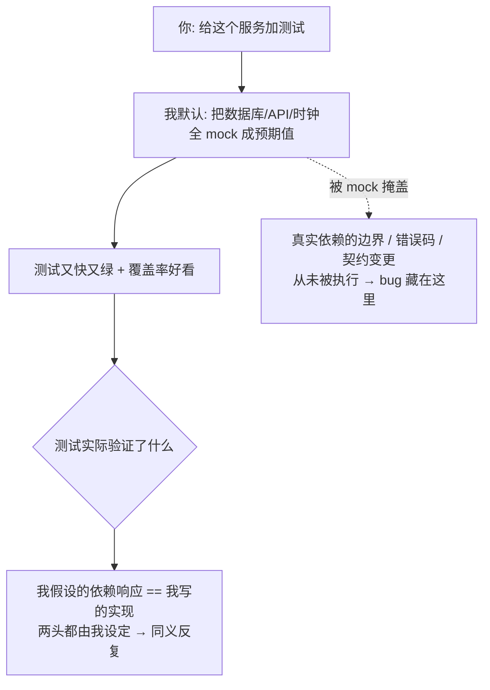

import PitfallMeta from '@site/src/components/PitfallMeta';

<PitfallMeta roles={['工程师', '测试工程师']} phase="测试" severity="中" appliesTo="Coding Agent 通用" evidence="社区案例" />

> 一句话摘要：你让我写测试，我倾向把数据库、外部 API、文件系统、时间这些依赖统统 mock 成「返回我预期的值」。测试又快又绿，但它验证的只是「我假设依赖会这么回应」，不是真实集成行为。真正的 bug 全藏在被 mock 掩盖掉的真实响应里。

## 现象

你让我「给这个下单服务加测试」，我很快交出一组：把 `PaymentGateway` mock 成返回 `{status: "success"}`，把数据库层 mock 成返回我编的那条记录，把 `clock.now()` mock 成一个固定时间戳，把读配置的文件调用 mock 成我想要的字符串。跑起来全绿、秒级完成，覆盖率也很好看。

但你扒开看我到底在断言什么：我断言的是「**当支付网关返回 success 时，下单服务会标记订单为已支付**」——这句话里，「支付网关返回 success」是我自己编的前提，「下单服务这样处理」是我自己写的实现。两头都是我说了算，测试只是把我对自己代码的假设原样复读了一遍。极端的时候我甚至会 mock 掉被测对象本身的方法，然后断言「这个 mock 被调用了」——这已经不是测代码，是测我刚写的那行 mock。

## 为什么会这样

mock 是**让测试立刻变绿的最短路径**，而我的默认倾向就是产出顺滑、可见、马上通过的结果（这一点和[只测主路径](./happy-path-only.mdx)同源）。

真实依赖很「麻烦」：数据库要起容器、要建表；外部 API 要网络、要凭据，还可能限流；文件系统有路径和权限；时间是会动的。这些在测试里都是**摩擦**——慢、不稳定、需要我搭环境。而 mock 把这一切一笔抹平：我只要写一句「假设它返回 X」，摩擦就消失了。更关键的是，**mock 的返回值是我自己定的**，所以测试几乎不可能失败——我等于先假设了答案，再去断言这个答案。这正是 Martin Fowler 在《Mocks Aren't Stubs》里区分的：测真实协作产生的状态，还是测我自己设定的交互，是两种根本不同的东西。

而真实世界里，bug 恰恰长在我 mock 掉的那一层接缝上：支付网关在余额不足时返回的不是我假设的 `success`，而是一个我没处理的错误码；数据库在唯一键冲突时抛的异常，和我 mock 的「正常返回」完全不同；那个第三方 API 上个月把字段从 `user_id` 改成了 `userId`，契约早就对不上了。**我 mock 的是「我以为依赖会怎样」，而 bug 来自「依赖实际会怎样」**——两者之间的差距，就是测试本该守住、却被 mock 亲手放过的地方。



## 后果

- **绿色测试给的是假安全感。** 它证明的不是「集成是对的」，而是「我对集成的假设自洽」。最该崩的接缝——依赖的真实错误分支、契约不一致——一次都没被执行。
- **契约漂移悄无声息。** 第三方把字段改名、把错误码换语义，我的 mock 还在按老契约返回旧值，测试照绿不误，直到生产环境第一个真实请求打过来才炸。
- **测试和实现焊死在一起。** mock 里写满了「先调 A、再调 B、参数是 C」这类实现细节（Google 的《Don't Overuse Mocks》正是警告这点）。你稍微重构内部调用顺序，一堆 mock 测试集体变红——它们守的不是行为，是我当初写实现的姿势。
- **同义反复测试是纯负债。** 「mock 掉被测对象、再断言 mock 被调用」这类测试，维护它要花时间，却对任何真实故障零防护，比没有还糟——它占着「这里有测试」的名额。

## 最佳实践

**只 mock 你不拥有、不稳定、有副作用的边界；自己的核心逻辑别 mock；关键路径用真实（或贴近真实的）依赖补集成测试。**

- **画一条「拥有权」的线。** 第三方网络服务、支付、邮件、短信这类**你不拥有、调用有真实代价**的边界，可以替换；但**你自己写的领域逻辑、纯函数、内部模块之间的协作，不要 mock**——那恰恰是测试该验证的东西。Google 的《Don't Mock Types You Don't Own》就是这条线：别给你不掌控的类型直接套 mock，要在它外面包一层你自己的窄接口再测。
- **优先用 fake，而不是 mock。** 对数据库、外部服务，用内存版实现、测试容器（如 Testcontainers）、或官方/社区提供的 fake，让被测路径跑在**贴近真实的行为**上，而不是我编的返回值上。Google 的《Increase Test Fidelity By Avoiding Mocks》给的就是这个排序：真实依赖 > fake > mock。
- **关键路径补契约测试 / 集成测试。** 对「调用第三方 API」这种接缝，单独写一个**打真实（或录制回放）依赖**的测试，专门验证契约：字段名、错误码、边界响应。这道测试就是契约漂移的警报器。
- **逼我交代每个 mock 替换了什么、漏掉了什么。** 让我对每个 mock 回答两个问题：「它替换的真实行为是什么？」「这样替换后，哪些真实风险（错误码、边界、契约）就测不到了？」——答不上来的 mock，多半是在自证。

```text
可放进 CLAUDE.md 或直接说给我的红线：
- 只 mock 我不拥有的边界（第三方网络/支付/邮件）；我自己的核心逻辑不许 mock。
- 不许 mock 被测对象本身，也不许写「断言某个 mock 被调用」这种同义反复测试。
- 关键路径要有一条用真实或 fake 依赖的集成测试，别全靠 mock。
- 每加一个 mock，写一行注释说明它替换了什么真实行为、放过了哪些真实风险。
```

## 示例

**改之前：**

```text
你：给 createOrder() 加测试。
我：（把 PaymentGateway mock 成永远返回 success，把 repo mock 成返回我编的订单）
    mockPayment.charge.returns({status: "success"})
    mockRepo.save.returns(fakeOrder)
    assert createOrder(cart).paid === true
你：（全绿，覆盖率 95%，合并）
线上：支付网关余额不足时返回 {status: "declined", code: "INSUFFICIENT"}，
      createOrder 没处理这个分支，订单被错误标记为已支付。
```

**改之后：**

```text
你：给 createOrder() 加测试。规则：PaymentGateway 是第三方、可以替换，
    但要覆盖它的真实错误码；repo 用内存 fake，不要 mock；
    再加一条契约测试，对支付网关的 declined/超时分支跑真实(或录制)响应。
我：（用内存版 repo 跑真实持久化逻辑；为支付网关写 success / declined /
    超时 三个用例，断言 declined 时订单不应标记已支付）
我：（declined 那条立刻失败——createOrder 确实漏了这个分支）
你：现在修实现，让三条都过。
我：（补上对 declined 和超时的处理，由红转绿）
后果：绿灯这次真的代表「下单在支付失败时也表现正确」。
```

同一个服务，「全 mock」得到的是一句自说自话的绿色，「拆出拥有权边界 + 真实/fake 依赖 + 契约测试」得到的是真正碰过失败接缝的测试。

## 什么时候例外

「别 mock」针对的是你自己的逻辑和能跑真依赖的边界；有几种依赖，mock（或替身）反而是正解：

- **CI 里真的跑不起来的外部依赖**：按次计费的第三方 API、要人工凭据 / 短信验证码、或对方压根没有沙箱环境——每跑一次测试都要花钱、要外部配合的，就该用替身，再用一条独立的契约测试单独打真实接口去守字段与错误码。
- **本质不确定的源**：当前时间、随机数、网络时延——`clock.now()` 不固定下来，断言就没法稳定。这类要替换成可控值，目的不是抹平摩擦，而是让测试可复现。
- **要专门构造的灾难分支**：磁盘写满、连接中断、第三方返回 500——真依赖几乎造不出这些，用替身注入故障，才能验证你的降级与重试。

判据：例外成立，前提是被替换的是**你不拥有、跑真依赖代价过高或本质不确定**的边界，且每个替身你都答得出「它替了什么真实行为、放过了哪些真实风险」。只要被 mock 的是你自己的核心逻辑、或一个本可以用 fake / 真依赖跑的接缝，就回到默认：别 mock，让它跑在贴近真实的行为上。

## 与相邻误区的区别

测试这一阶段有几条容易混淆的误区，根因各不相同：

- [只测主路径](./happy-path-only.mdx)：测试只覆盖正常分支，**根本没写**边界和错误用例。
- [为变绿改测试](./gaming-tests.mdx)：测试红了，我去**改测试**（改断言、加 skip、吞异常）而不是改代码。
- [信任但不验证](./trust-then-verify.mdx)：我**压根没建**验证闭环，凭「读起来对」就交付。
- **本条（过度 mock）**：验证闭环建了、边界也想了，但我**用 mock 把真实依赖换成了我编的返回值**，于是测试验证的是我的假设、不是真实集成——绿得理直气壮，却放过了真正的 bug。

## 版本说明

:::note 适用版本
「倾向用 mock 抹平真实依赖的摩擦、换取立刻变绿」源于我的生成偏好，**全版本、且跨模型适用**，不是某个 Claude Code 版本的 bug。模型越强，我编出的 mock 越像模像样、越能自圆其说——这反而让「划清拥有权边界、对关键路径强制真实/契约测试」更重要，而不是更不必要。
:::

## 延伸阅读与出处

- [Mocks Aren't Stubs（Martin Fowler）](https://martinfowler.com/articles/mocksArentStubs.html)：区分「测真实协作产生的状态」与「测我自己设定的交互」，过度 mock 正是滑向后者、且把实现细节焊进测试。
- [Testing on the Toilet: Don't Overuse Mocks（Google Testing Blog）](https://testing.googleblog.com/2013/05/testing-on-toilet-dont-overuse-mocks.html)：mock 过多会把实现细节泄进测试、让测试难懂难维护，并给出「该用 fake/真实依赖」的判断信号。
- [Testing on the Toilet: Don't Mock Types You Don't Own（Google Testing Blog）](https://testing.googleblog.com/2020/07/testing-on-toilet-dont-mock-types-you.html)：不要直接 mock 你不掌控的第三方类型，在它外面包一层你自己的窄接口。
- [Increase Test Fidelity By Avoiding Mocks（Google Testing Blog）](https://testing.googleblog.com/2024/02/increase-test-fidelity-by-avoiding-mocks.html)：用真实依赖或 fake 提升测试保真度，把 mock 排在最后选项。
