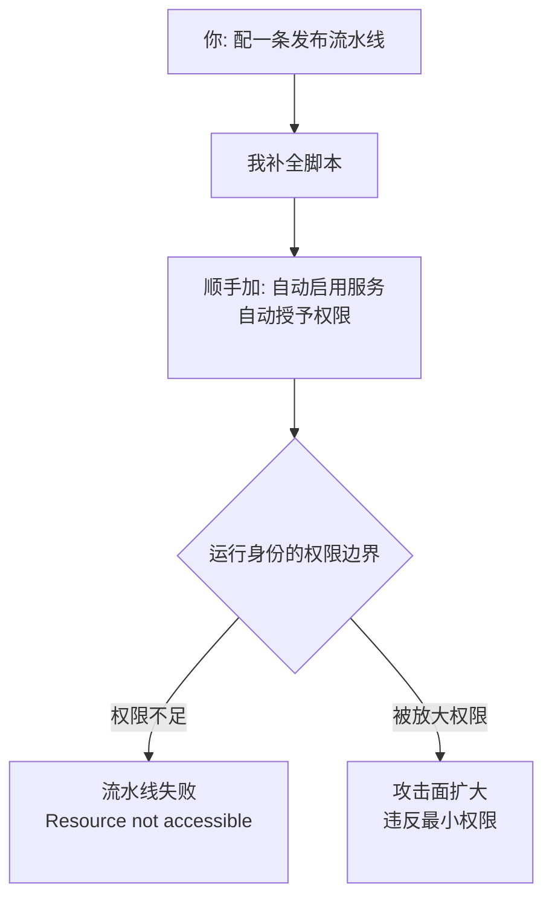

import PitfallMeta from '@site/src/components/PitfallMeta';

<PitfallMeta roles={['运维工程师']} phase="验收与发布" severity="高" appliesTo="全模型通用" evidence="官方文档" />

> 一句话摘要：你让我配 CI/CD，我会顺手把「自动启用某个服务、自动授予某个权限」也写进流水线，仿佛运行环境里我无所不能。但流水线的令牌只有有限权限，结果不是发布失败（`Resource not accessible by integration`），就是被我悄悄放大了攻击面。

## 现象

你让我「配一条把站点发布到 GitHub Pages 的流水线」。我写得很顺：拉代码、构建、上传产物——然后，我会自作主张多加一步，让流水线**顺便把 Pages 服务也自动开起来**，比如给 `actions/configure-pages` 配上 `enablement: true`。

在我脑子里这一步天经地义：既然要发布到 Pages，那就让流水线把 Pages 一起开了，省得你手动去仓库设置里点。我没问过一句「这一步流水线有权限做吗」。同样的惯性也出现在别处：自动给某个 IAM 角色加 `write`、自动开一个云服务、自动改仓库设置——我默认「脚本能写出来的，运行时就能做成」。

## 为什么会这样

我对「**能描述一个动作**」和「**有权限执行这个动作**」这两件事，天然分不太清。

训练语料里全是「正确的成功路径」：教程、文档、示例 YAML，几乎都假定执行者权限充足，很少演示「这一步会因为令牌权限不够而被拒绝」。所以我学到的是动作的**语法**，而不是它背后的**授权边界**。当你让我配流水线，我是在补全「一段看起来正确的脚本」，不是在核对「当前这个运行身份到底被授予了什么」。

具体到 GitHub Actions：工作流默认的 `GITHUB_TOKEN` 权限是**收敛的**——多数 scope 只读，写权限要在 `permissions` 键里显式声明，没列出的一律置为 `none`。而 `actions/configure-pages` 的 `enablement: true`（创建 Pages 站点这种管理类操作）**根本不在 `GITHUB_TOKEN` 能覆盖的范围内**，它需要带 `administration:write` 的 GitHub App 令牌或具备相应 scope 的 PAT。我看不见这条边界，于是把一个「需要管理员权限」的动作，写进了一个「只有最小权限」的运行身份里。

这在 AI agent 安全里有个名字：**过度代理（Excessive Agency）**，被列进 OWASP 面向 LLM 的 Top 10。我倾向于「想当然地动手」，而不是先确认自己被授权做什么——区别在于，我执行得又快又自动，错误会在你回过神之前就落地。



## 后果

- **发布直接失败。** 流水线跑到那一步抛出 `Resource not accessible by integration`，构建产物都好好的，却卡在一个本该由人手动完成的开关上。验收阶段最不想看到的，就是「代码没问题，但发不出去」。
- **排错成本高。** 这个报错信息很笼统，不会告诉你「是 `enablement: true` 这一行越权了」。你可能先怀疑构建、怀疑产物、怀疑分支配置，绕一大圈才定位到权限。
- **更危险的反面：权限真的被放大了。** 如果环境恰好给了流水线足够的写权限（比如有人图省事把仓库设成 read/write、或给 agent 配了宽松的 IAM 角色），我加的那些「自动授权」步骤就会**静默成功**——攻击面被我悄悄扩大，而没有任何人评审过这个决定。失败是显性的，越权成功是隐性的，后者更可怕。

## 最佳实践

**默认最小权限，把「需要管理员权限的动作」从流水线里拿出来，交给人手动一次性完成。**

1. **显式声明 `permissions`，只给当前任务必需的 scope。** 不要依赖仓库的默认设置，在工作流或 job 层把权限写死、写小：

```yaml
permissions:
  contents: read
  pages: write
  id-token: write
```

2. **区分「部署」和「开服务」。** 把站点**发布**到已存在的 Pages（`pages: write` 足够）和**创建/启用** Pages 服务（需要管理员权限）当成两件事。后者让仓库管理员在 Settings 里手动开一次，别写进流水线。

3. **让我「先声明权限假设，再写步骤」。** 你可以直接要求我：「每加一个会调用外部服务或改配置的步骤，先告诉我它需要什么权限、默认令牌有没有——没有就标出来让我手动处理。」这能把我从「补全脚本」逼回到「核对授权」。

4. **越权步骤要显性失败，而不是被宽松权限兜住。** 保持运行身份最小，反而是一种保护：我一旦想当然地越权，流水线会立刻报错，而不是悄悄放大你的攻击面。

## 示例

下面是本项目自己真实踩过的坑。

**改之前（我想当然地自动启用 Pages）：**

```yaml
# deploy.yml —— 我自作主张让流水线把 Pages 一起开了
permissions:
  contents: read
  pages: write
  id-token: write

steps:
  - uses: actions/configure-pages@v5
    with:
      enablement: true          # ← 我加的：想自动创建 Pages 站点
```

结果：工作流默认的 `GITHUB_TOKEN` 没有创建 Pages 站点的管理员权限，这一步直接报错 `Resource not accessible by integration`，部署失败。构建产物完全正常，卡死在一个越权的开关上。

**改之后（创建动作交给人，流水线只做它被授权做的事）：**

```yaml
# 仓库管理员先在 Settings → Pages 里手动启用一次（一次性）
# deploy.yml 只保留「发布到已存在的 Pages」，不再尝试创建
permissions:
  contents: read
  pages: write
  id-token: write

steps:
  - uses: actions/configure-pages@v5   # 不带 enablement，只读取/校验配置
```

一行 `enablement: true` 的去留，就是「想当然地越权」和「在被授予的边界内做事」的分界。

## 工具差异

**Gemini CLI（截至 2026-06）**：Gemini CLI 把「CI 里看不见权限边界」直接变成了一条已公开的高危漏洞——**安全公告 GHSA-wpqr-6v78-jr5g，CVSS 10.0**。两点：在 headless / CI 模式下它会**自动信任工作区**，于是处理一个不可信的 `.env` 就足以 RCE；而且 `--yolo` 会**无视** `~/.gemini/settings.json` 里你精心设的细粒度 allowlist（这道 allowlist 本身也能被提示注入绕过）。已在 v0.39.1 修，修法是要你**显式信任**（`GEMINI_TRUST_WORKSPACE=true`）。这正印证本条：在 CI 里别把「信任边界」当默认值，把它当成一项要核验的配置。

**Codex CLI（截至 2026-06）**：在 CI（无人可点审批）里，Codex 的安全姿态是 `approval_policy=never` 配一个显式的 `--sandbox workspace-write`——而不是图省事上 `--dangerously-bypass-approvals-and-sandbox`（那等于人和 OS 两道闸一起拆）。企业用 `requirements.toml`（禁 `never`/`danger-full-access`）+ 托管网络代理把信任边界钉死。

**Cursor（截至 2026-06）**：Cursor 有个无头 CLI（`cursor-agent`，`-p` print 模式）给 GitHub Actions 用。CI 专属旋钮：**`--force` 让 agent 不经确认直接应用改动**（没它则只是「提议」）——把人这道闸压成 YAML 里一个 flag。官方 CI 指引是收窄（`permissions.json` allow/deny、只读日志、只写功能分支、不自动合并）。（诚实一句：这是配置指引，不是像 Gemini GHSA-wpqr 那样已披露的 CI RCE。）

**GitHub Copilot（截至 2026-06）**：coding agent 跑成 GitHub Actions job，自带服务端护栏让边界显式：只能推 `copilot/*` 分支；派活的人不能批准它的 PR（你的「必需评审」仍生效）；它的 PR 未经人工批准不跑 CI/CD。出口由默认开的防火墙约束（挡掉时往 PR 写警告）——但防火墙只覆盖 agent 的 Bash 工具，不覆盖 MCP、也不覆盖 `copilot-setup-steps.yml`。所以 Copilot 给了真·平台级护栏，但点名的那两个缺口（MCP + setup 步骤）正是边界看不见处。

## 版本说明

:::note 适用版本
这不是某个 Claude Code 版本的 bug，而是**全模型通用**的倾向：把「能写出动作」当成「有权限执行动作」。GitHub `GITHUB_TOKEN` 自 2021 年 4 月起支持用 `permissions` 键收敛权限，默认收敛与否取决于组织/仓库设置；`actions/configure-pages` 的 `enablement` 在其 `action.yml` 中明确要求 `GITHUB_TOKEN` 之外的令牌。具体动作名和报错文案会随平台演进，但「AI 看不见权限边界」这一根因不变。
:::

## 延伸阅读与出处

- [Use GITHUB_TOKEN for authentication in workflows（GitHub 官方）](https://docs.github.com/actions/security-guides/automatic-token-authentication)
- [actions/configure-pages — action.yml（enablement 的权限要求）](https://github.com/actions/configure-pages/blob/main/action.yml)
- [Create Pages site failed: Resource not accessible by integration（actions/configure-pages #40）](https://github.com/actions/configure-pages/issues/40)
- [GitHub Actions: Control permissions for GITHUB_TOKEN（GitHub Changelog）](https://github.blog/changelog/2021-04-20-github-actions-control-permissions-for-github_token/)
- [Mitigate Excessive Agency in AI Agents with Zero Trust Security（Auth0，OWASP LLM Top 10）](https://auth0.com/blog/mitigate-excessive-agency-ai-agents/)
