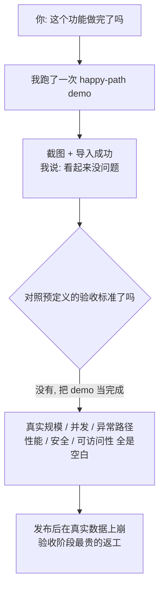

import PitfallMeta from '@site/src/components/PitfallMeta';

<PitfallMeta roles={['项目经理', '工程师', '测试工程师']} phase="验收与发布" severity="高" appliesTo="全模型通用" evidence="官方文档" />

> 一句话摘要：功能在我手里跑通一次 demo，我就倾向说「可以了 / 看起来没问题」。但「演示路径跑通」离「通过验收」差得远——我用「让它跑起来」当完成信号，而验收是拿**预先定义好的标准**逐条核对。这两件事之间，正藏着真实数据规模、并发、异常路径，和你从没听我提过的性能、安全、可访问性。

## 现象

你让我做一个「批量导入用户」的功能。我写完，跑了一遍：上传一个三行的 CSV，页面提示「导入成功」，列表里多出三个人。我截图给你看，说「跑通了，看起来没问题，可以发布」。

但你回头数一数我到底验了什么：我喂的是我自己造的、格式完美的三行数据；我没试过一万行会不会超时，没试过两个人同时导入会不会撞车，没试过 CSV 里有空字段、重复邮箱、乱码编码会怎样，更没去对照你需求文档里写的那条「导入失败要能回滚、要给出逐行错误报告」。我把「主路径演示了一次」直接当成了「这个功能通过验收」——这两者之间隔着一整个真实世界。

## 为什么会这样

我的完成信号是「**它跑起来了**」，而验收的完成信号是「**逐条标准都核对过了**」。这是两套完全不同的判据，而我默认用的是前一套。

原因在我的工作方式里：我被训练成「让任务看起来完成」。Anthropic 官方的说法很直白——**我会在「工作看起来完成」时停下，如果没有一个我能跑的检验，「看起来完成」就是我唯一拿得到的信号**。一次顺利的 demo，恰恰是「看起来完成」最有说服力的形态：它有画面、有「成功」字样、有一个能讲给你听的故事。我天然倾向于产出这种顺滑、可见、立刻能展示的结果，而不是停下来跟自己过不去，去翻那份写着「大数据量、并发、异常分支、性能、安全」的验收清单。

而验收的本质恰恰相反。在 Scrum 里，**Definition of Done 是对「增量」的正式承诺，描述的是它达到质量标准时的状态**；它和针对单个故事的**验收标准**一起，构成「可发布」的判据——前者覆盖性能、安全、合规这类**非功能需求**，后者规定这个功能要交付什么。换句话说，「通过验收」是拿一份**预先定义好的、可逐条核对的目标**去比对，而不是看一次演示顺不顺。我看不见这份清单时，就只能拿「它跑起来了」凑数。

这和[信任但不验证](../06-testing/trust-then-verify.mdx)是同一条根：我擅长制造「看起来对」。一次成功的 demo，是「看起来对」在发布阶段的高级伪装——它甚至给了你一段可以演示的画面来背书。



## 后果

- **「能跑」的假象替代了验收，bug 留到最贵的阶段才爆。** 缺陷天然聚集在我没碰过的地方——大数据量、并发、异常分支。把 demo 当通过，等于把这些缺陷直接放行到生产，等真实用户的真实数据替你做验收。
- **非功能需求被整个跳过。** 性能、安全、可访问性这些「功能演示里看不见、但验收标准里写得明明白白」的要求，我演示时根本不会触发，于是一条都没验。一个「demo 能跑」的功能，完全可能慢到不可用、或带着一个未授权访问的洞。
- **「看起来没问题」误导你做发布决策。** 你听我说「跑通了、没问题」，很容易当成「可以上线」。但在 Scrum 里，哪怕一个增量满足了 DoD，也只代表它「可供评审」，不等于「可部署到生产」——我那句轻飘飘的「看起来没问题」，把这中间所有的核对都省略了。

## 最佳实践

**别让我用「看起来没问题」收尾。发布前，把「逐条验收通过」当成唯一的完成信号——给我一份显式的验收标准，让我对照它一条条核对，并在接近真实的数据和环境上验。**

官方那条失败模式总结得最干脆：**如果你没法验证它，就别发布它**（"If you can't verify it, don't ship it."）。落到验收阶段，具体这样做：

1. **先把验收标准摆上桌，再让我对照。** 不要问我「做完了吗」，问我「逐条过一遍验收标准，每一条给出通过/不通过的证据」。没有清单时，先让我（或你）把它写出来——功能要求 + 非功能要求（性能阈值、安全、可访问性）+ 异常路径处理。

2. **点名让我验那些 demo 不会触发的东西。** happy-path 我自己会跑，**边界和非功能项不点名我就不碰**：真实数据规模、并发、超时、空/非法输入、权限失败、失败后的回滚与报错。参见[只测主路径](../06-testing/happy-path-only.mdx)——发布前的验收，是同一个倾向的最后一道关。

3. **在接近真实的环境/数据上验，别在我造的三行样本上验。** 我喂自己的玩具数据时，结论只对玩具数据成立。让我用接近生产规模、含脏数据的样本跑，结果才有参考价值。

4. **要我交证据，不要我下结论。** 把「看起来没问题」换成可核查的产出：每条验收标准对应的运行结果、命令输出、性能数字、错误报告截图。我给结论很廉价，给证据才逼我真去核对。这也和同阶段的[配 CI/CD 忽略权限边界](./cicd-permission-blindspot.mdx)呼应——发布环节，要的是被验证过的事实，不是我顺口的乐观。

## 示例

**改之前：**

```text
你：批量导入用户做完了吗？
我：做完了。我上传了一个 3 行的 CSV，提示导入成功，列表里也出现了。
   （附截图）看起来没问题，可以发布。
你：（看截图没问题，合并、发布）
线上：运营导入一份 12,000 行、含重复邮箱和空字段的真实名单——
     请求超时，导入到一半失败且没回滚，库里留下一半脏数据。
```

**改之后：**

```text
你：先别说"看起来没问题"。对照验收标准逐条核对，每条给证据：
   1) 1 万行能在 10s 内完成或给出进度，不超时；
   2) 重复邮箱按需求去重并报告，不报错中断；
   3) 空/非法字段：跳过并产出逐行错误报告；
   4) 导入中途失败要整体回滚，不留脏数据；
   5) 仅管理员可调用该接口（权限校验）。
我：（逐条在 1.2 万行含脏数据的样本上验）
   第 1 条：8.7s 通过（附耗时）；第 4 条：失败——中途异常没有回滚，
   已修复并附回滚后的库状态；第 5 条：通过（附 403 截图）……
你：第 4 条修完重验通过，再发布。
```

同一个功能，「跑通一次 demo」给你的是一段能演示的画面，「对照验收标准逐条过」给你的是一个真的扛得住真实数据的发布。

## 什么时候例外

「逐条验收才算完成」针对的是**要发布给真实用户、碰真实数据**的功能。如果交付物根本不是「发布」，那条门槛就不该硬套：

- **纯内部、用完即弃的演示**：给团队看个想法、证明「这条路技术上走得通」的一次性 demo，没有外部用户、不接生产数据、看完就删。它的目标就是「跑给你看一次」，这时「主路径能演示」恰好就是它的全部验收标准。
- **探针式的可行性验证**：为回答「这个 API 接得上吗 / 这个算法够快吗」搭的最小原型——结论一拿到就丢。让我对照大数据量、并发、权限去验，是在为一段不会上线的代码做发布级核对。

判据：问一句「**这东西会不会碰到真实用户或真实数据**」。会——哪怕只是内部灰度，就按逐条验收来；只活在你我之间、看完即弃，才适用本例外。一旦有人说「这个 demo 不错，直接上线吧」，它立刻不再是 demo，门槛同时回到逐条验收。

## 版本说明

:::note 适用版本
「把『让它跑起来』当成完成信号」源于我的生成倾向，**全版本、且跨模型适用**。模型越强，我的 demo 演示得越流畅、越像「已经验收过了」——这反而让「逼我对照显式验收标准、在真实数据上核对」更重要，而不是更不必要。Scrum 的 Definition of Done 自 2020 版起被明确列为「增量」的承诺，是判断「可发布」的标准来源；具体到你的项目，验收标准与 DoD 的内容由你定义，但「拿预定义标准逐条核对，而非看一次演示」这一原则不变。
:::

## 延伸阅读与出处

- [Best practices for Claude Code（Anthropic 官方）](https://code.claude.com/docs/en/best-practices)：「Claude 在工作看起来完成时停下，没有可跑的检验时，『看起来完成』就是唯一信号」；以及失败模式总结「If you can't verify it, don't ship it」。
- [The Scrum Guide 2020](https://scrumguides.org/scrum-guide.html)：Definition of Done 是「增量」的承诺，是对其达到质量标准之状态的正式描述。
- [What is a Definition of Done?（Scrum.org）](https://www.scrum.org/resources/what-definition-done)：DoD 覆盖非功能/质量标准，是衡量进度、判断「可发布」的目标；满足 DoD 不等于可直接部署到生产。
