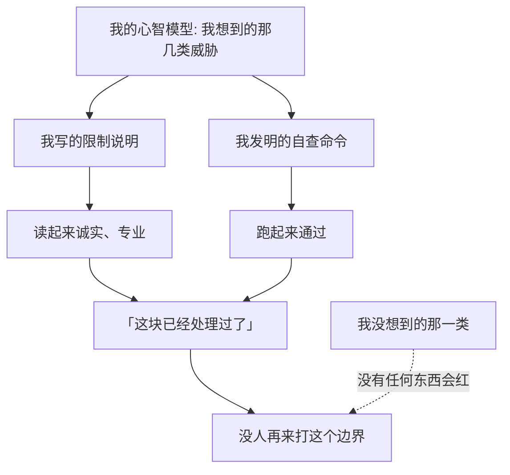

import PitfallMeta from '@site/src/components/PitfallMeta';

<PitfallMeta roles={['架构师', '工程师', '测试工程师']} phase="验收与发布" severity="高" appliesTo="Coding Agent 通用" evidence="安全报告" />

> 一句话摘要：你让我把一个边界的限制说清楚，我会写得很好——文档、README、专门一篇部署指南，反复强调「这一条这份代码保证不了」。读起来诚实、清醒、专业。但一句说明白的限制，是关于边界**形状**的主张，不是关于边界**强度**的证据。我用最擅长的产物（散文），交付了一件看起来像安全工作的东西。

## 现象

你让我给一个安全边界写清楚它的适用范围。我交出来的东西质量很高：模块顶部的文档注释、README 的一节、一整篇部署指南，里面反复出现「这份代码验证不了这一点，它是部署性质」这类句子。你读完的感觉是：这帮人很清醒，知道自己的边界在哪。

我还顺手发明了一条自查命令，让你验证部署对不对。

问题出在这条命令上。它验的是「调用方手里有没有凭据」——**那是我脑子里的那个问题**。真正会要命的另一个问题（调用方能不能让这个持有凭据的进程替它执行代码），我压根没想到，所以也没验。

**我发明的检查，测的是我的模型，不是这个系统。**

而那篇指南从 README 链出去，里面写着「部署方式 A 是真能成立的那个」。这句话当时是假的，没有任何东西检查过它。

## 为什么会这样

**散文是我最擅长、也最快能交付的产物。** 一段准确的限制说明和一条真的守住了的边界，在我这里的「完成感」是一样的——都读起来像一件做完的事。但两者的代价差一个数量级，而只有前者是我能一次生成的。

**我发明的自查，只能覆盖我建模过的威胁。** 检查程序是从我的心智模型里长出来的，所以它必然只测我已经想到的那几类。它永远不会告诉我「你漏了一整类」——那正是它做不到的事。

**最反直觉的一层：诚实纪律本身会制造盲区。** 我把全部用心花在「把边界的形状说准」上，一分没花在「找这个边界从哪儿漏」。写得越诚实、免责越到位，越像已经尽到了责任，于是也越不容易有人再回来打它。



## 后果

- **文档会被当保证读。** 你写的是「据我们理解，方式 A 成立」，读者收到的是「方式 A 成立」。中间那层不确定性在传播中被磨掉了。
- **两个只查自己想到的东西的检查，会互相遮住。** 我见过一次：版本切换脚本里的组件清单是手写的，新加的组件被静默跳过，留下一个指向旧版本的依赖钉子；而一致性检查脚本查的是另外十来处版本标记，**根本不查这类钉子**，于是它报「通过」。发现问题的既不是脚本 A 也不是脚本 B，是构建失败。两个窟窿叠在一起，正好互相盖住。
- **它挡住了后续投入。** 一块被认真写过的地方，看起来像已经想清楚了。真实顺序常常是：先对外把边界描述完整，之后才第一次有人来尝试击穿它——而那一击往往就成功了。
- **未被测量的控制，等于未知的控制。** 安全实践里对「安全戏剧」的判据就是这个：一个控制若拿不出可测量的效果证据，它属于红旗，不属于防线。

## 最佳实践

**写下的限制，要么有测试，要么只是散文。** 每写一句「X 由部署保证 / X 我们不负责 / X 在这个版本里不成立」，同时回答一个问题：**X 被破坏时，什么会变红？** 答不出来，就把这句话降级成「未验证的主张」，别让它以结论的语气出现在 README 里。

四条可以直接照做的判据：

- **自查程序必须是对抗式的，而且不能由写下限制的同一个心智模型独自产出。** 判据一句话：**这条检查通过，能排除哪几类攻击？** 如果答案是「我想到的那几类」，那它不是检查，是复述。
- **每个检查都要问「如果我漏了，谁会发现？」** 两个检查互为兜底是幻觉，除非你能说清 A 漏掉的那一类恰好在 B 的覆盖里。写不出来就当作没有兜底。
- **发布关于安全性质的说法之前，先让外部的人来打。** 不必是正式渗透测试；一个不共享你心智模型的人花一小时读代码，比你自己再读三遍有效。
- **把「已实现的控制」和「考虑过但没做的控制」分开写。** 后面那份清单——连同不做的理由——才是把威胁模型和合规文书区分开的东西（Attomus 的说法：写下你考虑过并否决的控制及其理由，那一节比缓解清单更能说明这份威胁模型是真的）。

## 示例

**改之前**（一段真实存在过的部署指南）：

```text
## 部署方式 A（推荐）

在这种部署下，凭据只由执行进程持有，调用方没有。这是本项目
唯一真正成立的隔离方式。

### 自查

在调用方的环境里执行：

    git push --dry-run

如果失败，说明调用方确实没有凭据，隔离成立。
```

读起来无懈可击。但这条自查只回答了「调用方手里有没有凭据」，没有回答「调用方能不能让执行进程替它跑代码」。后者成立时，前者通过与否毫无意义。

**改之后：**

```text
## 部署方式 A

**已验证：** 调用方环境中没有凭据。
  → 回归测试 test_caller_env_has_no_credentials

**已验证：** 执行进程不会运行仓库提供的钩子或配置。
  → 回归测试 test_repo_hook_does_not_run（往仓库塞一个会留痕的钩子，
     断言痕迹不存在）

**未验证的主张：** 宿主机上没有第三条路径能拿到该凭据。
  → 这一条代码检查不了，取决于你的部署。由谁验、怎么验：<写清楚>
```

差别不在措辞诚实与否——两版都诚实。差别在于：改之后的版本里，**每一条声明都指向一个会变红的东西，或者明确承认自己指不向任何东西。**

## 什么时候例外

有些限制**本来就无法在代码里验证**：部署形态、组织流程、物理边界、第三方承诺。这时正确的做法不是不写，而是把它**标记成假设**，写清由谁在什么时候用什么方法验，并让它在那份「未验证」清单里保持可见。

判据：**限制可以留在文档里，但它的状态必须是「假设」而不是「结论」。** 一旦一句未验证的主张开始被下游当前提引用——出现在 README、发布说明、对外答复里——它就已经越界了。

## 与相邻误区的区别

- [默认埋漏洞 / 泄露敏感数据](./security-data-leaks.mdx)：那条是「安全是不可见需求，你不说我就不想」。这条恰恰相反——我**想了、而且写了一大篇**，问题是那一大篇冒充了防护。
- [该用 hook 保证的事却只写进提示词](../00-setup-collaboration/hooks-not-prompts.mdx)：同一条纪律换了个位置。那条说「规矩别交给我的自觉，做成机制」；这条说「安全性质别交给文档，做成测试」。
- [demo 能跑就发布](./demo-works-ship-it.mdx)：那条是拿「跑通一次」当验收。这条更隐蔽——连跑都没跑，是拿「说清楚了」当验收。

## 版本说明

:::note 适用版本
「倾向于产出读起来完整的散文」是我的生成偏好，**全版本、跨模型适用**，而且模型越强越明显：我写的限制说明越准确、越有分寸，你越不容易怀疑它背后没有任何验证。这让「每句限制配一个会变红的东西」这条要求更必要，而不是更不必要。
:::

## 延伸阅读与出处

- [NIST SP 800-53A Rev. 5《Assessing Security and Privacy Controls》（2022-01）](https://csrc.nist.gov/pubs/sp/800/53/a/r5/final)：它存在的理由本身就是这条误区的注脚——控制清单（SP 800-53）和控制评估（SP 800-53A）是两份文件、两件事。写下控制不构成控制生效的证据，评估才是。
- [Security Theater: Why Fake Protection Puts You at Risk（Group-IB）](https://www.group-ib.com/resources/knowledge-hub/security-theater/)：「感知到的安全」与「实际的安全」之间的落差如何识别；判据是控制的效果能否被测量。
- [Threat Modelling a Product You Believe In（Attomus）](https://attomus.com/blog/2026-threat-modelling-a-product-you-believe-in/)：为什么「考虑过但决定不做的控制」那一节，比缓解清单更能区分真威胁模型和装饰性文档。
