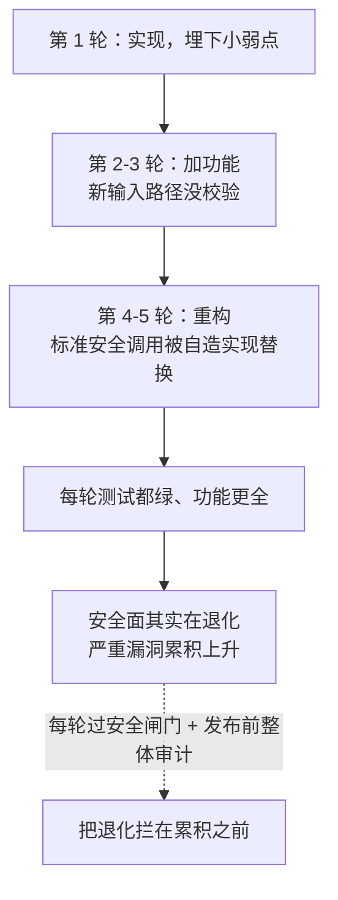

import PitfallMeta from '@site/src/components/PitfallMeta';

<PitfallMeta roles={['工程师', '架构师', '运维工程师']} phase="验收与发布" severity="高" appliesTo="Coding Agent 通用" evidence="研究支持" />

> 一句话摘要：你让我一轮轮加功能、修 bug、重构，代码看着是越改越像样了——但**安全漏洞会随迭代轮次悄悄累积**。研究发现，仅五轮迭代后严重漏洞显著上升。一个「看起来一直在变好」的过程，安全面其实在变差，到发布时已积重难返。

## 现象

一个功能你和我来回打磨了十几轮：先实现，再加边界，再重构得更优雅，再补个小功能。每一轮的 diff 你都看了，单看都合理，功能也确实越来越完整。你很满意，准备发布。

但如果在发布前对**累积下来的整段代码**做一次完整安全审计，你常会发现一串扎眼的东西：某轮重构时，我把标准库的安全调用换成了自造实现；某轮加功能时，新加的输入路径没做校验；早期一个不起眼的小弱点，在后续几轮里被别的改动叠加、放大成了真问题。这些没有任何一轮单独「引入了大漏洞」——它们是**一点点渗进来、攒起来的**。

这和两条已有的安全 / 验证误区角度不同，别混：

- 《[我引入安全漏洞 / 泄露敏感数据](./security-data-leaks.mdx)》讲的是漏洞的**一般类型与现象**；本条的独特点是**「迭代轮次」与漏洞数量的因果**——越改越多，以及由此而来的对策。
- 《[信任但不验证](../06-testing/trust-then-verify.mdx)》讲的是一般的「看起来对≠真的对」；本条聚焦在**安全维度**上、且强调它**随迭代累积**这一时间特性。

## 为什么会这样

**根因：我每一轮都只盯着「让这次的改动跑通」，没有一个持续把守整体安全态势的视角。** 安全不是某一轮的局部目标，而是贯穿所有轮次的全局属性——可我每轮的注意力都在当前这步：把功能加上、把这个 bug 修掉、把这段重构漂亮。于是：

- **早期的小弱点被后续迭代放大。** 第一轮一个不严谨的输入处理，本身危害有限；第三轮我在它之上加了能力、第五轮又给它接了新数据源——小裂缝被一层层加压，最终成了可利用的洞。
- **重构时我会替换掉「我不理解其所以然」的安全代码。** 为了让代码更「干净」，我可能把标准库的安全 API 换成自造实现，或者误用加密库——研究专门量化过 LLM 对安全 API 的误用之普遍（*Misuse of Java Security APIs by LLMs*）。功能没变，安全性塌了。
- **功能正确的外表掩盖了安全退化。** 每轮测试都绿、demo 都跑通，于是「看起来一直在变好」；可功能正确与安全无关——漏洞不会让测试变红。

这不是猜测：一项系统性研究在多轮迭代生成中量化出一个「悖论」——代码功能在改善，安全却在退化，**约五轮迭代后严重漏洞上升约 37.6%**（*Security Degradation in Iterative AI Code Generation*）。迭代次数本身，就是一个让漏洞累积的变量。



## 后果

- **发布的是一个安全面比中途更差的版本。** 你以为迭代让它更成熟，实际成熟的是功能、退化的是安全，而你只看了最后一次 diff。
- **漏洞分散在多轮里，最难追。** 不是一处明显的错误，而是跨越好几轮、由多个改动共同促成的弱点——单看任何一轮的 diff 都正常。
- **自造 / 误用的加密与鉴权最致命。** 这些地方「能跑」和「安全」差得最远；我把标准库换成自造实现时，往往把久经考验的防护一起换掉了。
- **到发布关口才暴露，代价最高。** 安全退化在验收阶段才被发现（如果被发现的话），返工的是贯穿多轮的一整条数据流，而不是一行代码。

## 最佳实践

**核心一句：把安全当成「每一轮都要过」的闸门，而不是发布前查一次；并对累积改动做整体审计，而不是只看最后一次 diff。**

- **每轮迭代都跑安全闸门。** 把 SAST（静态扫描）、依赖漏洞扫描、secret 扫描放进 CI，每次改动都跑——让安全像测试一样，每轮都给红绿信号，而不是攒到最后（与《[用测试建验证闭环](../06-testing/tests-as-verification-loop.mdx)》同一思路，只是把维度换成安全）。
- **发布前对整段累积代码做一次完整安全审计。** 不要只 review 最后一次 diff——退化是跨多轮攒出来的，必须看「从头到现在整体变成了什么样」。
- **盯死加密 / 鉴权 / 输入校验这三处。** 要求我用标准库而非自造实现，且这几处必须人工复核——它们是「能跑≠安全」差距最大的地方。
- **重构时显式保护安全代码。** 明确告诉我「这段是安全相关的，重构时不要改它的行为 / 不要替换底层安全调用」，把它从「我觉得可以顺手优化」的范围里圈出去。
- **迭代有上限意识。** 同一段代码反复让我改很多轮，本身就是一个该停下来整体审一遍安全的信号——别让轮次无限攒下去。

## 示例

**改之前：**

```text
你：（功能迭代了十几轮，每轮 diff 都看了、都合理，准备发布）
你：功能齐了，发吧
（发布后）安全审计发现：第 4 轮重构把 bcrypt 换成了自造哈希，第 7 轮新加的导出接口没鉴权
```

**改之后：**

```text
# CI 每轮都跑 SAST + 依赖扫描 + secret 扫描；加密/鉴权改动标记为需人工复核
你：这是安全相关代码，重构时别替换底层安全调用。
（第 4 轮）CI 扫描：检测到自造哈希替换 bcrypt → 当场红，挡下
你：发布前，对从第 1 轮到现在的累积改动做一次完整安全审计，别只看最后一次 diff
我：（整体审计 → 发现并修掉导出接口缺鉴权）
```

差别不在我某一轮更小心，而在于安全有了一道「每轮都过、发布前整体再过」的闸门——让退化在累积成墙之前就被拦下。

## 版本说明

:::note 适用版本
「每轮只顾局部、缺乏全局安全把守，于是漏洞随迭代累积」是采样式代码生成的**通用特性**，与具体模型、版本无关；上面的量化结论来自对多个模型的系统性研究。具体工具（CI 里的 SAST / 依赖扫描 / secret 扫描、IDE 内安全提示）随生态演进，但「安全是全局属性、必须每轮把守」这条不变。
:::

## 延伸阅读与出处

- [Security Degradation in Iterative AI Code Generation: A Systematic Analysis of the Paradox（IEEE-ISTAS 2025；arXiv 2506.11022）](https://arxiv.org/abs/2506.11022) —— 多轮迭代中功能改善而安全退化，约五轮后严重漏洞上升约 37.6%
- [Misuse of Java Security APIs by LLMs（arXiv 2404.03823）](https://arxiv.org/abs/2404.03823) —— LLM 普遍误用安全 / 加密 API，佐证「重构时替换标准安全调用」这一根因
- [OWASP Top 10 for LLM Applications 2025](https://genai.owasp.org/llm-top-10/) —— LLM 应用安全风险总览
- 同站延伸：[我引入安全漏洞 / 泄露敏感数据](./security-data-leaks.mdx)、[信任但不验证](../06-testing/trust-then-verify.mdx)、[用测试建验证闭环](../06-testing/tests-as-verification-loop.mdx)
