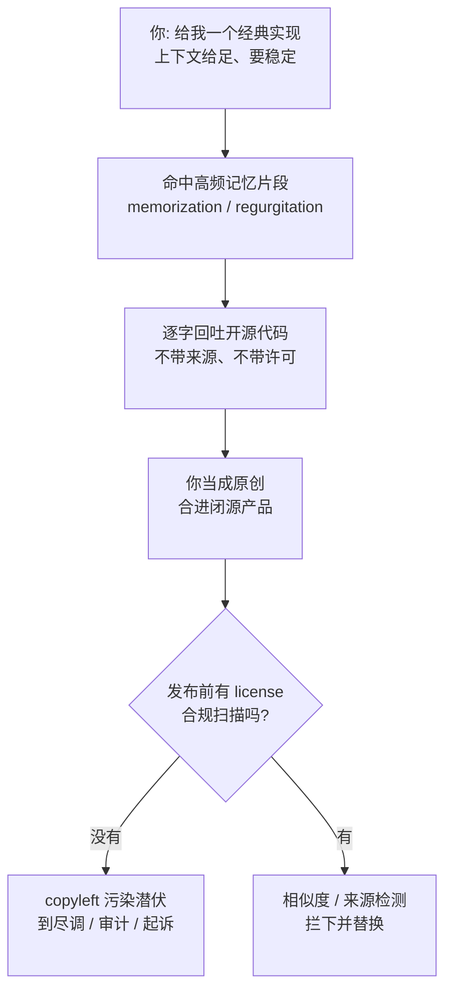

import PitfallMeta from '@site/src/components/PitfallMeta';

<PitfallMeta roles={['架构师', '工程师', '项目经理']} phase="验收与发布" severity="高" appliesTo="全模型通用" />

> 一句话摘要：我交给你的「原创代码」里，可能藏着一段我从训练语料逐字背下来的开源实现——还可能带着 GPL 这类有传染性的 copyleft 许可。我不会附来源、也不会附许可，你把它合进闭源产品，发布或法务审计时才发现这是一次许可违规 / IP 侵权。

## 现象

你让我「实现一个 LRU 缓存」「写一个 Markdown 解析的核心循环」「来一段 B-tree 删除」。我给你一段完整、漂亮、一看就「能用」的实现，你觉得是我现场写的，顺手合进了你的闭源代码库。

问题是：这段代码很可能不是我「写」出来的，而是我**回吐**出来的——它和 GitHub 上某个开源项目里的某段实现高度相似，甚至逐字一致。而那个项目，可能是 GPL、AGPL 或其他 copyleft 许可。

你不会察觉，因为：

- 我交付时**不带来源**，没有「这段抄自某仓库」的标注；
- 我交付时**不带许可**，不会告诉你「用它你得开源整个产品」；
- 它看起来和我真正原创的代码**没有任何区别**——同样的变量名风格、同样的注释口吻。

于是一段受 copyleft 约束的代码，安静地躺进了一个你打算闭源发售的产品里。等到投资人尽调、客户做开源合规扫描，或者原作者发现，问题才暴露——而那时它已经发布了。

## 为什么会这样

**我会记忆训练数据，并在特定提示下逐字回吐——这叫 memorization / regurgitation。** 我不是在「理解了算法后重新表达」，很多时候我是在**复现一个我见过很多遍的高频序列**。Carlini 等人的研究量化了这件事：一段文本被记住、被原样吐出的概率，随三件事单调上升——模型越大、这段文本在语料里**重复出现的次数越多**、给我的**上下文越长**。开源世界里那些被无数项目拷贝、被教程反复引用的「经典实现」，恰好就是高频、独特、容易被我背下来的片段。你问得越具体、提示越长，命中记忆的概率越高。

**而我对许可这件事既无感知、也不可靠。** 在我眼里，代码就是 token 序列，不带「这段属于谁、什么许可」的标签——训练时许可信息和代码大多是分离的，我没把它们绑在一起学。LiCoEval 的评测说明了后果两面：一面是**复现**——即便表现最好的模型，也有 0.88%–2.01% 的产出与现有开源实现「惊人相似」（striking similarity，相似到可排除独立创作的程度）；另一面是**标注**——大多数模型给不出准确的许可信息，对 copyleft 许可尤其差。也就是说，最危险的那一类（传染性许可），恰恰是我最说不清来源的那一类。

**更糟的是，「让我写得更稳」反而会加重污染。** Colombo 等人对 ChatGPT 生成的 7 万多个方法实现做大规模研究发现：**上下文越大，复现 copyleft 代码的可能性越高**；而调高 temperature（让我更「发散」）反而能缓解。这与你的直觉相反——你为了拿到确定、可靠的实现而给足上下文、压低随机性，正好把我推向「逐字背诵」那一端。



## 后果

- **copyleft 的传染性是产品级风险，不是一行代码的问题。** GPL / AGPL 的逻辑是：你分发的衍生作品也必须以同样许可开源。一段被污染的代码进了闭源产品，理论上的连带后果可能波及整个产品的开源义务——这不是删一行能了结的。
- **闭源、商业、专利场景首当其冲。** 你打算卖授权、申请专利、或对外宣称「自研」，而内里嵌着无法溯源、许可不明的第三方代码——这直接戳破前述主张，并构成 IP 侵权暴露。
- **发现得越晚越贵。** 编码期发现，换一段自研实现几乎零成本；等到投资尽调、客户合规扫描、甚至原作者主张权利时才暴露，要做的是代码考古、整体替换、对外披露、甚至法律和解——和编码期是数量级的成本差。
- **「看不出区别」让它绕过常规评审。** 它能编译、能跑、风格自然，code review 盯的是 bug 不是出处。没有专门的来源 / 许可检测，这类问题在功能视角下完全隐形。

## 最佳实践

**把许可合规当成一道和安全扫描并列的发布前闸门，别指望我自发说清来源。** 我给不出可靠的许可信息，所以护栏要建在我之外。

1. **对成段、看着「现成」的代码保持警惕。** 越是「经典算法 / 知名库的核心实现 / 一看就完整能用」的整段产出，越可能是我背出来的高频片段，越该过一遍来源核查。零散的、贴着你业务规格长出来的代码风险低得多。

2. **上自动化的相似度 / 来源检测（license / origin 扫描）。** 在 CI 里挂一道：把我产出的代码片段拿去比对公开开源语料，命中高相似度就告警，并尽量回链到来源仓库与其许可。把它放在和 SAST、secret 扫描同一排的发布前质量闸门里。

3. **要求我标注不确定来源的片段。** 给我下任务时直接加一句：「如果某段实现你怀疑是在复现某个已知开源项目，明确告诉我，并说明你不确定它的许可。」我未必每次都能识别，但被要求时我会把这层不确定摊开，而不是默默当成原创交付。

4. **关键模块让我基于你的规格原创，而不是『想起一段实现』。** 与其说「给我一个 X 的实现」，不如把你的接口、约束、边界条件讲清楚，让我顺着你的规格生成。贴着你独有上下文长出来的代码，命中逐字记忆的概率远低于「来个经典 X」。

5. **建立发布前 license 合规检查清单。** 第三方代码与依赖的许可是否都已识别、是否与你的分发模式（闭源 / 商业）兼容、copyleft 项有没有被隔离或替换——把它写进 release checklist，与安全检查并列，缺一道不放行。

```text
# 给我下任务时，把「原创 + 来源透明」一起要求，例如：
"基于下面的接口和约束实现一个带 TTL 的缓存（不要照搬某个已知库的实现）：
 - 接口：get(key) / set(key, value, ttl_seconds) / 命中统计
 - 约束：线程安全、O(1) 读写、过期惰性清理
 如果你怀疑某段在复现某个已知开源项目，请标出来并说明许可你不确定。"
```

## 示例

**改之前（你向我要一个「经典实现」，我回吐高频片段）：**

```text
你：给我一个标准的 LRU cache 实现。
我：（直接吐出一段与某知名开源库高度相似、甚至逐字一致的实现，
     不带任何来源与许可标注）
你：（当成原创，合进闭源产品，发布）
→ 半年后客户做开源合规扫描，命中某 GPL 项目，整条产品线的合规性被质疑。
```

**改之后（贴着规格原创 + 来源透明 + 发布前闸门）：**

```text
你：基于这个接口和约束实现一个带 TTL 的缓存，别照搬已知库；
   如果你怀疑在复现某开源项目，标出来并说明许可不确定。
我：（顺着你的规格生成；对其中一段并指出"这部分的双向链表写法
     与常见教科书实现相近，来源 / 许可我无法确定，建议过一遍来源扫描"）
CI：license / origin 扫描对全部新增代码跑一遍 → 无高相似度命中 → 放行。
→ 发布前这道闸门和 SAST、secret 扫描并排，许可污染在合入前就被拦截或替换。
```

差别不在「我会不会写缓存」，而在于：你是向我要一段「现成的经典实现」（把我推向逐字记忆），还是让我贴着你的规格原创，并在我之外建一道能看见「这段抄自哪里、什么许可」的闸门。

## 版本说明

:::note 适用版本
这不是某个 Claude Code 版本的 bug，而是**全模型通用**的倾向：大模型会记忆并在特定提示下回吐训练样本，且不附带可靠的来源 / 许可信息。模型迭代和训练侧的去重、过滤会降低逐字复现的比例，但只要存在记忆与回吐机制，「成段产出可能复现 copyleft 代码、而我说不清它的许可」这一根因就不会消失。把许可合规做成发布前的自动化闸门，是与模型版本无关的护栏。

本条讲的是**法律 / 许可 / 知识产权**维度——你以为是原创、实则可能侵权或违反 copyleft。它与本阶段《[我会把安全当成默认不可见的需求，于是埋下漏洞、泄露敏感数据](./security-data-leaks.mdx)》是两类不同问题：那条讲**安全漏洞与敏感数据泄露**（功能正确但不安全），本条讲**代码的合法可用性**（功能正确、安全也没问题，但用了就违规）。两者都需要在发布前各自设一道闸门，互不替代。
:::

## 延伸阅读与出处

- [LiCoEval: Evaluating LLMs on License Compliance in Code Generation (arXiv 2408.02487, ICSE 2025)](https://arxiv.org/abs/2408.02487) —— 14 个主流模型里，即便最好的也有 0.88%–2.01% 产出与现有开源代码「惊人相似」，且大多给不出准确许可、对 copyleft 尤差。
- [On the Possibility of Breaking Copyleft Licenses When Reusing Code Generated by ChatGPT (arXiv 2502.05023, ICPC 2025)](https://arxiv.org/abs/2502.05023) —— 7 万多个生成方法的大规模研究：上下文越大越容易复现 copyleft 代码，调高 temperature 反而缓解。
- [Quantifying Memorization Across Neural Language Models (arXiv 2202.07646, ICLR 2023)](https://arxiv.org/abs/2202.07646) —— 逐字回吐训练数据的概率随模型规模、样本重复次数、提示上下文长度单调上升。
