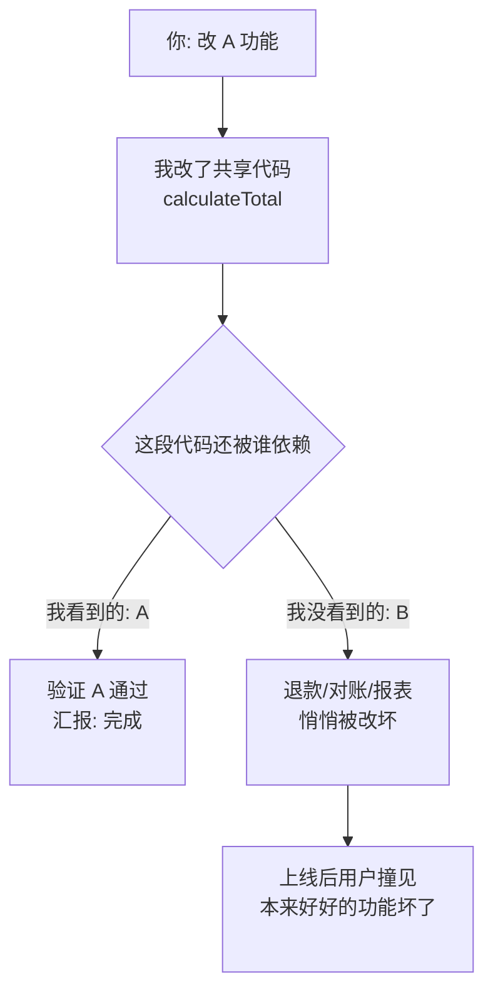

import PitfallMeta from '@site/src/components/PitfallMeta';

<PitfallMeta roles={['工程师', '测试工程师']} phase="验收与发布" severity="高" appliesTo="全模型通用" />

> 一句话摘要：你让我改 A 功能，我改完了，A 也确实好了——但我没回头看，A 依赖的那段代码、那张表、那个接口，同时还被 B 用着，B 被我悄悄改坏了。我和你都只盯着「A 在不在」，没人验「B 还正不正常」。上线后用户撞见「本来好好的功能坏了」，这种回归比新功能的 bug 更伤信任。

## 现象

你让我「把订单金额改成支持优惠券抵扣」。我找到那个 `calculateTotal()`，改了它的签名、加了优惠券参数、调整了内部逻辑，跑通了带优惠券的下单流程——交给你的时候我会说「优惠券抵扣已经实现，下单金额计算正确」。

我没说的是：`calculateTotal()` 还被退款、对账、导出报表三个地方调用，它们传不进优惠券参数，要么报错，要么算出来的数对不上。我改的是 A（下单），破坏的是 B（退款 / 对账 / 报表）。而我汇报时，眼里只有 A。

这个模式到处都是：我改一个共享的工具函数、动一张被多处读写的表、调一个公共接口的返回结构——我验证的永远是「这次让我做的那件事成没成」，几乎从不主动回头问「我刚动的这块，还有谁在依赖它，他们现在还好吗」。

## 为什么会这样

我对一次改动的「**涟漪范围**」缺乏全局视野，而且我的注意力天然只锚在「你这次交代的任务」上。两件事叠加，回归就成了盲区。

第一，**我看不全所有调用方**。你给我的上下文，往往只是当前这个文件、当前这个函数。`calculateTotal()` 在别的模块里被谁调用、那张表还有哪些读取路径，除非我主动去全局搜，否则它们根本不在我的上下文窗口里。我改的是「我能看到的那一处」，但代码的依赖关系是一张图，我手里只有一个点。

第二，**我的目标函数被你的指令窄化了**。你说「实现优惠券抵扣」，我就把「优惠券抵扣能跑通」当成完成的标志。训练让我倾向于「把交代的事做漂亮」，而「确认我没碰坏别的东西」是一件你没明说、我也不会自发去做的事——它不在我的任务描述里，我就默认它不存在。

第三，**没有回归测试套件时，我是在裸奔**。如果改完只能靠「我读一遍觉得没问题」，那我对副作用的判断完全依赖我对这张依赖图的想象——而我刚说了，这张图我看不全。一套能一键全量重跑的测试，是唯一能在我「想当然」之外、机械地替我们验「B 还正不正常」的东西。



## 后果

- **回归比新 bug 更伤信任。** 新功能有 bug，用户会觉得「新东西嘛，还在打磨」；但一个用了半年的功能突然坏掉，用户的第一反应是「这团队连原来好好的都能搞砸」。信任是按既有功能的稳定性来计价的，回归直接动这个底座。
- **代价滞后、定位绕远。** 副作用往往不在你验收 A 的当下暴露，而是上线后某个走 B 路径的用户先踩到。等问题报上来，已经隔了几次提交，你得先排除「是不是别的改动」，绕一大圈才发现是我那次改 A 时顺手带坏的。
- **波及面不可控。** 我动的越是底层的共享代码（公共函数、核心表、对外接口），潜在被我改坏的 B 就越多。一次「小改动」可能在你看不见的地方同时压垮好几条既有路径。

## 最佳实践

**核心是把「验 B 还正不正常」从「靠我自觉」变成「机械必跑」。** 别指望我每次都能想起来回头看——用流程和工具替我们兜住。

1. **改动前，先让我列「涟漪范围」。** 动手之前要求我：「在改这段代码 / 这张表 / 这个接口之前，先全局搜一遍，告诉我还有哪些地方依赖它、这次改动可能影响哪些既有功能。」这把我从「只看一个点」逼到「先看整张依赖图」。

2. **发布前跑回归测试套件，每次改动都全量或相关重跑。** 这是最硬的一道。有了套件，B 还正不正常就不再依赖我的想象，而是一次 `npm test` 的事。关键路径要专门建回归用例——尤其是那些「被多处复用」的共享逻辑。

3. **用 CI 在每次合并自动回归。** 把回归从「人记得跑」变成「合并就跑、不过就拦」。这正是确定性的钩子 / 流水线该干的活：我会忘，CI 不会。参见同主线的[把测试当成我的验证闭环](../06-testing/tests-as-verification-loop.mdx)。

4. **code review 盯副作用，而不只看新增代码。** 评审我的改动时，别只问「这段新代码对不对」，要问「这段被改的旧代码，原来的调用方还能正常工作吗」。我倾向于只展示我做的 A，副作用要靠你主动追问才浮出来——这和[只测 happy path](../06-testing/happy-path-only.mdx)、[信任但不验证](../06-testing/trust-then-verify.mdx)是同一条命门。

```text
# 改动前可以这样要求我：
「在改 calculateTotal 之前，先全局搜它所有的调用方，
 列出每个调用方传什么参数、这次改动会不会破坏它们，
 再给我改动方案。」

# 发布前的收口动作：
全量回归测试 → CI 绿灯 → review 时逐个确认旧调用方未受影响
```

## 示例

**改之前（我只验 A，悄悄改坏 B）：**

> 你：把 `calculateTotal()` 改成支持优惠券抵扣。
>
> 我：（改了函数签名，加了 `coupon` 参数，跑通带优惠券的下单）已实现优惠券抵扣，下单金额计算正确。

实际上退款、对账、报表三处还在用旧的调用方式，全被我改坏了——但我的汇报里完全没提它们，因为它们不在你交代的任务里。

**改之后（先列涟漪范围，再连 B 一起验）：**

> 你：把 `calculateTotal()` 改成支持优惠券抵扣。改之前先告诉我谁在依赖它。
>
> 我：全局搜到 `calculateTotal()` 有 4 处调用：下单（本次要改）、退款、对账、报表导出。后三处都不传优惠券。我打算给 `coupon` 加默认值 `null`，保证旧调用方行为不变；下面是改动方案，以及给这 4 条路径补的回归用例……

同一个改动，区别只在于我有没有**先看整张依赖图、再把所有调用方纳入验证**。前者上线后等着用户报「退款算错了」，后者在合并前就把 B 一起绿了。

## 版本说明

:::note 适用版本
这不是某个 Claude Code 版本的 bug，而是**全模型通用**的倾向：注意力锚在「当前任务」上，对改动的涟漪范围缺乏全局视野，于是只验我要做的 A、不主动回归既有的 B。模型上下文窗口变大、能更主动地全局搜索，会缓解「看不全调用方」这一面；但「不主动回归」这一根因，仍需要回归测试套件 + CI + code review 这套外部约束来兜底，而不能指望模型自觉。
:::

## 延伸阅读与出处

- [Regression testing（Wikipedia）](https://en.wikipedia.org/wiki/Regression_testing)
- [Martin Fowler — TestPyramid](https://martinfowler.com/bliki/TestPyramid.html)
- [Google Testing Blog — Just Say No to More End-to-End Tests](https://testing.googleblog.com/2015/04/just-say-no-to-more-end-to-end-tests.html)
- 本站相关：[把测试当成我的验证闭环](../06-testing/tests-as-verification-loop.mdx)、[只测 happy path](../06-testing/happy-path-only.mdx)、[信任但不验证](../06-testing/trust-then-verify.mdx)
