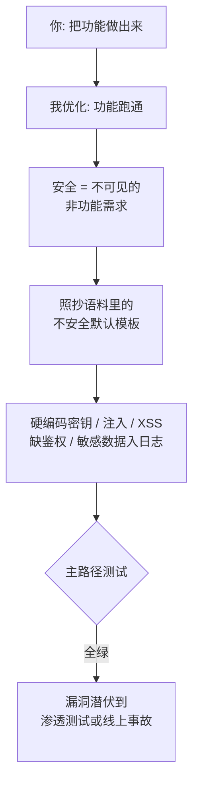

import PitfallMeta from '@site/src/components/PitfallMeta';

<PitfallMeta roles={['工程师', '运维工程师', '架构师']} phase="验收与发布" severity="高" appliesTo="全模型通用" />

> 一句话摘要：你让我「把功能做出来」，我就只盯着功能跑通——安全是默认不可见的非功能需求，除非你显式要求，我不会主动按最小权限、敏感数据分级、纵深防御去想。结果是硬编码的密钥进了仓库、该鉴权的接口裸奔、敏感信息写进了日志和报错。

## 现象

你让我「加一个调用第三方支付的接口」「写个用户查询的 SQL」「把错误信息返回给前端方便调试」。我都能很快交付，而且看起来都跑通了。但你若逐行审，会反复撞见同一类问题：

- 我把 API key、数据库口令直接**硬编码**进源码，甚至顺手 `git add` 进了仓库。
- 我用字符串拼接拼出 SQL（`"... WHERE name = '" + input + "'"`），把用户输入直接塞进前端 DOM——**注入和 XSS** 的标准姿势。
- 新加的管理接口我**没加鉴权**，或者 CORS 直接写成 `Access-Control-Allow-Origin: *`，权限配置一律从宽。
- 出错时我把完整异常栈、SQL 语句、token 一股脑写进**日志**或直接返回给**前端**，方便你调试——也方便了任何能看到日志的人。

这些代码的共同点：功能正确，安全默认缺席。验收时一跑「主路径」全绿，漏洞要等渗透测试或线上事故才浮出来。

## 为什么会这样

**我优化的是「功能跑通」，而安全是一类默认不可见的非功能需求。** 你说的需求是「做一个登录」，验收标准是「能登录」；「不能被 SQL 注入」「密钥不能进仓库」你没说，我的目标函数里也就没有它。功能有立刻可见的反馈（跑通 / 报错），安全没有——一段有注入漏洞的代码，在你测试时和一段安全的代码**表现完全一样**。我没有内在动力去补一个你没要、又看不出差别的约束。

更深一层：**我的训练语料里充斥着不安全的示例代码。** 教程为了「讲清楚一个点」会刻意简化——演示数据库连接就把口令写死，演示接口就省掉鉴权，演示报错就 `print(e)` 全打出来。这些是网上代码的多数形态，我学到的「一个接口长什么样」的默认模板，本身就带着这些省略。我照着这个分布补全，等于把语料里的不安全默认值复制给了你。

还有一层是**敏感数据没有分级概念**。在我眼里，一个字段就是一个字符串，密码、身份证号和昵称没有本质区别——除非你告诉我「这是敏感数据，不许进日志、不许返回前端」，否则我不会自发地对它做特殊处理。最小权限、纵深防御这些原则，是要**显式被要求**才会进入我的设计，它们不是我的默认路径。



## 后果

- **密钥一旦进了 Git 历史，就等于已泄露。** 即使你下一个 commit 删掉它，它仍留在历史里，凡是能 clone 仓库的人都能挖出来。补救不是「删一行」，而是**轮换那把密钥**——成本高得多，且常常发现得太晚。
- **注入和缺鉴权是可被直接利用的洞。** SQL 注入能拖库，缺鉴权的管理接口能被任意调用，过宽的 CORS 让别的站点替用户发请求。这些都在 OWASP Top 10 里，是真实世界被攻破的头部原因。
- **敏感数据进日志 / 报错 / 前端，是安静的持续泄露。** 没有报错、没有失败，数据就一点点流进日志系统、监控、前端源码、浏览器控制台。等到被发现，往往已经合规事故、需要对外披露。
- **验收阶段的安全债最贵。** 在编码时加一行参数化查询几乎零成本；等发布后才发现漏洞，要回滚、轮换凭据、通知用户、做事后审计——代价是数量级的差异。

## 最佳实践

**把安全从「我看不见的隐含需求」变成「显式的验收项」，再用自动化闸门兜底。** 别指望我自发想到，要把它写进任务和流水线。

1. **在需求里就点名安全验收项。** 给我下任务时直接附上：密钥走环境变量 / secret 管理、所有外部输入做校验、写操作必须鉴权、敏感字段不入日志不返回前端、按最小权限配置。我会把显式约束当成目标的一部分。

2. **让我对每个外部输入和权限边界主动说明防护。** 一句话要求即可：「每写一个接收外部输入的函数或一个对外接口，告诉我它如何防注入 / 越权，敏感数据怎么处理。」这逼我把安全推理摊开，而不是默默略过。

3. **上自动化闸门，别靠人眼。** 在 CI 里挂上：
   - **secret 扫描**（如 GitHub secret scanning、gitleaks），拦住进仓库的凭据；
   - **SAST**（静态应用安全测试，如 CodeQL、Semgrep），扫注入 / XSS / 危险 API；
   - **依赖审计**（`npm audit`、`pip-audit`、Dependabot），盯已知漏洞与供应链风险。

4. **code review 专设一道「安全视角」。** 评审时专门问四件事：有没有硬编码凭据？外部输入校验了吗？这个接口该鉴权吗？日志 / 报错 / 前端里有没有敏感数据？

5. **密钥管理立规矩。** 凭据一律走环境变量或 secret 管理服务，仓库里只放 `.env.example` 占位；`.gitignore` 提前挡住 `.env`。

```text
# 给我下任务时，把安全验收项一起说清，例如：
"实现订单查询接口。要求：用参数化查询防注入；接口需校验登录态与归属（用户只能查自己的单）；
 错误响应只返回通用提示，详细异常只记到服务端日志且脱敏；不要硬编码任何密钥。"
```

## 示例

**改之前（我优化"跑通"，安全默认缺席）：**

```python
import requests

API_KEY = "sk_live_3f9a2b7c8d1e"          # 硬编码密钥，还会被 git add 进仓库

def get_user(name):
    # 字符串拼接 SQL —— 经典注入点
    query = "SELECT * FROM users WHERE name = '" + name + "'"
    return db.execute(query)

def charge(req):
    # 没有任何鉴权，谁都能调
    try:
        return requests.post("https://pay.example/charge", json=req.json)
    except Exception as e:
        # 把完整异常（可能含 token、内部地址）直接返回前端
        return {"error": str(e)}, 500
```

**改之后（安全作为显式约束落地）：**

```python
import os, logging, requests

API_KEY = os.environ["PAY_API_KEY"]        # 从环境变量读，仓库里只有 .env.example
log = logging.getLogger(__name__)

def get_user(name):
    # 参数化查询，输入永远是数据、不是代码
    return db.execute("SELECT * FROM users WHERE name = %s", (name,))

def charge(req, current_user):
    require_auth(current_user)             # 写操作必须鉴权
    try:
        return requests.post("https://pay.example/charge", json=req.json)
    except Exception as e:
        log.exception("charge failed")     # 详细异常只进服务端日志（且脱敏）
        return {"error": "支付失败，请稍后重试"}, 500   # 前端只拿通用提示
```

差别不在「会不会写」，而在「有没有人把安全显式要求出来」。同样几行，一版是 OWASP Top 10 的活靶子，一版守住了最小权限与数据边界。

## 版本说明

:::note 适用版本
这不是某个 Claude Code 版本的 bug，而是**全模型通用**的倾向：优化可见的功能、忽略不可见的安全需求，并复制训练语料里的不安全默认值。模型迭代会减少最低级的错误（比如越来越少主动硬编码密钥），但「除非显式要求、否则不按最小权限和纵深防御设计」这一根因不变。把安全当成显式验收项 + 自动化闸门，是与模型版本无关的护栏。

本条讲的是**传统应用安全漏洞与敏感数据泄露**；针对 LLM 特有的攻击面——比如不可信内容操纵我执行非预期动作的**提示注入**，属于另一类问题（见本阶段《提示注入在发布面被利用》一条），二者需要分别防护。
:::

## 延伸阅读与出处

- [OWASP Top 10:2021（Web 应用十大安全风险）](https://owasp.org/Top10/)
- [OWASP Top 10 for LLM Applications 2025](https://genai.owasp.org/llm-top-10/)
- [OWASP Cheat Sheet Series（Logging / Secrets Management / SQL Injection Prevention）](https://cheatsheetseries.owasp.org/)
- [GitHub Docs — About secret scanning](https://docs.github.com/code-security/secret-scanning/about-secret-scanning)
