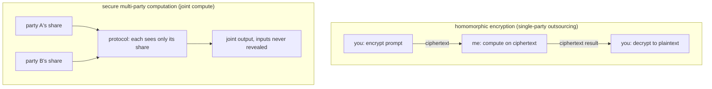

import PrivacyMeta from '@site/src/components/PrivacyMeta';

<PrivacyMeta era="Volume 1 · Privacy foundations" technique="Privacy-preserving computation" audience={['Privacy Engineer', 'Security Engineer', 'ML Engineer']} severity="Medium" maturity="Experimental" evidence="Research" />

> In one sentence: homomorphic encryption (HE) lets you **send data encrypted**, have the server **compute directly on the ciphertext**, and decrypt only at your end — the server never sees plaintext; secure multi-party computation (MPC) lets several parties **jointly compute a function without handing over their inputs**. The key difference from a TEE: **the remote execution environment is not a trust root** — security comes from cryptographic assumptions. The cost is being **much slower** (HE especially), so today they're used in narrow scenarios, and full private LLM inference is still expensive. Volume 1 covers what they guarantee, where the cost is, and how to choose between them and a TEE.

## Mechanism: what happens on my side

- **Homomorphic encryption (HE)**: you send the prompt under homomorphic encryption, I (the server / model) do additions and multiplications **on the ciphertext**, return a **ciphertext** result, and only you (holding the private key) can decrypt; plaintext never appeared on my side. Gentry gave the **first fully homomorphic** scheme using ideal lattices, and used **bootstrapping** (homomorphically evaluating the decryption circuit on the ciphertext itself to "refresh" noise) to make **circuits of arbitrary depth** computable (Gentry, STOC 2009).
- **Secure multi-party computation (MPC)**: split the computation across parties (client and server, or several servers); using **garbled circuits** or **secret sharing**, each party sees only its own "share," **no single party sees a complete input**, yet together they compute the correct output (Evans et al., 2018, surveying Yao's garbled circuits, SPDZ, etc.).

Red line: I shouldn't say "I **promise** not to look at your data" — the accurate statement is: **under cryptographic assumptions, I (the computing party) hold only ciphertext / shares and cannot see plaintext**. That's a mathematical property, not a promise.



## Threat surface: what they do and don't defend

- **Defend**: a computing party snooping inputs and intermediate values — HE defends against the **single** outsourced computing party; MPC defends against parties **within the collusion threshold**.
- **Doesn't defend ① a mismatched threat model**: protocols come in **semi-honest (honest-but-curious)** and **malicious** flavors — semi-honest only stops "peeking," not "tampering." Using a semi-honest protocol where a malicious party exists is a common false security.
- **Doesn't defend ② MPC collusion**: once parties beyond the protocol's assumed threshold collude, the guarantee breaks.
- **Doesn't defend ③ the output itself leaking**: the protocol guarantees "the process leaks no input," but the **function's output** may reveal inputs — for privacy you still layer DP on the output.
- **Doesn't defend ④ after decryption**: once you decrypt an HE result or reveal an MPC output, the plaintext is back in the ordinary world and subject to every other privacy risk.

## How the defense works

Security comes not from "hiding inside some hardware" but from **cryptographic assumptions**: HE rests on hard lattice problems + bootstrapping for noise control; MPC on secret sharing / garbled circuits + communication rounds, proven to "reveal nothing beyond the output" under an **explicit threat model and collusion threshold**. That's exactly the load-bearing point — **this is a trust model orthogonal to a TEE's**: a TEE places its trust in hardware isolation and attestation; HE / MPC **don't treat the remote execution environment as a trust root**, building security instead on cryptographic assumptions, parameter choices, the protocol model, and implementation correctness — you still trust your own client's key security, randomness quality, and crypto-library implementation, just not the other side's hardware.

## Buildable recipe

```text
1. Pick the paradigm: outsource data to a "single" party to compute -> HE; data
   spread across "multiple" parties to compute jointly -> MPC.
2. HE: choose a scheme — CKKS (approximate arithmetic, fits ML's floats) /
   BFV·BGV (exact integers); use a mature library (OpenFHE, Microsoft SEAL);
   reduce circuit depth / configure bootstrapping for noise on deep circuits.
3. MPC: choose protocol and threat model — semi-honest vs malicious, two-party vs
   multi-party, collusion threshold; use a mature framework (e.g. MP-SPDZ);
   evaluate communication rounds and bandwidth (MPC is usually comms-bound).
4. Set security parameters: target at least 128-bit, but for HE don't stop at one
   abstract λ — re-check the concrete parameter set (ring dimension / ciphertext
   modulus / noise budget / multiplicative depth) with your library's lattice
   estimator; for MPC spell out the threat model (semi-honest / malicious) and
   collusion assumptions — don't leave defaults.
5. Layer DP on the output: if the output can reveal inputs, add differential
   privacy to the output.
```

Every parameter (scheme, λ, collusion threshold, circuit depth) carries **your threat model and load**; HE / MPC feasibility depends heavily on circuit depth and data scale — a paper demo may not transfer to LLM scale.

**Minimal testable assertions** (turn the recipe above into a regression check):

- How to test: ① functionality — compare ciphertext / multi-party results against plaintext computation (HE approximate schemes like CKKS must carry an **error bound**); ② security — target ≥ 128-bit with the HE parameter set re-checked via an estimator (not just an abstract λ), and the threat model and collusion threshold stated and matching the protocol.
- Pass: results fall within the declared error bound; security parameters meet the bar; the threat model (semi-honest / malicious, collusion threshold) is explicit and consistent with the chosen protocol.
- Fail: insufficient parameters / unclear threat model / using a semi-honest protocol in a malicious setting → the claimed privacy guarantee isn't met; go back and switch protocol or fix parameters.

## A real case / engineering feasibility

(This entry's maturity is "Experimental": the **cryptographic primitives are mature**, but at LLM scale this is still an engineering-feasibility question; what follows is the state of play, not a "production" endorsement.)

HE / MPC are deployed in **narrow scenarios**: private set intersection (PSI), secure aggregation in federated learning, encrypted database queries, and more. ML has private-inference prototypes, but **full private LLM inference is limited by overhead**, currently seen on small models, partial stages, or combined with TEE / DP. The foundation and the systematization are, respectively, Gentry (2009, first FHE) and Evans et al. (2018, an MPC engineering survey).

## Residual risk and trade-offs

Calling out each false security:

- **"Encrypted = secure" depends on the threat model.** Semi-honest ≠ malicious; the wrong protocol makes the guarantee exist in name only.
- **MPC collusion breaks the guarantee.** Security is tied to the "colluding parties don't exceed the threshold" assumption — if that fails, so does the guarantee.
- **The output can still leak.** The protocol covers "the process"; the output's reconstruction risk needs DP.
- **Performance is the top barrier.** HE has **orders-of-magnitude** overhead, MPC has **communication** overhead — both can slow LLM inference to the point of impracticality; measure against your own circuit depth and data scale.

:::caution To be verified
HE's exact overhead multiplier (often quoted on the order of "~10⁴×") depends heavily on the scheme, circuit depth, parameters, and whether bootstrapping is used; this entry **does not state a single bald multiplier** — measure on your own load. A specific first-source benchmark is to be verified (recorded in `BACKLOG-privacy.md`).
:::

- **Approximate schemes have numerical error.** CKKS does approximate arithmetic on ciphertext, introducing error that affects model accuracy — evaluate against an error bound.

## Compliance mapping

- **GDPR / data minimization**: HE / MPC can complete processing without exposing raw data to the computing party — a strong technical argument for "data minimization / appropriate technical measures."
- **Liability isn't automatically waived**: even if the computing party can't see plaintext, data flows, output handling, and party relationships remain subject to contract and law (as with a TEE, a technical guarantee ≠ dissolution of legal liability).

(Compliance evolves with the statute version; this section is stamped 2026-06 — verify the latest enacted text before citing.)

## How this differs from neighboring techniques

- **HE·MPC vs. TEE**: both "hand data out to be computed without leaking it," but the trust models are opposite — a TEE rests on **hardware trust** (fast, general, but you trust the chip vendor and live with side channels, see [Trusted execution environments](./trusted-execution-environment.mdx)); HE / MPC rest on **cryptography** (no remote execution environment as a trust root, but much slower). The choice is trading "speed" for "not trusting the remote hardware," or the reverse.
- **HE·MPC vs. differential privacy**: HE / MPC protect "**inputs from being seen by the computing party during computation**"; DP protects "**outputs from leaking a single sample**." They're orthogonal and often stacked — compute with HE / MPC, then add DP to the output, to close both "process" and "result."

## Version notes

:::note Applicable versions
HE / MPC are **model-agnostic** cryptographic mechanisms; the primitive layer (FHE since Gentry 2009, MPC since Yao in the 1980s) is mature and stable, but **their feasibility at LLM scale changes rapidly with schemes, hardware acceleration, and libraries**. This entry reflects the 2026-06 engineering state; performance and applicability are whatever your measurements and the libraries' current versions say. (Sources verified 2026-06.)
:::

## Further reading and sources

Mixed evidence — **primary: Research** (Gentry, Evans et al.); **supplementary: standard / framework** (CCC's HE / MPC / TEE comparison).

- [Fully Homomorphic Encryption Using Ideal Lattices (Gentry, STOC 2009)](https://research.ibm.com/publications/fully-homomorphic-encryption-using-ideal-lattices) — research: the first fully homomorphic encryption scheme + bootstrapping, enabling arbitrary-depth circuits on ciphertext.
- [A Pragmatic Introduction to Secure Multi-Party Computation (Evans et al., 2018)](https://www.cs.virginia.edu/~evans/pragmaticmpc/pragmaticmpc.pdf) — research: an MPC engineering survey (Yao's garbled circuits, secret sharing, SPDZ, semi-honest vs malicious).
- [A Technical Analysis of Confidential Computing (CCC, v1.3)](https://confidentialcomputing.io/wp-content/uploads/sites/10/2023/03/CCC-A-Technical-Analysis-of-Confidential-Computing-v1.3_unlocked.pdf) — standard: places HE / MPC and TEE in one trust-model framework for comparison.
